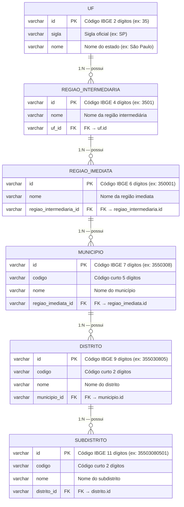

# Diagrama Entidade-Relacionamento — batch-geolocalidade

## Esquemas

O banco PostgreSQL utiliza **dois schemas**:

| Schema | Propósito | Tabelas |
|---|---|---|
| `spring_batch` | Metadata do Spring Batch | `BATCH_JOB_INSTANCE`, `BATCH_JOB_EXECUTION`, `BATCH_STEP_EXECUTION`, etc. |
| `localidade` | Tabelas de negócio (DTB/IBGE) | `uf`, `regiao_intermediaria`, `regiao_imediata`, `municipio`, `distrito`, `subdistrito` |

## ERD — Schema `localidade`



## Cardinalidade e Regras

| Relacionamento | Cardinalidade | FK Column | Nullable | On Delete |
|---|---|---|---|---|
| UF → RegiaoIntermediaria | 1:N | `uf_id` | NOT NULL | — |
| RegiaoIntermediaria → RegiaoImediata | 1:N | `regiao_intermediaria_id` | NOT NULL | — |
| RegiaoImediata → Municipio | 1:N | `regiao_imediata_id` | NOT NULL | — |
| Municipio → Distrito | 1:N | `municipio_id` | NOT NULL | — |
| Distrito → Subdistrito | 1:N | `distrito_id` | NOT NULL | — |

## Volumetria Esperada (Brasil, DTB 2024)

| Tabela | Registros (~) |
|---|---|
| `uf` | 27 |
| `regiao_intermediaria` | 133 |
| `regiao_imediata` | 510 |
| `municipio` | 5.570 |
| `distrito` | 10.407 |
| `subdistrito` | 684 |

## Índices

Índices são criados automaticamente pelo Hibernate/JPA via `@Id` nas chaves primárias. Índices adicionais em colunas FK não são criados automaticamente — recomenda-se adicionar manualmente em ambiente de produção:

```sql
CREATE INDEX IF NOT EXISTS idx_regiao_intermediaria_uf ON localidade.regiao_intermediaria(uf_id);
CREATE INDEX IF NOT EXISTS idx_regiao_imediata_inter ON localidade.regiao_imediata(regiao_intermediaria_id);
CREATE INDEX IF NOT EXISTS idx_municipio_imediata ON localidade.municipio(regiao_imediata_id);
CREATE INDEX IF NOT EXISTS idx_distrito_municipio ON localidade.distrito(municipio_id);
CREATE INDEX IF NOT EXISTS idx_subdistrito_distrito ON localidade.subdistrito(distrito_id);
```
