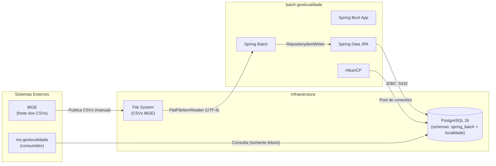

# Integrações e Dependências Externas — batch-geolocalidade

## Diagrama de Dependências

## Dependências Maven

| Dependência | GroupId:ArtifactId | Escopo | Propósito |
|---|---|---|---|
| Spring Boot Web | `spring-boot-starter-web` | compile | Contexto Spring (sem REST endpoints ativos) |
| Spring Data JPA | `spring-boot-starter-data-jpa` | compile | Mapeamento ORM e repositórios |
| Spring Batch | `spring-boot-starter-batch` | compile | Engine de processamento batch |
| PostgreSQL Driver | `postgresql` | runtime | Driver JDBC para PostgreSQL |
| H2 Database | `h2` | test | Banco em memória para testes |
| Spring Batch Test | `spring-batch-test` | test | Utilitários de teste para batch |
| Spring Boot Test | `spring-boot-starter-test` | test | Framework de testes |

## Integrações Externas

### 1. PostgreSQL Database

| Atributo | Valor |
|---|---|
| **Propósito** | Persistência de metadata do batch e dados de negócio |
| **Host/Porta** | Configurável: `SPRING_DATASOURCE_URL` (default: `localhost:5432`) |
| **Database** | `worker_db` |
| **Schemas** | `spring_batch` (metadata), `localidade` (negócio) |
| **Driver** | `org.postgresql.Driver` |
| **Pool** | HikariCP (padrão Spring Boot) |
| **Timeout** | Padrão HikariCP (30s connection timeout) |
| **Retry** | Gerenciado pelo HikariCP + Spring Batch retry |

### 2. File System (CSVs IBGE)

| Atributo | Valor |
|---|---|
| **Propósito** | Leitura de arquivos CSV da Divisão Territorial Brasileira |
| **Path** | Configurável: `APP_IMPORT_PATH` (default: `/tmp/work/data/ibge`) |
| **Arquivos** | `DTB_Municipios.csv`, `DTB_Distritos.csv`, `DTB_Subdistritos.csv` |
| **Encoding** | UTF-8 |
| **Formato** | CSV com delimitador `,`, 7 linhas de metadados no topo |
| **Tolerância** | `strict=false` (tolera colunas extras) |
| **Validação** | `LoadTestRunner` loga `exists=true/false` para cada arquivo |

### 3. ms-geolocalidade (Consumidor)

| Atributo | Valor |
|---|---|
| **Propósito** | Microserviço que consulta as tabelas de localidade para enriquecer respostas |
| **Tipo** | Consumidor dos dados (somente leitura) |
| **Schema** | `localidade` |
| **Integração** | Via banco de dados compartilhado (shared database integration) |

## Mapa de Configuração (Environment Variables)

| Variável | Default | Descrição |
|---|---|---|
| `SPRING_DATASOURCE_URL` | `jdbc:postgresql://localhost:5432/worker_db?currentSchema=spring_batch` | URL de conexão JDBC |
| `SPRING_DATASOURCE_USERNAME` | `worker_user` | Usuário do banco |
| `SPRING_DATASOURCE_PASSWORD` | `worker_pass` | Senha do banco |
| `SPRING_DATASOURCE_SCHEMA` | `spring_batch` | Schema padrão da conexão |
| `SPRING_JPA_SCHEMA` | `localidade` | Schema do Hibernate |
| `SPRING_JPA_HIBERNATE_DDL_AUTO` | `update` | Estratégia DDL |
| `SPRING_SQL_INIT_MODE` | `always` | Modo de inicialização SQL |
| `APP_IMPORT_PATH` | `/tmp/work/data/ibge` | Diretório base dos CSVs |
| `APP_IMPORT_PATH_DTB_MUNICIPIOS` | `DTB_Municipios.csv` | Nome do arquivo de municípios |
| `APP_IMPORT_PATH_DTB_DISTRITOS` | `DTB_Distritos.csv` | Nome do arquivo de distritos |
| `APP_IMPORT_PATH_DTB_SUBDISTRITOS` | `DTB_Subdistritos.csv` | Nome do arquivo de subdistritos |

## Modos de Execução

| Modo | Flag | Comportamento |
|---|---|---|
| **Normal** | (sem flag) | Spring Boot inicia, Batch NÃO executa (`spring.batch.job.enabled=false`) |
| **Load Test** | `--app.loadtest.enabled=true` | `LoadTestRunner` executa o Job e encerra com exit code |
