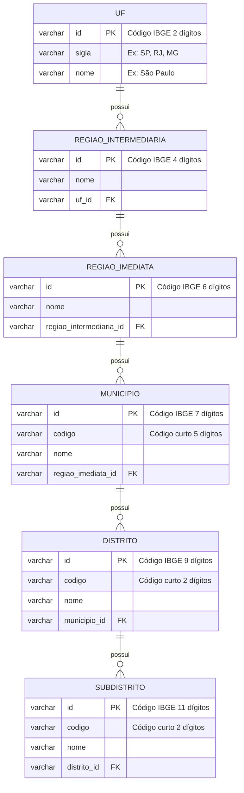
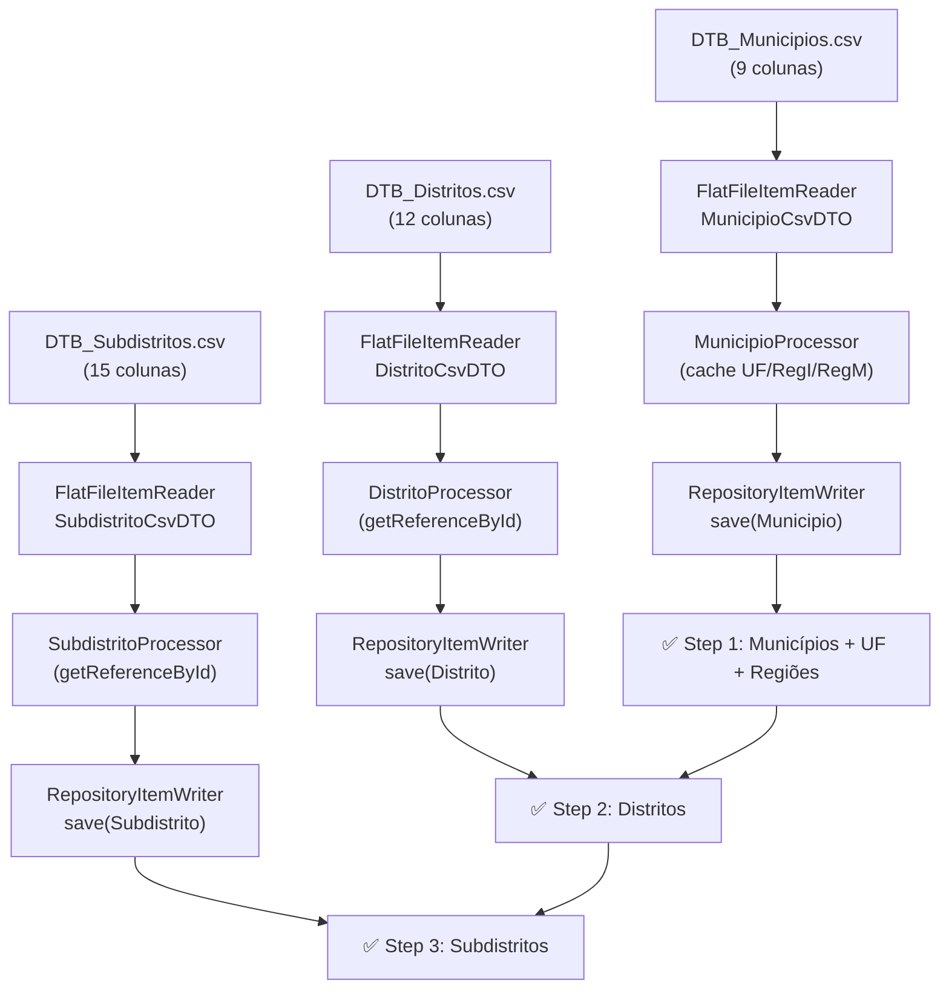

# Glossário de Domínio — batch-geolocalidade

## 1. Introdução

Este documento define o domínio do **batch-geolocalidade**, um serviço Spring Batch responsável por importar dados da **Divisão Territorial Brasileira (DTB)** do **IBGE** a partir de arquivos CSV e persistir em banco de dados PostgreSQL.

O domínio modela a hierarquia geopolítica brasileira em 6 níveis, da maior para a menor granularidade:

```
UF → Região Intermediária → Região Imediata → Município → Distrito → Subdistrito
```

A fonte de dados é o Instituto Brasileiro de Geografia e Estatística (**IBGE**), que publica anualmente os arquivos da **DTB** com a relação completa de municípios, distritos e subdistritos do Brasil.

## 2. Termos de Domínio

### 2.1. Hierarquia Geopolítica

| Termo | Definição | Sinônimos | Código (struct/enum) |
|---|---|---|---|
| **UF** | Unidade Federativa — estado brasileiro. Identificada pelo código IBGE de 2 dígitos. | Estado, Unidade Federativa | `entity.Uf` |
| **Região Intermediária** | Agrupamento de regiões imediatas definido pelo IBGE. Código de 4 dígitos. | Região Intermediária, Intermediária | `entity.RegiaoIntermediaria` |
| **Região Imediata** | Agrupamento de municípios definido pelo IBGE. Código de 6 dígitos. | Região Imediata, Imediata | `entity.RegiaoImediata` |
| **Município** | Cidade ou município brasileiro. Código IBGE completo de 7 dígitos (6 + dígito verificador). | Cidade, Município | `entity.Municipio` |
| **Distrito** | Subdivisão administrativa de um município. Código IBGE completo de 9 dígitos. | Distrito | `entity.Distrito` |
| **Subdistrito** | Subdivisão administrativa de um distrito. Código IBGE completo de 11 dígitos. | Subdistrito | `entity.Subdistrito` |

### 2.2. Fontes de Dados

| Termo | Definição | Sinônimos | Código (struct/enum) |
|---|---|---|---|
| **IBGE** | Instituto Brasileiro de Geografia e Estatística — órgão federal responsável por dados estatísticos e geográficos. | IBGE | — |
| **DTB** | Divisão Territorial Brasileira — publicação anual do IBGE com a malha geopolítica oficial. | DTB, Divisão Territorial | — |
| **CSV de Municípios** | Arquivo `DTB_Municipios.csv` com 9 colunas: dados de UF, Região Intermediária, Região Imediata e Município. | Arquivo de municípios, CSV de municípios | `dto.MunicipioCsvDTO` |
| **CSV de Distritos** | Arquivo `DTB_Distritos.csv` com 12 colunas: hierarquia completa + dados de distrito. | Arquivo de distritos, CSV de distritos | `dto.DistritoCsvDTO` |
| **CSV de Subdistritos** | Arquivo `DTB_Subdistritos.csv` com 15 colunas: hierarquia completa + dados de subdistrito. | Arquivo de subdistritos, CSV de subdistritos | `dto.SubdistritoCsvDTO` |

### 2.3. Spring Batch

| Termo | Definição | Sinônimos | Código (struct/enum) |
|---|---|---|---|
| **Job** | Unidade de execução do Spring Batch. Este projeto define o job `importacaoGeolocalidadeJob`. | Job, Batch Job | `config.BatchConfig.importacaoGeolocalidadeJob()` |
| **Step** | Etapa de um Job. Este projeto tem 3 steps sequenciais: `stepMunicipio`, `stepDistrito`, `stepSubdistrito`. | Step, Etapa | `config.BatchConfig` |
| **Chunk** | Unidade de processamento em lote. Configurado com tamanho 100 (100 registros por transação). | Chunk, Lote | `config.BatchConfig` (chunk=100) |
| **Reader** | Componente que lê dados de uma fonte. Leitores `FlatFileItemReader` configurados para CSV com encoding UTF-8. | Leitor, ItemReader | `config.BatchConfig` |
| **Processor** | Componente que transforma dados do Reader antes de enviar ao Writer. Converte DTOs CSV em entidades JPA. | Processador, ItemProcessor | `processor.MunicipioProcessor`, `processor.DistritoProcessor`, `processor.SubdistritoProcessor` |
| **Writer** | Componente que persiste os dados processados. Usa `RepositoryItemWriter` com Spring Data JPA. | Escritor, ItemWriter | `config.BatchConfig` |
| **Load Test Runner** | Runner condicional (`app.loadtest.enabled=true`) que executa o Job e encerra a aplicação com exit code. | Runner, Test Runner | `load.LoadTestRunner` |

### 2.4. Banco de Dados

| Termo | Definição | Sinônimos | Código (struct/enum) |
|---|---|---|---|
| **Schema `spring_batch`** | Schema PostgreSQL para tabelas de metadata do Spring Batch (`BATCH_*`). Schema padrão da conexão JDBC. | Schema de batch | `application.yaml: currentSchema=spring_batch` |
| **Schema `localidade`** | Schema PostgreSQL para tabelas de negócio (entidades JPA). Schema configurado via `hibernate.default_schema`. | Schema de negócio, Schema de localidade | `application.yaml: default_schema=localidade` |
| **Dual Schema** | Padrão onde dois schemas coexistem no mesmo banco: um para metadata do framework e outro para dados de negócio. | Separação de schemas | `db/init-postgres.sql` |
| **HikariCP** | Pool de conexões JDBC utilizado (padrão do Spring Boot). Configurado com `schema=spring_batch`. | Pool de conexões | `application.yaml: hikari.schema` |

## 3. Relações entre Conceitos

### 3.1. Hierarquia Geopolítica (Diagrama Entidade-Relacionamento)



### 3.2. Fluxo de Importação (Job → Steps)



## 4. Regras de Negócio Fundamentais

1. **Ordem de importação é estrita**: Municípios → Distritos → Subdistritos. Distritos dependem de FK para Município; Subdistritos dependem de FK para Distrito.

2. **Códigos IBGE como IDs naturais**: Todas as entidades usam o código IBGE completo como chave primária (String), sem surrogate keys.

3. **Siglas de UF são derivadas**: O CSV do IBGE não contém a sigla da UF (ex: "SP"), apenas o código (ex: "35"). O `MunicipioProcessor` mantém um mapa estático (`UF_SIGLAS`) para derivar a sigla a partir do código.

4. **Cache intra-Job**: O `MunicipioProcessor` mantém caches (`HashMap`) de UF, Região Intermediária e Região Imediata para evitar criar instâncias duplicadas durante a execução de um mesmo Job.

5. **`getReferenceById` para FKs**: Os processors de Distrito e Subdistrito usam `getReferenceById()` (proxy JPA) para evitar INSERTs desnecessários ao referenciar entidades já persistidas.

6. **CSVs têm 7 linhas de metadados**: Os arquivos do IBGE começam com 7 linhas de cabeçalho/métadados que devem ser puladas (`linesToSkip(7)`).

7. **Tokenizer tolerante**: O delimitador CSV é configurado com `strict=false` para tolerar colunas extras (ex: vírgula final de linha).

8. **Dois schemas no PostgreSQL**: `spring_batch` (metadata do framework) e `localidade` (tabelas de negócio). A conexão JDBC usa `currentSchema=spring_batch`; o Hibernate é configurado com `default_schema=localidade`.

9. **Jobs não disparam no startup**: `spring.batch.job.enabled=false` impede execução automática. O Job é disparado manualmente via LoadTestRunner (`--app.loadtest.enabled=true`).

10. **Saída determinística**: O LoadTestRunner encerra o processo com exit code 0 (sucesso) ou 1 (falha), permitindo uso em scripts e pipelines CI/CD.
