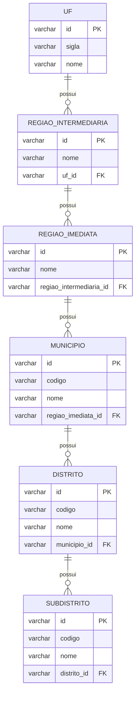

# batch-geolocalidade

Serviço de **Spring Batch** para importar dados do IBGE (DTB) a partir de arquivos CSV e persistir em banco de dados (JPA/Hibernate).

Este módulo foi desenhado para rodar localmente (para validação e carga inicial) e também em ambiente de cluster (via volume montado), lendo os arquivos a partir de um diretório configurável.

## O que este projeto faz

O Job `importacaoGeolocalidadeJob` executa 3 steps, nesta ordem:

1. **Municípios** (e hierarquia superior necessária)
2. **Distritos** (depende de Município)
3. **Subdistritos** (depende de Distrito)

Ao final, as entidades são gravadas via Spring Data JPA.

## Stack

- Java: 21
- Build: Maven Wrapper (`./mvnw`)
- Spring Boot: 3.5.12
- Spring Batch: 5.x (transitivo do Boot 3.5.12)
- Persistência: Spring Data JPA + Hibernate
- Banco (default): PostgreSQL
- Banco (testes): H2 em memória (ver `src/test/resources/application.yaml`)

## Documentação (C4 Model)

Existe documentação arquitetural em C4 Model (com diagramas Mermaid) em:

- Nível 1 — Contexto: [docs/c4-nivel-1-contexto.md](docs/c4-nivel-1-contexto.md)
- Nível 2 — Contêiner: [docs/c4-nivel-2-container.md](docs/c4-nivel-2-container.md)
- Nível 3 — Componente: [docs/c4-nivel-3-componente.md](docs/c4-nivel-3-componente.md)
- Nível 4 — Código: [docs/c4-nivel-4-codigo.md](docs/c4-nivel-4-codigo.md)

### Como visualizar os diagramas

- No GitHub: os blocos `mermaid` renderizam automaticamente.
- No VS Code: use a extensão “Markdown Preview Mermaid Support” (ou equivalente) e abra o preview do Markdown.

## Estrutura importante

- Config do Batch/Readers/Job: `src/main/java/br/com/fbso/geolocalidade/config/BatchConfig.java`
- Runner de carga (executa job e encerra app): `src/main/java/br/com/fbso/geolocalidade/load/LoadTestRunner.java`
- Configuração: `src/main/resources/application.yaml`

## Pré-requisitos

- Java 21 instalado
- Permissão de leitura no diretório de importação (por padrão: `/tmp/work/data/ibge`)

## Configuração

As propriedades principais ficam em `application.yaml`:

- `app.import.path`: diretório base onde ficam os CSVs
- `app.import.files.municipios`: nome do arquivo CSV de municípios
- `app.import.files.distritos`: nome do arquivo CSV de distritos
- `app.import.files.subdistritos`: nome do arquivo CSV de subdistritos

### Variáveis de ambiente

#### Banco de dados (PostgreSQL)

- `SPRING_DATASOURCE_URL` (default do módulo: `jdbc:postgresql://localhost:5432/worker_db?currentSchema=spring_batch`)
- `SPRING_DATASOURCE_USERNAME` (default: `worker_user`)
- `SPRING_DATASOURCE_PASSWORD` (default: `worker_pass`)
- `SPRING_DATASOURCE_SCHEMA` (default: `spring_batch`)
- `SPRING_JPA_SCHEMA` (default: `localidade`)
- `SPRING_JPA_HIBERNATE_DDL_AUTO` (default: `update`)
- `SPRING_SQL_INIT_MODE` (default: `always`)

Exemplo:

```bash
export SPRING_DATASOURCE_URL='jdbc:postgresql://localhost:5432/worker_db?currentSchema=spring_batch'
export SPRING_DATASOURCE_USERNAME=worker_user
export SPRING_DATASOURCE_PASSWORD=worker_pass
export SPRING_DATASOURCE_SCHEMA=spring_batch
export SPRING_JPA_SCHEMA=localidade
```

### Schemas (Batch vs negócio)

Este módulo usa **dois schemas** no PostgreSQL:

- `spring_batch`: tabelas internas do Spring Batch (metadata, `BATCH_*`)
- `localidade`: tabelas de negócio (entidades JPA: município/distrito/subdistrito, etc.)

Como funciona (ver `src/main/resources/application.yaml`):

- A conexão define `currentSchema=spring_batch` (schema padrão da sessão)
- O Hibernate define `hibernate.default_schema=localidade`

Os schemas são criados de forma idempotente no startup via `spring.sql.init` apontando para `src/main/resources/db/init-postgres.sql`.

Observação: se o usuário do banco **não** tiver permissão para criar schemas, crie-os manualmente (uma vez) ou ajuste permissões.

### Banco de dados (tabelas de negócio DTB/IBGE)

Além das tabelas `BATCH_*` (metadata do Spring Batch), este módulo cria/atualiza e **popula** as tabelas de negócio no schema `localidade`.

Essas tabelas são consumidas tipicamente pelo microserviço `ms-geolocalidade` para enriquecer respostas da AwesomeAPI com dados oficiais.

#### Tabelas (schema `localidade`)

- `uf`
- `regiao_intermediaria` (FK para `uf`)
- `regiao_imediata` (FK para `regiao_intermediaria`)
- `municipio` (FK para `regiao_imediata`)
- `distrito` (FK para `municipio`)
- `subdistrito` (FK para `distrito`)

#### Diagrama (relacionamento entre tabelas)



#### Como validar rapidamente no Postgres

Depois de rodar o load test ao menos uma vez, você deve ver:

- tabelas `BATCH_*` em `spring_batch`
- tabelas de negócio em `localidade`

Exemplo (psql):

```sql
SELECT table_schema, table_name
FROM information_schema.tables
WHERE table_schema IN ('spring_batch', 'localidade')
ORDER BY table_schema, table_name;
```

#### Arquivos (IBGE)

  - `APP_IMPORT_PATH`: sobrescreve `app.import.path`
  - `APP_IMPORT_PATH_DTB_MUNICIPIOS`: sobrescreve `app.import.files.municipios`
  - `APP_IMPORT_PATH_DTB_DISTRITOS`: sobrescreve `app.import.files.distritos`
  - `APP_IMPORT_PATH_DTB_SUBDISTRITOS`: sobrescreve `app.import.files.subdistritos`

Exemplo:

```bash
export APP_IMPORT_PATH=/tmp/work/data/ibge
export APP_IMPORT_PATH_DTB_MUNICIPIOS=DTB_Municipios.csv
export APP_IMPORT_PATH_DTB_DISTRITOS=DTB_Distritos.csv
export APP_IMPORT_PATH_DTB_SUBDISTRITOS=DTB_Subdistritos.csv
```

## Arquivos de entrada esperados (exemplo)

Por padrão (ver `application.yaml`), o módulo espera encontrar no diretório `app.import.path`:

- `DTB_Municipios.csv`
- `DTB_Distritos.csv`
- `DTB_Subdistritos.csv`

Observações:

- Os readers estão configurados para `UTF-8`.
- O tokenizer do CSV está com `strict=false` (tolerante a coluna extra, por exemplo vírgula final no final da linha).
- O import pula as primeiras 7 linhas (`linesToSkip(7)`) porque o arquivo vem com metadados do IBGE.

## Build e testes

Dentro do diretório do módulo:

```bash
./mvnw test
```

Para gerar o JAR:

```bash
./mvnw -DskipTests package
```

## Execução (load test / carga local)

Este módulo possui um runner dedicado que executa o Job e finaliza o processo automaticamente.

1) Garanta que os CSVs estejam no diretório de importação (por padrão: `/tmp/work/data/ibge`).

2) Execute o JAR habilitando o runner:

```bash
java -jar target/spring-batch-geolocalidade-0.0.1-SNAPSHOT.jar --app.loadtest.enabled=true
```

### Logs de validação dos arquivos

Quando o load test está habilitado, o runner imprime o caminho **absoluto** dos 3 arquivos configurados e um `exists=true/false` para facilitar validação.

Exemplo (formato):

- `IBGE file [municipios] path=/.../DTB_Municipios.csv, exists=true`
- `IBGE file [distritos] path=/.../DTB_Distritos.csv, exists=true`
- `IBGE file [subdistritos] path=/.../DTB_Subdistritos.csv, exists=true`

### Resultado esperado

No final, o runner imprime:

- `status=COMPLETED` e contagens > 0 para `municipios`, `distritos`, `subdistritos`
- O processo encerra com exit code:
  - `0` para sucesso
  - `1` para falha

## Acessando o H2 Console (local)

Este módulo não expõe H2 Console por padrão.

Para testes automatizados, a aplicação usa H2 em memória via `src/test/resources/application.yaml`.

## Troubleshooting

### 1) “Input resource must exist (reader is in 'strict' mode)”

- Confira `app.import.path` e os nomes em `app.import.files.*`.
- Use os logs `IBGE file [...] exists=...` para ver exatamente o que o runner está tentando abrir.

### 2) Caracteres acentuados quebrados (ex.: `Rondônia`)

- Verifique se os arquivos estão realmente em UTF-8.
- Os readers estão configurados com `UTF-8`.

### 3) CSV com coluna extra no final

- Este caso é tolerado (tokenizer `strict=false`).

### 4) Falhas de FK / NOT NULL ao importar distritos/subdistritos

- Distritos e subdistritos referenciam entidades já importadas.
- O processamento usa `getReferenceById(...)` para evitar inserir entidades “proxy” com campos obrigatórios nulos.

## Notas

- O `spring.batch.job.enabled=false` está configurado para impedir execução automática do Job no startup (o load test dispara explicitamente).
