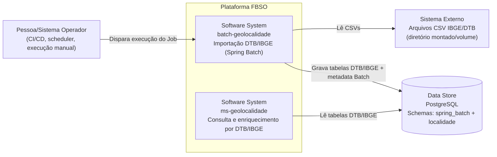

# C4 — Nível 1 (Contexto) — batch-geolocalidade

## Objetivo

Descrever o **contexto** do serviço `batch-geolocalidade`: quem o aciona, quais recursos externos ele usa e qual resultado ele entrega.

## Responsabilidade do sistema

O `batch-geolocalidade` é um serviço de **Spring Batch** responsável por:

- Ler arquivos **CSV do IBGE/DTB** a partir de um diretório configurável.
- Processar a hierarquia territorial (UF → regiões → município → distrito → subdistrito).
- Persistir/atualizar as tabelas de negócio no schema `localidade` em **PostgreSQL**.
- Manter metadata do Batch (tabelas `BATCH_*`) no schema `spring_batch`.

O resultado é uma base local (DTB/IBGE) pronta para consumo por sistemas de consulta, como o `ms-geolocalidade`.

## Diagrama (Contexto)

## Observações

- O Job principal é `importacaoGeolocalidadeJob`.
- A execução automática no startup é desabilitada (`spring.batch.job.enabled=false`).
- Existe um runner opcional para carga local (`LoadTestRunner`) habilitado por `app.loadtest.enabled=true`.
