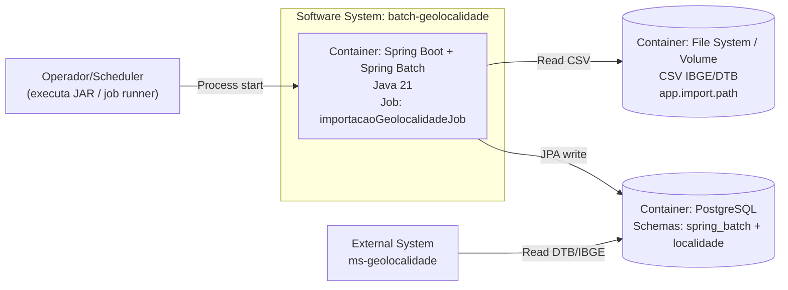

# C4 — Nível 2 (Contêiner) — batch-geolocalidade

## Objetivo

Detalhar os **contêineres** (executáveis/armazenamentos) que compõem o `batch-geolocalidade` e suas integrações.

## Contêineres

- **Aplicação Spring Boot + Spring Batch (Java 21)**
  - Define o Job `importacaoGeolocalidadeJob` com 3 steps (municípios → distritos → subdistritos).
  - Faz parsing dos CSVs com `FlatFileItemReader` e persiste via Spring Data JPA.

- **PostgreSQL**
  - Schema `spring_batch`: tabelas internas de metadata do Spring Batch (`BATCH_*`).
  - Schema `localidade`: tabelas de negócio DTB/IBGE (`uf`, `regiao_*`, `municipio`, `distrito`, `subdistrito`).

- **Diretório de importação (volume/FS)**
  - Local onde ficam os CSVs do IBGE/DTB.
  - Configurado por `app.import.path` (env `APP_IMPORT_PATH`).

## Diagrama (Contêiner)

## Tecnologias observadas

- Spring Boot 3.5.12
- Spring Batch (via Boot)
- Spring Data JPA + Hibernate
- Driver PostgreSQL
- Testes: H2 + spring-batch-test

