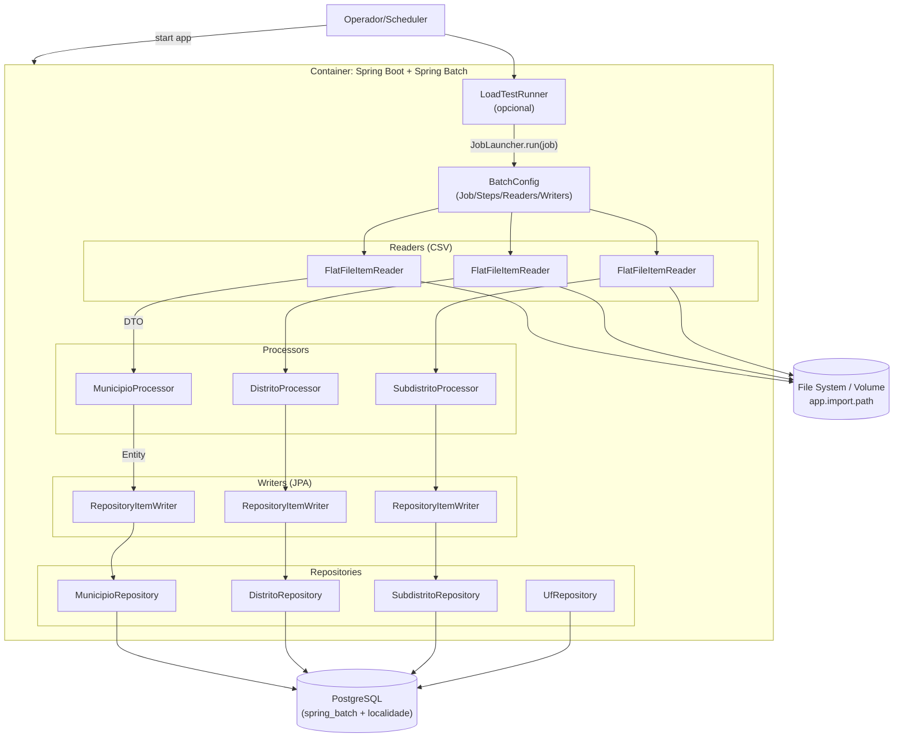

# C4 — Nível 3 (Componente) — batch-geolocalidade

## Objetivo

Descrever os **componentes** internos do contêiner "Spring Boot + Spring Batch" do `batch-geolocalidade`.

## Componentes principais

### Orquestração do Job

- `BatchConfig` (`br.com.fbso.geolocalidade.config`)
  - Define o Job `importacaoGeolocalidadeJob`.
  - Define 3 steps:
    - `stepMunicipio` (Municípios + hierarquia superior)
    - `stepDistrito`
    - `stepSubdistrito`

### Leitura de CSV (Readers)

- `FlatFileItemReader<MunicipioCsvDTO>` (`municipioReader`)
- `FlatFileItemReader<DistritoCsvDTO>` (`distritoReader`)
- `FlatFileItemReader<SubdistritoCsvDTO>` (`subdistritoReader`)

Características observadas:

- CSV delimitado por vírgula (`DelimitedLineTokenizer`) com `strict=false`.
- `linesToSkip(7)` para pular metadados do IBGE.
- `encoding("UTF-8")`.

### Processamento (Processors)

- `MunicipioProcessor`
  - Monta `Uf`, `RegiaoIntermediaria`, `RegiaoImediata` e `Municipio` a partir do DTO.
  - Mantém caches em memória durante o Job para evitar recriar instâncias repetidas.

- `DistritoProcessor`
  - Cria `Distrito` usando `MunicipioRepository.getReferenceById(...)`.

- `SubdistritoProcessor`
  - Cria `Subdistrito` usando `DistritoRepository.getReferenceById(...)`.

### Persistência (Writers + Repositories)

- Writers: `RepositoryItemWriter` com `save(...)`:
  - `MunicipioRepository`
  - `DistritoRepository`
  - `SubdistritoRepository`

- Repositórios adicionais:
  - `UfRepository` (presente no projeto; pode ser usado em evoluções/consultas)

### Runner opcional (carga local)

- `LoadTestRunner`
  - Componente condicional por `app.loadtest.enabled=true`.
  - Dispara o Job via `JobLauncher` e encerra o processo com exit code (0/1).

## Diagrama (Componentes)

