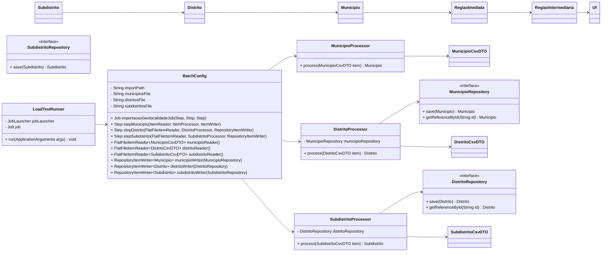

# C4 — Nível 4 (Código) — batch-geolocalidade

## Objetivo

Detalhar a visão de **código** (classes e relacionamentos) do fluxo de importação DTB/IBGE.

O recorte é o pipeline típico de Spring Batch:

CSV → `FlatFileItemReader<DTO>` → `ItemProcessor<DTO, Entity>` → `RepositoryItemWriter<Entity>` → `JpaRepository.save(...)`.

## Fluxo de execução (alto nível)

- Job: `importacaoGeolocalidadeJob`
  1. `stepMunicipio`: importa municípios e hierarquia superior (UF, Regiões)
  2. `stepDistrito`: importa distritos (referencia município por `getReferenceById`)
  3. `stepSubdistrito`: importa subdistritos (referencia distrito por `getReferenceById`)

- Runner opcional:
  - `LoadTestRunner` dispara o Job quando `app.loadtest.enabled=true`.

## Diagrama (Classes principais)

## Notas de implementação (observadas no código)

- Os readers usam `linesToSkip(7)` e `encoding("UTF-8")`.
- Os tokenizers estão com `strict=false` para tolerar colunas extras.
- `MunicipioProcessor` gera/associa `Uf`, `RegiaoIntermediaria`, `RegiaoImediata` e `Municipio` num único processamento.
- `DistritoProcessor` e `SubdistritoProcessor` usam `getReferenceById(...)` para manter integridade de FKs sem provocar inserts indevidos.

