# Modelo de Dados (ERD) — ms-billing-admin-tax-rates

> **Schema:** `billing_tax_rates` (compartilhado com `ms-billing-engine-tax-rates`)
> **Fonte:** `data/init.sql` existente + novas tabelas de administração (DT-1)
> **Atualizado:** 2026-07-12 (24 tabelas documentadas: 15 existentes + 6 admin + 3 IVA Dual independentes)
> **Decisão arquitetural:** [ADR-003](adrs/ADR-003-tax-table-strategy.md) — Estratégia de tabelas independentes para CBS, IBS, IS
> **Referência de integração:** [INTEGRATION-MAP.md](../../../../../business-inputs/business-projects/PRJ-FIN-2026-0002-ADMIN-TRIBUTOS-CORPORATIVOS/INTEGRATION-MAP.md) — Seção 5

📋 **Dicionário de Dados:** Para descrições detalhadas da função de negócio, propósito e padrões de uso de cada tabela, consulte [data-dictionary.md](data-dictionary.md). Este documento foca na estrutura relacional; o dicionário complementa com a semântica.

> ⚠️ **ATENÇÃO:** A tabela `iva_dual_rules` (CBS+IBS+IS unificados) está sendo **redefinida em 3 tabelas independentes** conforme [ADR-003](adrs/ADR-003-tax-table-strategy.md). Durante a transição, `iva_dual_rules` é mantida como legada; as novas implementações devem usar `aliquotas_cbs`, `aliquotas_ibs` e `aliquotas_is`. A VIEW `v_aliquotas_iva` provê compatibilidade retroativa para o motor de cálculo (DT-3).

---

## Diagrama Entidade-Relacionamento

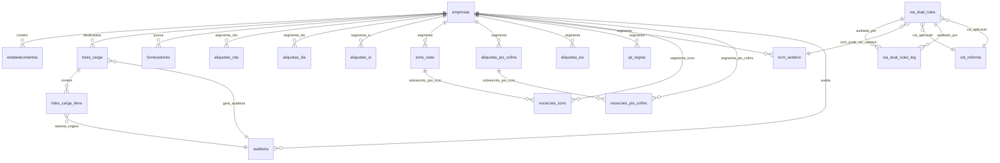

### Novas Tabelas — DT-1

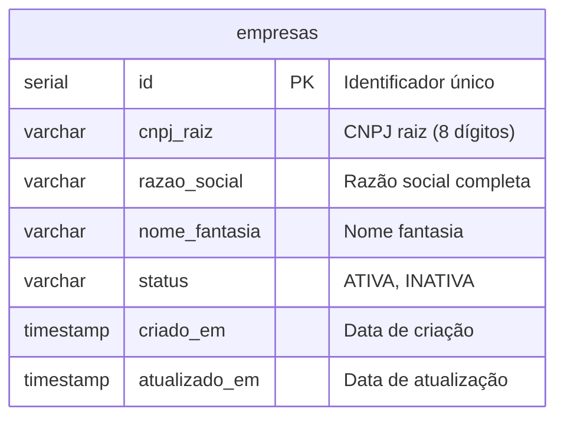
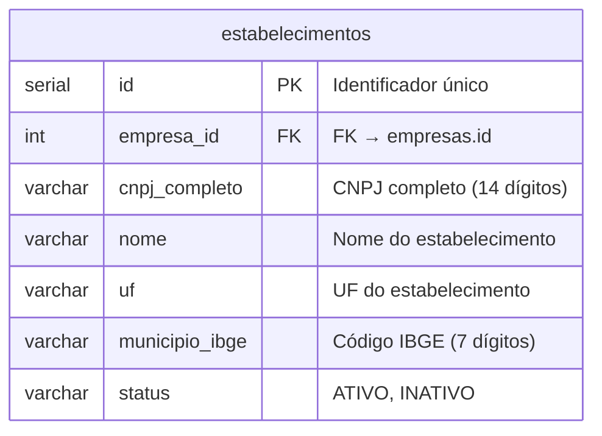
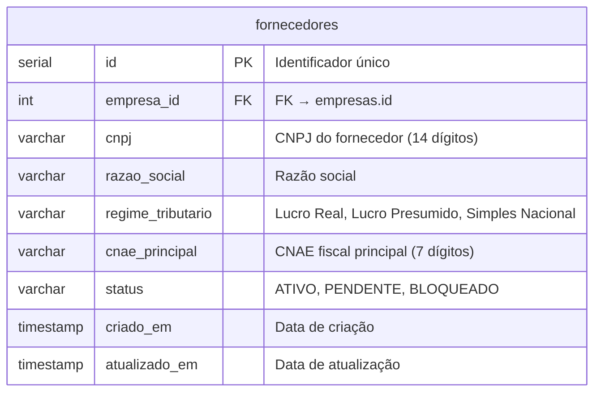
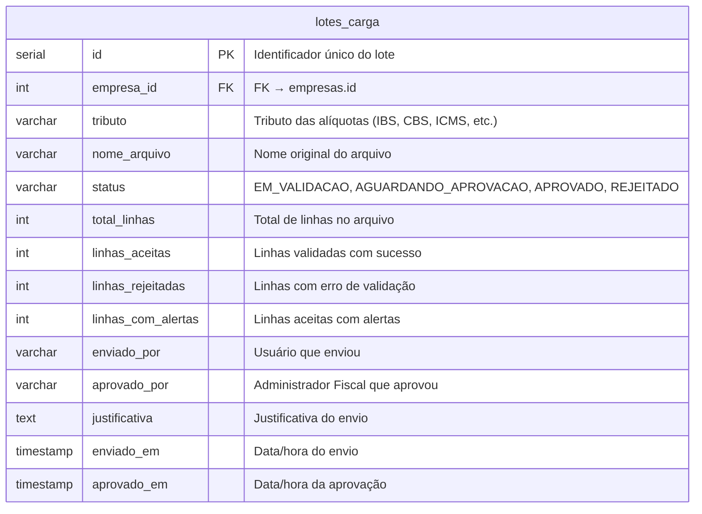
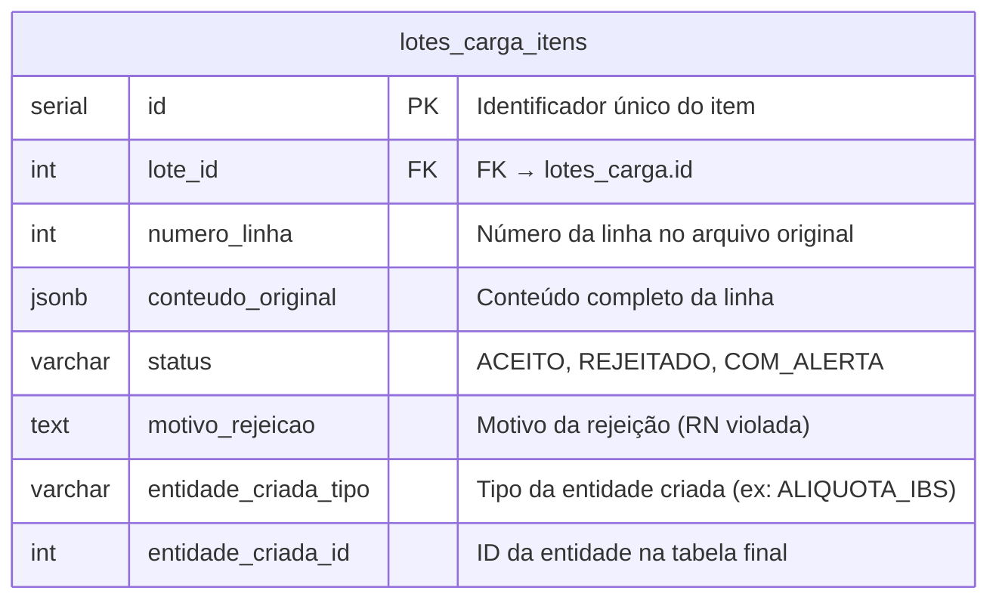
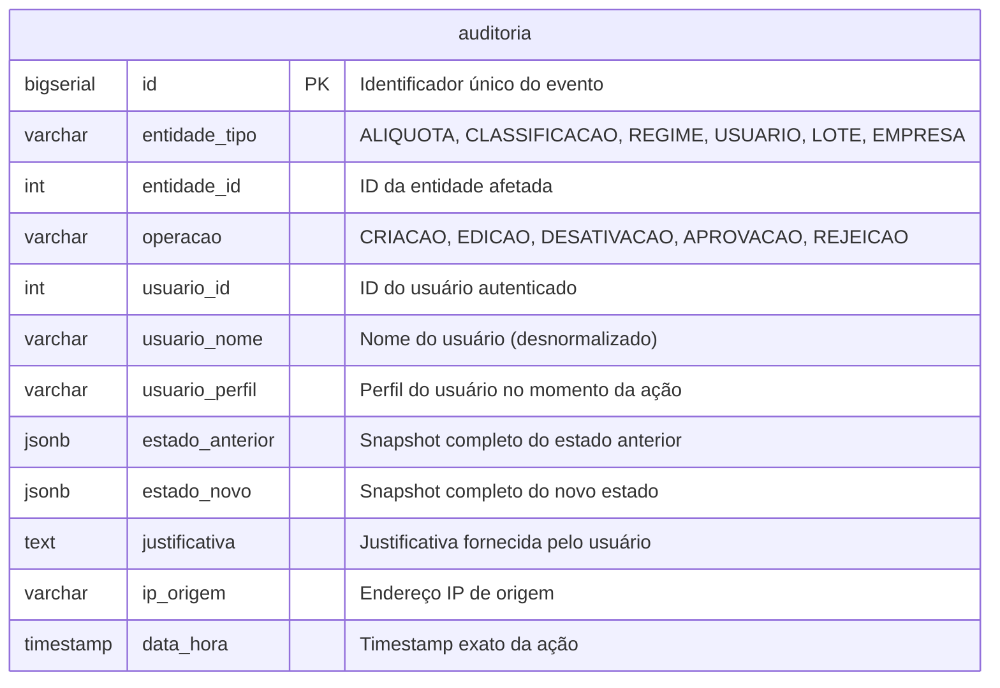

### Tabelas Existentes — Regime ICMS (colunas originais + colunas multi-tenancy)

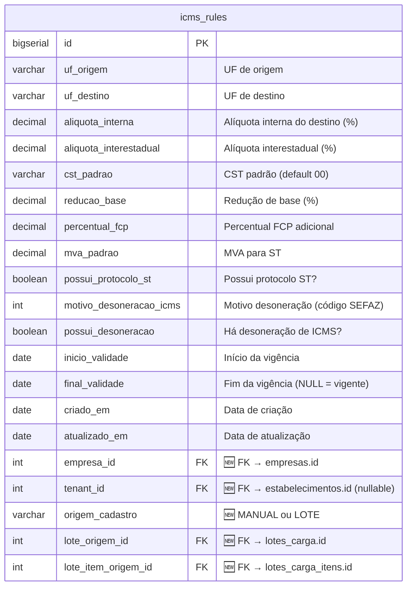
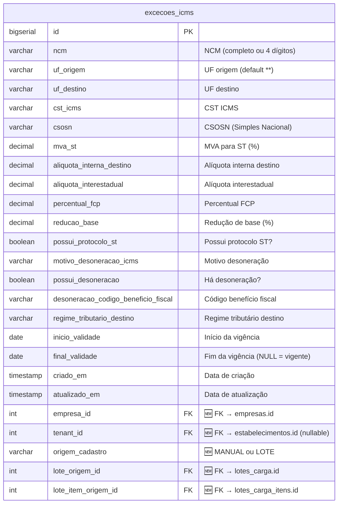
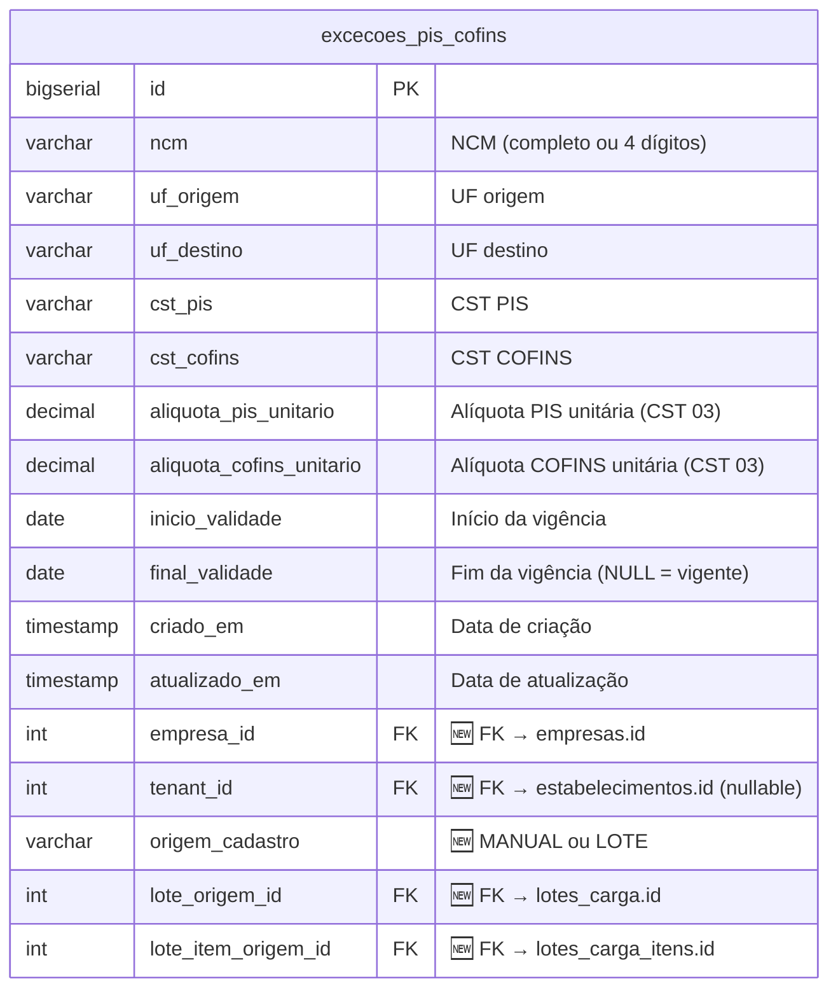

### 🆕 IVA Dual — Tabelas Independentes (ADR-003)

> **Decisão:** [ADR-003 — Opção C](adrs/ADR-003-tax-table-strategy.md) — CBS, IBS e IS são armazenados em tabelas independentes porque possuem chaves naturais e ciclos de vida distintos. A VIEW `v_aliquotas_iva` materializada supre o motor de cálculo (DT-3) com a mesma assinatura de consulta que `iva_dual_rules` provia.

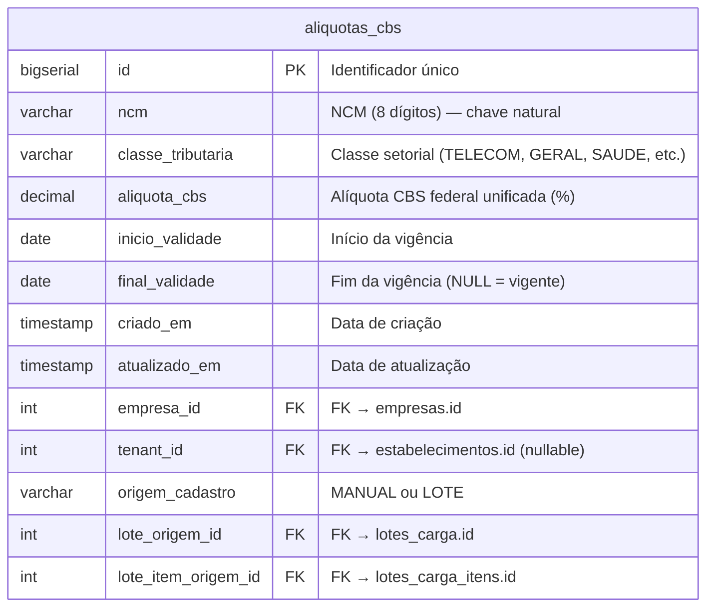
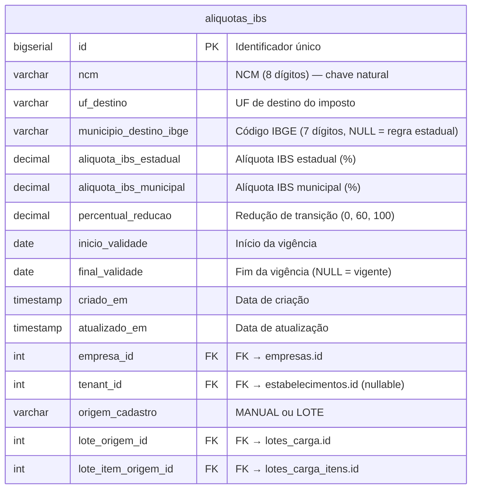
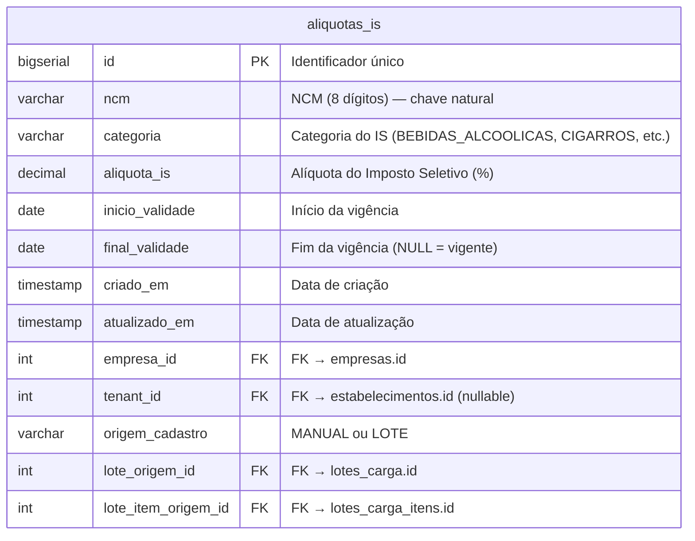

### VIEW Materializada — `v_aliquotas_iva` (Contrato DT-1 ↔ DT-3)

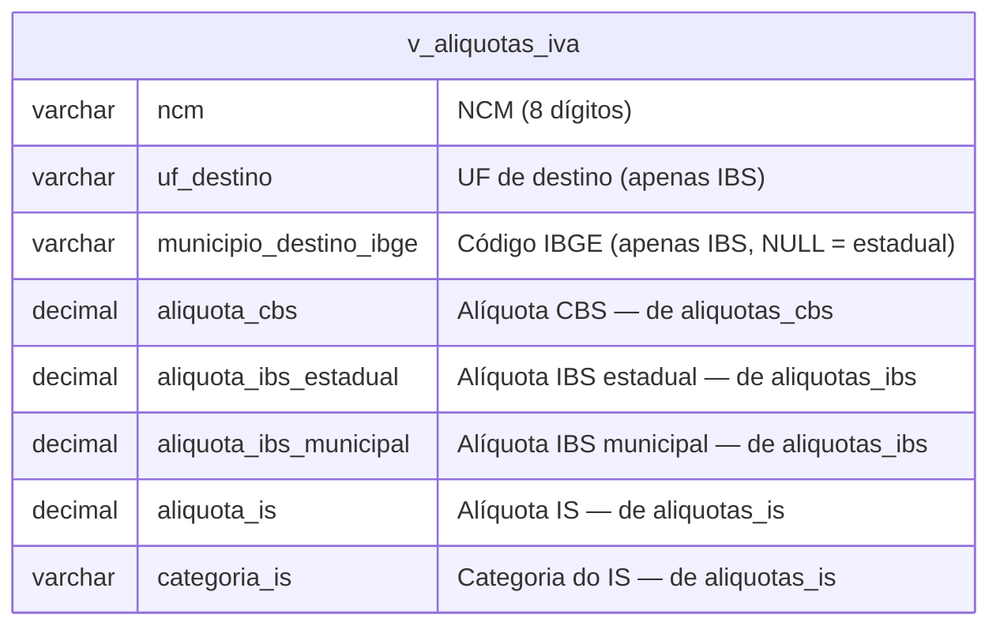

**Definição SQL:**
```sql
CREATE MATERIALIZED VIEW v_aliquotas_iva AS
SELECT
    COALESCE(c.ncm, i.ncm) AS ncm,
    i.uf_destino,
    i.municipio_destino_ibge,
    c.aliquota_cbs,
    c.classe_tributaria,
    i.aliquota_ibs_estadual,
    i.aliquota_ibs_municipal,
    i.percentual_reducao,
    s.aliquota_is,
    s.categoria AS categoria_is,
    COALESCE(c.empresa_id, i.empresa_id, s.empresa_id) AS empresa_id,
    GREATEST(
        COALESCE(c.inicio_validade, '1900-01-01'),
        COALESCE(i.inicio_validade, '1900-01-01'),
        COALESCE(s.inicio_validade, '1900-01-01')
    ) AS inicio_validade,
    LEAST(
        COALESCE(c.final_validade, '9999-12-31'),
        COALESCE(i.final_validade, '9999-12-31'),
        COALESCE(s.final_validade, '9999-12-31')
    ) AS final_validade
FROM aliquotas_cbs c
FULL OUTER JOIN aliquotas_ibs i
    ON c.ncm = i.ncm AND c.empresa_id = i.empresa_id
FULL OUTER JOIN aliquotas_is s
    ON COALESCE(c.ncm, i.ncm) = s.ncm
    AND COALESCE(c.empresa_id, i.empresa_id) = s.empresa_id
WHERE COALESCE(c.final_validade, CURRENT_DATE + 1) >= CURRENT_DATE
  AND COALESCE(i.final_validade, CURRENT_DATE + 1) >= CURRENT_DATE
  AND (s.final_validade IS NULL OR s.final_validade >= CURRENT_DATE);

-- Refresh após cada carga de lote aprovada:
-- REFRESH MATERIALIZED VIEW CONCURRENTLY v_aliquotas_iva;
```

> 💡 **Uso:** O motor de cálculo (DT-3) consulta `v_aliquotas_iva` com a mesma query que usava para `iva_dual_rules` — sem alterações no código. A administração (DT-1) escreve diretamente nas tabelas independentes (`aliquotas_cbs`, `aliquotas_ibs`, `aliquotas_is`). Ver [ADR-003](adrs/ADR-003-tax-table-strategy.md) para justificativa completa.

---

### ⚠️ VIEWs de Compatibilidade Legada — Estratégia de Deploy (CRÍTICO)

> **Esta seção é crítica para o deploy.** O motor de cálculo `ms-billing-engine-tax-rates` (DT-3, Go) referencia as tabelas pelos nomes originais em inglês no código (`federal_tax_rules`, `cbs_rates`, `ibs_rates`, `is_rates`, `iva_dual_rules`, `product_tax_exceptions`, `simples_nacional_rates`, `tax_equivalence`, `iss_rates`, `tenants`, `auditoria_log`). Para garantir que o DT-3 continue funcionando **sem nenhuma alteração de código**, são criadas VIEWs com os nomes legados que redirecionam para as novas tabelas em português.

#### Estratégia

```
┌─────────────────────────────────────────────────────────────────────────────┐
│                      DEPLOY DT-1 (Admin) — Java/Spring                       │
│                                                                              │
│  Cria tabelas NOVAS com nomes em português:                                  │
│  ┌──────────────────────────────────────────────────────────────────────┐   │
│  │  aliquotas_cbs       aliquotas_ibs       aliquotas_is                │   │
│  │  aliquotas_pis_cofins  aliquotas_iss     faixas_simples_nacional     │   │
│  │  equivalencia_csosn_cst  excecoes_icms  excecoes_pis_cofins         │   │
│  │  estabelecimentos    auditoria                                       │   │
│  │  v_aliquotas_iva    (VIEW materializada — JOIN das 3 aliquotas)     │   │
│  └──────────────────────────────────────────────────────────────────────┘   │
│                                    │                                         │
│                                    │  Cria VIEWs de compatibilidade          │
│                                    ▼                                         │
│  ┌──────────────────────────────────────────────────────────────────────┐   │
│  │  VIEW federal_tax_rules        AS SELECT * FROM aliquotas_pis_cofins │   │
│  │  VIEW cbs_rates                AS SELECT * FROM aliquotas_cbs        │   │
│  │  VIEW ibs_rates                AS SELECT * FROM aliquotas_ibs        │   │
│  │  VIEW is_rates                 AS SELECT * FROM aliquotas_is         │   │
│  │  VIEW iss_rates                AS SELECT * FROM aliquotas_iss        │   │
│  │  VIEW simples_nacional_rates   AS SELECT * FROM faixas_simples_nacional │
│  │  VIEW tax_equivalence          AS SELECT * FROM equivalencia_csosn_cst │
│  │  VIEW tenants                  AS SELECT * FROM estabelecimentos     │   │
│  │  VIEW auditoria_log            AS SELECT * FROM auditoria            │   │
│  │  VIEW iva_dual_rules           AS SELECT * FROM v_aliquotas_iva      │   │
│  │  VIEW product_tax_exceptions   AS SELECT * FROM v_excecoes_fiscais   │   │
│  └──────────────────────────────────────────────────────────────────────┘   │
└─────────────────────────────────────────────────────────────────────────────┘
                                    │
                                    │ DT-3 consulta via VIEWs (nomes legados)
                                    ▼
┌─────────────────────────────────────────────────────────────────────────────┐
│                ms-billing-engine-tax-rates (DT-3) — Go                       │
│                                                                              │
│  Código NÃO muda:                                                            │
│  ┌──────────────────────────────────────────────────────────────────────┐   │
│  │  GetCBSRate()      → SELECT * FROM cbs_rates WHERE ...               │   │
│  │  GetIBSRate()      → SELECT * FROM ibs_rates WHERE ...               │   │
│  │  GetISRate()       → SELECT * FROM is_rates WHERE ...                │   │
│  │  computeIvaDual()  → SELECT * FROM iva_dual_rules WHERE ...          │   │
│  │  GetTenant()       → SELECT * FROM tenants WHERE ...                 │   │
│  │  AuditLog()        → INSERT INTO auditoria_log ...                   │   │
│  └──────────────────────────────────────────────────────────────────────┘   │
│                                                                              │
│  As VIEWs são transparentes para INSERT, UPDATE, DELETE e SELECT            │
│  (desde que sejam VIEWs simples — sem JOINs, agregações ou DISTINCT)        │
└─────────────────────────────────────────────────────────────────────────────┘
```

#### DDL das VIEWs de Compatibilidade

```sql
-- Migration: V30__criar_views_compatibilidade.sql
-- Executar APÓS a criação de todas as tabelas com nomes em português
-- Essas VIEWs são o CONTRATO DE INTERFACE entre DT-1 e DT-3
-- ⚠️ 11 VIEWs — verificar existência de todas antes do deploy do DT-3

-- ============================================================================
-- VIEWs para tabelas de alíquotas (updatable — DT-3 pode escrever)
-- ============================================================================

-- federal_tax_rules → aliquotas_pis_cofins
CREATE VIEW federal_tax_rules AS SELECT * FROM aliquotas_pis_cofins;

-- cbs_rates → aliquotas_cbs
CREATE VIEW cbs_rates AS SELECT * FROM aliquotas_cbs;

-- ibs_rates → aliquotas_ibs
CREATE VIEW ibs_rates AS SELECT * FROM aliquotas_ibs;

-- is_rates → aliquotas_is
CREATE VIEW is_rates AS SELECT * FROM aliquotas_is;

-- iss_rates → aliquotas_iss
CREATE VIEW iss_rates AS SELECT * FROM aliquotas_iss;

-- simples_nacional_rates → faixas_simples_nacional
CREATE VIEW simples_nacional_rates AS SELECT * FROM faixas_simples_nacional;

-- tax_equivalence → equivalencia_csosn_cst
CREATE VIEW tax_equivalence AS SELECT * FROM equivalencia_csosn_cst;

-- ============================================================================
-- VIEWs para tabelas administrativas (updatable)
-- ============================================================================

-- tenants → estabelecimentos
CREATE VIEW tenants AS SELECT * FROM estabelecimentos;

-- auditoria_log → auditoria
CREATE VIEW auditoria_log AS SELECT * FROM auditoria;

-- ============================================================================
-- VIEWs para IVA Dual (read-only — DT-3 só consulta)
-- ============================================================================

-- iva_dual_rules → v_aliquotas_iva (VIEW materializada)
CREATE VIEW iva_dual_rules AS SELECT * FROM v_aliquotas_iva;

-- ============================================================================
-- VIEW para exceções fiscais (read-only — JOIN de excecoes_icms + excecoes_pis_cofins)
-- ⚠️ NÃO é updatable (contém FULL OUTER JOIN). DT-3 faz apenas SELECT.
-- DT-1 escreve diretamente em excecoes_icms e excecoes_pis_cofins
-- ============================================================================

CREATE VIEW v_excecoes_fiscais AS
SELECT
    COALESCE(ei.ncm, ep.ncm) AS ncm,
    COALESCE(ei.uf_origem, ep.uf_origem) AS uf_origem,
    COALESCE(ei.uf_destino, ep.uf_destino) AS uf_destino,
    ep.cst_pis, ep.cst_cofins,
    ei.cst_icms, ei.csosn,
    ei.mva_st, ei.aliquota_interna_destino, ei.aliquota_interestadual,
    ei.percentual_fcp, ei.reducao_base,
    ei.possui_protocolo_st, ei.motivo_desoneracao_icms,
    ei.possui_desoneracao, ei.desoneracao_codigo_beneficio_fiscal,
    ei.regime_tributario_destino,
    ep.aliquota_pis_unitario, ep.aliquota_cofins_unitario,
    COALESCE(ei.inicio_validade, ep.inicio_validade) AS inicio_validade,
    CASE WHEN ei.final_validade IS NOT NULL AND ep.final_validade IS NOT NULL
         THEN GREATEST(ei.final_validade, ep.final_validade)
         ELSE COALESCE(ei.final_validade, ep.final_validade) END AS final_validade,
    COALESCE(ei.empresa_id, ep.empresa_id) AS empresa_id,
    COALESCE(ei.tenant_id, ep.tenant_id) AS tenant_id,
    CASE WHEN ei.origem_cadastro IS NOT NULL THEN ei.origem_cadastro
         ELSE ep.origem_cadastro END AS origem_cadastro,
    COALESCE(ei.lote_origem_id, ep.lote_origem_id) AS lote_origem_id,
    COALESCE(ei.lote_item_origem_id, ep.lote_item_origem_id) AS lote_item_origem_id
FROM excecoes_icms ei
FULL OUTER JOIN excecoes_pis_cofins ep
    ON ei.ncm = ep.ncm
    AND ei.uf_destino = ep.uf_destino
    AND ei.uf_origem = ep.uf_origem
    AND ei.empresa_id = ep.empresa_id;

-- product_tax_exceptions → v_excecoes_fiscais
CREATE VIEW product_tax_exceptions AS SELECT * FROM v_excecoes_fiscais;
```

#### Requisitos de Deploy

| # | Requisito | Criticidade | Motivo |
|---|-----------|------------|--------|
| 1 | VIEWs devem ser criadas na **mesma transação** que as tabelas | 🔴 CRÍTICO | Se as VIEWs não existirem, DT-3 quebra imediatamente |
| 2 | Ordem: tabelas → dados → VIEWs | 🔴 CRÍTICO | VIEWs dependem das tabelas existirem |
| 3 | `iva_dual_rules` (VIEW) deve ser criada **antes** de dropar a tabela `iva_dual_rules` original | 🔴 CRÍTICO | Evita janela sem a entidade `iva_dual_rules` |
| 4 | Testar `SELECT`, `INSERT`, `UPDATE`, `DELETE` via VIEWs updatable | 🟠 ALTO | VIEWs simples (`SELECT *`) são updatable. `product_tax_exceptions` e `iva_dual_rules` são read-only (JOIN/MVIEW) — DT-3 só faz SELECT nelas |
| 5 | `product_tax_exceptions` e `iva_dual_rules` **NÃO** são updatable | 🟠 ALTO | `product_tax_exceptions` tem FULL OUTER JOIN; `iva_dual_rules` aponta para materialized view. DT-1 escreve nas tabelas base; DT-3 só lê |
| 6 | `v_excecoes_fiscais` deve existir antes de `product_tax_exceptions` | 🔴 CRÍTICO | `product_tax_exceptions` é VIEW sobre `v_excecoes_fiscais` |
| 5 | DT-3 **NÃO** precisa de redeploy | ✅ Garantido | VIEWs são transparentes para o consumidor |
| 6 | Rollback: dropar VIEWs restaura nomes originais | 🟡 MÉDIO | Ter script de rollback pronto |

#### Verificação Pós-Deploy

```sql
-- 1. Confirmar que as 11 VIEWs existem
SELECT table_name, is_insertable_into, is_updatable
FROM information_schema.views
WHERE table_schema = 'billing_tax_rates'
  AND table_name IN ('federal_tax_rules', 'cbs_rates', 'ibs_rates', 'is_rates',
                     'iss_rates', 'simples_nacional_rates', 'tax_equivalence',
                     'iva_dual_rules', 'product_tax_exceptions',
                     'tenants', 'auditoria_log')
ORDER BY table_name;

-- 2. VIEWs updatable (9 de 11): testar INSERT
INSERT INTO federal_tax_rules (regime_tributario, cst_pis, cst_cofins, aliquota_pis, aliquota_cofins, empresa_id)
VALUES ('LUCRO_REAL', '01', '01', 1.65, 7.60, 1)
RETURNING id;

-- 3. VIEW read-only: testar SELECT em product_tax_exceptions (FULL OUTER JOIN)
SELECT * FROM product_tax_exceptions
WHERE ncm = '84713019' AND uf_destino = 'SP'
  AND final_validade IS NULL
LIMIT 1;

-- 4. VIEW read-only: testar SELECT em iva_dual_rules (materialized view)
SELECT * FROM iva_dual_rules
WHERE ncm = '84713019' AND uf_destino = 'SP'
  AND final_validade IS NULL
LIMIT 1;

-- 5. Limpar registro de teste
DELETE FROM federal_tax_rules WHERE ncm = '84713019' AND empresa_id = 1;
```

> ⚠️ **ATENÇÃO:** Esta seção é material de referência para o **coordenador de deploy**. As VIEWs de compatibilidade são o mecanismo que permite a evolução do schema (nomes em português) sem quebrar o contrato com o motor de cálculo legado (DT-3). **Não pule esta etapa no deploy.**

---

### 🔧 Estratégia de Migração: RENAME vs CREATE+INSERT

Duas estratégias são usadas para renomear as tabelas legadas, dependendo se a tabela sofre **apenas renomeação** ou **redesign estrutural**.

> `★ Insight ─────────────────────────────────────`
> No PostgreSQL, `ALTER TABLE RENAME` é uma operação **instantânea** — apenas atualiza o catálogo (`pg_class.relname`), sem tocar nos dados. O OID da tabela não muda, então FKs, índices, triggers e sequences associadas continuam funcionando. Já `CREATE TABLE + INSERT...SELECT` copia fisicamente os dados, o que para tabelas grandes pode gerar WAL massivo e exigir downtime. A regra é: **se a estrutura não muda, RENAME. Se muda, CREATE.**
> `─────────────────────────────────────────────────`

#### Quando usar cada estratégia

| Cenário | Estratégia | Tabelas |
|---------|-----------|---------|
| **Apenas renomear** (estrutura idêntica) | `ALTER TABLE RENAME` + VIEW | `federal_tax_rules`, `simples_nacional_rates`, `tax_equivalence`, `iss_rates`, `tenants`, `auditoria_log` |
| **Split/redesign** (estrutura muda) | `CREATE TABLE` + `INSERT...SELECT` + VIEW | `iva_dual_rules` → 3 tabelas, `product_tax_exceptions` → 2 tabelas |
| **Redefinição** (tabela existente ganha nova estrutura) | `ALTER TABLE RENAME` (old) + `CREATE TABLE` (new) + `INSERT...SELECT` + VIEW | `cbs_rates` (fallback → primária) |

#### Estratégia A: `ALTER TABLE RENAME` + VIEW (6 tabelas)

Para tabelas que mantêm a mesma estrutura — apenas o nome muda.

```sql
-- Migration: V30a__renomear_tabelas_simples.sql
-- ⚠️ Executar em TRANSAÇÃO ÚNICA (BEGIN...COMMIT)
-- Para cada tabela: rename → ajustar sequence → ajustar índices → criar VIEW → grants

BEGIN;

-- ============================================================================
-- 1. federal_tax_rules → aliquotas_pis_cofins
-- ============================================================================
ALTER TABLE federal_tax_rules RENAME TO aliquotas_pis_cofins;
ALTER SEQUENCE IF EXISTS federal_tax_rules_id_seq RENAME TO aliquotas_pis_cofins_id_seq;
ALTER INDEX IF EXISTS idx_federal_regime RENAME TO idx_pis_cofins_regime;
-- Trigger names são internos; PostgreSQL referencia por OID, mas renomear para clareza:
ALTER TRIGGER billing_tax_rates_federal_tax_rules_fim_validade
    ON aliquotas_pis_cofins RENAME TO trg_pis_cofins_fim_validade;
ALTER TRIGGER billing_tax_rates_federal_tax_rules_atualizado_em
    ON aliquotas_pis_cofins RENAME TO trg_pis_cofins_atualizado_em;

CREATE VIEW federal_tax_rules AS SELECT * FROM aliquotas_pis_cofins;

-- ============================================================================
-- 2. simples_nacional_rates → faixas_simples_nacional
-- ============================================================================
ALTER TABLE simples_nacional_rates RENAME TO faixas_simples_nacional;
ALTER SEQUENCE IF EXISTS simples_nacional_rates_id_seq RENAME TO faixas_simples_nacional_id_seq;
ALTER INDEX IF EXISTS idx_rbt12_range RENAME TO idx_faixas_rbt12_range;

CREATE VIEW simples_nacional_rates AS SELECT * FROM faixas_simples_nacional;

-- ============================================================================
-- 3. tax_equivalence → equivalencia_csosn_cst
-- ============================================================================
ALTER TABLE tax_equivalence RENAME TO equivalencia_csosn_cst;
ALTER SEQUENCE IF EXISTS tax_equivalence_id_seq RENAME TO equivalencia_csosn_cst_id_seq;

CREATE VIEW tax_equivalence AS SELECT * FROM equivalencia_csosn_cst;

-- ============================================================================
-- 4. iss_rates → aliquotas_iss
-- ============================================================================
ALTER TABLE iss_rates RENAME TO aliquotas_iss;
ALTER SEQUENCE IF EXISTS iss_rates_id_seq RENAME TO aliquotas_iss_id_seq;

CREATE VIEW iss_rates AS SELECT * FROM aliquotas_iss;

-- ============================================================================
-- 5. tenants → estabelecimentos
-- ============================================================================
ALTER TABLE tenants RENAME TO estabelecimentos;
ALTER SEQUENCE IF EXISTS tenants_id_seq RENAME TO estabelecimentos_id_seq;

CREATE VIEW tenants AS SELECT * FROM estabelecimentos;

-- ============================================================================
-- 6. auditoria_log → auditoria
-- ============================================================================
ALTER TABLE auditoria_log RENAME TO auditoria;
ALTER SEQUENCE IF EXISTS auditoria_log_id_seq RENAME TO auditoria_id_seq;

CREATE VIEW auditoria_log AS SELECT * FROM auditoria;

-- ============================================================================
-- Grants — replicar permissões da tabela original para a VIEW e novo nome
-- ============================================================================
-- (executar para cada tabela renomeada)
DO $$
DECLARE
    r RECORD;
BEGIN
    FOR r IN
        SELECT 'federal_tax_rules'::regclass AS view_name,
               'aliquotas_pis_cofins'::regclass AS table_name
    LOOP
        EXECUTE format('GRANT SELECT, INSERT, UPDATE, DELETE ON %s TO app_admin', r.view_name);
        EXECUTE format('GRANT SELECT, INSERT, UPDATE, DELETE ON %s TO app_admin', r.table_name);
        EXECUTE format('GRANT SELECT ON %s TO app_engine_readonly', r.view_name);
        EXECUTE format('GRANT SELECT ON %s TO app_engine_readonly', r.table_name);
    END LOOP;
END;
$$;

COMMIT;
```

**Vantagens da Estratégia A:**
- Instantâneo — apenas atualiza catálogo, zero I/O de dados
- FKs, índices, triggers continuam funcionando (referenciam OID, não nome)
- Rollback simples: `ALTER TABLE ... RENAME TO ...` reverso
- Sem duplicação de dados em disco
- Sem downtime para tabelas de qualquer tamanho

#### Estratégia B: `CREATE TABLE` + `INSERT...SELECT` + VIEW (2 splits)

Para tabelas que estão sendo divididas e ganham nova estrutura.

```sql
-- Migration: V30b__criar_tabelas_split.sql
-- ⚠️ Executar em TRANSAÇÃO ÚNICA
-- ⚠️ Pode gerar WAL significativo se as tabelas originais forem grandes

BEGIN;

-- ============================================================================
-- 1. iva_dual_rules → aliquotas_cbs + aliquotas_ibs + aliquotas_is
-- ============================================================================

-- Criar as 3 tabelas independentes (já existem de V24-V26)
-- Popular com dados da tabela original:

-- aliquotas_cbs: uma linha por (ncm, empresa_id) — elimina duplicação UF
INSERT INTO aliquotas_cbs (ncm, classe_tributaria, aliquota_cbs,
                           inicio_validade, final_validade,
                           empresa_id, tenant_id, origem_cadastro,
                           lote_origem_id, lote_item_origem_id)
SELECT DISTINCT ON (ncm, empresa_id)
       ncm, NULL AS classe_tributaria, aliquota_cbs,
       inicio_validade, final_validade,
       empresa_id, tenant_id, origem_cadastro,
       lote_origem_id, lote_item_origem_id
FROM iva_dual_rules
ORDER BY ncm, empresa_id, inicio_validade DESC;

-- aliquotas_ibs: uma linha por (ncm, uf_destino, municipio, empresa_id)
INSERT INTO aliquotas_ibs (ncm, uf_destino, municipio_destino_ibge,
                           aliquota_ibs_estadual, aliquota_ibs_municipal,
                           percentual_reducao,
                           inicio_validade, final_validade,
                           empresa_id, tenant_id, origem_cadastro,
                           lote_origem_id, lote_item_origem_id)
SELECT ncm, uf_destino, municipio_destino_ibge,
       aliquota_ibs_estadual, aliquota_ibs_municipal,
       percentual_reducao,
       inicio_validade, final_validade,
       empresa_id, tenant_id, origem_cadastro,
       lote_origem_id, lote_item_origem_id
FROM iva_dual_rules;

-- aliquotas_is: apenas linhas onde IS se aplica (filtra NULLs)
INSERT INTO aliquotas_is (ncm, categoria, aliquota_is,
                          inicio_validade, final_validade,
                          empresa_id, tenant_id, origem_cadastro,
                          lote_origem_id, lote_item_origem_id)
SELECT DISTINCT ON (ncm, empresa_id)
       ncm, NULL AS categoria, aliquota_is,
       inicio_validade, final_validade,
       empresa_id, tenant_id, origem_cadastro,
       lote_origem_id, lote_item_origem_id
FROM iva_dual_rules
WHERE is_imposto_seletivo = TRUE
ORDER BY ncm, empresa_id, inicio_validade DESC;

-- Atualizar sequences
SELECT setval('aliquotas_cbs_id_seq', (SELECT MAX(id) FROM aliquotas_cbs));
SELECT setval('aliquotas_ibs_id_seq', (SELECT MAX(id) FROM aliquotas_ibs));
SELECT setval('aliquotas_is_id_seq', (SELECT MAX(id) FROM aliquotas_is));

-- Criar VIEW de compatibilidade (aponta para VIEW materializada)
REFRESH MATERIALIZED VIEW v_aliquotas_iva;
CREATE VIEW iva_dual_rules AS SELECT * FROM v_aliquotas_iva;

-- ============================================================================
-- 2. product_tax_exceptions → excecoes_icms + excecoes_pis_cofins
-- ============================================================================

-- excecoes_icms: apenas colunas de ICMS
INSERT INTO excecoes_icms (ncm, uf_origem, uf_destino,
                           cst_icms, csosn,
                           mva_st, aliquota_interna_destino, aliquota_interestadual,
                           percentual_fcp, reducao_base,
                           possui_protocolo_st, motivo_desoneracao_icms,
                           possui_desoneracao, desoneracao_codigo_beneficio_fiscal,
                           regime_tributario_destino,
                           inicio_validade, final_validade,
                           empresa_id, tenant_id, origem_cadastro,
                           lote_origem_id, lote_item_origem_id)
SELECT ncm, uf_origem, uf_destino,
       cst_icms, csosn,
       mva_st, aliquota_interna_destino, aliquota_interestadual,
       percentual_fcp, reducao_base,
       possui_protocolo_st, motivo_desoneracao_icms,
       possui_desoneracao, desoneracao_codigo_beneficio_fiscal,
       regime_tributario_destino,
       inicio_validade, final_validade,
       empresa_id, tenant_id, origem_cadastro,
       lote_origem_id, lote_item_origem_id
FROM product_tax_exceptions;

-- excecoes_pis_cofins: apenas colunas de PIS/COFINS
INSERT INTO excecoes_pis_cofins (ncm, uf_origem, uf_destino,
                                 cst_pis, cst_cofins,
                                 aliquota_pis_unitario, aliquota_cofins_unitario,
                                 inicio_validade, final_validade,
                                 empresa_id, tenant_id, origem_cadastro,
                                 lote_origem_id, lote_item_origem_id)
SELECT ncm, uf_origem, uf_destino,
       cst_pis, cst_cofins,
       aliquota_pis_unitario, aliquota_cofins_unitario,
       inicio_validade, final_validade,
       empresa_id, tenant_id, origem_cadastro,
       lote_origem_id, lote_item_origem_id
FROM product_tax_exceptions;

-- Atualizar sequences
SELECT setval('excecoes_icms_id_seq', (SELECT MAX(id) FROM excecoes_icms));
SELECT setval('excecoes_pis_cofins_id_seq', (SELECT MAX(id) FROM excecoes_pis_cofins));

-- Criar VIEW de compatibilidade
CREATE VIEW v_excecoes_fiscais AS
SELECT ...; -- (definição completa na seção DDL das VIEWs acima)

CREATE VIEW product_tax_exceptions AS SELECT * FROM v_excecoes_fiscais;

COMMIT;
```

#### Comparativo Final

| Critério | Estratégia A (RENAME) | Estratégia B (CREATE+INSERT) |
|----------|----------------------|------------------------------|
| **Velocidade** | Instantâneo (catálogo) | Proporcional ao volume de dados |
| **WAL gerado** | Zero (só metadados) | Significativo (cópia de dados) |
| **Espaço em disco** | Zero adicional | 2× durante migração |
| **FKs/Índices/Triggers** | Preservados (mesmo OID) | Recriados (novo OID) |
| **Sequences** | Renomeadas (mesmo OID) | Resetadas via `setval()` |
| **Rollback** | `ALTER TABLE RENAME` reverso | `DROP TABLE` nova |
| **Validação de dados** | Desnecessária (mesmos dados) | Recomendada (row counts) |
| **Usar quando** | Estrutura idêntica | Estrutura muda (split/redesign) |

### Tabelas Existentes — Demais Regimes (com 🆕 colunas multi-tenancy)

As seguintes tabelas também recebem as 5 colunas multi-tenancy (`empresa_id`, `tenant_id`, `origem_cadastro`, `lote_origem_id`, `lote_item_origem_id`):

| Tabela | Tributo | 🆕 Colunas Multi-Tenancy |
|:---|:---|:---|
| `aliquotas_pis_cofins` | PIS, COFINS | ✅ `empresa_id`, `tenant_id`, `origem_cadastro`, `lote_origem_id`, `lote_item_origem_id` |
| `equivalencia_csosn_cst` | ICMS (Simples) | ✅ idem |
| `faixas_simples_nacional` | ICMS (Simples) | ✅ idem |
| `ipi_regras` | IPI | ✅ idem |
| `aliquotas_iss` | ISS | ✅ idem |
| `iva_dual_rules` | CBS, IBS | ✅ (⚠️ em redefinição — ver ADR-003) |
| `ncm_seletivo` | IS | ✅ idem |

### Tabelas sem Multi-Tenancy (Operacionais — gerenciadas pelo DT-3)

| Tabela | Motivo |
|:---|:---|
| `tax_tokens` | Tabela operacional do motor de cálculo (DT-3). Não requer segmentação por empresa |
| `fornecedor_fiscal` | Tabela operacional do motor de cálculo (DT-3). Complementar à nova `fornecedores` |
| `iva_dual_rules_log` | Trigger de auditoria do PostgreSQL no schema existente. Substituído conceitualmente por `auditoria` para novas operações |
| `reforma_tributaria_rules` | ⚠️ Legado/deprecated — mantido para compatibilidade. Não recebe novas colunas |
| `cst_reforma` | Tabela de referência normativa (LC 214/2025). Não requer segmentação por empresa |
| `v_aliquotas_iva` | VIEW materializada — contrato de interface DT-1 ↔ DT-3. Não armazena dados próprios; deriva de `aliquotas_cbs`, `aliquotas_ibs`, `aliquotas_is` |

---

## Resumo das 24 Tabelas

### Regime Atual (Pré-Reforma) — 7 tabelas (+ multi-tenancy)

| # | Tabela | Tributo | Administrada por | 🆕 Multi-Tenancy |
|:---|:---|:---|:---|:---:|
| 1 | `icms_rules` | ICMS | DT-1 | ✅ |
| 2 | `aliquotas_pis_cofins` | PIS, COFINS | DT-1 | ✅ |
| 3 | `excecoes_icms` | ICMS (exceções por NCM) | DT-1 | ✅ |
| `excecoes_pis_cofins` | PIS, COFINS (exceções por NCM) | DT-1 | ✅ |
| `product_tax_exceptions` | ICMS, PIS, COFINS (VIEW legada) | Automático | — |
| 4 | `equivalencia_csosn_cst` | ICMS | DT-1 | ✅ |
| 5 | `faixas_simples_nacional` | ICMS | DT-1 | ✅ |
| 6 | `ipi_regras` | IPI | DT-1 | ✅ |
| 7 | `aliquotas_iss` | ISS | DT-1 | ✅ |

### Reforma Tributária (IVA Dual) — 9 tabelas (3 ativas + 3 independentes 🆕 + 3 legadas)

| # | Tabela | Tributo | Administrada por | 🆕 Multi-Tenancy |
|:---|:---|:---|:---|:---:|
| 8 | `iva_dual_rules` | CBS, IBS, IS | ⚠️ Em redefinição (ADR-003) | ✅ |
| 9 | `iva_dual_rules_log` | — | Trigger PostgreSQL | ❌ (legado) |
| 10 | `reforma_tributaria_rules` | CBS, IBS, IS | ⚠️ Legado | ❌ |
| 11 | `ncm_seletivo` | IS (catálogo NCMs) | DT-1 | ✅ |
| 12 | `cst_reforma` | CBS, IBS | Referência normativa | ❌ |
| 🆕 12a | **`aliquotas_cbs`** | **CBS** | **DT-1** | **✅ (tabela independente)** |
| 🆕 12b | **`aliquotas_ibs`** | **IBS** | **DT-1** | **✅ (tabela independente)** |
| 🆕 12c | **`aliquotas_is`** | **IS** | **DT-1** | **✅ (tabela independente)** |
| 🆕 12d | **`v_aliquotas_iva`** | **CBS, IBS, IS (VIEW)** | **Automático** | **— (VIEW materializada)** |

> ⚠️ **Nota de transição:** `iva_dual_rules` é mantida durante o período de migração. `aliquotas_cbs` existente (fallback setorial) é **redefinida** como tabela primária de CBS. `aliquotas_cbs` antiga tem seus dados migrados para a nova estrutura. Ver [ADR-003](adrs/ADR-003-tax-table-strategy.md).

### Operacional — 2 tabelas (gerenciadas pelo DT-3)

| # | Tabela | Gerenciada por | Acesso DT-1 |
|:---|:---|:---|:---|
| 16 | `tax_tokens` | DT-3 | Nenhum (operacional) |
| 17 | `fornecedor_fiscal` | DT-3 | Leitura (consulta) |

### Novas Tabelas — DT-1 — 6 tabelas

| # | Tabela | Propósito |
|:---|:---|:---|
| 18 | `empresas` | Raiz do multi-tenancy — empresas do grupo econômico |
| 19 | `estabelecimentos` | Estabelecimentos dentro de cada empresa |
| 20 | `fornecedores` | Cadastro mestre de fornecedores (negócio) |
| 21 | `lotes_carga` | Cabeçalho dos lotes de importação (staging) |
| 22 | `lotes_carga_itens` | Itens do lote aguardando aprovação (staging) |
| 23 | `auditoria` | Trilha de auditoria unificada para todas as entidades |

### Tabelas Independentes IVA Dual (ADR-003) — 3 tabelas + 1 VIEW

| # | Tabela | Propósito |
|:---|:---|:---|
| 🆕 12a | `aliquotas_cbs` | Alíquotas CBS federais por NCM + classe tributária setorial (chave natural: `ncm`) |
| 🆕 12b | `aliquotas_ibs` | Alíquotas IBS estaduais/municipais por NCM + UF + município (chave natural: `ncm, uf_destino, municipio_destino_ibge`) |
| 🆕 12c | `aliquotas_is` | Alíquotas do Imposto Seletivo por NCM + categoria (chave natural: `ncm`) |
| 🆕 12d | `v_aliquotas_iva` | VIEW materializada — JOIN de `aliquotas_cbs` + `aliquotas_ibs` + `aliquotas_is`; contrato de interface para DT-3 |

---

## Relacionamentos

| Origem | Destino | Cardinalidade | Significado |
|:---|:---|:---|:---|
| `empresas` | `estabelecimentos` | 1:N | Uma empresa possui múltiplos estabelecimentos |
| `empresas` | `fornecedores` | 1:N | Uma empresa possui múltiplos fornecedores |
| `empresas` | `icms_rules` (e demais) | 1:N | Tabelas fiscais segmentadas por empresa |
| `empresas` | `lotes_carga` | 1:N | Lotes de carga por empresa |
| `lotes_carga` | `lotes_carga_itens` | 1:N | Um lote contém múltiplos itens |
| `empresas` | `aliquotas_cbs` | 1:N | Tabela CBS segmentada por empresa |
| `empresas` | `aliquotas_ibs` | 1:N | Tabela IBS segmentada por empresa |
| `empresas` | `aliquotas_is` | 1:N | Tabela IS segmentada por empresa |
| `lotes_carga_itens` | `aliquotas_cbs` (via `lote_item_origem_id`) | N:1 | Rastreabilidade: alíquota CBS → item do lote de origem |
| `lotes_carga_itens` | `aliquotas_ibs` (via `lote_item_origem_id`) | N:1 | Rastreabilidade: alíquota IBS → item do lote de origem |
| `lotes_carga_itens` | `aliquotas_is` (via `lote_item_origem_id`) | N:1 | Rastreabilidade: alíquota IS → item do lote de origem |
| `lotes_carga_itens` | `icms_rules` (via `lote_item_origem_id`) | N:1 | Rastreabilidade: alíquota → item do lote de origem |
| `icms_rules` | `excecoes_icms` | 1:N | Exceções ICMS por NCM que sobrescrevem a regra geral |
| `aliquotas_pis_cofins` | `excecoes_pis_cofins` | 1:N | Exceções PIS/COFINS por NCM que sobrescrevem a regra geral |
| `iva_dual_rules` | `iva_dual_rules_log` | 1:N | Histórico de alterações (trigger legado) |
| `auditoria` | (todas as entidades) | N:1 | Trilha unificada — cada registro audita uma entidade |

---

## Padrões Comuns

- **Vigência temporal:** Todas as tabelas de regras fiscais usam `inicio_validade`/`final_validade` (NULL = vigente). Trigger `fechar_fim_validade_generica()` fecha automaticamente a regra anterior ao inserir uma nova
- **Wildcard matching:** `*` como catch-all em campos de UF, NCM (4 dígitos para grupo). Match mais específico prevalece via `ORDER BY`
- **Multi-Tenancy (🆕):** Todas as tabelas de regras fiscais agora incluem `empresa_id` (FK → `empresas`) e `tenant_id` (nullable FK → `estabelecimentos`) para segmentação por empresa do grupo econômico
- **Rastreabilidade de Origem (🆕):** Colunas `origem_cadastro` (MANUAL/LOTE), `lote_origem_id` e `lote_item_origem_id` permitem rastrear cada alíquota até sua origem — cadastro manual (usuário) ou carga em lote (arquivo, linha, aprovação)
- **Fluxo de Carga em Lote (🆕):** Dados passam pelas tabelas de staging (`lotes_carga` + `lotes_carga_itens`) e só são efetivados nas tabelas finais após aprovação explícita de um Administrador Fiscal
- **Triggers PL/pgSQL:** `fechar_fim_validade_generica` (fecha vigência) e `atualizar_data_atualizacao_generica` (atualiza timestamp)
- **Auditoria Unificada (🆕):** A tabela `auditoria` registra todas as operações de CRIACAO, EDICAO, DESATIVACAO, APROVACAO e REJEICAO em qualquer entidade. Registros são imutáveis (sem UPDATE/DELETE permitido). Retenção mínima de 5 anos

---

## Referências Cruzadas

- **Dicionário de Dados:** [data-dictionary.md](data-dictionary.md) — função de negócio e regras de cada tabela
- **Mapa de Integrações:** [INTEGRATION-MAP.md](../../../../../business-inputs/business-projects/PRJ-FIN-2026-0002-ADMIN-TRIBUTOS-CORPORATIVOS/INTEGRATION-MAP.md) — como as tabelas se relacionam com os componentes do sistema
- **Schema DDL:** `data/init.sql` (existente) + migrations Flyway para novas tabelas e colunas
- **Contrato de API:** [API-CONTRACTS.md](../../../../../business-inputs/business-projects/PRJ-FIN-2026-0002-ADMIN-TRIBUTOS-CORPORATIVOS/API-CONTRACTS.md) — endpoints que operam sobre estas tabelas

---

- **ADR-003 — Estratégia de Tabelas de Impostos:** [ADR-003-tax-table-strategy.md](adrs/ADR-003-tax-table-strategy.md) — Decisão de separar CBS, IBS e IS em tabelas independentes

---

🤖 *Documento adaptado para o ms-billing-admin-tax-rates (DT-1) em 12 de Julho de 2026, com base no ERD original do ms-billing-engine-tax-rates. Atualizado conforme ADR-003 (tabelas independentes IVA Dual).*
🤖 *Documento gerado por Inteligência Artificial. Agentes: Arquiteto de Dados (skills: `sql-pro`, `database-optimizer`), Especialista PostgreSQL (skill: `postgresql`), Senior Architect (engineering skill: `senior-architect`). Skills aplicadas: `postgresql`, `sql-pro`, `database-optimizer`, `senior-architect`, `senior-backend`. Ferramenta: Claude Code (Anthropic).*
