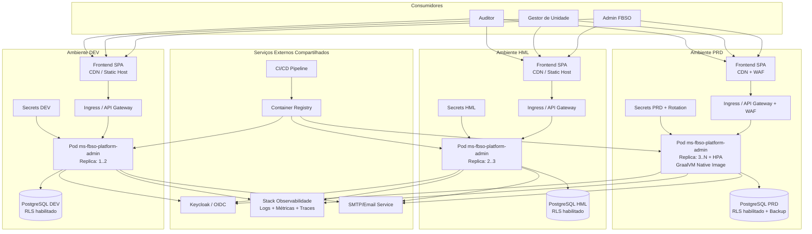
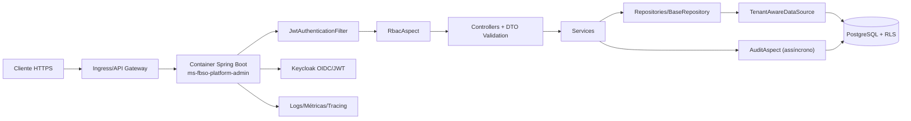

# ARCHITECTURE-C4-DEPLOYMENT.md — Modelo C4 Deployment: ms-fbso-platform-admin

- Microserviço: ms-fbso-platform-admin
- Stack: Java 25 + Spring Boot + PostgreSQL
- Escopo: C4 Deployment (visão de runtime e infraestrutura por ambiente)
- Referências: ARCHITECTURE.md e [ARCHITECTURE-C4.md](./ARCHITECTURE-C4.md)
- Versão: 1.1
- Data: 16 de Julho de 2026

---

## 1. Objetivo

Documentar a visão de implantação (Deployment) do ms-fbso-platform-admin, cobrindo topologia por ambiente (DEV, HML, PRD), componentes de execução, segurança operacional e integração com observabilidade.

---

## 2. Premissas de Deployment

1. O serviço é empacotado como container OCI (Spring Boot).
2. A execução ocorre em runtime orquestrado (Kubernetes/Container Platform).
3. O banco PostgreSQL é serviço gerenciado ou dedicado por ambiente.
4. O isolamento multi-tenant é aplicado no banco via RLS e no app via contexto JWT + TenantAwareDataSource.
5. Segredos (DB credentials, chaves JWT/OIDC, endpoints) são injetados por Secret Manager/K8s Secrets.

---

## 3. C4 Deployment — Visão Geral Multiambiente

---

## 4. C4 Deployment — Runtime do Serviço (Node/Container)

---

## 5. Topologia por Ambiente

## 5.1 DEV

- Objetivo: desenvolvimento e testes de integração rápidos.
- Réplicas: 1..2.
- Banco: PostgreSQL DEV com dataset controlado.
- Segurança: JWT real ou mock controlado; segredos em namespace DEV.
  - ⚠️ **Mock JWT permitido apenas em DEV local.** HML e PRD sempre usam JWT real do Keycloak com assinatura RS256 validada.
- Observabilidade: retenção reduzida, custo otimizado.

## 5.2 HML

- Objetivo: homologação funcional e validação de release.
- Réplicas: 2..3.
- Banco: PostgreSQL HML com massa de teste representativa.
- Segurança: políticas equivalentes à produção (sem privilégios administrativos amplos).
- Observabilidade: dashboards e alertas de pré-produção.

## 5.3 PRD

- Objetivo: operação de negócio.
- Runtime: **GraalVM Native Image** (preferencial) — cold start rápido (~ms), menor consumo de memória, ideal para autoscaling. Fallback JVM disponível para troubleshooting.
- Réplicas: 3..N com autoscaling horizontal (HPA).
- Banco: PostgreSQL PRD com backup, PITR e hardening.
- Segurança: WAF, segredos com rotação, princípio do menor privilégio.
- Observabilidade: SLO/SLA, alertas críticos, tracing distribuído.

---

## 6. Segurança de Infraestrutura

1. Entrada protegida por TLS no Ingress/Gateway.
2. Validação de autenticação/autorização no app (JWT + RBAC Aspect).
3. Isolamento multi-tenant garantido em profundidade:
   - App: TenantContext + TenantAwareDataSource.
   - Banco: RLS com tenant_id por sessão.
4. Auditoria assíncrona para operações sensíveis.
5. Segredos nunca hardcoded; injeção por Secret Manager/K8s.
6. Políticas de rede entre pods e banco restritas ao necessário.

---

## 7. Operabilidade

- Health checks:
  - Liveness: processo JVM e endpoint de saúde.
  - Readiness: conectividade DB e dependências críticas.
- Logs estruturados por correlação (request_id, tenant_id, user_id).
- Métricas recomendadas:
  - Latência por endpoint.
  - Taxa de erro 4xx/5xx.
  - Pool de conexões JDBC.
  - Throughput por tenant (com controle de cardinalidade).
- Tracing:
  - Fluxo ponta a ponta: Ingress -> Controller -> Service -> Repository -> DB.

---

## 8. Pipeline de Entrega

1. Build e testes no CI.
2. Publicação da imagem no registry.
3. Deploy automatizado por ambiente (DEV -> HML -> PRD).
4. Promotion por evidência (testes, métricas e aprovação).
5. Rollback rápido para versão anterior em caso de regressão.

---

## 9. Riscos e Mitigações

- Vazamento entre tenants:
  - Mitigação: RLS + TenantAwareDataSource + testes de isolamento.
- Saturação de conexões ao banco:
  - Mitigação: tuning HikariCP, limites por ambiente e HPA calibrado.
- Falha de dependência de autenticação (Keycloak):
  - Mitigação: timeouts, retries controlados e circuit breaker.
- Degradação em PRD por carga:
  - Mitigação: autoscaling, métricas de capacidade e testes periódicos.

---

## 10. Roadmap de Evolução de Deployment

1. Adicionar diagrama de deployment por cloud target (AKS/EKS/ACA) quando o stack de infra for consolidado.
2. Evoluir para GitOps completo (promoção por pull request de manifests).
3. Formalizar runbooks de incidentes e recuperação.
4. Consolidar políticas de custo e performance por ambiente.

---

## 11. Registro de Alterações

| Versão | Data | Alteração | Autor |
|:---|:---|:---|:---|
| 1.1 | 16/07/2026 | Revisão de alinhamento C4: Adicionado Frontend SPA (CDN/Static Host) por ambiente no diagrama multiambiente (§3). Adicionado SMTP/Email Service como serviço externo. PRD: Adicionado GraalVM Native Image como runtime preferencial com fallback JVM (§5.3). DEV: Adicionada ressalva de segurança para Mock JWT (§5.1). Adicionado cross-reference para ARCHITECTURE-C4.md no cabeçalho e changelog (§11). | Arquiteto/IA |
| 1.0 | 16/07/2026 | Criação inicial: Deployment multiambiente (DEV/HML/PRD), runtime do serviço, topologia por ambiente, segurança de infraestrutura, operabilidade, pipeline de entrega, riscos e mitigações, roadmap. | Time Técnico |
