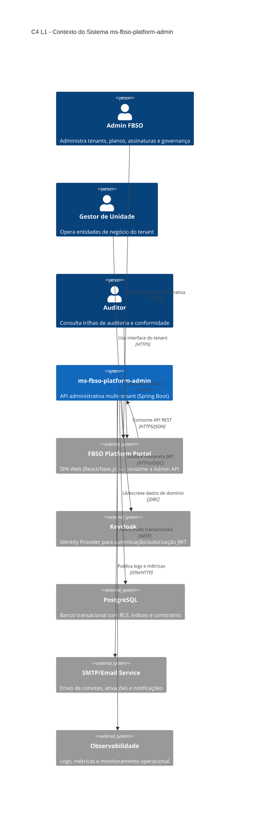
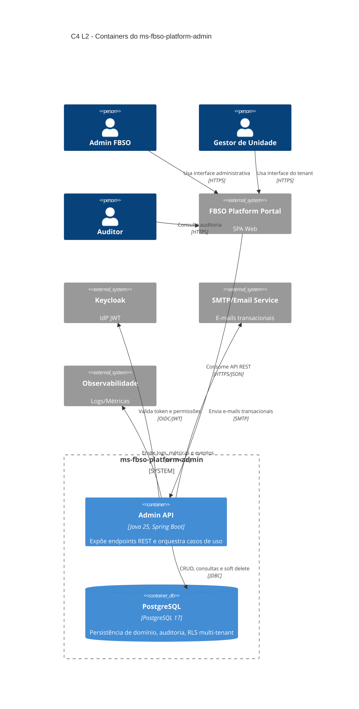
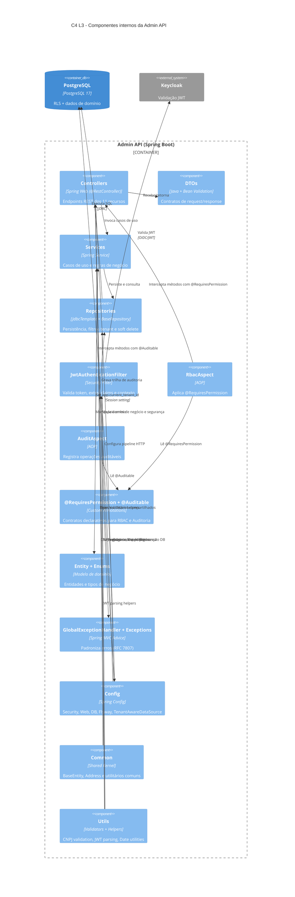

# ARCHITECTURE-C4.md — Modelo C4: ms-fbso-platform-admin

- Microserviço: ms-fbso-platform-admin
- Stack: Java 25 + Spring Boot + PostgreSQL
- Escopo C4: Contexto (L1), Containers (L2), Componentes (L3)
- Origem funcional: ARCHITECTURE.md e PRD.md do projeto PRJ-FIN-2026-0003-SAAS-FBSO-ORG
- Versão: 1.1
- Data: 16 de Julho de 2026
- Complemento: [ARCHITECTURE-C4-DEPLOYMENT.md](./ARCHITECTURE-C4-DEPLOYMENT.md) — visão de infraestrutura e deployment

---

## 1. Objetivo

Este documento traduz a arquitetura atual do ms-fbso-platform-admin para o modelo C4, mantendo aderência à estrutura package-by-layer e aos mecanismos de segurança e isolamento multi-tenant já definidos.

---

## 2. C4 Level 1 — System Context

### 2.1 Visão

O sistema ms-fbso-platform-admin é o backend administrativo SaaS multi-tenant da plataforma FBSO, responsável por gestão de tenants, planos, assinaturas, usuários, permissões, unidades de negócio, produtos/serviços, onboarding, auditoria e dashboards. Ele é consumido pelo frontend `web_app-fbso-platform-portal` (SPA React/Next.js), que por sua vez serve os usuários finais (Admin FBSO, Gestor de Unidade, Auditor).

### 2.2 Diagrama (L1)

---

## 3. C4 Level 2 — Container Diagram

### 3.1 Visão

Dentro do boundary do sistema, o principal container é uma API Spring Boot que expõe endpoints REST e encapsula as regras de negócio. O armazenamento é feito em PostgreSQL com Row-Level Security para isolamento de tenant.

### 3.2 Diagrama (L2)

---

## 4. C4 Level 3 — Component Diagram (Admin API)

### 4.1 Visão

Este nível mapeia os principais componentes internos do container Admin API, refletindo os pacotes existentes: controller, dto, service, repository, security, entity/enums, exception, config e common.

### 4.2 Diagrama (L3)

---

## 5. Mapeamento do Desenho Original para C4

| Bloco no desenho atual | Representação C4 |
|:---|:---|
| controller/ + dto/ | Componentes Controllers e DTOs (L3) |
| service/ | Componente Services (L3) |
| repository/ (JDBC Template) | Componente Repositories (L3) |
| security/ (JWT Filter, RbacAspect, AuditAspect) | Componentes JwtAuthenticationFilter, RbacAspect, AuditAspect (L3) |
| security/annotation/ (@RequiresPermission, @Auditable) | Componente @RequiresPermission + @Auditable (L3) |
| entity/ + enums/ | Componente Entity + Enums (L3) |
| PostgreSQL RLS | ContainerDb PostgreSQL e relação Config -> DB (L2/L3) |
| config/ (Security, Web, DB, Flyway, TenantAwareDataSource) | Componente Config (L3) |
| exception/ | Componente Exception Handler (L3) |
| common/ (BaseEntity, Address) | Componente Common (L3) |
| utils/ (CnpjValidator, JwtUtils, DateUtils) | Componente Utils (L3) |

---

## 6. Notas de Evolução

- Se surgirem novos módulos (ex.: billing, notificações, integrações fiscais), recomenda-se expandir com C4 L3 por bounded context.
- Quando houver múltiplos deployables (ex.: APIs separadas por domínio), adicionar C4 L2 com novos containers internos.
- Para operações e ambiente, complementar com [ARCHITECTURE-C4-DEPLOYMENT.md](./ARCHITECTURE-C4-DEPLOYMENT.md).

---

## 7. Registro de Alterações

| Versão | Data | Alteração | Autor |
|:---|:---|:---|:---|
| 1.1 | 16/07/2026 | Revisão de alinhamento C4: Adicionado Frontend (`web_app-fbso-platform-portal`) e SMTP/Email Service como sistemas externos no L1/L2. L3: Adicionados componentes `security/annotation/` (@RequiresPermission, @Auditable) e `utils/` (CnpjValidator, JwtUtils, DateUtils). Corrigida posição do TenantAwareDataSource (config/, não security/). Detalhado Config com WebConfig e TenantAwareDataSource. Atualizada tabela de mapeamento (§5) com annotations e utils. Adicionado cross-reference para C4-DEPLOYMENT.md e changelog. | Arquiteto/IA |
| 1.0 | 16/07/2026 | Criação inicial: C4 L1 (Contexto), L2 (Containers), L3 (Componentes), tabela de mapeamento, notas de evolução. | Time Técnico |
