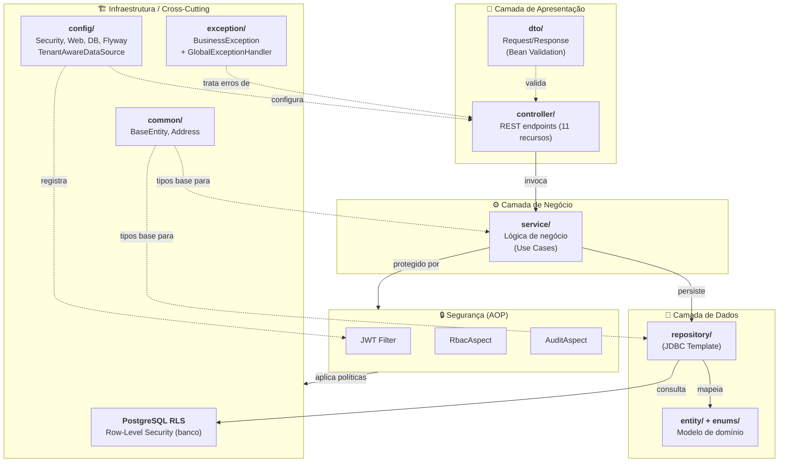
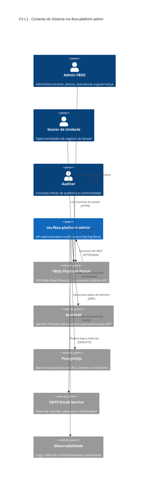
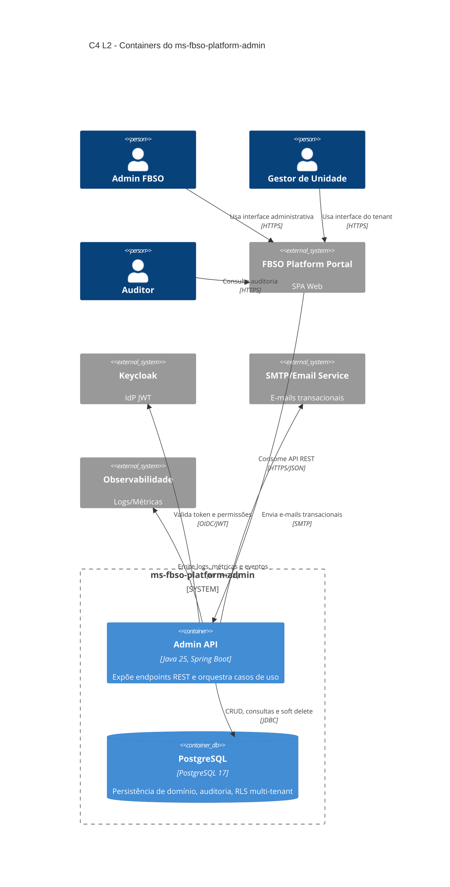
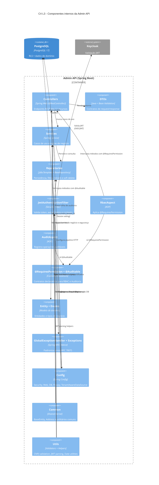
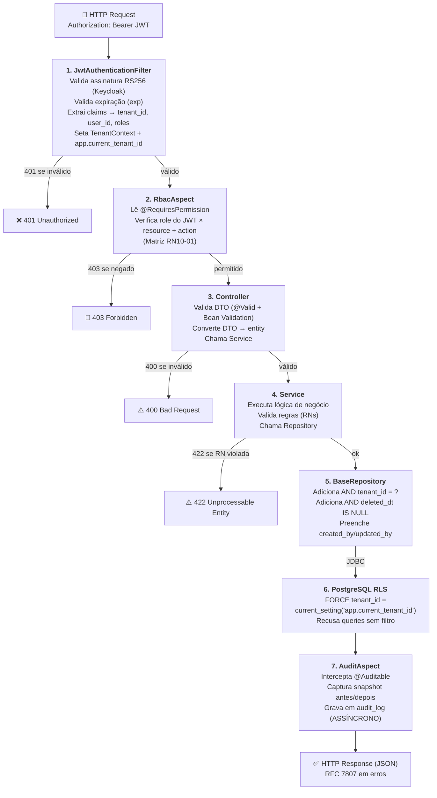
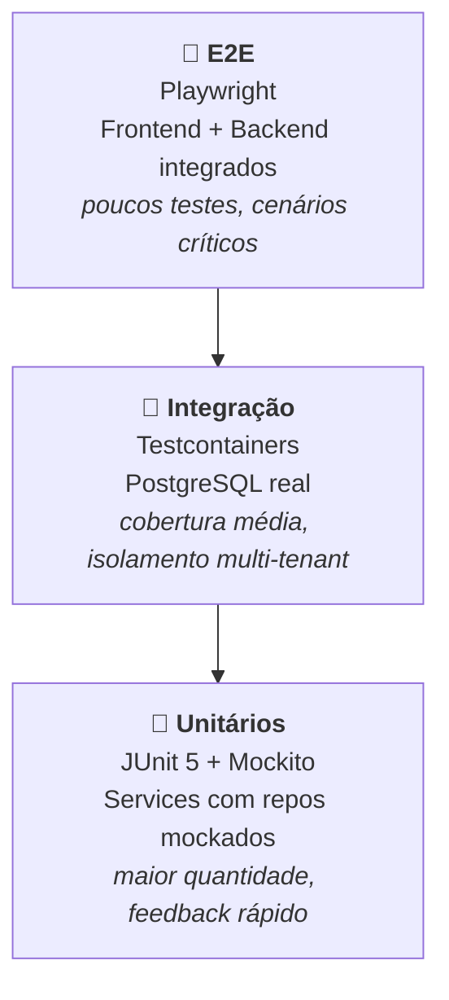
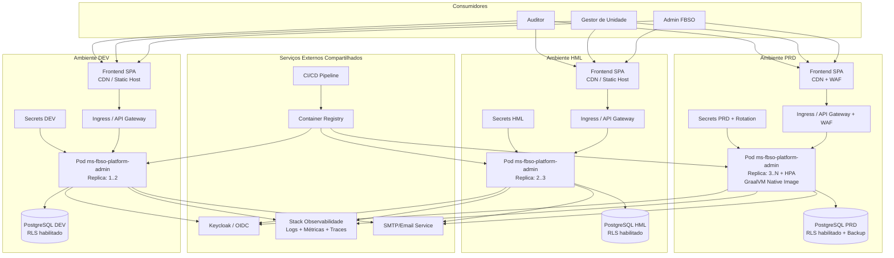
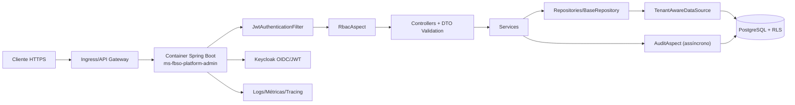

# ARCHITECTURE.md — Arquitetura da Solução: ms-fbso-platform-admin

- **Microserviço:** `ms-fbso-platform-admin`
- **Stack:** Java 25 + Spring Boot 3.5.14 + PostgreSQL
- **Projeto de Negócio:** [PRJ-FIN-2026-0003-SAAS-FBSO-ORG](../../../../../../../business-inputs/business-projects/PRJ-FIN-2026-0003-SAAS-FBSO-ORG/)
- **Versão:** 2.3
- **Data:** 17 de Julho de 2026
- **Status:** Em Execução — Sprint 3 (M2+M3) em andamento. Frentes 0+1 concluídas (20/20 tasks ✅). M2 100%. Dashboard implementado (5 endpoints REST) + testado (23 IT PostgreSQL real). maven-failsafe-plugin adicionado. 105 testes totais. V003 product_service RLS corrigido. JaCoCo 87.1%
- **Origem:** [PRD.md](./PRD.md)
- **Débitos Técnicos:** [IDENTIFIED-TECHNICAL-DEBT](./sprints/sprint-03-portal-admin/IDENTIFIED-TECHNICAL-DEBT-sprint-03-portal-admin.md) — 47 débitos (7 skills, 16/07/2026)
- **Escopo:** Estilo arquitetural + C4 L1-L3 + Design detalhado + C4 Deployment + ADRs

---

## 1. Estilo Arquitetural

### 1.1 Package-by-Layer com Spring Boot

Adotamos a estrutura de pacotes tradicional do ecossistema Spring Boot — **simples, padronizada e imediatamente compreensível** para qualquer desenvolvedor Java. Os aspectos cross-cutting (Multi-Tenant, RBAC, Auditoria) são implementados via AOP (Programação Orientada a Aspectos) do Spring, mantendo o código de negócio limpo.



### 1.2 Por Que Esta Estrutura e Não Clean Architecture?

| Critério | Package-by-Layer (adotada) | Clean Architecture |
|:---|:---|:---|
| Curva de aprendizado | Imediata — qualquer dev Spring Boot entende | Alta — exige disciplina com dependências |
| Produtividade inicial | Alta — scaffold rápido, convenções Spring | Média — muitas interfaces e mapeamentos |
| Testabilidade | Boa — services podem ser testados com mocks | Excelente — mas ao custo de complexidade |
| Risco de acoplamento | Médio — mitigado por aspectos AOP | Baixo — garantido pela inversão de dependência |
| Adequação ao time | ✅ Time reduzido, prazo de 14 semanas | ⚠️ Melhor para times maiores com domínio complexo |
| Padrão Spring Boot | ✅ Natural — `@Service`, `@Repository`, `@Controller` | ⚠️ Força padrões não idiomáticos |

> **Decisão:** Para o contexto atual (time reduzido, escopo bem definido, prazo curto), a estrutura package-by-layer entrega o melhor custo/benefício. Se o projeto crescer significativamente na Fase 1 (módulos-produto), podemos reavaliar a migração para camadas mais isoladas.

---

## 2. Estrutura de Pacotes

```
com.fbso.platform.admin/
│
├── FbsoPlatformAdminApplication.java
│
├── config/
│   ├── SecurityConfig.java              ← Spring Security + JWT
│   ├── WebConfig.java                   ← CORS, Jackson
│   └── DataSourceConfig.java            ← HikariCP pool
│
├── controller/
│   ├── TenantController.java            ← /api/v1/tenants
│   ├── PlanController.java              ← /api/v1/plans
│   ├── SubscriptionController.java      ← /api/v1/subscriptions
│   ├── UserController.java              ← /api/v1/users
│   ├── PermissionController.java        ← /api/v1/permissions
│   ├── BusinessUnitController.java      ← /api/v1/business-units
│   ├── ProductController.java           ← /api/v1/products
│   ├── DashboardController.java         ← /api/v1/dashboard/admin, /client
│   ├── OnboardingController.java        ← /api/v1/onboarding
│   └── AuditController.java             ← /api/v1/audit
│
├── dto/
│   ├── request/
│   │   ├── TenantCreateRequest.java
│   │   ├── PlanCreateRequest.java
│   │   ├── SubscriptionCreateRequest.java
│   │   ├── UserInviteRequest.java
│   │   ├── PermissionUpdateRequest.java
│   │   ├── BusinessUnitCreateRequest.java
│   │   ├── ProductCreateRequest.java
│   │   └── ... (demais requests)
│   └── response/
│       ├── TenantResponse.java
│       ├── PlanResponse.java
│       ├── DashboardSummaryResponse.java
│       ├── OnboardingStatusResponse.java
│       ├── AuditEntryResponse.java
│       ├── ErrorResponse.java
│       └── ... (demais responses)
│
├── entity/
│   ├── Tenant.java
│   ├── Plan.java
│   ├── PlanModule.java
│   ├── Subscription.java
│   ├── User.java
│   ├── UserPermission.java
│   ├── ResourceAction.java
│   ├── RoleResource.java
│   ├── BusinessUnit.java
│   ├── ProductService.java
│   └── AuditEntry.java
│
├── enums/
│   ├── TenantStatus.java                ← PENDING_ONBOARDING, ACTIVE, SUSPENDED, INACTIVE
│   ├── TenantSegment.java               ← RETAIL, SERVICES, INDUSTRY...
│   ├── Recurrence.java                  ← MONTHLY, QUARTERLY, YEARLY
│   ├── SubscriptionStatus.java          ← ACTIVE, SUSPENDED, CANCELED
│   ├── UserStatus.java                  ← ACTIVE, INACTIVE, INVITE_PENDING
│   ├── Role.java                        ← ADMIN_TENANT, MANAGER_BU, OPERATOR_BU, AUDITOR
│   ├── TaxRegime.java                   ← SIMPLES_NACIONAL, LUCRO_REAL, LUCRO_PRESUMIDO
│   └── ProductType.java                 ← PRODUCT, SERVICE
│
├── exception/
│   ├── BusinessException.java           ← RuntimeException base (HTTP 422)
│   ├── DuplicateCnpjException.java
│   ├── InvalidStatusTransitionException.java
│   ├── PlanHasActiveSubscribersException.java
│   ├── TenantNotFoundException.java
│   ├── PermissionDeniedException.java   ← HTTP 403
│   └── GlobalExceptionHandler.java      ← @ControllerAdvice — RFC 7807
│
├── repository/
│   ├── TenantRepository.java
│   ├── PlanRepository.java
│   ├── SubscriptionRepository.java
│   ├── UserRepository.java
│   ├── PermissionRepository.java
│   ├── BusinessUnitRepository.java
│   ├── ProductRepository.java
│   ├── DashboardRepository.java
│   ├── AuditRepository.java
│   └── common/
│       └── BaseRepository.java          ← Template com Soft Delete + Tenant Filter
│
├── service/
│   ├── TenantService.java
│   ├── PlanService.java
│   ├── SubscriptionService.java
│   ├── UserService.java
│   ├── PermissionService.java
│   ├── BusinessUnitService.java
│   ├── ProductService.java
│   ├── DashboardService.java
│   ├── OnboardingService.java
│   └── AuditService.java
│
├── security/
│   ├── JwtAuthenticationFilter.java     ← OncePerRequestFilter
│   ├── TenantContext.java               ← ThreadLocal<String> tenant_id
│   ├── aspect/
│   │   ├── RbacAspect.java              ← Verifica @RequiresPermission
│   │   ├── AuditAspect.java             ← Registra @Auditable (assíncrono)
│   │   └── TenantAwareDataSource.java   ← Configura app.current_tenant_id (RLS)
│   └── annotation/
│       ├── RequiresPermission.java      ← (resource, action)
│       └── Auditable.java               ← (entityType)
│
├── common/
│   ├── BaseEntity.java                  ← created_dt, updated_dt, created_by, updated_by, deleted_dt, deleted_by
│   └── Address.java                     ← Value Object (street, city, state, zip)
│
└── utils/
    ├── CnpjValidator.java
    ├── JwtUtils.java
    └── DateUtils.java
```

---

## 3. Modelo C4 — Visão Arquitetural

> Esta seção traduz a arquitetura para o modelo C4 (Contexto L1, Containers L2, Componentes L3), mantendo aderência à estrutura package-by-layer e aos mecanismos de segurança e isolamento multi-tenant.

### 3.1 C4 L1 — System Context

O sistema ms-fbso-platform-admin é o backend administrativo SaaS multi-tenant da plataforma FBSO, responsável por gestão de tenants, planos, assinaturas, usuários, permissões, unidades de negócio, produtos/serviços, onboarding, auditoria e dashboards. Ele é consumido pelo frontend `web_app-fbso-platform-portal` (SPA React/Next.js), que por sua vez serve os usuários finais (Admin FBSO, Gestor de Unidade, Auditor).



### 3.2 C4 L2 — Container Diagram

Dentro do boundary do sistema, o principal container é uma API Spring Boot que expõe endpoints REST e encapsula as regras de negócio. O armazenamento é feito em PostgreSQL com Row-Level Security para isolamento de tenant.



### 3.3 C4 L3 — Component Diagram (Admin API)

Este nível mapeia os principais componentes internos do container Admin API, refletindo os pacotes existentes: controller, dto, service, repository, security, entity/enums, exception, config, common e utils.



### 3.4 Mapeamento do Desenho para C4

| Bloco no desenho atual | Representação C4 |
|:---|:---|
| controller/ + dto/ | Componentes Controllers e DTOs (L3) |
| service/ | Componente Services (L3) |
| repository/ (JDBC Template) | Componente Repositories (L3) |
| security/ (JWT Filter, RbacAspect, AuditAspect) | Componentes JwtAuthenticationFilter, RbacAspect, AuditAspect (L3) |
| security/annotation/ (@RequiresPermission, @Auditable) | Componente @RequiresPermission + @Auditable (L3) |
| entity/ + enums/ | Componente Entity + Enums (L3) |
| PostgreSQL RLS | ContainerDb PostgreSQL e relação Config → DB (L2/L3) |
| config/ (Security, Web, DB, Flyway, TenantAwareDataSource) | Componente Config (L3) |
| exception/ | Componente Exception Handler (L3) |
| common/ (BaseEntity, Address) | Componente Common (L3) |
| utils/ (CnpjValidator, JwtUtils, DateUtils) | Componente Utils (L3) |

### 3.5 Notas de Evolução do C4

- Se surgirem novos módulos (ex.: billing, notificações, integrações fiscais), recomenda-se expandir com C4 L3 por bounded context.
- Quando houver múltiplos deployables (ex.: APIs separadas por domínio), adicionar C4 L2 com novos containers internos.

---

## 4. Pipeline de Segurança por Requisição



---

## 5. Design dos Aspectos Cross-Cutting

### 5.1 @RequiresPermission — Anotação de RBAC

```java
@Target(ElementType.METHOD)
@Retention(RetentionPolicy.RUNTIME)
public @interface RequiresPermission {
    String resource();   // ex: "PRODUCT_SERVICE"
    String action();     // ex: "edit", "create", "view", "delete"
}
```

**Uso no controller:**
```java
@RestController
@RequestMapping("/api/v1/products")
public class ProductController {

    @GetMapping
    @RequiresPermission(resource = "PRODUCT_SERVICE", action = "view")
    public Page<ProductResponse> list(/* ... */) { }

    @PostMapping
    @RequiresPermission(resource = "PRODUCT_SERVICE", action = "create")
    public ResponseEntity<ProductResponse> create(@Valid @RequestBody ProductCreateRequest req) { }

    @PatchMapping("/{id}")
    @RequiresPermission(resource = "PRODUCT_SERVICE", action = "edit")
    public ResponseEntity<ProductResponse> update(@PathVariable String id,
                                                   @Valid @RequestBody ProductUpdateRequest req) { }
}
```

### 5.2 @Auditable — Anotação de Auditoria

```java
@Target(ElementType.METHOD)
@Retention(RetentionPolicy.RUNTIME)
public @interface Auditable {
    String entityType();   // ex: "TENANT", "USER", "PLAN"
    String action();       // ex: "CREATED", "UPDATED", "SUSPENDED"
}
```

**Uso no service:**
```java
@Service
public class TenantService {

    @Auditable(entityType = "TENANT", action = "SUSPENDED")
    @Transactional
    public TenantResponse suspend(String tenantId, String reason) {
        // lógica de suspensão...
    }
}
```

### 5.3 Isolamento Multi-Tenant — Defesa em Profundidade (3 Camadas)

O isolamento entre tenants é a falha mais catastrófica possível em um SaaS. Adotamos **defesa em profundidade** com 3 camadas independentes:

#### Camada 1: PostgreSQL Row-Level Security (Preventiva — Banco)

**Migration V003** — Ativa RLS em 5 tabelas críticas com `tenant_id` (Fase 0). Demais tabelas receberão RLS nas fases seguintes (M2-M6).

```sql
-- Tabelas com RLS ativado na Fase 0 (dados multi-tenant)
ALTER TABLE fbso_platform.subscription ENABLE ROW LEVEL SECURITY;
ALTER TABLE fbso_platform."user" ENABLE ROW LEVEL SECURITY;
ALTER TABLE fbso_platform.business_unit ENABLE ROW LEVEL SECURITY;
ALTER TABLE fbso_platform.product_service ENABLE ROW LEVEL SECURITY;
ALTER TABLE fbso_platform.audit_log ENABLE ROW LEVEL SECURITY;

-- Tabelas SEM RLS na Fase 0 (acesso cross-tenant ou sem tenant_id):
-- tenant (Admin FBSO cross-tenant), plan, plan_module, resource_action,
-- role_resource (tabelas de domínio/sem tenant_id), user_permission (FK para user)

-- Política de isolamento: força WHERE tenant_id = sessão atual
CREATE POLICY tenant_isolation ON fbso_platform.subscription
    FOR ALL
    USING (tenant_id = current_setting('app.current_tenant_id')::UUID)
    WITH CHECK (tenant_id = current_setting('app.current_tenant_id')::UUID);
-- (repetir CREATE POLICY para cada tabela com RLS)
```

**No lado Java** (`JwtAuthenticationFilter`), a sessão PostgreSQL é configurada:

```java
// Após validar o JWT e extrair claims:
String tenantId = claims.get("tenant_id").toString();
jdbcTemplate.update("SET LOCAL app.current_tenant_id = ?", tenantId);
```

**Garantia:** Mesmo que um desenvolvedor escreva `SELECT * FROM subscription` sem `WHERE`, o PostgreSQL **recusa ou filtra automaticamente**. Impossível de burlar via aplicação.

#### Camada 2: BaseRepository Template (Preventiva — Aplicação)

O `BaseRepository` (ADR-L01) inclui `AND tenant_id = ?` em todas as queries para tabelas com `hasTenantColumn=true`. Esta camada é a **convenção de desenvolvimento** — todo repository que estende `BaseRepository` herda o filtro automaticamente.

#### Camada 3: Teste de Isolamento Automatizado (Detectiva)

Teste de integração que popula dados para 2 tenants e verifica que tenant-A nunca vê dados de tenant-B em **nenhum** endpoint. Se qualquer query burlar o RLS, o teste falha.

```java
@Test
void tenantIsolation_allEndpoints() {
    // Popula tenant-A com 3 BUs, tenant-B com 2 BUs
    // Para cada endpoint GET: autenticar como tenant-A
    // Verificar que NENHUM dado de tenant-B aparece na resposta
}
```

---

## 6. Design de Persistência

### 6.1 BaseRepository — Template com Soft Delete

```java
@Repository
public abstract class BaseRepository<T extends BaseEntity, ID> {

    protected final JdbcTemplate jdbc;
    protected final String tableName;
    protected final RowMapper<T> rowMapper;

    public List<T> findAll(int page, int size, String sort) {
        String sql = String.format(
            "SELECT * FROM %s WHERE deleted_dt IS NULL AND tenant_id = ?" +
            " ORDER BY %s LIMIT ? OFFSET ?",
            tableName, sort
        );
        return jdbc.query(sql, rowMapper, TenantContext.getTenantId(), size, page * size);
    }

    public Optional<T> findById(ID id) {
        String sql = String.format(
            "SELECT * FROM %s WHERE id = ? AND deleted_dt IS NULL AND tenant_id = ?",
            tableName
        );
        List<T> results = jdbc.query(sql, rowMapper, id, TenantContext.getTenantId());
        return results.isEmpty() ? Optional.empty() : Optional.of(results.get(0));
    }

    public void softDelete(ID id, String deletedBy) {
        String sql = String.format(
            "UPDATE %s SET deleted_dt = NOW(), deleted_by = ? WHERE id = ? AND tenant_id = ?",
            tableName
        );
        jdbc.update(sql, deletedBy, id, TenantContext.getTenantId());
    }
}
```

### 6.2 Índices Únicos Parciais (Flyway Migrations)

```sql
-- V002__business_unit_indexes.sql
CREATE UNIQUE INDEX unique_cnpj_active
ON business_unit (tenant_id, cnpj)
WHERE deleted_dt IS NULL;

-- V003__user_indexes.sql
CREATE UNIQUE INDEX unique_email_active
ON "user" (tenant_id, email)
WHERE deleted_dt IS NULL;

-- V004__product_indexes.sql
CREATE UNIQUE INDEX unique_sku_active
ON product_service (business_unit_id, sku)
WHERE deleted_dt IS NULL AND sku IS NOT NULL;
```

---

## 7. Tratamento de Erros (RFC 7807)

### 7.1 Hierarchy de Exceções

```
RuntimeException
  ├── BusinessException (HTTP 422)
  │     ├── DuplicateCnpjException
  │     ├── InvalidStatusTransitionException
  │     ├── PlanHasActiveSubscribersException
  │     └── TenantNotFoundException
  └── SecurityException
        └── PermissionDeniedException (HTTP 403)
```

### 7.2 GlobalExceptionHandler

```java
@ControllerAdvice
public class GlobalExceptionHandler {

    @ExceptionHandler(BusinessException.class)
    public ResponseEntity<ErrorResponse> handleBusiness(BusinessException ex) {
        return ResponseEntity.unprocessableEntity().body(
            ErrorResponse.builder()
                .type("https://api.fbso.org/errors/" + ex.getErrorCode())
                .title(ex.getMessage())
                .status(422)
                .detail(ex.getDetail())
                .fields(ex.getFieldErrors())
                .build()
        );
    }

    @ExceptionHandler(PermissionDeniedException.class)
    public ResponseEntity<ErrorResponse> handleForbidden(PermissionDeniedException ex) {
        return ResponseEntity.status(403).body(
            ErrorResponse.builder()
                .title("Acesso negado")
                .detail("Você não tem permissão para executar esta operação.")
                .status(403)
                .build()
        );
    }
}
```

---

## 8. Estratégia de Testes

### 8.1 Pirâmide de Testes



### 8.2 Teste de Service com Repository Mockado

```java
@ExtendWith(MockitoExtension.class)
class TenantServiceTest {

    @Mock TenantRepository tenantRepo;
    @InjectMocks TenantService tenantService;

    @Test
    void createTenant_shouldSetStatusPendingOnboarding() {
        when(tenantRepo.existsByNameCorporate("Novo Mercado Ltda")).thenReturn(false);

        TenantCreateRequest req = new TenantCreateRequest("Novo Mercado Ltda", "RETAIL");
        TenantResponse response = tenantService.create(req);

        assertThat(response.getStatus()).isEqualTo(TenantStatus.PENDING_ONBOARDING);
    }
}
```

### 8.3 Teste de Isolamento Multi-Tenant com Testcontainers

```java
@Testcontainers
class TenantIsolationIntegrationTest {

    @Container
    static PostgreSQLContainer<?> postgres = new PostgreSQLContainer<>("postgres:17");

    @Autowired ProductRepository productRepo;

    @Test
    void shouldReturnOnlyCurrentTenantProducts() {
        // DADO: produtos cadastrados para tenant-A e tenant-B
        // QUANDO: TenantContext está setado com tenant-A
        TenantContext.set("tenant-A-id");
        List<ProductService> products = productRepo.findAll(0, 100, "name");

        // ENTÃO: apenas produtos do tenant-A são retornados
        assertThat(products).allMatch(p -> p.getTenantId().equals("tenant-A-id"));
    }
}
```

---

## 9. Decisões de Design (ADRs Locais)

> **Nota:** ADRs locais usam prefixo `ADR-Lxx`. O PRD.md §5.2 referencia estas mesmas decisões com prefixo `ADR-xx`. Mapeamento: ADR-01=ADR-L01, ADR-02=ADR-L02, ADR-04=ADR-L04, ADR-05=ADR-L05, ADR-06=ADR-L06, ADR-07=ADR-L07, ADR-08=ADR-L07. ADR-03 foi pulado (reservado para decisão futura).

| ID | Decisão | Justificativa |
|:---|:---|:---|
| **ADR-L01** | JDBC Template (não JPA/Hibernate) | Controle total sobre SQL — essencial para Multi-Tenant e Soft Delete. Sem anotações mágicas. BaseRepository agora inclui `save(T)` e `update(T)` genéricos (DT-003, Sprint 3) |
| **ADR-L02** | Aspectos AOP para cross-cutting | RBAC e Auditoria não poluem services e repositories. Zero risco de esquecimento humano. Tenant Isolation delegado ao PostgreSQL RLS (ADR-L07) |
| **ADR-L03** | Auditoria assíncrona | Não bloqueia a operação principal. Trade-off: perda de registros em crash (aceitável para Fase 0) |
| **ADR-L04** | RFC 7807 para erros | Padrão IETF. Frontend implementa tratamento genérico. Sem surpresas |
| **ADR-L05** | Índices únicos parciais (PostgreSQL) | Permite reúso de CNPJ/e-mail após soft delete. Sem triggers complexos |
| **ADR-L06** | Package-by-Layer tradicional | Simplicidade > pureza arquitetural. Time reduzido, prazo curto. Reavaliar na Fase 1 |
| **ADR-L07** | PostgreSQL Row-Level Security (RLS) | Defesa em profundidade — camada 1 de 3 para isolamento multi-tenant. Garantia no nível do banco: impossível burlar via aplicação. Substitui o TenantIsolationAspect AOP (removido — redundante e frágil). TenantAwareDataSource agora lança `TenantIsolationException` em falha (DT-006, Sprint 3) |

---

## 10. C4 Deployment — Visão de Infraestrutura

> Esta seção documenta a visão de implantação (Deployment) do ms-fbso-platform-admin, cobrindo topologia por ambiente (DEV, HML, PRD), componentes de execução, segurança operacional e integração com observabilidade.

### 10.1 Premissas de Deployment

1. O serviço é empacotado como container OCI (Spring Boot).
2. A execução ocorre em runtime orquestrado (Kubernetes/Container Platform).
3. O banco PostgreSQL é serviço gerenciado ou dedicado por ambiente.
4. O isolamento multi-tenant é aplicado no banco via RLS e no app via contexto JWT + TenantAwareDataSource.
5. Segredos (DB credentials, chaves JWT/OIDC, endpoints) são injetados por Secret Manager/K8s Secrets.

### 10.2 Visão Geral Multiambiente



### 10.3 Runtime do Serviço (Node/Container)



### 10.4 Topologia por Ambiente

#### 10.4.1 DEV

- Objetivo: desenvolvimento e testes de integração rápidos.
- Réplicas: 1..2.
- Banco: PostgreSQL DEV com dataset controlado.
- Segurança: JWT real ou mock controlado; segredos em namespace DEV.
  - ⚠️ **Mock JWT permitido apenas em DEV local.** HML e PRD sempre usam JWT real do Keycloak com assinatura RS256 validada.
- Observabilidade: retenção reduzida, custo otimizado.

#### 10.4.2 HML

- Objetivo: homologação funcional e validação de release.
- Réplicas: 2..3.
- Banco: PostgreSQL HML com massa de teste representativa.
- Segurança: políticas equivalentes à produção (sem privilégios administrativos amplos).
- Observabilidade: dashboards e alertas de pré-produção.

#### 10.4.3 PRD

- Objetivo: operação de negócio.
- Runtime: **GraalVM Native Image** (preferencial) — cold start rápido (~ms), menor consumo de memória, ideal para autoscaling. Fallback JVM disponível para troubleshooting.
- Réplicas: 3..N com autoscaling horizontal (HPA).
- Banco: PostgreSQL PRD com backup, PITR e hardening.
- Segurança: WAF, segredos com rotação, princípio do menor privilégio.
- Observabilidade: SLO/SLA, alertas críticos, tracing distribuído.

### 10.5 Segurança de Infraestrutura

1. Entrada protegida por TLS no Ingress/Gateway.
2. Validação de autenticação/autorização no app (JWT + RBAC Aspect).
3. Isolamento multi-tenant garantido em profundidade:
   - App: TenantContext + TenantAwareDataSource.
   - Banco: RLS com tenant_id por sessão.
4. Auditoria assíncrona para operações sensíveis.
5. Segredos nunca hardcoded; injeção por Secret Manager/K8s.
6. Políticas de rede entre pods e banco restritas ao necessário.

### 10.6 Operabilidade

- Health checks:
  - Liveness: processo JVM e endpoint de saúde.
  - Readiness: conectividade DB e dependências críticas.
- Logs estruturados por correlação (request_id, tenant_id, user_id).
- Métricas recomendadas:
  - Latência por endpoint.
  - Taxa de erro 4xx/5xx.
  - Pool de conexões JDBC.
  - Throughput por tenant (com controle de cardinalidade).
- Tracing:
  - Fluxo ponta a ponta: Ingress → Controller → Service → Repository → DB.

### 10.7 Pipeline de Entrega

1. Build e testes no CI.
2. Publicação da imagem no registry.
3. Deploy automatizado por ambiente (DEV → HML → PRD).
4. Promotion por evidência (testes, métricas e aprovação).
5. Rollback rápido para versão anterior em caso de regressão.

### 10.8 Riscos e Mitigações

- Vazamento entre tenants:
  - Mitigação: RLS + TenantAwareDataSource + testes de isolamento.
- Saturação de conexões ao banco:
  - Mitigação: tuning HikariCP, limites por ambiente e HPA calibrado.
- Falha de dependência de autenticação (Keycloak):
  - Mitigação: timeouts, retries controlados e circuit breaker.
- Degradação em PRD por carga:
  - Mitigação: autoscaling, métricas de capacidade e testes periódicos.

### 10.9 Roadmap de Evolução de Deployment

1. Adicionar diagrama de deployment por cloud target (AKS/EKS/ACA) quando o stack de infra for consolidado.
2. Evoluir para GitOps completo (promoção por pull request de manifests).
3. Formalizar runbooks de incidentes e recuperação.
4. Consolidar políticas de custo e performance por ambiente.

---

## 11. Registro de Alterações

| Versão | Data | Alteração | Autor |
|:---|:---|:---|:---|
| 2.1 | 16/07/2026 | BaseRepository.save/update (DT-003), TenantIsolationException no TenantAwareDataSource (DT-006), referência a débitos técnicos da Sprint 3 ([IDENTIFIED-TECHNICAL-DEBT](sprints/sprint-03-portal-admin/IDENTIFIED-TECHNICAL-DEBT-sprint-03-portal-admin.md) — auditoria com 7 skills). ADR-L01 e ADR-L07 atualizados. | Time Técnico |
| 2.0 | 16/07/2026 | **Consolidação dos 3 documentos de arquitetura:** C4 L1-L3 (§3) e C4 Deployment (§10) integrados ao ARCHITECTURE.md. Diagramas ASCII convertidos para Mermaid: package-by-layer (§1.1), pipeline de segurança (§4), pirâmide de testes (§8.1). Seções renumeradas. Changelog unificado. Documentos `ARCHITECTURE-C4.md` e `ARCHITECTURE-C4-DEPLOYMENT.md` arquivados. | Arquiteto/IA |
| 1.4 | 16/07/2026 | Sprint 3 iniciada (16/07/2026). Status atualizado para "Em Execução". | Time Técnico |
| 1.3 | 15/07/2026 | Revisão Caveman (DOCS-SERVICE-CAVEMAN-REVIEW.md): Corrigido SQL injection (L337, concatenação→PreparedStatement). Corrigido RLS de 11→5 tabelas com justificativa (§5.3). Removido TenantIsolationAspect do file listing (§2) e diagrama (§1.1) — substituído por RLS. Adicionado TenantAwareDataSource. Reordenado changelog cronologicamente. Adicionado mapeamento ADR-Lxx↔ADR-xx (§9). | Caveman/IA |
| 1.2 | 14/07/2026 | Adicionado PostgreSQL Row-Level Security (RLS) como camada 1 de defesa em profundidade no isolamento multi-tenant. Novo ADR-L07. Atualizada sequência de segurança com migration V003 para RLS. | Agente Arquiteto/IA |
| 1.1 | 13/07/2026 | Simplificação para package-by-layer (controller/service/repository). Aspectos AOP mantidos para cross-cutting. ADR-L06 documentando a decisão. | Time Técnico |
| 1.0 | 13/07/2026 | Criação inicial: Clean Architecture adaptada. | Time Técnico |

------------------------------

---
🤖 *Documentação gerada de forma automatizada pelo Agente: Analista de Negócios/Claude. Foram utilizados os skills: architecture-patterns, 030-architecture-adr-general, engineering-skills. v2.0 em 16/07/2026: Consolidação dos 3 documentos de arquitetura.*
