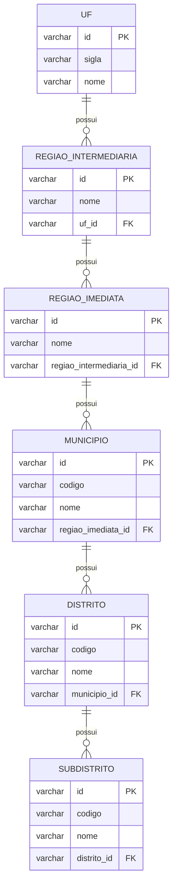

# ms-geolocalidade

Microserviço para consulta de geolocalização por CEP e descoberta de localidades dentro de um raio, integrando:

- **AwesomeAPI** (geocodificação `/json/{cep}` e busca por raio `/search`)
- **Base local DTB/IBGE** (enriquecimento oficial via tabelas persistidas em banco)

Fonte AwesomeAPI: https://docs.awesomeapi.com.br/api-cep

## Requisitos

- Java 21
- Maven Wrapper (`./mvnw`)

## Stack

- Spring Boot (via parent `microservices-parent-v21`)
- Spring Web + Validation
- Spring Data JPA (somente leitura no uso típico)
- Banco (default): PostgreSQL
- Cache: Caffeine (cache de chamadas à AwesomeAPI)

## Documentação (C4 Model)

Existe documentação arquitetural em C4 Model (com diagramas Mermaid) em:

- Nível 1 — Contexto: [docs/c4-nivel-1-contexto.md](docs/c4-nivel-1-contexto.md)
- Nível 2 — Contêiner: [docs/c4-nivel-2-container.md](docs/c4-nivel-2-container.md)
- Nível 3 — Componente: [docs/c4-nivel-3-componente.md](docs/c4-nivel-3-componente.md)
- Nível 4 — Código: [docs/c4-nivel-4-codigo.md](docs/c4-nivel-4-codigo.md)

### Como visualizar os diagramas

- No GitHub: os blocos `mermaid` renderizam automaticamente.
- No VS Code: use a extensão “Markdown Preview Mermaid Support” (ou equivalente) e abra o preview do Markdown.

## Banco de dados (tabelas e relacionamentos)

Este serviço consulta tabelas do **DTB/IBGE** (populadas tipicamente pelo batch `batch-geolocalidade`) para enriquecer as respostas da AwesomeAPI.

### Tabelas consultadas

- `uf`
- `regiao_intermediaria` (FK para `uf`)
- `regiao_imediata` (FK para `regiao_intermediaria`)
- `municipio` (FK para `regiao_imediata`)
- `distrito` (FK para `municipio`)
- `subdistrito` (FK para `distrito`)

Observações importantes:

- O endpoint de raio usa `subdistrito` para buscar **nome oficial** via prefixo do código IBGE: `subdistrito.id LIKE '{city_ibge}%'`.
- Os endpoints de municípios fazem paginação e retornam, além do município, o **primeiro distrito** e o **primeiro subdistrito** (quando existirem) para dar um “payload resumido” da hierarquia.

### Diagrama (entidades/tabelas)



## Execução local (dev)

Por padrão o serviço sobe com **PostgreSQL** (ver `src/main/resources/application.yml`).

```bash
./mvnw spring-boot:run
```

ou

```bash
cd backend/java/spring/microservices/ms-geolocalidade && ./mvnw -q spring-boot:run -Dspring-boot.run.arguments=--server.port=8081
```

## Configuração

### Banco de dados (PostgreSQL)

Defaults do `application.yml`:

- `SPRING_DATASOURCE_URL`: `jdbc:postgresql://localhost:5432/worker_db?currentSchema=localidade`
- `SPRING_DATASOURCE_USERNAME`: `worker_user`
- `SPRING_DATASOURCE_PASSWORD`: `worker_pass`
- `SPRING_DATASOURCE_SCHEMA`: `localidade`
- `SPRING_JPA_SCHEMA`: `localidade`
- `SPRING_JPA_HIBERNATE_DDL_AUTO`: `update`

Exemplo:

```bash
export SPRING_DATASOURCE_URL='jdbc:postgresql://localhost:5432/worker_db?currentSchema=localidade'
export SPRING_DATASOURCE_USERNAME=worker_user
export SPRING_DATASOURCE_PASSWORD=worker_pass
export SPRING_DATASOURCE_SCHEMA=localidade
export SPRING_JPA_SCHEMA=localidade
```

## Variáveis de ambiente

- `AWESOME_API_TOKEN` (usado na chamada `/json/{cep}` via query param)
- `AWESOME_API_KEY` (usado na chamada `/search` via header `x-api-key`)

Observação: o serviço aceita autenticação por **token** ou **x-api-key**. Quando ambos existem, ele prefere `AWESOME_API_TOKEN`.

## setando variaveis

```bash
export AWESOME_API_TOKEN={codigo}
export AWESOME_API_KEY={codigo}
```

## Endpoints

Formato de resposta padrão: o serviço envolve os retornos em `PageResponseDTO`:

```json
{
	"content": [],
	"status": { "code": 200, "status": "SUCCESS", "message": "OK", "timestamp": "2026-03-21T12:34:56.789" },
	"pageInfo": null
}
```

Sugestão para testes locais:

```bash
BASE=http://localhost:8080
```

### 1) Vizinhança por CEP (AwesomeAPI + enriquecimento IBGE)

`GET /api/v1/localidades/vizinhas-agil?cep={cep}&raio={raioKm}`

- Função: geocodifica o CEP, busca localidades dentro de um raio e enriquece com:
	- UF/município oficial a partir das tabelas IBGE (quando `city_ibge` existir)
	- nome de subdistrito oficial (quando existir) via prefixo do código IBGE
- Parâmetros:
	- `cep` (obrigatório, não vazio)
	- `raio` (opcional, default `5`, deve ser `> 0`)

Exemplo:

```bash
curl -sS "$BASE/api/v1/localidades/vizinhas-agil?cep=01001000&raio=5" | jq
```

Exemplo de response (estrutura):

```json
{
	"content": [
		{
			"zipcodeInfo": {
				"cep": "01001000",
				"address_type": "Rua",
				"address_name": "Sé",
				"address": "Praça da Sé",
				"state": "SP",
				"city": "São Paulo",
				"city_ibge": "3550308",
				"lat": "-23.5505",
				"lng": "-46.6333",
				"district": "Sé",
				"distance_km": null
			},
			"localidade": {
				"city_ibge": "3550308",
				"city": "São Paulo",
				"state": "SP"
			},
			"cidadesProximas": [
				{
					"cep": "01001000",
					"city": "São Paulo",
					"city_ibge": "3550308",
					"district": "Sé",
					"subdistrict": null,
					"distance_km": 0.0
				}
			]
		}
	],
	"status": {
		"code": 200,
		"status": "SUCCESS",
		"message": "OK",
		"timestamp": "2026-03-21T12:34:56.789"
	},
	"pageInfo": null
}
```

### 2) Geocodificação por CEP (AwesomeAPI)

`GET /api/v1/localidades/cep/{cep}`

- Função: retorna a resposta de geocodificação do CEP (lat/lng + metadados) via AwesomeAPI.

Exemplo:

```bash
curl -sS "$BASE/api/v1/localidades/cep/01001000" | jq
```

Exemplo de response (estrutura):

```json
{
	"content": [
		{
			"cep": "01001000",
			"state": "SP",
			"city": "São Paulo",
			"city_ibge": "3550308",
			"lat": "-23.5505",
			"lng": "-46.6333",
			"district": "Sé",
			"distance_km": null
		}
	],
	"status": { "code": 200, "status": "SUCCESS", "message": "OK", "timestamp": "2026-03-21T12:34:56.789" },
	"pageInfo": {
		"page": 0,
		"size": 1,
		"totalElements": 1,
		"totalPages": 1,
		"first": true,
		"last": true,
		"empty": false,
		"numberOfElements": 1,
		"sortDirection": "NONE"
	}
}
```

### 3) Municípios (IBGE)

`GET /api/v1/localidades/municipios?page={n}&size={n}`

- Função: lista municípios com paginação (tamanho limitado a `1..50`) e retorna a hierarquia (UF/regiões/município) + primeiro distrito/subdistrito quando existir.

Exemplo:

```bash
curl -sS "$BASE/api/v1/localidades/municipios?page=0&size=10" | jq
```

### 4) Município por ID (IBGE)

`GET /api/v1/localidades/municipios/id/{id}`

- Função: retorna 0 ou 1 item (o retorno é paginado no formato padrão).

Exemplo:

```bash
curl -sS "$BASE/api/v1/localidades/municipios/id/3550308" | jq
```

### 5) Municípios por nome (IBGE)

`GET /api/v1/localidades/municipios/nome/{nomeMunicipio}?page={n}&size={n}`

- Função: busca por `nome` (contém, case-insensitive) com paginação (tamanho limitado a `1..50`).

Exemplo:

```bash
curl -sS "$BASE/api/v1/localidades/municipios/nome/Sao?page=0&size=10" | jq
```

### 6) UFs (IBGE)

`GET /api/v1/localidades/uf`

- Função: lista UFs ordenadas por `sigla`.

Exemplo:

```bash
curl -sS "$BASE/api/v1/localidades/uf" | jq
```

### 7) Municípios por UF (IBGE)

`GET /api/v1/localidades/uf/{sigla_uf}/municipios?page={n}&size={n}`

- Função: lista municípios filtrando por UF. O `size` é limitado a `10..50`.

Exemplo:

```bash
curl -sS "$BASE/api/v1/localidades/uf/SP/municipios?page=0&size=10" | jq
```

### 8) Municípios por UF e nome (IBGE)

`GET /api/v1/localidades/uf/{sigla_uf}/municipios/{nomeMunicipio}?page={n}&size={n}`

- Função: lista municípios filtrando por UF e por nome (contém, case-insensitive). O `size` é limitado a `10..50`.

Exemplo:

```bash
curl -sS "$BASE/api/v1/localidades/uf/SP/municipios/Sao?page=0&size=10" | jq
```

## Erros (formato)

O serviço retorna erros no mesmo wrapper `PageResponseDTO` (com `content=[]`), por exemplo:

- `400` para CEP inválido / parâmetros inválidos
- `502` para falha ao consultar AwesomeAPI

Exemplo (estrutura):

```json
{
	"content": [],
	"status": { "code": 502, "status": "ERROR", "message": "Falha ao consultar AwesomeAPI: ...", "timestamp": "2026-03-21T12:34:56.789" },
	"pageInfo": null
}
```


## Build nativo (GraalVM)

```bash

./mvnw -DskipTests native:compile

./mvnw -DskipTests -Dnative-image.args="--threads.auto"   native:compile

```

## Docker (imagem nativa)

O `Dockerfile` assume build com **context na raiz do monorepo**.

```bash
docker build -f backend/java/spring/microservices/ms-geolocalidade/Dockerfile -t ms-geolocalidade:latest .
```


## ADENDO DE INFORMACOES DE SITES PESQUISADOS COMO BASE DE CONHECIMENTO

https://www.ibge.gov.br/geociencias/organizacao-do-territorio/divisao-regional/23701-divisao-territorial-brasileira.html

https://www.ibge.gov.br/estatisticas/sociais/populacao/38734-cadastro-nacional-de-enderecos-para-fins-estatisticos.html?edicao=38891&t=resultados

https://www.ibge.gov.br/geociencias/organizacao-do-territorio/estrutura-territorial.html


