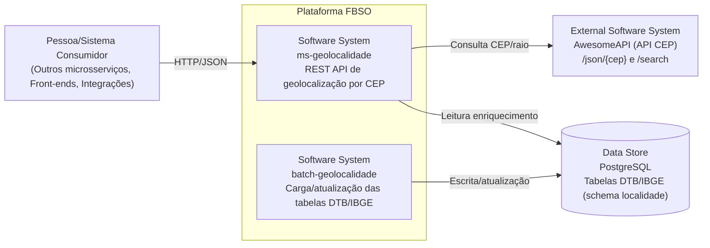

# C4 — Nível 1 (Contexto) — ms-geolocalidade

## Objetivo

Descrever o **contexto** do microserviço `ms-geolocalidade`: quem o consome, quais sistemas externos ele integra e quais responsabilidades ele possui.

## Responsabilidade do sistema

O `ms-geolocalidade` é um microserviço REST que:

- Consulta **geolocalização por CEP** e **vizinhança em raio (km)** via **AwesomeAPI**.
- Enriquece respostas com dados oficiais do **DTB/IBGE** persistidos em **PostgreSQL**.
- Aplica cache em chamadas de geocodificação por CEP (AwesomeAPI `/json/{cep}`) para reduzir latência/custo.

## Diagrama (Contexto)

## Principais entradas/saídas

- Entradas: chamadas HTTP para endpoints `/api/v1/localidades/**`.
- Saídas:
  - HTTP para AwesomeAPI.
  - SQL (leitura) para PostgreSQL com dados DTB/IBGE.

## Premissas e limites

- Autenticação/autorização não está representada aqui (não há evidência no projeto de um mecanismo de auth no nível de controller).
- `batch-geolocalidade` é tratado como sistema externo no contexto do `ms-geolocalidade` (ele é responsável por popular as tabelas DTB/IBGE). 
