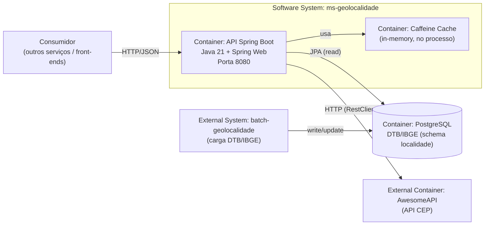

# C4 — Nível 2 (Contêiner) — ms-geolocalidade

## Objetivo

Detalhar os **contêineres** (executáveis/armazenamentos) que compõem o `ms-geolocalidade` e suas integrações.

## Contêineres

- **API Spring Boot (Java 21)**
  - Expõe endpoints REST `/api/v1/localidades/**`.
  - Orquestra chamadas à AwesomeAPI e leituras no PostgreSQL.
  - Responsável por validação de entrada e padronização de resposta (`PageResponseDTO`).

- **Cache in-process (Caffeine)**
  - Cacheia geocodificação de CEP (`AwesomeCepService.obterCoordenadas`) via `@Cacheable`.

- **PostgreSQL (schema `localidade`)**
  - Armazena tabelas DTB/IBGE (UF, regiões, municípios, distritos, subdistritos).
  - O `ms-geolocalidade` tipicamente faz **somente leitura** dessas tabelas.

- **AwesomeAPI (externo)**
  - Geocodificação por CEP: `GET /json/{cep}`
  - Busca por raio: `GET /search?lat=...&lng=...&d=...`

## Diagrama (Contêiner)

## Tecnologias observadas no projeto

- Spring Boot + Spring Web + Validation (via parent)
- Spring Data JPA
- PostgreSQL driver
- Cache: `spring-boot-starter-cache` + Caffeine
- HTTP client: `RestClient` com `JdkClientHttpRequestFactory`

