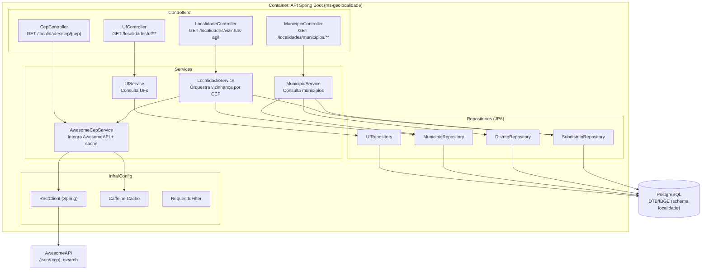

# C4 — Nível 3 (Componente) — ms-geolocalidade

## Objetivo

Descrever os **componentes** internos do contêiner "API Spring Boot" do `ms-geolocalidade`, com foco em responsabilidades e dependências.

## Componentes principais (por pacote)

### Controllers (`com.fbso.geolocalidade.controller`)

- `LocalidadeController`
  - Endpoint: `GET /api/v1/localidades/vizinhas-agil`
  - Caso de uso: vizinhança por CEP (AwesomeAPI + enriquecimento DTB/IBGE)

- `CepController`
  - Endpoint: `GET /api/v1/localidades/cep/{cep}`
  - Caso de uso: geocodificação por CEP (AwesomeAPI)

- `UfController`
  - Endpoints: `GET /api/v1/localidades/uf`, `GET /api/v1/localidades/uf/{sigla}/municipios`, ...
  - Caso de uso: navegação UF → municípios (DTB/IBGE)

- `MunicipioController`
  - Endpoints: `GET /api/v1/localidades/municipios`, `.../id/{id}`, `.../nome/{nome}`
  - Caso de uso: busca/paginação em municípios (DTB/IBGE)

### Services (`com.fbso.geolocalidade.service`)

- `AwesomeCepService`
  - Integração HTTP com AwesomeAPI (`/json/{cep}`, `/search`)
  - Cache: `@Cacheable` em `obterCoordenadas(cep)`

- `LocalidadeService`
  - Orquestra: geocodificação do CEP, busca por raio, enriquecimento via repositórios

- `UfService`, `MunicipioService`
  - Consultas paginadas e montagem de DTOs a partir das entidades DTB/IBGE

### Repositories (`com.fbso.geolocalidade.repository`)

- `MunicipioRepository`, `UfRepository`
  - Leitura com `@EntityGraph` para carregar hierarquia UF/Regiões

- `DistritoRepository`, `SubdistritoRepository`
  - Busca de primeiro distrito/subdistrito (payload resumido)
  - Consulta por prefixo do código IBGE (`SubdistritoRepository.findNomeByCodigo`)

### Config e infraestrutura (`com.fbso.geolocalidade.config`)

- `ClientConfig`
  - Bean de `RestClient` com `HttpClient` (timeouts)

- `AwesomeApiProperties`
  - Config: base URL + token/key

- `CacheConfig` / `CacheProperties`
  - Nome do cache e TTL/tamanho (Caffeine)

- `RequestIdFilter`
  - Propaga `requestId` em MDC para logging

## Diagrama (Componentes)

## Observações

- O caso de uso "vizinhas por CEP" combina dados **dinâmicos** (AwesomeAPI) com dados **oficiais** (DTB/IBGE).
- O cache é aplicado apenas na geocodificação (`/json/{cep}`), não na busca por raio.

