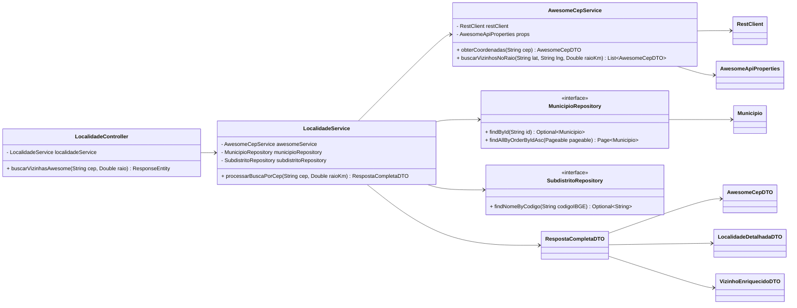

# C4 — Nível 4 (Código) — ms-geolocalidade

## Objetivo

Detalhar a visão de **código** (classes e principais relacionamentos) do fluxo central de negócio:

- "Vizinhança por CEP" (`GET /api/v1/localidades/vizinhas-agil`).

O foco aqui é mostrar como os componentes se conectam em termos de classes/métodos, sem tentar cobrir o domínio DTB/IBGE inteiro.

## Recorte do caso de uso

1. `LocalidadeController` recebe `cep` e `raio`.
2. `LocalidadeService.processarBuscaPorCep`:
   - chama `AwesomeCepService.obterCoordenadas(cep)` (com cache)
   - chama `AwesomeCepService.buscarVizinhosNoRaio(lat,lng,raio)`
   - enriquece vizinhos com `SubdistritoRepository.findNomeByCodigo(city_ibge)`
   - resolve UF/município oficial via `MunicipioRepository.findById(city_ibge)`
3. Retorna `RespostaCompletaDTO` dentro de `PageResponseDTO`.

## Diagrama (Classes)

## Notas de implementação (observadas no código)

- Cache: `AwesomeCepService.obterCoordenadas` usa `@Cacheable` com key normalizada (`CepUtils.normalizeCep`).
- HTTP: a integração usa `RestClient` configurado em `ClientConfig` com timeouts (connect/read).
- Enriquecimento IBGE:
  - município oficial é obtido via `MunicipioRepository.findById(city_ibge)`.
  - subdistrito oficial é obtido via `SubdistritoRepository.findNomeByCodigo(city_ibge)` usando prefixo do código.

