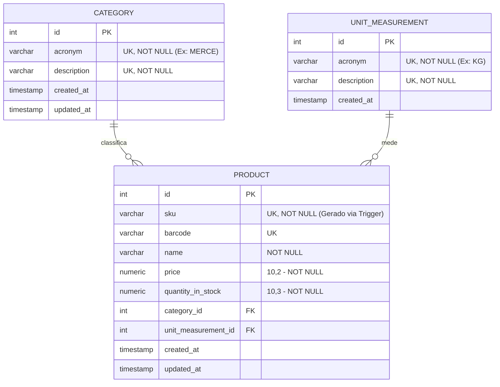

Para representar o **Diagrama de Entidade-Relacionamento (DER)** da nossa solução, utilizaremos a notação *Crow's Foot* (Pé de Galinha) dentro do Mermaid.

Este diagrama detalha a estrutura do schema `product_catalog_simple`, focando na integridade referencial e nos tipos de dados que definimos para suportar o microserviço em Java 21.

---

# 🗄️ Diagrama de Entidade-Relacionamento (DER)

---

## 🔍 Detalhes Técnicos do Modelo

### 1. Regras de Relacionamento

* **Category 1:N Product:** Uma categoria pode ter vários produtos (ex: "Bebidas" tem "Água" e "Suco"), mas um produto pertence a apenas uma categoria.
* **Unit 1:N Product:** Uma unidade de medida pode ser aplicada a vários produtos (ex: "KG" para "Tomate" e "Carne"), mas cada produto tem uma única unidade principal definida.

### 2. Constraints (Restrições)

* **UK (Unique Key):** * `sku` e `barcode` na tabela de produtos são únicos para evitar duplicidade de itens no checkout.
* Os `acronyms` nas tabelas de apoio são únicos para garantir a consistência da trigger que gera o SKU.

* **Precision:** * `price`: Definido como `NUMERIC(10,2)` para evitar erros de ponto flutuante em cálculos financeiros.
* `quantity_in_stock`: Definido como `NUMERIC(10,3)` para suportar balanças de precisão (gramas).

### 3. Auditoria Automática

Todas as tabelas herdam as colunas `created_at` e `updated_at`, que são alimentadas pelas *triggers* globais que configuramos no início do projeto, garantindo que o banco de dados seja a "fonte da verdade" cronológica.

---

**Com o DER finalizado, você gostaria de prosseguir para o arquivo `docker-compose.yml` que sobe o Postgres já com esse schema e o Redis preparado para o motor de consulta?**

---

