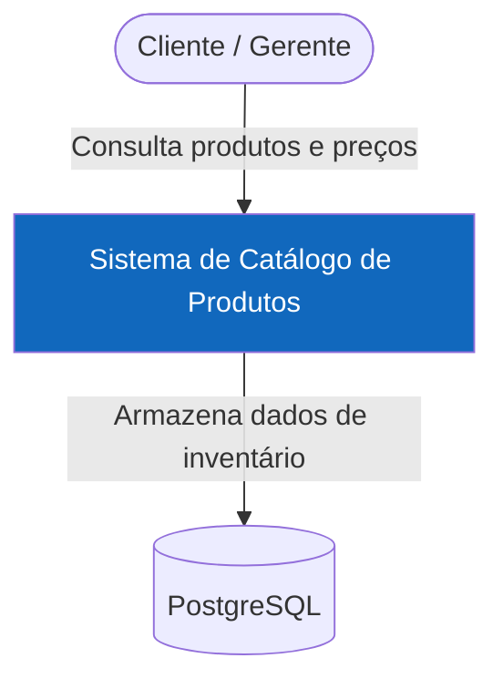
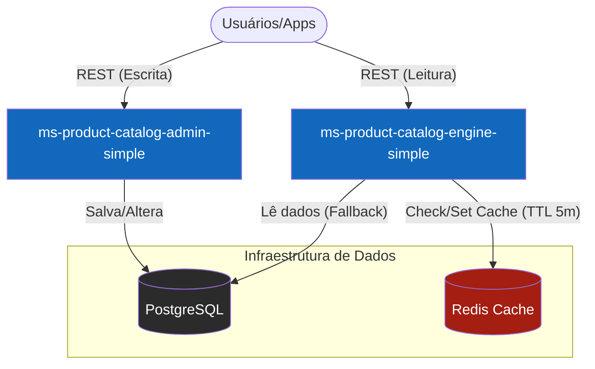
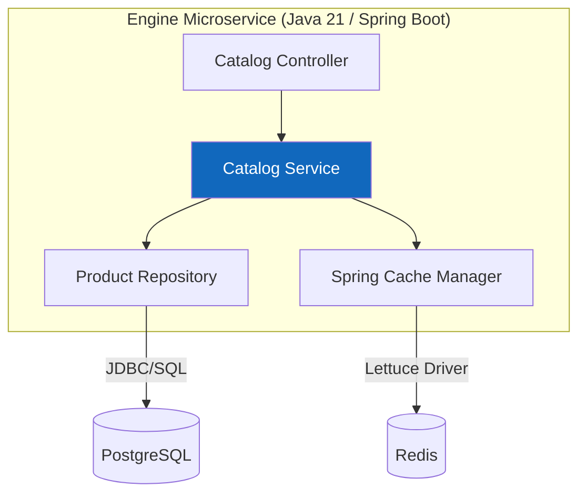
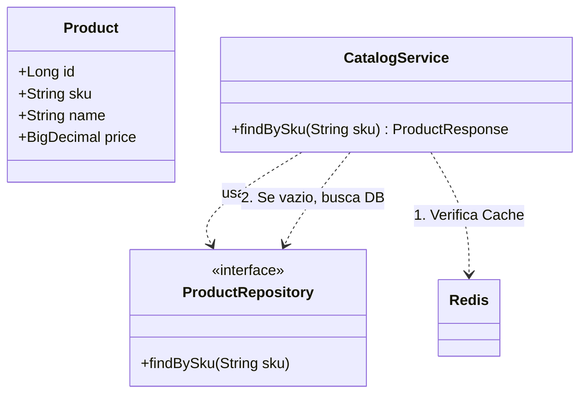

Abaixo, apresento os diagramas em formato **Mermaid** (que é renderizado nativamente em arquivos Markdown), estruturando a solução com os dois microserviços, o banco de dados PostgreSQL e o cache Redis.

---

# 🏗️ Documentação de Arquitetura C4 - Catálogo Simples

## 1. Diagrama de Contexto (Nível 1)

O objetivo aqui é mostrar como o sistema de catálogo interage com os usuários e o mundo externo.

---

## 2. Diagrama de Contêineres (Nível 2)

Aqui detalhamos a separação entre o Admin e o Engine de Consulta, além da infraestrutura de dados.

---

## 3. Diagrama de Componentes (Nível 3)

Focaremos no **ms-product-catalog-engine-simple**, detalhando como o Spring Boot organiza a lógica de cache.

---

## 4. Diagrama de Código (Nível 4)

Representação simplificada das classes principais e da lógica de decisão do Cache (Padrão *Cache-Aside*).

---

## 📝 Resumo da Decisão Arquitetural

* **Separação de Preocupações:** O serviço de **Admin** detém a soberania da escrita. O serviço de **Engine** detém a responsabilidade pela performance e entrega de leitura.
* **Estratégia de Cache:** Baseada em **TTL (Time To Live)** de 300 segundos (5 minutos). Não há acoplamento de mensagens entre os serviços nesta fase.
* **Persistência:** PostgreSQL utilizando o schema `product_catalog_simple` com as triggers de SKU e Auditoria que desenvolvemos.
* **Eficiência:** Ambos os serviços desenhados para compilação nativa via **GraalVM**, garantindo baixo uso de memória e inicialização rápida.

---
