# Índice de Documentos do Projeto
**Programa:** Adequação Corporativa à Reforma Tributária Nacional
**Código:** PRJ-FIN-2026-0001-REFORMA-TRIBUTARIA-2026-CORPORATIVO
**Última Atualização:** 23 de Junho de 2026

---

## 1. Estrutura Hierárquica de Documentos

Este projeto segue a cadeia de desdobramento de negócios:

```
[Estratégico] PROJECT-CHARTER  →  [Escopo] REQUIREMENTS  →  [Macro-Escopo] EPICS  →  [Funcional] FEATURES  →  [Execução] USER-STORYS
```

Cada nível referencia explicitamente o nível anterior via marcadores `[INDEX]`, garantindo rastreabilidade completa da diretriz estratégica até o critério de aceite.

---

## 2. Diagrama Visual da Documentação

```mermaid
flowchart TD
    %% Estilo Global
    classDef corporativo fill:#1A365D,stroke:#0A192F,stroke-width:2px,color:#FFF;
    classDef requisitos fill:#2B6CB0,stroke:#1A365D,stroke-width:2px,color:#FFF;
    classDef onda1 fill:#D69E2E,stroke:#B7791F,stroke-width:2px,color:#FFF;
    classDef onda2 fill:#2C7A7B,stroke:#234E52,stroke-width:2px,color:#FFF;
    classDef features fill:#4A5568,stroke:#2D3748,stroke-width:1px,color:#FFF;

    %% Nós Principais (Estratégico e Requisitos)
    PC[PROJECT-CHARTER.md<br>Diretrizes Corporativas Globais]:::corporativo
    REQ[REQUIREMENTS.md<br>Requisitos de Negócio - Lucro Real]:::requisitos
    
    %% Desdobramento Onda 1 (Documento e Épicos)
    EPICS[03-EPICS.md<br>Épicos Onda 1 e Onda 2]:::requisitos
    E1_EP1[Épico 01.01: Qualificação e Saneamento CRM]:::onda1
    E1_EP2[Épico 01.02: Conexão à Inteligência Corporativa]:::onda1
    E1_EP3[Épico 01.03: Precificação Dinâmica e IVA por Fora]:::onda1

    %% Features da Onda 1
    F1_1[Feature 01.1: Validação Cadastral em Tempo Real]:::features
    F1_2[Feature 01.2: Governança e Trava Comercial]:::features
    F1_3[Feature 02.1: Simulador Unificado Omnicanal]:::features
    F1_4[Feature 02.2: Resiliência de Vendas / Contingência]:::features
    F1_5[Feature 03.1: Interface Visual de Decomposição]:::features
    F1_6[Feature 03.2: Painel de Atratividade B2B / Crédito]:::features
    F1_7[Feature 03.3: Token de Garantia Comercial]:::features

    %% Desdobramento Onda 2 (Documento e Épicos)
    E2_EP1[Épico 02.01: Faturamento e Consistência SAP]:::onda2
    E2_EP2[Épico 02.02: Governança do Split Payment Bancário]:::onda2
    E2_EP3[Épico 02.03: Apropriação de Créditos no Lucro Real]:::onda2

    %% Features da Onda 2
    F2_1[Feature 01.1: Validação Pré-Emissão e Trava Contábil]:::features
    F2_2[Feature 01.2: Motor de Conversão ISS para IBS]:::features
    F2_3[Feature 01.3: Automação de Benefícios e Regimes Especiais]:::features
    F2_4[Feature 02.1: Liquidação e Conciliação Segregada]:::features
    F2_5[Feature 02.2: Ajuste de Split para Operações Incentivadas]:::features
    F2_6[Feature 02.3: Painel de Auditoria e Reconciliação]:::features
    F2_7[Feature 03.1: Auditoria de Entrada e Bloqueio de Créditos]:::features
    F2_8[Feature 03.2: Segregação Contábil de Custos e Ativos]:::features
    F2_9[Feature 03.3: Escrituração de Reserva de Incentivos]:::features

    %% Relacionamentos Estratégicos Principais
    PC --> |Autoriza e direciona| REQ
    REQ --> |Desdobra em épicos| EPICS

    %% Mapeamento da Onda 1 (Épicos -> Features)
    EPICS --> E1_EP1
    EPICS --> E1_EP2
    EPICS --> E1_EP3
    E1_EP1 --> F1_1
    E1_EP1 --> F1_2
    E1_EP2 --> F1_3
    E1_EP2 --> F1_4
    E1_EP3 --> F1_5
    E1_EP3 --> F1_6
    E1_EP3 --> F1_7

    %% Mapeamento da Onda 2 (Épicos -> Features)
    EPICS --> E2_EP1
    EPICS --> E2_EP2
    EPICS --> E2_EP3
    E2_EP1 --> F2_1
    E2_EP1 --> F2_2
    E2_EP1 --> F2_3
    E2_EP2 --> F2_4
    E2_EP2 --> F2_5
    E2_EP2 --> F2_6
    E2_EP3 --> F2_7
    E2_EP3 --> F2_8
    E2_EP3 --> F2_9

    %% Conexões de Interdependência Funcional de Negócio
    F1_7 -.-> |Injeta token de preço base e alíquota no| F2_1
    F2_3 -.-> |Recalcula a base tributária para o| F2_5
```



---

## 3. Índice Completo de Documentos

### 3.1 Nível Estratégico

| Documento | Descrição | Status |
|:---|:---|:---|
| [PROJECT-CHARTER.md](./PROJECT-CHARTER.md) | Termo de Abertura do Programa — Versão 2.0 (Visão de Negócios / Alta Gestão) | ✅ Aprovado |
| [PROJECT-CHARTER-001.md](./PROJECT-CHARTER-001.md) | Termo de Abertura do Programa — Versão 1.0 (Histórico) | 📋 Arquivado |

### 3.2 Nível de Escopo — Requisitos

| Documento | Descrição | Status |
|:---|:---|:---|
| [REQUIREMENTS.md](./REQUIREMENTS.md) | 9 Requisitos de Negócio (BR-01 a BR-09) distribuídos em 3 Blocos: Fundação, Onda 1 e Onda 2 | ✅ Aprovado |

### 3.3 Nível Macro-Escopo — Épicos

| Documento | Descrição | Épicos | Status |
|:---|:---|:---|:---|
| [03-EPICS.md](./03-EPICS.md) | Épicos unificados — Onda 1 (Canais Comerciais e Vendas) + Onda 2 (Finanças, Faturamento e ERP) | 01.01 (CRM), 01.02 (Integração), 01.03 (Precificação), 02.01 (Faturamento), 02.02 (Split), 02.03 (Créditos) | ✅ Pronto |

### 3.4 Nível Funcional — Features

**Documento:** [04-FEATURES.md](./04-FEATURES.md) — 16 features unificadas (7 Onda 1 + 9 Onda 2)

#### Onda 1: Canais Comerciais e Vendas

| Feature | Épico | Descrição | User Stories |
|:---|:---|:---|:---|
| Feature 01.1 | Épico 01.01 | Validação Cadastral Geográfica em Tempo Real | [01.01.1 US](./USER-STORYS-01-01-1-VALIDACAO-CADASTRAL-GEOGRAFICA-TEMPO-REAL.md) ✅ |
| Feature 01.2 | Épico 01.01 | Governança e Trava Comercial de Vendas (CRM) | [01-01-2 US](./USER-STORYS-01-01-2-TRAVA-COMERCIAL-NO-CRM-POR-FALTA-DE-HIGIENIZACAO-CADASTRAL.md) ✅ |
| Feature 02.1 | Épico 01.02 | Simulador Unificado em Telas de Proposta (Omnicanalidade) | [01-02-1 US](./USER-STORYS-01-02-1-SIMULADOR-UNIFICADO-OMNICANAL.md) ✅ |
| Feature 02.2 | Épico 01.02 | Resiliência de Vendas (Contingência Local) | [01-02-2 US](./USER-STORYS-01-02-2-RESILIENCIA-VENDAS-CONTINGENCIA-LOCAL.md) ✅ |
| Feature 03.1 | Épico 01.03 | Interface Visual de Checkout com Decomposição do IVA | [01-03-1 US](./USER-STORYS-01-03-1-INTERFACE-VISUAL-CHECKOUT-DECOMPOSICAO-IVA.md) ✅ |
| Feature 03.2 | Épico 01.03 | Painel de Atratividade B2B (Calculadora de Crédito do IVA) | [01-03-2 US](./USER-STORYS-01-03-2-PAINEL-ATRATIVIDADE-B2B-CALCULADORA-CREDITO.md) ✅ |
| Feature 03.3 | Épico 01.03 | Chave de Garantia Comercial (Token de Validade Fiscal) | [01-03-3 US](./USER-STORYS-01-03-3-CHAVE-DE-GARANTIA-TOKEN-DE-VALIDADE-FISCAL.md) ✅ |

#### Onda 2: Finanças, Faturamento e ERP

| Feature | Épico | Descrição | User Stories |
|:---|:---|:---|:---|
| Feature 01.1 | Épico 02.01 | Validação de Faturamento Pré-Emissão e Trava Contábil | [02-01-1 US](./USER-STORYS-02-01-1-VALIDACAO-FATURAMENTO-PRE-EMISSAO-TRAVA-CONTABIL.md) ✅ |
| Feature 01.2 | Épico 02.01 | Motor de Conversão do ISS para IBS (Serviços) | [02-01-2 US](./USER-STORYS-02-01-2-MOTOR-CONVERSAO-ISS-IBS.md) ✅ |
| Feature 01.3 | Épico 02.01 | Automação de Benefícios e Regimes Especiais | [02-01-3 US](./USER-STORYS-02-01-3-AUTOMACAO-BENEFICIOS-REGIMES-ESPECIAIS.md) ✅ |
| Feature 02.1 | Épico 02.02 | Liquidação e Conciliação Financeira Segregada (Split) | [02-02-1 US](./USER-STORYS-02-02-1-LIQUIDACAO-CONCILIACAO-SEGREGADA-SPLIT.md) ✅ |
| Feature 02.2 | Épico 02.02 | Ajuste de Split para Operações Incentivadas | [02-02-2 US](./USER-STORYS-02-02-2-AJUSTE-SPLIT-OPERACOES-INCENTIVADAS.md) ✅ |
| Feature 02.3 | Épico 02.02 | Painel de Auditoria e Reconciliação do Split Payment | [02-02-3 US](./USER-STORYS-02-02-3-PAINEL-AUDITORIA-RECONCILIACAO-SPLIT.md) ✅ |
| Feature 03.1 | Épico 02.03 | Auditoria Fiscal de Entrada e Bloqueio de Créditos | [02-03-1 US](./USER-STORYS-02-03-1-AUDITORIA-FISCAL-ENTRADA-BLOQUEIO-CREDITOS.md) ✅ |
| Feature 03.2 | Épico 02.03 | Segregação Contábil de Custos de Estoque e Ativos | [02-03-2 US](./USER-STORYS-02-03-2-SEGREGACAO-CONTABIL-CUSTOS-ESTOQUE-ATIVOS.md) ✅ |
| Feature 03.3 | Épico 02.03 | Escrituração de Reserva de Incentivos (Subvenção) | [02-03-3 US](./USER-STORYS-02-03-3-ESCRITURACAO-RESERVA-INCENTIVOS.md) ✅ |

### 3.5 Nível de Governança e Métricas

| Documento | Descrição | Status |
|:---|:---|:---|
| [MATRIZ-KPI.md](./MATRIZ-KPI.md) | 8 KPIs em 3 dimensões: Financeira (F1-F3), Compliance (C1-C2), Operacional (O1-O2) com template de dashboard para CFO | ✅ Pronto |

### 3.6 Base de Conhecimento Técnico-Tributário

| Documento | Conteúdo |
|:---|:---|
| [docs-suporte/README-ESCOPO.md](./docs-suporte/README-ESCOPO.md) | Catálogo de impostos PJ, estrutura de microserviços, matriz de convivência de regimes (2026-2033) |
| [docs-suporte/README-BRAINSTORM.md](./docs-suporte/README-BRAINSTORM.md) | Modelagem técnica Go para motores de cálculo fiscal (TaxDocumentInput, TaxItem, DIFAL) |
| [docs-suporte/README-ICMS.md](./docs-suporte/README-ICMS.md) | Regras detalhadas de ICMS, alíquotas interestaduais, DIFAL |
| [docs-suporte/README-ICMS-EXTENSAO-REGRAS.md](./docs-suporte/README-ICMS-EXTENSAO-REGRAS.md) | Extensões de regras ICMS, ST, FCP |
| [docs-suporte/README-PIS-COFINS.md](./docs-suporte/README-PIS-COFINS.md) | Regimes cumulativo e não-cumulativo, alíquotas, bases de cálculo |
| [docs-suporte/README-IPI.md](./docs-suporte/README-IPI.md) | TIPI, NCM, fato gerador, alíquotas |
| [docs-suporte/README-CONSTANTS.md](./docs-suporte/README-CONSTANTS.md) | Constantes fiscais, tabelas de alíquotas, códigos IBGE |
| [docs-suporte/README-SIMPLES-NACIONAL.md](./docs-suporte/README-SIMPLES-NACIONAL.md) | Anexos I-V, RBT12, regras de transição |
| [docs-suporte/README-TABELA-CST-CSON.md](./docs-suporte/README-TABELA-CST-CSON.md) | Tabelas CST, CSOSN, CFOP |
| docs-suporte/*.pdf (11 arquivos) | Material do curso RTC CFC-RFB, Nota Técnica NT 2025.002, cartilha da reforma |

---

## 4. Estatísticas do Projeto

| Métrica | Valor |
|:---|:---|
| **Requisitos de Negócio (BR)** | 9 (BR-01 a BR-09) |
| **Épicos** | 6 (3 Onda 1 + 3 Onda 2) |
| **Features** | 16 (7 Onda 1 + 9 Onda 2) |
| **User Stories** | 41 (21 Onda 1 + 20 Onda 2) |
| **Regras de Negócio (RN)** | ~90 (média de 2-3 RNs por US) |
| **Critérios de Aceite BDD** | ~55 cenários Dado/Quando/Então |
| **KPIs de Negócio** | 8 (3 Financeiros + 2 Compliance + 2 Operacionais) |

---

## 5. Convenções do Projeto

- **Rastreabilidade:** Todo documento referencia seu antecessor hierárquico via marcador `[INDEX]`
- **User Stories:** Seguem o formato padrão — Descrição (Como/Quero/Para), Regras de Negócio (RN01, RN02...), Critérios de Aceite em BDD (Cenário: Dado/Quando/Então)
- **Nomenclatura de Arquivos:** `FEATURE-{onda}-{sequencia}-{descricao-curta}.md` para Features, `USER-STORYS-{feature}-{descricao-curta}.md` para User Stories (onde `{feature}` = código completo: `01-01-1`, `02-03-2` etc.)
- **Status de Documentos:** "Pronto para Desenvolvimento Técnico" indica que o PO/PM já validou o conteúdo de negócio
- **Base de Conhecimento:** Documentos em `docs-suporte/` são fontes técnicas de referência, não fazem parte da hierarquia de negócios
