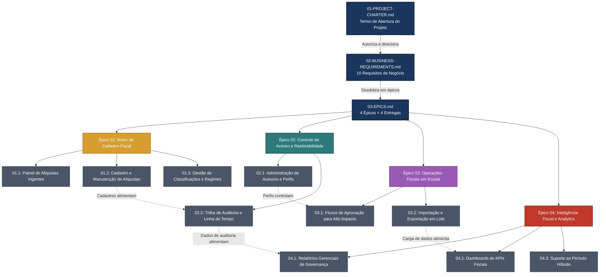

# Índice de Documentos do Projeto
**Projeto:** Portal Corporativo de Gestão Tributária — Autonomia do Time de Finanças na Administração de Impostos
**Código:** PRJ-FIN-2026-0002-ADMIN-TRIBUTOS-CORPORATIVOS
**Programa Pai:** [PRJ-FIN-2026-0001](../PRJ-FIN-2026-0001-REFORMA-TRIBUTARIA-2026-CORPORATIVO/)
**Última Atualização:** 08 de Julho de 2026

---

## 1. Estrutura Hierárquica de Documentos

Este projeto segue a cadeia de desdobramento de negócios:

```
[Estratégico] PROJECT-CHARTER  →  [Escopo] REQUIREMENTS  →  [Macro-Escopo] EPICS  →  [Funcional] FEATURES  →  [Execução] USER-STORYS
```

Cada nível referencia explicitamente o nível anterior via marcadores `[INDEX]`, garantindo rastreabilidade completa da diretriz estratégica até o critério de aceite.

---

## 2. Diagrama Visual da Documentação



---

## 3. Índice Completo de Documentos

### 3.1 Nível Estratégico

| Documento | Descrição | Status |
|:---|:---|:---|
| [01-PROJECT-CHARTER.md](./01-PROJECT-CHARTER.md) | Termo de Abertura do Projeto — Versão 1.0 (Visão de Negócios Pura / Alta Gestão) | ⚠️ Requer atualização (ref. 3→4 entregas) |

### 3.2 Nível de Escopo — Requisitos

| Documento | Descrição | Status |
|:---|:---|:---|
| [02-BUSINESS-REQUIREMENTS.md](./02-BUSINESS-REQUIREMENTS.md) | 10 Requisitos de Negócio (BR-01 a BR-10) em 4 Blocos = 4 Entregas | ✅ Atualizado |

### 3.3 Nível Macro-Escopo — Épicos

| Documento | Descrição | Épicos | Status |
|:---|:---|:---|:---|
| [03-EPICS.md](./03-EPICS.md) | 4 Épicos = 4 Entregas: Motor de Cadastro, Controle e Rastreabilidade, Operações em Escala, Inteligência e Analytics | 01, 02, 03, 04 | ✅ Atualizado |

### 3.4 Nível Funcional — Features

| Documento | Descrição | Features | Status |
|:---|:---|:---|:---|
| [04-FEATURES.md](./04-FEATURES.md) | 10 Features (3 Entrega 1 + 2 Entrega 2 + 2 Entrega 3 + 3 Entrega 4) com 38 Regras de Negócio | ✅ Pronto |

### 3.5 Nível de Governança e Métricas

| Documento | Descrição | Status |
|:---|:---|:---|
| [MATRIZ-KPI.md](./MATRIZ-KPI.md) | 8 KPIs em 3 dimensões: Autonomia (A), Governança (G), Eficiência e Satisfação (E) | ⚠️ Requer atualização (ref. BRs renumerados, 3→4 entregas) |
| [DEFINITION_OF_DONE.md](./DEFINITION_OF_DONE.md) | DoD com 3 níveis: User Story, Feature, Entrega — visão de negócios | ⚠️ Requer atualização (ref. 3→4 entregas) |
| [STAKEHOLDER-MAP.md](./STAKEHOLDER-MAP.md) | Mapa de stakeholders, matriz RACI por fase, canais de comunicação e escalation path | ⚠️ Requer atualização (ref. 3→4 fases/entregas) |
| [GLOSSARY.md](./GLOSSARY.md) | Termos específicos do projeto: conceitos do portal, módulos, perfis, fases, métricas | ⚠️ Requer atualização (ref. 3→4 entregas) |

### 3.6 Referência Externa

| Documento | Descrição |
|:---|:---|
| [Glossário do Programa Pai](../PRJ-FIN-2026-0001-REFORMA-TRIBUTARIA-2026-CORPORATIVO/GLOSSARY.md) | Terminologia completa do domínio tributário (CBS, IBS, IS, IVA Dual, Lucro Real, Split Payment, etc.) |

---

## 4. Estatísticas do Projeto

| Métrica | Valor |
|:---|:---|
| **Entregas (Deliveries)** | 4 (Gestão Básica, Governança, Operações em Escala, Portal Completo) |
| **Épicos** | 4 (1 por entrega) |
| **Features** | 10 (3 + 2 + 2 + 3) |
| **Requisitos de Negócio (BR)** | 10 (BR-01 a BR-10, numerados sequencialmente por bloco) |
| **KPIs** | 8 (2 Autonomia + 3 Governança + 3 Eficiência/Satisfação) |
| **User Stories** | 30 (9 Entrega 1 + 6 Entrega 2 + 6 Entrega 3 + 9 Entrega 4) |
| **Regras de Negócio (RN)** | 38 (distribuídas nas Features) + ~90 (distribuídas nas User Stories) |
| **Módulos do Portal** | 6 (M1 a M6) |
| **Perfis de Usuário** | 3 (Administrador Fiscal, Analista Fiscal, Auditor/Controller) |

---

## 5. Mapa Rápido: Bloco → Épico → Entrega → BRs

| Bloco | Épico | Entrega | BRs |
|:---|:---|:---|:---|
| 1 — Motor de Cadastro Fiscal | 01 | Entrega 1 | BR-01, BR-02, BR-03 |
| 2 — Controle de Acesso e Rastreabilidade | 02 | Entrega 2 | BR-04, BR-05 |
| 3 — Operações Fiscais em Escala | 03 | Entrega 3 | BR-06, BR-07 |
| 4 — Inteligência Fiscal e Analytics | 04 | Entrega 4 | BR-08, BR-09, BR-10 |

---

## 6. Convenções do Projeto

- **Rastreabilidade:** Todo documento referencia seu antecessor hierárquico via marcador `[INDEX]`
- **User Stories:** Seguem o formato padrão — Descrição (Como/Quero/Para), Regras de Negócio (RN01, RN02...), Critérios de Aceite em BDD (Cenário: Dado/Quando/Então)
- **Nomenclatura de Arquivos:** Segue o mesmo padrão do programa pai PRJ-FIN-2026-0001
- **Status de Documentos:** "Pronto para Desenvolvimento Técnico" indica que o PO/PM já validou o conteúdo de negócio
- **Programa Pai:** Este projeto herda as convenções, glossário e premissas do [PRJ-FIN-2026-0001](../PRJ-FIN-2026-0001-REFORMA-TRIBUTARIA-2026-CORPORATIVO/)
- **Visão de Negócios:** Toda documentação deste projeto é redigida em linguagem de negócios, com foco em valor entregue ao time de Finanças e à governança corporativa
