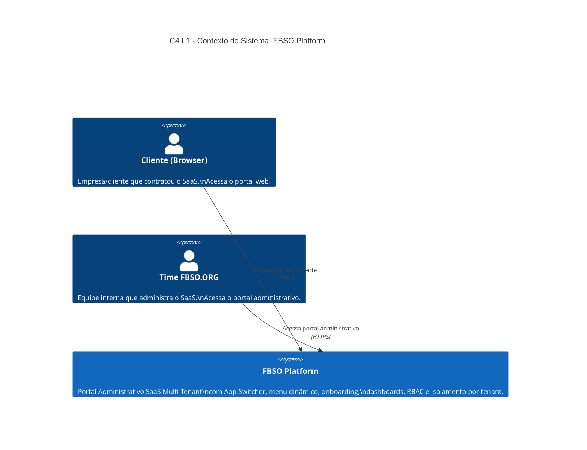
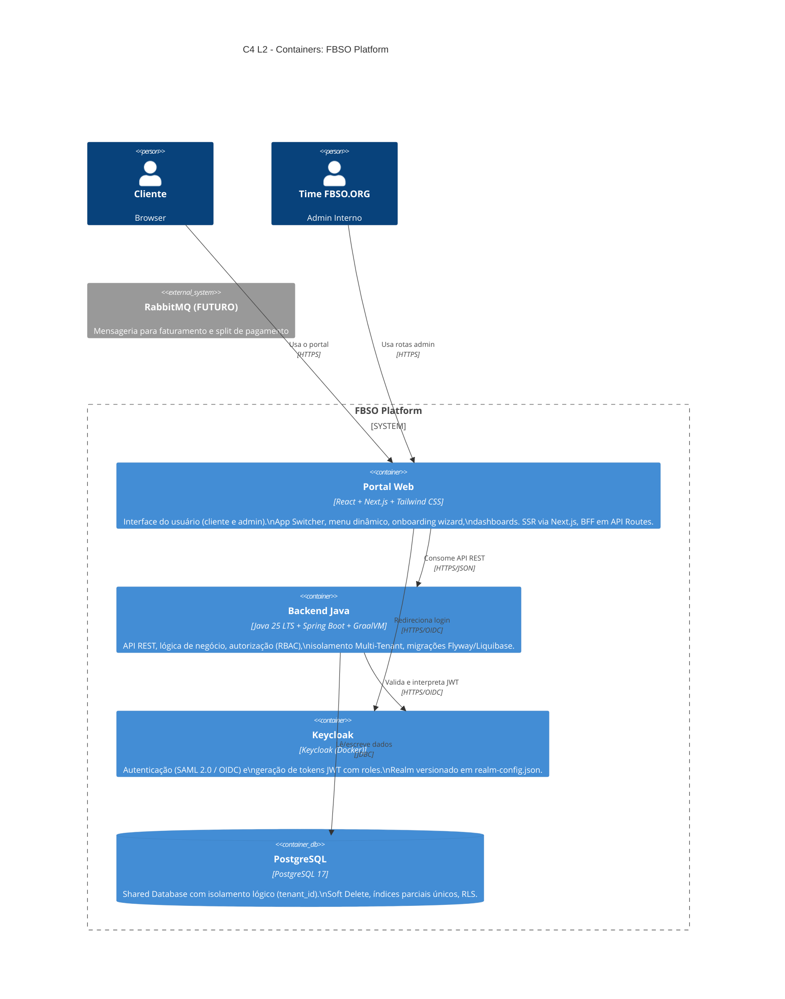
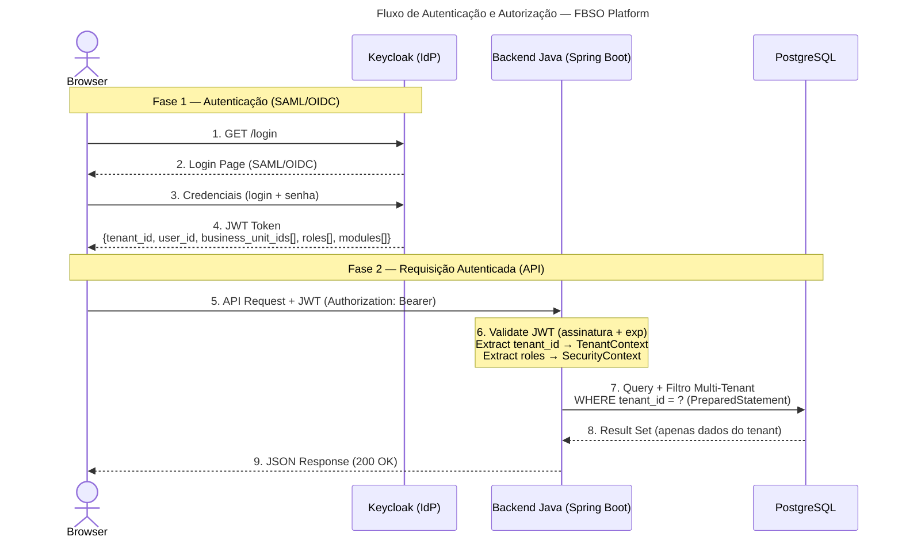

# ARCHITECTURE.md — Visão Arquitetural da Solução

- **Projeto:** PRJ-FIN-2026-0003-SAAS-FBSO-ORG
- **Programa:** FBSO Platform — Portal Administrativo SaaS (Fase 0 — Core)
- **Versão:** 1.2
- **Data:** 16 de Julho de 2026
- **Status:** Visão de Alto Nível — todos os diagramas padronizados em Mermaid
- **Origem:** [TECHNICAL-PLAN.md](./TECHNICAL-PLAN.md)

---

## 1. Diagrama de Contexto (C4 — Nível 1)



> **Nota:** Este diagrama mostra a plataforma como uma caixa-preta (Nível 1 — System Context). Para ver os containers internos (Frontend, Backend, Keycloak, PostgreSQL), veja a [Seção 2](#2-diagrama-de-containers-c4--nível-2). Para detalhamento de componentes internos do backend (Nível 3), consulte [ARCHITECTURE-C4.md do microserviço ms-fbso-platform-admin](../../../backend/java/spring/microservices/ms-fbso-platform-admin/.specs/business-projects/PRJ-FIN-2026-0003-SAAS-FBSO-ORG/ARCHITECTURE-C4.md).

### Atores Externos

| Ator | Descrição | Interação |
|:---|:---|:---|
| **Cliente (Browser)** | Empresa/cliente que contratou o SaaS. Acessa o portal web | HTTPS → Frontend |
| **Time FBSO.ORG** | Equipe interna que administra o SaaS. Acessa o portal administrativo | HTTPS → Frontend (rotas admin) |

### Responsabilidades por Componente

| Componente | Responsabilidade | Stack |
|:---|:---|:---|
| **Portal Web** | Interface do usuário (cliente e admin). App Switcher, menu dinâmico, onboarding wizard, dashboards | React + Next.js + Tailwind CSS |
| **Keycloak** | Autenticação (SAML 2.0 / OIDC) e geração de tokens JWT com roles | Keycloak (Docker) |
| **Backend** | API REST, lógica de negócio, autorização (RBAC), isolamento Multi-Tenant | Java 25 LTS + Spring Boot + GraalVM |
| **PostgreSQL** | Persistência de dados com isolamento lógico e Soft Delete | PostgreSQL |

---

## 2. Diagrama de Containers (C4 — Nível 2)



> **Orquestração:** Kubernetes (Staging + Produção) | **Dev Local:** Docker Compose (4 containers)

> **Nota:** Para visão detalhada dos componentes internos do backend (C4 Nível 3), consulte [ARCHITECTURE-C4.md do microserviço ms-fbso-platform-admin](../../../backend/java/spring/microservices/ms-fbso-platform-admin/.specs/business-projects/PRJ-FIN-2026-0003-SAAS-FBSO-ORG/ARCHITECTURE-C4.md). Para a visão de infraestrutura e deployment (C4 Deployment), consulte [ARCHITECTURE-C4-DEPLOYMENT.md](../../../backend/java/spring/microservices/ms-fbso-platform-admin/.specs/business-projects/PRJ-FIN-2026-0003-SAAS-FBSO-ORG/ARCHITECTURE-C4-DEPLOYMENT.md).

---

## 3. Fluxo de Autenticação e Autorização



### Estrutura do JWT (Payload)

```json
{
  "iss": "fbso-platform",
  "sub": "user-uuid-from-keycloak",
  "tenant_id": "t-12345",
  "email": "maria@empresa.com.br",
  "roles": [
    {"business_unit_id": "bu-001", "role": "ADMIN_TENANT"},
    {"business_unit_id": "bu-002", "role": "MANAGER_BU"}
  ],
  "modules": ["FBSO_PLATFORM"],
  "exp": 1721000000
}
```

### Filtros de Segurança no Backend

| Camada | O que faz |
|:---|:---|
| **Security Filter** | Intercepta toda requisição HTTP. Valida assinatura e expiração do JWT. Extrai claims (tenant_id, roles, modules). |
| **Tenant Isolation** | Injeta `WHERE tenant_id = ?` em TODA query SQL. Se o JWT não contiver tenant_id, a requisição é rejeitada (403). |
| **RBAC Interceptor** | Verifica se o papel do usuário tem permissão para o recurso + ação (ex: PRODUCT_SERVICE:edit). Se não tiver, retorna 403. |
| **Business Unit Filter** | Para operações em recursos de uma BU específica, verifica se o `business_unit_id` da URL está na lista `roles[]` do JWT. |
| **Audit Trail** | Toda operação de escrita (INSERT, UPDATE, soft-DELETE) gera registro automático na trilha de auditoria. |

---

## 4. Decisões Arquiteturais (ADRs)

| ID | Decisão | Justificativa | Impacto |
|:---|:---|:---|:---|
| **ADR-01** | Shared Database com isolamento lógico (`tenant_id`) | Time reduzido. Um banco único simplifica operação, backup e custos. Isolamento garantido por filtro obrigatório em 100% das queries | Todo endpoint DEVE filtrar por tenant_id. Risco: uma query sem filtro expõe dados entre tenants |
| **ADR-02** | Java 25 LTS + Spring Boot + GraalVM para backend | Stack corporativa consolidada. Spring Security integra nativamente com JWT. Spring Data JDBC simplifica persistência com filtro Multi-Tenant. GraalVM Native Image para inicialização rápida e baixo consumo de memória | Exige configuração de TenantResolver e SecurityFilter customizados. GraalVM requer AOT compilation metadata para reflection |
| **ADR-03** | React + Next.js + Tailwind CSS | Next.js provê SSR onde necessário e separação clara entre rotas admin e cliente. Tailwind com CSS variables prepara temas dinâmicos por tenant | Exige design system com tokens CSS customizáveis |
| **ADR-04** | Keycloak como IdP externo | Isola complexidade de autenticação (SAML, OIDC, MFA, SSO) da aplicação. Enterprise-ready desde o dia 1. Backend só valida JWT | Keycloak é um container adicional para gerenciar. Configuração do realm deve ser versionada (realm-config.json) |
| **ADR-05** | Soft Delete universal | Requisito de auditoria fiscal e compliance. Nenhum registro é removido fisicamente. `deleted_dt IS NULL` em toda query | Índices únicos devem ser parciais (`WHERE deleted_dT IS NULL`). Volume de dados cresce indefinidamente |
| **ADR-06** | API Contract First (OpenAPI) | O contrato de API é definido antes do código. Backend e Frontend desenvolvem em paralelo com MSW mock | Exige disciplina de versionamento de contrato. Mudanças pós-aprovação seguem processo formal |
| **ADR-07** | JWT Stateless (sem sessão no servidor) | Cada requisição carrega o token JWT com todas as claims necessárias (tenant_id, roles, modules). Backend não mantém estado de sessão | Token trafega em toda requisição. Revogação de acesso exige blacklist ou tempo de expiração curto |
| **ADR-08** | Docker + Kubernetes para todos os ambientes | Consistência entre dev, staging e produção. K8s provê health checks, rolling updates, auto-scaling | Exige Dockerfile para cada componente. Complexidade de configuração K8s (ConfigMaps, Secrets, Ingress) |

---

## 5. Estrutura de Módulos do Backend (Pacotes)

```
com.fbso.platform.admin/              ← Projeto: ms-fbso-platform-admin
│
├── config/
│   ├── SecurityConfig.java           ← Configuração Spring Security + JWT
│   ├── TenantContext.java            ← Holder do tenant_id da requisição atual
│   └── WebConfig.java                ← CORS, interceptors
│
├── security/
│   ├── JwtAuthenticationFilter.java  ← Filtro que valida JWT em toda requisição
│   ├── TenantIsolationFilter.java    ← Injeta tenant_id nas queries
│   └── RbacInterceptor.java          ← Verifica permissões por recurso/ação
│
├── tenant/
│   ├── TenantController.java         ← REST /tenants
│   ├── TenantService.java
│   └── TenantRepository.java
│
├── plan/
│   ├── PlanController.java           ← REST /plans
│   ├── PlanService.java
│   └── PlanRepository.java
│
├── subscription/
│   ├── SubscriptionController.java   ← REST /subscriptions
│   ├── SubscriptionService.java
│   └── SubscriptionRepository.java
│
├── user/
│   ├── UserController.java           ← REST /users
│   ├── UserService.java
│   ├── UserRepository.java
│   └── UserInviteService.java        ← Lógica de convite por e-mail
│
├── permission/
│   ├── PermissionController.java     ← REST /permissions
│   ├── PermissionService.java
│   └── PermissionRepository.java
│
├── businessunit/
│   ├── BusinessUnitController.java   ← REST /business-units
│   ├── BusinessUnitService.java
│   └── BusinessUnitRepository.java
│
├── product/
│   ├── ProductController.java        ← REST /products
│   ├── ProductService.java
│   └── ProductRepository.java
│
├── dashboard/
│   ├── DashboardController.java      ← REST /dashboard/admin, /dashboard/client
│   └── DashboardService.java
│
├── onboarding/
│   ├── OnboardingController.java     ← REST /onboarding
│   └── OnboardingService.java
│
├── audit/
│   ├── AuditController.java          ← REST /audit
│   ├── AuditService.java
│   └── AuditEntityListener.java      ← JPA Entity Listener para auto-auditoria
│
└── common/
    ├── BaseEntity.java               ← Superclasse com campos de auditoria (compatível com Spring Data JDBC via convention-based mapping)
    └── SoftDeleteRepository.java     ← Repository base com filtro deleted_dt IS NULL
```

---

## 6. Estrutura de Módulos do Frontend (Rotas Next.js)

```
web_app-fbso-platform-portal/
│
├── app/
│   ├── (auth)/
│   │   ├── login/page.tsx            ← Tela de login (redireciona para Keycloak)
│   │   └── reset-password/page.tsx   ← Recuperação de senha
│   │
│   ├── (onboarding)/
│   │   └── onboarding/
│   │       ├── page.tsx              ← Wizard — Passo 1: Confirmar dados
│   │       ├── step-2/page.tsx       ← Passo 2: Cadastrar Matriz
│   │       ├── step-3/page.tsx       ← Passo 3: Resumo do Plano
│   │       └── step-4/page.tsx       ← Passo 4: Boas-vindas
│   │
│   ├── (admin)/                      ← Rotas do time FBSO.ORG
│   │   ├── dashboard/page.tsx        ← Dashboard administrativo
│   │   ├── tenants/page.tsx          ← Gestão de contas
│   │   ├── plans/page.tsx            ← Configuração de planos
│   │   └── audit/page.tsx            ← Histórico de auditoria
│   │
│   └── (portal)/                     ← Rotas do cliente
│       ├── dashboard/page.tsx        ← Dashboard do cliente
│       ├── business-units/page.tsx   ← Unidades de Negócio
│       ├── products/page.tsx         ← Catálogo de Produtos
│       ├── users/page.tsx            ← Gestão de Usuários (Admin Tenant)
│       └── profile/page.tsx          ← Perfil do usuário
│
├── components/
│   ├── layout/
│   │   ├── AppSwitcher.tsx           ← Seletor de módulos no topo
│   │   ├── Sidebar.tsx               ← Menu lateral dinâmico
│   │   └── BusinessUnitSelector.tsx  ← Seletor de Unidade de Negócio
│   ├── dashboard/
│   │   ├── MetricsCard.tsx           ← Card de indicador
│   │   └── TrendChart.tsx            ← Gráfico de evolução
│   └── common/
│       ├── DataTable.tsx             ← Tabela paginada reutilizável
│       └── StatusBadge.tsx           ← Badge de status colorido
│
├── lib/
│   ├── auth.ts                       ← Integração com Keycloak (next-auth)
│   ├── api-client.ts                 ← Cliente HTTP com injeção de JWT
│   └── permissions.ts                ← Hook usePermission(resource, action)
│
└── mocks/
    └── handlers/                     ← MSW handlers baseados no OpenAPI
```

---

## 7. Estratégia Multi-Tenant (Isolamento Lógico)

### Princípios

1. **Toda tabela operacional tem `tenant_id`** — sem exceção
2. **Toda query SQL inclui `WHERE tenant_id = ?`** — injetado automaticamente pelo `TenantIsolationFilter`
3. **O `tenant_id` vem do JWT** — nunca do parâmetro da URL ou do corpo da requisição
4. **Auditoria é cross-tenant** — o time FBSO.ORG vê ações de todos os tenants (para fins administrativos)

### Fluxo do tenant_id

```
JWT (tenant_id: t-12345)
  → TenantContext.set("t-12345")
    → TenantIsolationFilter intercepta query SQL
      → Adiciona "AND tenant_id = ?" com placeholder parametrizado (PreparedStatement)
        → PostgreSQL retorna apenas dados do tenant t-12345
```

---

## 8. Próximos Passos de Detalhamento

1. Definir schema SQL completo (migrations Flyway/Liquibase)
2. Especificar OpenAPI YAML com todos os endpoints
3. Detalhar políticas de segurança (CORS, CSP, rate limiting)
4. Definir estratégia de logging e monitoramento
5. Especificar pipelines CI/CD
6. ✅ ~~Criar diagrama C4 nível 3 (Componentes internos de cada container)~~ — Concluído: [ARCHITECTURE-C4.md do ms-fbso-platform-admin](../../../backend/java/spring/microservices/ms-fbso-platform-admin/.specs/business-projects/PRJ-FIN-2026-0003-SAAS-FBSO-ORG/ARCHITECTURE-C4.md) (L1, L2, L3 com Mermaid)
7. ✅ ~~Diagrama C4 Deployment~~ — Concluído: [ARCHITECTURE-C4-DEPLOYMENT.md do ms-fbso-platform-admin](../../../backend/java/spring/microservices/ms-fbso-platform-admin/.specs/business-projects/PRJ-FIN-2026-0003-SAAS-FBSO-ORG/ARCHITECTURE-C4-DEPLOYMENT.md) (topologia DEV/HML/PRD)
8. Detalhar plano de testes (unitários, integração, E2E, segurança)

---

## 9. Registro de Alterações

| Versão | Data | Alteração | Autor |
|:---|:---|:---|:---|
| 1.2 | 16/07/2026 | Migração do fluxo de autenticação e autorização (§3) de ASCII art para Mermaid sequenceDiagram. Todos os diagramas do documento agora padronizados em Mermaid (C4Context, C4Container, sequenceDiagram). | Arquiteto/IA |
| 1.1 | 16/07/2026 | Migração dos diagramas C4 L1 e L2 de ASCII art para Mermaid (C4Context/C4Container). Adicionadas referências cruzadas para ARCHITECTURE-C4.md (L3) e ARCHITECTURE-C4-DEPLOYMENT.md do microserviço ms-fbso-platform-admin. Seção de próximos passos atualizada com status dos itens concluídos. | Arquiteto/IA |
| 1.0 | 13/07/2026 | Criação inicial: diagramas C4 níveis 1-2, fluxo de autenticação, 8 ADRs, estrutura de pacotes backend e frontend, estratégia Multi-Tenant | Time Técnico |

------------------------------

---
🤖 *Documentação gerada de forma automatizada pelo Agente: Analista de Negócios/Claude. Foram utilizados os skills: 030-architecture-adr-general, 033-architecture-diagrams.*
🔍 *Revisado pelo skill caveman-review em 15/07/2026. Ajustes aplicados: SQL injection corrigido (placeholder parametrizado), JWT modules atualizado para Fase 0, GraalVM adicionado à stack, BaseEntity compatível com Spring Data JDBC.*
