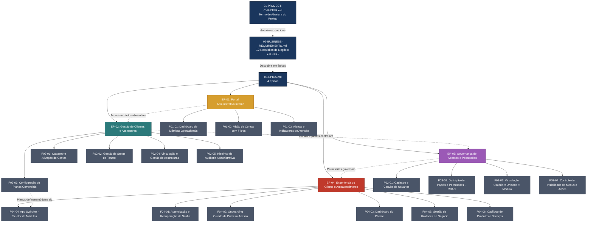

# Índice de Documentos do Projeto

**Projeto:** FBSO Platform — Portal Administrativo SaaS
**Código:** PRJ-FIN-2026-0003-SAAS-FBSO-ORG
**Programa:** FBSO Platform (Projeto independente — fundação para módulos futuros)
**Última Atualização:** 16 de Julho de 2026 — Desenvolvimento ativo: Sprints 1-2 (Setup+Segurança) concluídas, Sprint 3 (M2+M3: Portal Admin + Contas e Planos) em andamento

---

## 1. Estrutura Hierárquica de Documentos

Este projeto segue a cadeia de desdobramento de negócios:

```
[Estratégico] PROJECT-CHARTER  →  [Escopo] REQUIREMENTS  →  [Macro-Escopo] EPICS  →  [Funcional] FEATURES  →  [Execução] USER-STORYS
```

Cada nível referencia explicitamente o nível anterior via marcadores `[INDEX]`, garantindo rastreabilidade completa da diretriz estratégica até o critério de aceite.

---

## 2. Diagrama Visual da Documentação



---

## 3. Índice Completo de Documentos

### 3.1 Nível Estratégico

| Documento | Descrição | Status |
|:---|:---|:---|
| [01-PROJECT-CHARTER-FBSO-PLATFORM.md](./01-PROJECT-CHARTER-FBSO-PLATFORM.md) | Termo de Abertura do Projeto — Versão 1.0 (Visão de Negócios Pura / Alta Gestão). 7 entregas (D1-D7), 7 marcos (M1-M7), 8 stakeholders. | ✅ Aprovado |

### 3.2 Nível de Escopo — Requisitos

| Documento | Descrição | Status |
|:---|:---|:---|
| [02-BUSINESS-REQUIREMENTS.md](./02-BUSINESS-REQUIREMENTS.md) | 10 Requisitos Funcionais de Negócio (BR-A01 a BR-B05) em 2 Blocos + 8 Requisitos Não-Funcionais (BR-NFR01 a BR-NFR08) | ✅ Aprovado |

### 3.3 Nível Macro-Escopo — Épicos

| Documento | Descrição | Épicos | Status |
|:---|:---|:---|:---|
| [03-EPICS.md](./03-EPICS.md) | 4 Épicos: Portal Administrativo, Gestão de Clientes e Assinaturas, Governança de Acessos, Experiência do Cliente e Autoatendimento | EP-01 a EP-04 | ✅ Aprovado |

### 3.4 Nível Funcional — Features

| Documento | Descrição | Features | Status |
|:---|:---|:---|:---|
| [04-FEATURES.md](./04-FEATURES.md) | 18 Features (3 EP-01 + 5 EP-02 + 4 EP-03 + 6 EP-04) com 58 User Stories e Regras de Negócio | ✅ Aprovado |

### 3.5 Nível de Governança e Métricas

| Documento | Descrição | Status |
|:---|:---|:---|
| [MATRIZ-KPI.md](./MATRIZ-KPI.md) | 12 KPIs em 4 dimensões: Adoção e Autonomia (A), Operação e Governança (O), Satisfação e Qualidade (S), Prontidão para o Futuro (P) | ✅ Atualizado |
| [DEFINITION_OF_DONE.md](./DEFINITION_OF_DONE.md) | DoD com 3 níveis: User Story (12 critérios), Feature (5 critérios), Entrega (6 critérios) — visão de negócios | ✅ Atualizado |
| [STAKEHOLDER-MAP.md](./STAKEHOLDER-MAP.md) | Mapa de stakeholders (8 partes interessadas), matriz RACI por entrega (D1-D7), canais de comunicação e escalation path | ✅ Atualizado |
| [GLOSSARY.md](./GLOSSARY.md) | Termos específicos do projeto: conceitos da plataforma, entidades de negócio, módulos, perfis de acesso, fases, métricas | ✅ Atualizado |
| [TECHNICAL-TEAM-MAP.md](./TECHNICAL-TEAM-MAP.md) | Mapa do time técnico: 10-12 vagas ideais em 4 áreas (Desenvolvimento, Qualidade, Transversais, Gestão). Status: ⚠️ TODO — aguardando designação de profissionais | ⚠️ TODO |

### 3.6 Nível Técnico

| Documento | Descrição | Status |
|:---|:---|:---|
| [ARCHITECTURE.md](./ARCHITECTURE.md) | Visão arquitetural da solução: C4 (níveis 1-2), 8 ADRs, fluxo de autenticação, estrutura de pacotes backend/frontend, estratégia Multi-Tenant | ✅ Atualizado |
| [TECHNICAL-PLAN.md](./TECHNICAL-PLAN.md) | Plano técnico: stack definida (Java 25 LTS + Spring Boot, React/Next.js, PostgreSQL, Keycloak), ERD, matriz de artefatos, análise de cenários, riscos técnicos | ✅ Atualizado |
| [API-CONTRACTS.md](./API-CONTRACTS.md) | Contratos de API: 11 recursos REST, schemas de exemplo, matriz RBAC × endpoints, política de versionamento | ✅ Atualizado |
| [INTEGRATION-MAP.md](./INTEGRATION-MAP.md) | Mapa de integrações: 8 integrações (6 Fase 0 + 2 futuras), fluxos de dados, dependências de infraestrutura, Docker Compose | ✅ Atualizado |

### 3.7 Nível de Execução — User Stories

| Documento | Feature | Épico | US | Data-Alvo | Status |
|:---|:---|:---|:---:|:---|:---|
| [05-USER-STORYS-01-1-DASHBOARD-METRICAS-OPERACIONAIS.md](./05-USER-STORYS-01-1-DASHBOARD-METRICAS-OPERACIONAIS.md) | F01-01 — Dashboard de Métricas Operacionais | EP-01 | 3 | 15/08/2026 | ✅ Pronto |
| [05-USER-STORYS-01-2-VISAO-CONTAS-FILTROS.md](./05-USER-STORYS-01-2-VISAO-CONTAS-FILTROS.md) | F01-02 — Visão de Contas com Filtros | EP-01 | 2 | 15/08/2026 | ✅ Pronto |
| [05-USER-STORYS-01-3-ALERTAS-INDICADORES-ATENCAO.md](./05-USER-STORYS-01-3-ALERTAS-INDICADORES-ATENCAO.md) | F01-03 — Alertas e Indicadores de Atenção | EP-01 | 2 | 15/08/2026 | ✅ Pronto |
| [05-USER-STORYS-02-1-CADASTRO-ATIVACAO-CONTAS-CLIENTES.md](./05-USER-STORYS-02-1-CADASTRO-ATIVACAO-CONTAS-CLIENTES.md) | F02-01 — Cadastro e Ativação de Contas | EP-02 | 4 | 31/08/2026 | ✅ Pronto |
| [05-USER-STORYS-02-2-GESTAO-STATUS-TENANT.md](./05-USER-STORYS-02-2-GESTAO-STATUS-TENANT.md) | F02-02 — Gestão de Status do Tenant | EP-02 | 3 | 31/08/2026 | ✅ Pronto |
| [05-USER-STORYS-02-3-CONFIGURACAO-PLANOS-COMERCIAIS.md](./05-USER-STORYS-02-3-CONFIGURACAO-PLANOS-COMERCIAIS.md) | F02-03 — Configuração de Planos Comerciais | EP-02 | 4 | 31/08/2026 | ✅ Pronto |
| [05-USER-STORYS-02-4-VINCULACAO-GESTAO-ASSINATURAS.md](./05-USER-STORYS-02-4-VINCULACAO-GESTAO-ASSINATURAS.md) | F02-04 — Vinculação e Gestão de Assinaturas | EP-02 | 3 | 31/08/2026 | ✅ Pronto |
| [05-USER-STORYS-02-5-HISTORICO-AUDITORIA-ADMINISTRATIVA.md](./05-USER-STORYS-02-5-HISTORICO-AUDITORIA-ADMINISTRATIVA.md) | F02-05 — Histórico de Auditoria | EP-02 | 2 | 31/08/2026 | ✅ Pronto |
| [05-USER-STORYS-03-1-CADASTRO-CONVITE-USUARIOS.md](./05-USER-STORYS-03-1-CADASTRO-CONVITE-USUARIOS.md) | F03-01 — Cadastro e Convite de Usuários | EP-03 | 3 | 15/09/2026 | ✅ Pronto |
| [05-USER-STORYS-03-2-DEFINICAO-PAPEIS-PERMISSOES-RBAC.md](./05-USER-STORYS-03-2-DEFINICAO-PAPEIS-PERMISSOES-RBAC.md) | F03-02 — Definição de Papéis e Permissões (RBAC) | EP-03 | 4 | 15/09/2026 | ✅ Pronto |
| [05-USER-STORYS-03-3-VINCULACAO-USUARIO-UNIDADE-MODULO.md](./05-USER-STORYS-03-3-VINCULACAO-USUARIO-UNIDADE-MODULO.md) | F03-03 — Vinculação Usuário × Unidade × Módulo | EP-03 | 3 | 15/09/2026 | ✅ Pronto |
| [05-USER-STORYS-03-4-CONTROLE-VISIBILIDADE-MENUS-ACOES.md](./05-USER-STORYS-03-4-CONTROLE-VISIBILIDADE-MENUS-ACOES.md) | F03-04 — Controle de Visibilidade de Menus e Ações | EP-03 | 3 | 15/09/2026 | ✅ Pronto |
| [05-USER-STORYS-04-1-AUTENTICACAO-RECUPERACAO-SENHA.md](./05-USER-STORYS-04-1-AUTENTICACAO-RECUPERACAO-SENHA.md) | F04-01 — Autenticação e Recuperação de Senha | EP-04 | 3 | 30/09/2026 | ✅ Pronto |
| [05-USER-STORYS-04-2-ONBOARDING-GUIADO-PRIMEIRO-ACESSO.md](./05-USER-STORYS-04-2-ONBOARDING-GUIADO-PRIMEIRO-ACESSO.md) | F04-02 — Onboarding Guiado de Primeiro Acesso | EP-04 | 5 | 30/09/2026 | ✅ Pronto |
| [05-USER-STORYS-04-3-DASHBOARD-CLIENTE.md](./05-USER-STORYS-04-3-DASHBOARD-CLIENTE.md) | F04-03 — Dashboard do Cliente | EP-04 | 2 | 30/09/2026 | ✅ Pronto |
| [05-USER-STORYS-04-4-APP-SWITCHER-SELETOR-MODULOS.md](./05-USER-STORYS-04-4-APP-SWITCHER-SELETOR-MODULOS.md) | F04-04 — App Switcher (Seletor de Módulos) | EP-04 | 3 | 30/09/2026 | ✅ Pronto |
| [05-USER-STORYS-04-5-GESTAO-UNIDADES-NEGOCIO.md](./05-USER-STORYS-04-5-GESTAO-UNIDADES-NEGOCIO.md) | F04-05 — Gestão de Unidades de Negócio | EP-04 | 5 | 15/10/2026 | ✅ Pronto |
| [05-USER-STORYS-04-6-CATALOGO-PRODUTOS-SERVICOS.md](./05-USER-STORYS-04-6-CATALOGO-PRODUTOS-SERVICOS.md) | F04-06 — Catálogo de Produtos e Serviços | EP-04 | 4 | 15/10/2026 | ✅ Pronto |

---

## 4. Estatísticas do Projeto

| Métrica | Valor |
|:---|:---|
| **Entregas (Deliveries)** | 7 (D1 a D7) |
| **Marcos (Milestones)** | 7 (M1 a M7, de 24/07 a 30/10/2026) |
| **Duração Total** | 14 semanas (~3,5 meses) |
| **Épicos** | 4 (EP-01 a EP-04) |
| **Features** | 18 (3 + 5 + 4 + 6) |
| **User Stories** | 58 |
| **Requisitos de Negócio (BR)** | 10 funcionais (Bloco A: 5 + Bloco B: 5) + 8 não-funcionais |
| **KPIs** | 12 (3 Adoção + 4 Operação + 3 Satisfação + 2 Prontidão) |
| **Regras de Negócio (RN)** | 18 (RN01-01 a RN04-06, distribuídas nas 18 Features — cada Feature define suas próprias RNs) |
| **Perfis de Usuário** | 4 (Admin do Tenant, Gerente de Unidade, Operador de Unidade, Auditor) |
| **Stakeholders Mapeados** | 8 (Diretoria, Coordenador, PO, Analista de Negócios, Líder Comercial, Líder Admin, Time de Vendas, Early Adopters) |
| **Vagas Técnicas Ideais** | 10-12 (3 Dev + 2-4 Qualidade + 2 Transversais + 3 Gestão) |
| **Priorização** | 16 Must Have + 2 Should Have |

---

## 5. Mapa Rápido: Épico → Entrega → Features → Marcos

| Épico | Entrega | Marco | Data | Features |
|:---|:---|:---|:---|:---|
| EP-01 — Portal Administrativo Interno | D1 | M2 | 15/08/2026 | F01-01, F01-02, F01-03 |
| EP-02 — Gestão de Clientes e Assinaturas | D2, D3 | M3 | 31/08/2026 | F02-01 a F02-05 |
| EP-03 — Governança de Acessos e Permissões | D4 | M4 | 15/09/2026 | F03-01 a F03-04 |
| EP-04a — Portal do Cliente e Onboarding | D5 | M5 | 30/09/2026 | F04-01 a F04-04 |
| EP-04b — Unidades de Negócio e Catálogo | D6, D7 | M6 | 15/10/2026 | F04-05, F04-06 |
| Aceite Final | D1-D7 | M7 | 30/10/2026 | Todas (18) |

---

## 6. Convenções do Projeto

- **Rastreabilidade:** Todo documento referencia seu antecessor hierárquico via marcador `[INDEX]`
- **Cadeia de desdobramento:** Project Charter → Business Requirements → Epics → Features → User Stories
- **Visão de Negócios:** Toda documentação deste projeto é redigida em linguagem de negócios, com foco em valor entregue ao time administrativo da FBSO.ORG e aos clientes do portal. Zero citações técnicas nos documentos de negócio (01 a 04). Exceto neste índice de navegação (README.md), que referencia documentos técnicos para rastreabilidade completa.
- **Nomenclatura de Arquivos:** Segue o padrão numérico (01-, 02-, 03-, 04-) para documentos da cadeia principal e nomes descritivos em MAIÚSCULO para documentos de governança (DEFINITION_OF_DONE, GLOSSARY, MATRIZ-KPI, STAKEHOLDER-MAP, TECHNICAL-TEAM-MAP)
- **Status de Documentos:** "Aprovado" indica que o PO e stakeholders validaram o conteúdo de negócio. "TODO" indica documento criado com estrutura completa mas aguardando preenchimento.
- **MoSCoW:** Must Have (16 features), Should Have (2 features: F01-03 — Alertas e Indicadores de Atenção, F04-06 — Catálogo de Produtos e Serviços), Could Have (0), Won't Have nesta fase (módulos Tributali-Engine e Storekeeper Portal)
- **Entregas:** 7 entregas lógicas (D1 a D7) distribuídas em 6 marcos de release (M2 a M7). D2 e D3 compartilham o mesmo marco (M3) por formarem juntas o ciclo de Gestão de Clientes e Assinaturas.
- **Datas:** Cronograma de 14 semanas com cadência quinzenal. Datas-alvo representam o fim do ciclo de entrega. Homologação ocorre no dia útil mais próximo.
- **Fase 0:** Este projeto é a Fase 0 do programa FBSO Platform — entrega a fundação administrativa (Core) sobre a qual os módulos-produto serão acoplados em fases futuras.

---

## 7. Produtos Futuros (Fora do Escopo)

| Produto | Descrição | Status |
|:---|:---|:---|
| **Tributali-Engine** | Módulo de gestão tributária — cálculos de IBS/CBS, Split Payment, automação fiscal da Reforma Tributária | Futuro (pós-Core) |
| **Storekeeper Portal** | Módulo de varejo — PDV (frente de caixa), controle de estoque, gestão comercial para lojistas e supermercados | Futuro (pós-Core) |

> **Nota:** Este README e todos os documentos do projeto são mantidos pelo Time de Negócios. Alterações na estrutura de documentos ou no cronograma devem ser refletidas neste índice.

------------------------------

---
🤖 *Documentação gerada de forma automatizada pelo Agente: Analista de Negócios/Claude. Foram utilizados os skills: agile-ba-practices, domain-modeling.*
🔍 *Revisado pelo skill caveman-review em 15/07/2026. Ajustes aplicados: ressalva de citações técnicas, seção 3.6 Nível Técnico, esclarecimento de entregas/marcos, features Should Have explicitadas.*
