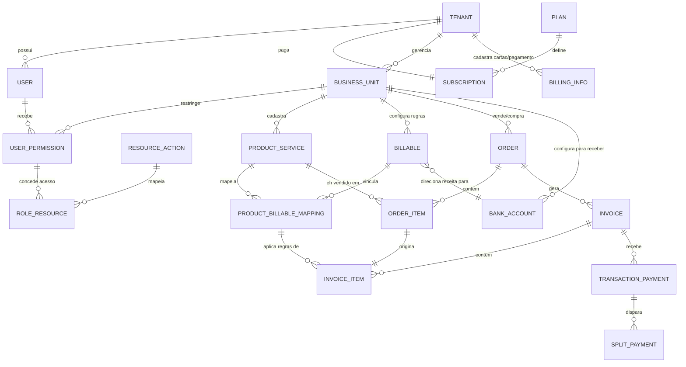

# PLANO TÉCNICO — Análise de Organização das Demandas Técnicas

- **Projeto:** PRJ-FIN-2026-0003-SAAS-FBSO-ORG
- **Programa:** FBSO Platform — Portal Administrativo SaaS (Fase 0 — Core)
- **Data da Análise:** 13 de Julho de 2026
- **Analistas:** Time Técnico FBSO.ORG
- **Status:** Proposta Inicial — Stack definida pelo time técnico. Norteará os próximos passos de planejamento fino.
- **Versão:** 1.1
- **Última Atualização:** 13 de Julho de 2026 (incorporação do modelo ERD e dicionário de entidades do IDEIAS.md)

---

## 1. Contexto da Análise

O projeto PRJ-FIN-2026-0003 tem como objetivo central **construir o Portal Administrativo (Core) da FBSO Platform** — a fundação do futuro SaaS multi-produto. Para viabilizar tecnicamente essa entrega, a stack tecnológica foi definida pelo time técnico conforme detalhado abaixo.

### 1.1 Escopo Técnico do Projeto

O Core da FBSO Platform é composto por **duas frentes de desenvolvimento** principais:

| Frente | Descrição | Escopo de Negócio |
|:---|:---|:---|
| **Backend** | Aplicação Monolítica Modular de administração do SaaS (package-by-layer) | EP-01 (Portal Admin), EP-02 (Clientes e Assinaturas), EP-03 (RBAC), EP-04 (Portal do Cliente) |
| **Frontend** | Portal web (admin interno + portal do cliente) | Interfaces de todos os 4 épicos, App Switcher, Onboarding |

### 1.2 Referência aos Documentos de Negócio

| Documento | Conteúdo relevante para o time técnico |
|:---|:---|
| [01-PROJECT-CHARTER](./01-PROJECT-CHARTER-FBSO-PLATFORM.md) | Escopo, entregas D1-D7, marcos M1-M7, premissas e restrições |
| [02-BUSINESS-REQUIREMENTS](./02-BUSINESS-REQUIREMENTS.md) | 10 BRs funcionais, 8 NFRs (disponibilidade, segurança, auditabilidade, etc.) |
| [03-EPICS](./03-EPICS.md) | 4 épicos com jornadas de usuário e requisitos de negócio |
| [04-FEATURES](./04-FEATURES.md) | 18 features, 58 user stories, 18 regras de negócio (RN01-01 a RN18-04) |
| [05-USER-STORYS-*.md](./) | 18 arquivos de user stories com critérios de aceitação detalhados |
| [MATRIZ-KPI](./MATRIZ-KPI.md) | 12 KPIs em 4 dimensões |
| [DEFINITION_OF_DONE](./DEFINITION_OF_DONE.md) | DoD de User Story (12 critérios), Feature (5), Entrega (6) |

---

## 2. Stack Tecnológica Definida

### 2.1 Visão Geral da Stack

```
┌─────────────────────────────────────────────────────────┐
│                    FBSO PLATFORM                        │
├─────────────────────────────────────────────────────────┤
│  Frontend: React + Next.js + Tailwind CSS               │
│  Backend:  Java 25 LTS + Spring Boot (Monolítico Modular) │
│  Banco:    PostgreSQL                                   │
│  IdP:      Keycloak (Docker) — SAML 2.0 + JWT          │
│  Mensageria (futuro): RabbitMQ                          │
│  Infra:    Docker + Kubernetes                          │
└─────────────────────────────────────────────────────────┘
```

### 2.2 Detalhamento da Stack

#### 2.2.1 Banco de Dados — PostgreSQL

- **Motor:** PostgreSQL (versão mais recente estável)
- **Modelo de isolamento:** Multi-Tenant com Isolamento Lógico — banco de dados único compartilhado, com coluna `tenant_id` em todas as tabelas operacionais e filtro obrigatório em todas as consultas
- **Política de deleção:** Soft Delete — registros não são removidos fisicamente. Campo `deleted_dt` marca a exclusão lógica. Índices únicos compostos com `WHERE deleted_dt IS NULL` para preservar unicidade entre registros ativos
- **Auditoria:** Campos de auditoria padrão em todas as tabelas: `created_dt`, `updated_dt`, `created_by`, `updated_by`, `deleted_dt`, `deleted_by`

#### 2.2.2 Backend & Microserviços — Java 25 + Spring Boot

- **Linguagem:** Java 25 LTS — Oracle GraalVM 25.0.3+9.1 (build 25.0.3+9-LTS-jvmci-b01)
- **Framework:** Spring Boot (versão compatível com Java 25 LTS)
- **Arquitetura:** Aplicação Monolítica Modular REST (package-by-layer) com princípios de isolamento Multi-Tenant. Banco único compartilhado com isolamento lógico via `tenant_id`
- **Autenticação/Autorização:** Integração com Keycloak via SAML 2.0 para autenticação; autorização baseada em roles e permissões via JWT (RBAC)
- **Build:** Maven (preferencial) ou Gradle
- **Containerização:** Docker com Oracle GraalVM Native Image para inicialização rápida e baixo consumo de memória. AOT compilation exige metadata de reflection — compilar e testar o native image desde o primeiro sprint para identificar restrições cedo
- **Escopo de API:** CRUD completo para Tenants, Plans, Subscriptions, Users, Permissions, Business Units, Product/Services Catalog

#### 2.2.3 Frontend — React + Next.js + Tailwind CSS

- **Framework:** React com Next.js (App Router ou Pages Router)
- **Estilização:** Tailwind CSS para design system utilitário
- **Personalização por Tenant:** A escolha do Tailwind CSS + Next.js viabiliza a customização visual por tenant no futuro — temas, ícones, logo do tenant e ajustes de identidade visual aplicados dinamicamente
- **Componentes-chave:**
  - App Switcher (seletor de módulos no topo)
  - Menu lateral dinâmico (renderizado conforme permissões + módulo ativo)
  - Onboarding wizard (4 passos)
  - Dashboard administrativo (métricas e gráficos)
  - Gestão de tenants, planos, usuários, permissões
  - Portal do cliente (dashboard, catálogo, unidades de negócio)
- **Consumo de API:** Comunicação com backend REST via fetch/axios, com tipagem gerada a partir do contrato OpenAPI
- **Mock para desenvolvimento:** MSW (Mock Service Worker) baseado no OpenAPI YAML para desenvolvimento independente do backend

#### 2.2.4 Infraestrutura & Integrações Core

##### Provedor de Identidade (IdP) — Keycloak

- **Containerização:** Keycloak rodando em container Docker
- **Protocolos:** SAML 2.0 (para clientes corporativos com SSO) + OAuth 2.0 / OpenID Connect (OIDC)
- **Função:** Gerencia fluxos de login SAML dos clientes e gera tokens JWT contendo as roles e permissões do usuário
- **Integração Backend:** O backend valida o JWT a cada requisição, extrai `tenant_id`, `business_unit_ids`, `roles` e aplica os filtros de isolamento
- **Integração Frontend:** Frontend redireciona para tela de login do Keycloak; após autenticação, recebe o token e o envia em todas as requisições ao backend

##### Mensageria (Futuro/Escalabilidade) — RabbitMQ

- **Status:** Fora do escopo da Fase 0. Será incorporado quando o processamento de faturamento e split de pagamentos (módulo Tributali-Engine) exigir processamento assíncrono e resiliente a falhas
- **Casos de uso futuros:** Processamento de faturas em lote, split de pagamentos, notificações de eventos do sistema, integração com gateways de pagamento

##### Hospedagem & DevOps — Docker + Kubernetes (K8s)

- **Containerização:** Todos os componentes (backend, frontend, Keycloak) em containers Docker
- **Orquestração:** Kubernetes para gerenciamento de containers, escalabilidade, rolling updates e health checks
- **Ambientes previstos:** Desenvolvimento local (Docker Compose), Staging (K8s), Produção (K8s)

### 2.3 Decisões Arquiteturais (ADRs Implícitos)

| # | Decisão | Justificativa |
|:---|:---|:---|
| **ADR-01** | PostgreSQL com isolamento lógico (Shared Database) | Time reduzido — um banco único simplifica operação e reduz custos de infraestrutura. Isolamento garantido por filtro `tenant_id` obrigatório em todas as queries |
| **ADR-02** | Java 25 LTS + Spring Boot para backend | Stack corporativa consolidada. Spring Boot oferece ecossistema maduro para CRUD, segurança, validação e integração com PostgreSQL e Keycloak |
| **ADR-03** | React + Next.js + Tailwind para frontend | Next.js provê SSR/SSG quando necessário. Tailwind viabiliza temas dinâmicos por tenant no futuro (customização de logo, cores, ícones) |
| **ADR-04** | Keycloak como IdP (SAML + JWT) | Solução enterprise-ready desde o dia 1. Isola complexidade de autenticação do código da aplicação. Prepara para SSO corporativo (Azure AD, Okta, Google Workspace) |
| **ADR-05** | Soft Delete em todas as tabelas | Requisito de auditoria fiscal — dados nunca são removidos fisicamente. Índices únicos compostos garantem unicidade apenas entre ativos |
| **ADR-06** | RabbitMQ postergado para fase futura | A Fase 0 (Core administrativo) não tem requisitos de processamento assíncrono. RabbitMQ será incorporado junto com o Tributali-Engine |
| **ADR-07** | JWT Stateless (sem sessão no servidor) | Cada requisição carrega o token JWT com todas as claims necessárias (tenant_id, roles, modules). Backend não mantém estado de sessão |
| **ADR-08** | Docker + Kubernetes para todos os ambientes | Consistência entre dev, staging e produção. K8s provê health checks, rolling updates, auto-scaling |

> **Nota:** A lista canônica e detalhada dos ADRs (com justificativas completas e impactos) está em [ARCHITECTURE.md](./ARCHITECTURE.md) §4.

### 2.4 Modelo de Dados de Referência (ERD)

O diagrama abaixo — extraído do esboço de arquitetura do produto (IDEIAS.md) — apresenta a visão completa das entidades planejadas para a FBSO Platform. As entidades na **parte superior** do diagrama (até PRODUCT_SERVICE) estão no escopo deste projeto (Core Administrativo). As demais pertencem a fases futuras.

#### 2.4.1 Diagrama de Entidades e Relacionamentos



#### 2.4.2 Dicionário de Entidades — Fase 0 (Core Administrativo)

Entidades que **DEVEM** ser implementadas neste projeto:

##### Camada Administrativa (SaaS Core)

| Entidade | Descrição | Campos Essenciais |
|:---|:---|:---|
| **TENANT** | Conta Master / Pagadora do cliente | `id` (PK), `name_corporate` (Razão Social), `name_fantasy` (Nome Fantasia), `segment` (Segmento de Mercado), `status` (Enum: PENDING_ONBOARDING, ACTIVE, SUSPENDED, INACTIVE) |
| **USER** | Usuários do ecossistema | `id` (PK), `tenant_id` (FK), `external_keycloak_id` (UUID do Keycloak), `email`, `name`, `status` (ACTIVE, INACTIVE, INVITE_PENDING) |
| **PLAN** | Plano comercial do SaaS | `id` (PK), `name`, `description`, `price`, `recurrence` (MONTHLY, QUARTERLY, YEARLY), `status` (ACTIVE, DISCONTINUED) |
| **SUBSCRIPTION** | Assinatura de um Tenant a um Plano | `id` (PK), `tenant_id` (FK), `plan_id` (FK), `start_date`, `end_date` (nullable), `status` (ACTIVE, SUSPENDED, CANCELED) |
| **PLAN_MODULE** | Módulos incluídos em cada plano | `id` (PK), `plan_id` (FK), `module_name` (ex: TRIBUTALI_ENGINE, STOREKEEPER_PORTAL) |

##### Camada de Isolamento Operacional (Governança)

| Entidade | Descrição | Campos Essenciais |
|:---|:---|:---|
| **BUSINESS_UNIT** | CNPJs / Filiais vinculadas a um Tenant | `id` (PK), `tenant_id` (FK), `parent_id` (FK auto-relacionamento Matriz/Filial), `cnpj` (Único entre ativos), `corporate_name`, `tax_regime` (SIMPLES_NACIONAL, LUCRO_REAL, LUCRO_PRESUMIDO), `address`, `status` (ACTIVE, INACTIVE) |
| **USER_PERMISSION** | Tabela Ponte de Segurança — vincula usuário a unidades | `id` (PK), `user_id` (FK), `business_unit_id` (FK), `role` (Enum: ADMIN_TENANT, MANAGER_BU, OPERATOR_BU, AUDITOR) |
| **RESOURCE_ACTION** | Telas e ações do portal | `id` (PK), `resource_name` (ex: dashboard, product_catalog, user_management), `action` (view, create, edit, delete) |
| **ROLE_RESOURCE** | Tabela ponte — papel × recursos permitidos | `id` (PK), `role` (Enum), `resource_action_id` (FK) |

##### Camada de Catálogo

| Entidade | Descrição | Campos Essenciais |
|:---|:---|:---|
| **PRODUCT_SERVICE** | Catálogo Comercial da Unidade de Negócio | `id` (PK), `business_unit_id` (FK), `name`, `sku` (opcional, único por BU), `type` (PRODUCT, SERVICE), `description`, `status` (ACTIVE, INACTIVE) |

##### Campos de Auditoria (TODAS as tabelas)

| Campo | Tipo | Descrição |
|:---|:---|:---|
| `created_dt` | Timestamp | Data/hora de criação do registro |
| `updated_dt` | Timestamp | Data/hora da última atualização |
| `created_by` | FK → USER.id | Usuário que criou o registro |
| `updated_by` | FK → USER.id | Usuário que atualizou o registro |
| `deleted_dt` | Timestamp (nullable) | Data/hora da exclusão lógica (NULL = ativo) |
| `deleted_by` | FK → USER.id | Usuário que realizou a exclusão lógica |

#### 2.4.3 Entidades Fora do Escopo (Fases Futuras)

Estas entidades **NÃO** devem ser implementadas na Fase 0. Documentadas como referência para garantir que o schema do Core não impeça sua adição futura.

| Entidade | Descrição | Fase Prevista |
|:---|:---|:---|
| **BILLABLE** | Engine Fiscal — regras de tributação (NCM, NBS, CNAE, alíquotas IBS/CBS) | Tributali-Engine |
| **PRODUCT_BILLABLE_MAPPING** | De-Para: Produto × Regra Fiscal | Tributali-Engine |
| **ORDER / ORDER_ITEM** | Pedidos comerciais (Quote → Sale Order) | Storekeeper / Tributali-Engine |
| **INVOICE / INVOICE_ITEM** | Documentos de cobrança | Storekeeper / Tributali-Engine |
| **TRANSACTION_PAYMENT** | Entrada de pagamentos (gateway ou input manual) | Storekeeper / Tributali-Engine |
| **SPLIT_PAYMENT** | Split de arrecadação (IBS/CBS para o governo) | Tributali-Engine |
| **BILLING_INFO** | Dados de cartão/pagamento do Tenant | Storekeeper |
| **BANK_ACCOUNT** | Contas bancárias por Unidade de Negócio | Storekeeper / Tributali-Engine |

#### 2.4.4 Índices Únicos e Soft Delete

Conforme ADR-05, utiliza-se **Índice Único Parcial** (PostgreSQL) para entidades com restrições de unicidade sob Soft Delete:

```sql
-- CNPJ único apenas entre registros ativos do mesmo tenant
CREATE UNIQUE INDEX unique_cnpj_active
ON business_unit (tenant_id, cnpj)
WHERE deleted_dt IS NULL;

-- E-mail único por tenant apenas entre ativos
CREATE UNIQUE INDEX unique_email_active
ON "user" (tenant_id, email)
WHERE deleted_dt IS NULL;

-- SKU único por Unidade de Negócio apenas entre ativos
CREATE UNIQUE INDEX unique_sku_active
ON product_service (business_unit_id, sku)
WHERE deleted_dt IS NULL AND sku IS NOT NULL;
```

#### 2.4.5 Mapeamento Entidade → Endpoint API

| Entidade | Recurso API | Épico |
|:---|:---|:---|
| TENANT | `/tenants` | EP-02 |
| PLAN | `/plans` | EP-02 |
| SUBSCRIPTION | `/subscriptions` | EP-02 |
| PLAN_MODULE | (sub-recurso de `/plans`) | EP-02 |
| USER | `/users` | EP-03 |
| USER_PERMISSION | `/permissions` | EP-03 |
| RESOURCE_ACTION | (tabela de domínio — populada via migration, sem CRUD externo) | EP-03 |
| ROLE_RESOURCE | (tabela de domínio — populada via migration, sem CRUD externo) | EP-03 |
| BUSINESS_UNIT | `/business-units` | EP-04 |
| PRODUCT_SERVICE | `/products` | EP-04 |

---

## 3. Análise das Possibilidades de Organização dos Trabalhos

### 3.1 Cenários de Organização

#### Cenário A — Sequencial Puro (NÃO RECOMENDADO)

```
Backend completo → Frontend completo
```

**Vantagem:** Sem risco de contrato de API — frontend só começa quando backend está pronto.
**Desvantagem:** Tempo total é a soma dos dois. Time reduzido agravado pelo sequenciamento.

#### Cenário B — Backend-First com Frontend em Onda

```
Backend EP-01 → Frontend EP-01 (em paralelo: Backend EP-02 → Frontend EP-02) ...
```

**Vantagem:** Frontend inicia mais cedo, cada módulo é entregue completo.
**Desvantagem:** Complexo de coordenar com time reduzido. Requer APIs de cada épico estáveis antes do frontend daquele épico.

#### Cenário C — API Contract First + Paralelo (RECOMENDADO)

```
Fase 0: API Contract + Scaffolds + Setup Infra
Fase 1: Desenvolvimento Paralelo Backend + Frontend (com MSW Mock)
Fase 2: Integração e Homologação
Fase 3: Go-Live

        ┌────────────────────────────────────────────────┐
        │  FASE 0: Fundação                               │
        │  Contrato OpenAPI, Scaffolds Backend/Frontend,  │
        │  Setup Keycloak, DB Schema, Docker/K8s base     │
        └────────────────────────────────────────────────┘
                │
                ▼
        ┌────────────────────────────────────────────────┐
        │  FASE 1: Desenvolvimento Paralelo               │
        │  Backend: Java 25/Spring ◄──MSW Mock──►        │
        │  Frontend: React/Next.js/Tailwind               │
        └────────────────────────────────────────────────┘
                │
                ▼
        ┌────────────────────────────────────────────────┐
        │  FASE 2: Integração e Homologação               │
        │  Integração frontend ↔ backend real,            │
        │  Testes E2E, UAT com early adopters            │
        └────────────────────────────────────────────────┘
                │
                ▼
        ┌────────────────────────────────────────────────┐
        │  FASE 3: Estabilização e Go-Live                │
        │  Regressão, Aceitação, Deploy Produção          │
        └────────────────────────────────────────────────┘
```

**Vantagens:**
- Backend e Frontend avançam em paralelo com contrato de API como "fonte da verdade"
- Frontend usa MSW mock para desenvolvimento independente desde o início
- Tempo total reduzido em relação ao sequencial puro
**Desvantagens:**
- Se o contrato de API mudar, ambos os times precisam se realinhar
- Time reduzido: mesmas pessoas podem precisar atuar em ambas as frentes

### 3.2 Recomendação

**Recomenda-se o Cenário C** (API Contract First + Paralelo) pelos seguintes motivos:

1. Melhor aproveitamento do time reduzido — trabalho pode ser distribuído entre backend e frontend sem espera
2. Contrato de API como artefato inicial resolve o principal ponto de acoplamento
3. MSW mock permite que o frontend seja desenvolvido e testado sem depender do backend estar pronto
4. Adequado à stack definida (Java/Spring + React/Next.js)

> ⚠️ **Ressalva para time reduzido:** Se o time for pequeno demais para paralelismo real (ex: 1-2 pessoas), adotar uma variação do Cenário A com ciclos curtos (1 feature por vez, backend + frontend juntos) pode ser mais produtivo que o custo de coordenação do paralelismo.

---

## 4. Definição de Artefatos por Solução Técnica

### 4.1 Matriz de Artefatos

| Artefato | Projeto de Negócio (PRJ-FIN-2026-0003) | Backend Java/Spring | Frontend React/Next.js |
|:---|:---|:---|:---|
| **PROJECT-CHARTER** | ✅ (já existe) | — | — |
| **BUSINESS-REQUIREMENTS** | ✅ (já existe) | — | — |
| **EPICS** | ✅ (já existe) | — | — |
| **FEATURES** | ✅ (já existe) | — | — |
| **USER-STORYS** | ✅ (18 arquivos) | — | — |
| **PLANO-TECNICO.md** | ✅ (este documento) | — | — |
| **API-CONTRACTS.md** | ✅ (nível projeto — a criar) | 🔗 referencia | 🔗 referencia |
| **INTEGRATION-MAP.md** | ✅ (nível projeto — a criar) | 🔗 referencia | 🔗 referencia |
| **SPECS.md** | — | ✅ `.specs/` | ✅ `.specs/` |
| **TASKS.md** | — | ✅ `.specs/` | ✅ `.specs/` |
| **TEST_PLAN.md** | — | ✅ `.specs/` | ✅ `.specs/` |
| **ARCHITECTURE.md** | — | ✅ `.specs/` | ✅ `.specs/` |
| **OpenAPI YAML** | — | ✅ fonte canônica | 🔗 cópia para geração de tipos |
| **ENVIRONMENTS.md** | — | ✅ `.specs/governance/` | ✅ `.specs/governance/` |

### 4.2 Localização dos Artefatos

- **Documentos de negócio:** `business-inputs/business-projects/PRJ-FIN-2026-0003-SAAS-FBSO-ORG/`
- **Especificações técnicas do backend:** `.specs/` no diretório do microserviço Java
- **Especificações técnicas do frontend:** `.specs/` no diretório do projeto React/Next.js
- **Contratos e integrações (nível projeto):** `business-inputs/business-projects/PRJ-FIN-2026-0003-SAAS-FBSO-ORG/`

### 4.3 Árvore de Diretórios Esperada (Alvo)

```
workspace-fbso/
│
├── business-inputs/business-projects/
│   └── PRJ-FIN-2026-0003-SAAS-FBSO-ORG/
│       ├── README.md                         ← Índice geral
│       ├── 01-PROJECT-CHARTER-*.md           ← Já existe
│       ├── 02-BUSINESS-REQUIREMENTS.md       ← Já existe
│       ├── 03-EPICS.md                       ← Já existe
│       ├── 04-FEATURES.md                    ← Já existe
│       ├── 05-USER-STORYS-*.md               ← 18 arquivos
│       ├── DEFINITION_OF_DONE.md             ← Já existe
│       ├── GLOSSARY.md                       ← Já existe
│       ├── MATRIZ-KPI.md                     ← Já existe
│       ├── STAKEHOLDER-MAP.md                ← Já existe
│       ├── TECHNICAL-TEAM-MAP.md             ← Já existe
│       ├── PLANO-TECNICO.md                  ← ESTE DOCUMENTO
│       ├── API-CONTRACTS.md                  ← A CRIAR
│       └── INTEGRATION-MAP.md                ← A CRIAR
│
├── backend/java/spring/microservices/
│   └── ms-fbso-platform-admin/               ← Backend: A CRIAR
│       ├── pom.xml
│       ├── Dockerfile
│       ├── src/main/java/...
│       ├── src/main/resources/
│       │   └── application.yml
│       ├── src/test/java/...
│       └── .specs/
│           ├── api/
│           │   └── fbso-platform-api.yaml    ← OpenAPI (fonte canônica)
│           ├── architecture/
│           ├── domain/
│           ├── engineering/
│           ├── governance/
│           └── business-projects/
│               └── PRJ-FIN-2026-0003-.../
│                   ├── SPECS.md
│                   ├── TASKS.md
│                   ├── TEST_PLAN.md
│                   └── ARCHITECTURE.md
│
├── frontend/javascript/react/web_apps/
│   └── web_app-fbso-platform-portal/         ← Frontend: A CRIAR
│       ├── package.json
│       ├── next.config.js
│       ├── tailwind.config.js
│       ├── src/...
│       └── .specs/
│           ├── api/
│           │   └── fbso-platform-api.yaml    ← Cópia do contrato
│           ├── architecture/
│           ├── design/
│           ├── engineering/
│           ├── governance/
│           └── business-projects/
│               └── PRJ-FIN-2026-0003-.../
│                   ├── SPECS.md
│                   ├── TASKS.md
│                   ├── TEST_PLAN.md
│                   └── ARCHITECTURE.md
│
└── infra/
    ├── docker/
    │   ├── docker-compose.yml                ← Dev local (backend + frontend + DB + Keycloak)
    │   └── keycloak/
    │       └── realm-config.json             ← Configuração do realm FBSO Platform
    └── k8s/
        ├── namespace.yaml
        ├── backend-deployment.yaml
        ├── frontend-deployment.yaml
        ├── keycloak-deployment.yaml
        └── postgres-statefulset.yaml
```

---

## 5. Contratos e Integrações

### 5.1 API-CONTRACTS.md (A CRIAR)

**Localização:** `business-inputs/business-projects/PRJ-FIN-2026-0003-SAAS-FBSO-ORG/API-CONTRACTS.md`

**Conteúdo esperado:**
- Visão geral dos endpoints REST (recursos, métodos, paths)
- Modelos de request/response (schemas)
- Regras de autenticação/autorização por endpoint (RBAC)
- Estratégia de versionamento de API
- Política de erros e códigos HTTP
- Exemplos de fluxos de consumo (frontend → backend)
- Mapeamento de roles por endpoint conforme RN10-01 do FEATURES.md

### 5.2 INTEGRATION-MAP.md (A CRIAR)

**Localização:** `business-inputs/business-projects/PRJ-FIN-2026-0003-SAAS-FBSO-ORG/INTEGRATION-MAP.md`

**Conteúdo esperado:**
- Diagrama de comunicação entre todos os componentes do sistema
- Fluxo de autenticação: Frontend → Keycloak → JWT → Backend → PostgreSQL
- Isolamento Multi-Tenant: como o `tenant_id` flui do JWT até a consulta SQL
- Relacionamento entre entidades (Tenant, BusinessUnit, User, Permission, Plan, Subscription)
- Dependências externas (Keycloak, PostgreSQL, RabbitMQ futuro)

### 5.3 OpenAPI YAML (A CRIAR)

**Localização primária (fonte da verdade):** `.specs/api/fbso-platform-api.yaml` no backend
**Localização secundária (cópia de consumo):** `.specs/api/fbso-platform-api.yaml` no frontend

**Escopo de endpoints (baseado nos 4 épicos):**

| Recurso | Operações | Épico |
|:---|:---|:---|
| `/tenants` | CRUD + ativar/suspender/reativar | EP-02 |
| `/plans` | CRUD + desativar | EP-02 |
| `/subscriptions` | Criar, alterar (upgrade/downgrade), suspender | EP-02 |
| `/users` | CRUD + convite + desativar | EP-03 |
| `/permissions` | Atribuir/revogar papéis, vincular unidades e módulos | EP-03 |
| `/business-units` | CRUD + hierarquia matriz/filial + desativar | EP-04 |
| `/products` | CRUD + ativar/desativar (catálogo) | EP-04 |
| `/dashboard/admin` | Métricas operacionais (leitura) | EP-01 |
| `/dashboard/client` | Dashboard do cliente (leitura) | EP-04 |
| `/onboarding` | Fluxo de primeiro acesso | EP-04 |
| `/audit` | Histórico de auditoria (leitura) | EP-02 |

---

## 6. Governança dos Artefatos

### 6.1 Fluxo de Atualização

```
Mudança de requisito de negócio
        │
        ▼
[Projeto] FEATURES.md / USER-STORYS atualizado (PO + Analista de Negócios)
        │
        ▼
[Projeto] API-CONTRACTS.md atualizado (Arquiteto + Tech Lead)
        │
        ▼
[Backend] OpenAPI YAML atualizado
        │
        ├──► [Backend] Código Java/Spring implementa
        │
        └──► [Frontend] OpenAPI copiado → Tipos TypeScript regenerados → Código React atualizado
```

### 6.2 Responsáveis por Artefato

| Artefato | Responsável Primário | Revisor | Aprovador |
|:---|:---|:---|:---|
| PLANO-TECNICO.md | Time Técnico | Coordenador do Projeto | Diretoria FBSO.ORG |
| API-CONTRACTS.md | Tech Lead Backend + Tech Lead Frontend | PO | Coordenador do Projeto |
| INTEGRATION-MAP.md | Arquiteto / Tech Lead | Time Técnico | — |
| SPECS.md (por solução) | Tech Lead da solução | PO | — |
| TASKS.md (por solução) | Tech Lead da solução | PM | — |
| TEST_PLAN.md | QA + Tech Lead | PO | — |
| OpenAPI YAML | Tech Lead Backend | Tech Lead Frontend | PO |

---

## 7. Marcos e Sequenciamento Técnico

### 7.1 Fase 0 — Fundação e Setup (Pré-Kickoff → M1)

| Atividade | Entregável |
|:---|:---|
| Aprovação do PLANO-TECNICO.md | Stack validada por todos os stakeholders |
| Criação do API-CONTRACTS.md (primeira versão) | Contrato de API inicial com endpoints dos 4 épicos |
| Criação do INTEGRATION-MAP.md | Mapa de integrações do sistema |
| Criação do OpenAPI YAML (`fbso-platform-api.yaml`) v1.0 | Especificação OpenAPI completa |
| Definição do schema inicial do PostgreSQL (migrations) | Scripts Flyway/Liquibase para tabelas core |
| Scaffold do projeto backend Java 25/Spring Boot | Estrutura Maven + Dockerfile + `.specs/` |
| Scaffold do projeto frontend React/Next.js/Tailwind | Estrutura Node + configuração Tailwind + `.specs/` |
| Setup do Keycloak (Docker) + configuração do realm | Realm FBSO Platform com client e roles iniciais |
| Setup do Docker Compose para desenvolvimento local | `docker-compose.yml` com DB + Keycloak + backend + frontend |
| Setup do MSW mock no frontend | Mock server baseado no OpenAPI YAML |

### 7.2 Fase 1 — Desenvolvimento Paralelo (M1 → M6)

| Stream | Foco | Épicos |
|:---|:---|:---|
| **Backend** | Implementar endpoints REST conforme OpenAPI. Integração com PostgreSQL (Multi-Tenant). Autenticação/autorização via Keycloak (JWT + RBAC). Soft Delete e trilha de auditoria. | EP-01, EP-02, EP-03, EP-04 |
| **Frontend** | Implementar interfaces do portal consumindo mock (MSW) → migrar para API real. App Switcher, menu dinâmico, onboarding wizard. Dashboard administrativo e portal do cliente. Temas base com Tailwind (preparado para customização por tenant). | EP-01, EP-02, EP-03, EP-04 |

**Pré-condições para iniciar a Fase 1:**
- Contrato de API (OpenAPI) estável
- Schema do banco de dados definido
- Keycloak configurado com realm e client
- Docker Compose funcional para desenvolvimento local

### 7.3 Fase 2 — Integração e Homologação (M6 → M7)

- Integração frontend ↔ backend real (substituição progressiva do MSW)
- Testes E2E (Playwright/Cypress)
- Testes de segurança (RBAC, isolamento Multi-Tenant, OWASP top 10)
- Testes de performance (carga no dashboard, tempo de carregamento ≤ 3s)
- UAT com time interno FBSO.ORG
- UAT com early adopters (Portal do Cliente)
- Ajustes de contrato de API (se necessário)

### 7.4 Fase 3 — Go-Live (M7)

- Deploy em produção (Kubernetes)
- Configuração de monitoramento e alertas
- Rollback plan documentado
- Cutover: time FBSO.ORG passa a usar o portal administrativo
- Liberação do Portal do Cliente para early adopters
- Validação pós-go-live: KPIs, logs, monitoramento

---

## 8. Riscos Técnicos

| Risco | Probabilidade | Impacto | Mitigação |
|:---|:---|:---|:---|
| Alteração no contrato de API durante desenvolvimento | Média | Alto | API-CONTRACTS.md aprovado por ambos os times; mudanças seguem processo formal |
| Divergência entre mock (MSW) e API real | Média | Médio | MSW gerado a partir do OpenAPI YAML; testes de integração contínuos |
| Time reduzido impede paralelismo real | Alta | Alto | Se necessário, adotar ciclos curtos sequenciais (1 feature back+front por vez) |
| Complexidade do RBAC Multi-Tenant | Média | Alto | Começar com 3-4 papéis essenciais; implementar testes de isolamento desde o primeiro endpoint |
| Performance do dashboard com volume de dados | Baixa | Médio | Índices adequados no PostgreSQL; queries paginadas; cache onde aplicável |
| Keycloak complexidade de configuração SAML | Média | Médio | Documentar configuração do realm como código (`realm-config.json`); testar fluxo SSO com antecedência |
| Migração de schema causar downtime | Baixa | Alto | Migrações Flyway/Liquibase com rollback; ambiente de staging idêntico a produção |
| Tailwind CSS + temas dinâmicos por tenant (futuro) | Baixa | Baixa | A Fase 0 usa tema fixo. A customização visual por tenant é requisito futuro — Tailwind com CSS variables já prepara essa capacidade |

---

## 9. Perguntas em Aberto

> **Status: A DEFINIR pelo time técnico — Prazo: Sprint 0 (F0)**
> Cada pergunta deve ter um responsável designado e data-alvo de resposta antes do início da Fase 1.

1. **Banco de dados — naming:** Qual a convenção de nomenclatura para tabelas e colunas? `snake_case`? Prefixos por módulo?
2. **Migrations:** Flyway ou Liquibase? Versionamento semântico ou sequencial?
3. **OpenAPI — codegen:** Gerar interfaces Java (Spring) e tipos TypeScript a partir do OpenAPI YAML? Qual ferramenta?
4. **Testes — cobertura mínima:** Qual o percentual de cobertura esperado (JaCoCo para backend, Vitest/Istanbul para frontend)?
5. **CI/CD:** GitHub Actions, GitLab CI, ou Jenkins? Pipeline de deploy para staging e produção?
6. **Monitoramento:** Ferramenta de observabilidade (APM)? Log aggregation? Alertas?
7. **Multi-Tenant — Connection Pool:** Estratégia de connection pooling para banco compartilhado entre tenants?
8. **Keycloak — Alta disponibilidade:** Keycloak em cluster ou instância única no MVP? Plano de failover?

---

## 10. Próximos Passos

1. **[Imediato]** Revisar e aprovar este PLANO-TECNICO.md com time técnico e coordenação
2. **[Imediato]** Responder às 8 perguntas em aberto (Seção 9)
3. **[Pré-Kickoff]** Criar `API-CONTRACTS.md` com a primeira versão do contrato de API
4. **[Pré-Kickoff]** Criar `INTEGRATION-MAP.md` com o mapa de integrações
5. **[Pré-Kickoff]** Criar `fbso-platform-api.yaml` (OpenAPI) com endpoints essenciais
6. **[Pré-Kickoff]** Definir schema inicial do PostgreSQL e scripts de migration
7. **[Pré-Kickoff]** Scaffold do projeto backend (`ms-fbso-platform-admin`) e frontend (`web_app-fbso-platform-portal`)
8. **[Pré-Kickoff]** Setup do Keycloak com realm config e Docker Compose para dev local
9. **[Pré-Kickoff]** Setup do MSW mock no frontend baseado no OpenAPI
10. **[Kickoff/M1]** Iniciar Fase 1 — Desenvolvimento Paralelo com API Contract First

---

## 11. Aprovações

| Papel | Nome | Data | Assinatura |
|:---|:---|:---|:---|
| Coordenador do Projeto | `<TODO>` | | |
| Tech Lead Backend (Java/Spring) | `<TODO>` | | |
| Tech Lead Frontend (React/Next.js) | `<TODO>` | | |
| Product Owner | `<TODO>` | | |
| Diretoria FBSO.ORG | `<TODO>` | | |

---

## 12. Registro de Alterações

| Versão | Data | Alteração | Autor |
|:---|:---|:---|:---|
| 1.0 | 13/07/2026 | Criação inicial: stack definida (PostgreSQL, Java 25/Spring Boot, React/Next.js/Tailwind, Keycloak, RabbitMQ futuro, Docker/K8s), análise de cenários, matriz de artefatos, sequenciamento técnico, riscos, perguntas em aberto | Time Técnico |
| 1.1 | 13/07/2026 | Incorporação do modelo ERD e dicionário de entidades do IDEIAS.md (§2.4): diagrama de entidades com separação Fase 0 vs. Futuro, 10 entidades Core com campos essenciais, 8 entidades futuras documentadas, índices únicos parciais (Soft Delete), mapeamento Entidade→API | Time Técnico |

------------------------------

---
🤖 *Documentação gerada de forma automatizada pelo Agente: Analista de Negócios/Claude. Foram utilizados os skills: 030-architecture-adr-general, agile-ba-practices.*
🔍 *Revisado pelo skill caveman-review em 15/07/2026. Ajustes aplicados: Java 25 LTS confirmado com versão Oracle GraalVM 25.0.3+9.1, arquitetura "Monolítico Modular" (não microserviços), ADR-07 e ADR-08 adicionados, GraalVM AOT compilation notes, prazo para perguntas em aberto.*
