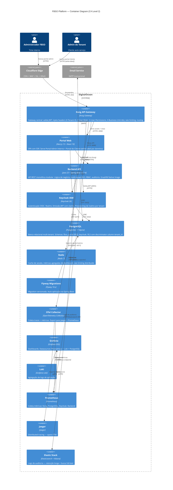
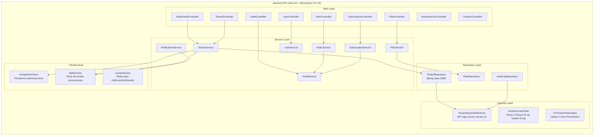

# DETAIL-LEVEL-ARCHITECTURE-DEFINITION — Arquitetura Detail-Level

- **Projeto:** PRJ-FIN-2026-0003-SAAS-FBSO-ORG
- **Data:** 31/07/2026
- **Fase:** F2 — Downstream Architecture Refinement
- **Stack Detectada:** Java 25 LTS / Spring Boot 3.5.14, Next.js 15 / React 19, PostgreSQL 17, Keycloak 26, Kong Gateway, Docker/GraalVM, GitHub Actions

## Padrões Corporativos FBSO

As tecnologias e padrões abaixo são **definições corporativas da FBSO.ORG** e constituem a baseline obrigatória para este projeto. Qualquer tecnologia adicional utilizada além destas deve ser explicitamente documentada com sua justificativa técnica e aprovada pelo time de arquitetura.

### Cloud & Edge
| Padrão | Tecnologia | Aplicação no Projeto |
|:---|:---|:---|
| Cloud Provider | **DigitalOcean** | Provedor único — DOKS (Kubernetes), PostgreSQL managed, Redis managed, Spaces (S3) |
| Edge/CDN/WAF | **Cloudflare** | DNS, CDN, WAF, SSL termination, DDoS protection — toda entrada de tráfego externo passa pela Cloudflare |

### Autenticação & Autorização
| Padrão | Tecnologia | Aplicação no Projeto |
|:---|:---|:---|
| IAM | **Keycloak** | Autenticação OIDC (frontend) + emissão JWT. Realms por tenant. Provisioning automático |
| API Gateway | **Kong** | Gateway central: valida JWT (Service-ID/Token-ID via Keycloak), injeta headers, rate limiting, routing |
| Integração Kong↔Keycloak | **Service-ID/Token-ID** | Kong encaminha Service-ID/Token-ID ao Keycloak para validação. Keycloak retorna autenticação + roles + acessos do usuário sistêmico. Kong alimenta cabeçalho JWT com atributos recebidos. **Microserviços NÃO revalidam JWT** — premissa: toda comunicação com microserviços passa pelo Kong |

### Banco de Dados
| Padrão | Tecnologia | Aplicação no Projeto |
|:---|:---|:---|
| Banco Relacional | **PostgreSQL** | PostgreSQL 17. Schema `fbso_portal` com RLS multi-tenant. Schemas auxiliares: `public`, `keycloak` |

### SRE & Observabilidade
| Padrão | Tecnologia | Aplicação no Projeto |
|:---|:---|:---|
| Métricas | **Prometheus** | Coleta de métricas via exporters (Kong, PostgreSQL, Keycloak) + Micrometer (backend) |
| Dashboards | **Grafana** | Visualização unificada — datasources: Prometheus, Loki, PostgreSQL |
| Logs | **Grafana Loki** | Agregação de logs de aplicação e infraestrutura |
| Tracing | **Jaeger** | Distributed tracing — spans do OpenTelemetry exportados para Jaeger |
| Instrumentação | **OpenTelemetry** | Auto-instrumentação backend (Java agent) + traces manuais em pontos críticos |
| Logs de Auditoria | **Elastic Stack** | Complementar ao Loki para logs de auditoria com retenção longa e busca full-text |

### Infraestrutura como Código (IaC)
| Padrão | Tecnologia | Aplicação no Projeto |
|:---|:---|:---|
| Provisioning | **Terraform** | DOKS cluster, PostgreSQL, Redis, Spaces, networking, secrets |
| Configuração | **Ansible** | Provisioning de nós, configuração Kong, agentes de monitoramento |

### DevOps & Orquestração
| Padrão | Tecnologia | Aplicação no Projeto |
|:---|:---|:---|
| Orquestração | **Kubernetes (DOKS)** | Cluster gerenciado DigitalOcean — todos os workloads em containers |
| Service Mesh | **Istio** | mTLS entre serviços, controle de tráfego (canary, blue-green), observabilidade sidecar |
| Autoscaling (Pods) | **Keda** | Kubernetes Event-Driven Autoscaling — escala pods baseado em eventos (fila, métricas) |
| Autoscaling (Nodes) | **Karpenter** | Cluster Autoscaling — adiciona/remove nós automaticamente conforme demanda |

### CI/CD
| Padrão | Tecnologia | Aplicação no Projeto |
|:---|:---|:---|
| CI/CD | **GitHub Actions** | Build, SAST (Semgrep), Secret Scanning (Gitleaks), Docker build, deploy via kubectl/Helm |

> ⚠️ **Regra de Compliance:** Tecnologias detectadas durante a análise que NÃO constam nesta lista de padrões corporativos devem ser explicitamente documentadas com justificativa técnica e aprovadas pelo time de arquitetura na seção "Tecnologias Adicionais".

---

## 1. C4 Level 2 — Container Diagram



---

## 2. C4 Level 3 — Backend API (S01)

### 2.1 Componentes Internos



### 2.2 Package Structure

```
com.fbso.platform.admin
├── config/
│   ├── SecurityConfig.java          // Spring Security + OAuth2 Resource Server
│   ├── TenantContextFilter.java     // Extrai X-Tenant-ID do header
│   ├── PermissionInterceptor.java   // Valida permissões dos headers Kong
│   ├── TenantAwareDataSource.java   // Proxy: SET app.current_tenant_id
│   └── CacheConfig.java             // Redis configuration
├── controller/
│   ├── DashboardController.java     // GET /api/v1/dashboard/admin/summary
│   ├── TenantController.java        // CRUD /api/v1/tenants
│   ├── PlanController.java          // CRUD /api/v1/plans
│   ├── SubscriptionController.java  // CRUD /api/v1/subscriptions
│   ├── UserController.java          // CRUD /api/v1/users
│   ├── RoleController.java          // GET /api/v1/roles
│   ├── BusinessUnitController.java  // CRUD /api/v1/business-units
│   ├── ProductController.java       // CRUD /api/v1/products
│   └── AuditController.java         // GET /api/v1/audit-logs
├── service/
│   ├── TenantService.java
│   ├── PlanService.java
│   ├── SubscriptionService.java
│   ├── UserService.java
│   ├── RbacService.java
│   ├── AuditService.java
│   ├── NotificationService.java
│   └── CacheService.java
├── repository/
│   ├── TenantRepository.java
│   ├── PlanRepository.java
│   ├── SubscriptionRepository.java
│   ├── UserRepository.java
│   ├── RoleRepository.java
│   ├── BusinessUnitRepository.java
│   ├── ProductRepository.java
│   └── AuditLogRepository.java
├── model/
│   ├── Tenant.java
│   ├── Plan.java
│   ├── Subscription.java
│   ├── User.java
│   ├── Role.java
│   ├── Permission.java
│   ├── BusinessUnit.java
│   ├── Product.java
│   └── AuditLog.java
├── dto/
│   ├── request/  // CreateTenantRequest, UpdatePlanRequest, etc.
│   └── response/ // TenantResponse, DashboardSummaryResponse, etc.
├── exception/
│   ├── GlobalExceptionHandler.java  // @ControllerAdvice
│   ├── TenantNotFoundException.java
│   └── InsufficientPermissionException.java
└── integration/
    ├── KongAdminClient.java         // Provisiona realms e services
    └── MailService.java             // Integração com provedor SMTP
```

---

## 3. ADRs Detalhados

### ADR-001: Multi-Tenancy via RLS + Discriminator Column

**Contexto:** A plataforma serve múltiplos clientes (tenants) que compartilham o mesmo banco de dados. É necessário garantir isolamento total de dados entre tenants.

**Alternativas consideradas:**
| Alternativa | Prós | Contras |
|:---|:---|:---|
| Schema-per-tenant | Isolamento máximo | Impossível gerenciar 500+ schemas dinâmicos com Flyway |
| Database-per-tenant | Isolamento físico | Custo de 500+ bancos no DigitalOcean; conexões multiplicadas |
| **RLS + discriminator column** | Isolamento lógico com política única; conexões compartilhadas | Complexidade de setup inicial; todas queries precisam do tenant_id |

**Decisão:** PostgreSQL Row-Level Security (RLS) com discriminator column `tenant_id` em todas as tabelas do schema `fbso_portal`.

**Diagrama de Sequência:**

```
Client → Kong → Backend → PostgreSQL

1. Kong valida JWT → extrai tenant_id do claim → injeta header X-Tenant-ID: {uuid}
2. TenantContextFilter intercepta request → lê X-Tenant-ID → armazena em TenantContext (ThreadLocal)
3. TenantAwareDataSource (proxy) → SET app.current_tenant_id = '{uuid}' no início de cada transação
4. RLS Policy: USING (tenant_id = current_setting('app.current_tenant_id')::uuid)
5. Após transação → RESET app.current_tenant_id
```

**Consequências:**
- Todas as queries são automaticamente filtradas pelo PostgreSQL via RLS
- Em caso de bug (tenant_id não setado), RLS bloqueia acesso (fail-secure)
- Performance: índices compostos `(tenant_id, ...)` em todas as tabelas

---

### ADR-002: Kong↔Keycloak — Service-ID/Token-ID Validation + Header Injection (Padrão Corporativo)

**Contexto:** Padrão corporativo FBSO.ORG: toda comunicação com microserviços passa pelo Kong. O backend não deve revalidar JWT — o Kong atua como trust boundary único para autenticação e autorização.

**Mecanismo de Integração Kong↔Keycloak (Padrão Corporativo):**
1. Kong recebe request com JWT no header `Authorization: Bearer <jwt>`
2. Kong encaminha **Service-ID** e **Token-ID** ao Keycloak para validação
3. Keycloak valida o token, autentica o serviço (Service-ID) e retorna:
   - Status de autenticação (válido/inválido)
   - Roles do usuário sistêmico
   - Permissões e acessos associados
4. Kong alimenta o cabeçalho JWT com os atributos recebidos do Keycloak
5. Kong injeta headers e encaminha ao backend
6. **Microserviços NÃO revalidam JWT** — premissa corporativa: confiança no Kong como único ponto de validação

**Alternativas consideradas:**
| Alternativa | Prós | Contras |
|:---|:---|:---|
| Backend valida JWT diretamente | Simples | Viola padrão corporativo; dupla validação; latência adicional |
| **Kong↔Keycloak Service-ID/Token-ID → injeta headers → backend confia** | Padrão corporativo; performance; responsabilidade única | Kong é single point of security (mitigado: health checks, replicação, fallback) |

**Decisão:** Seguir estritamente o padrão corporativo Kong↔Keycloak com Service-ID/Token-ID. Backend consome headers sem revalidar JWT.

**Headers injetados:**
| Header | Origem (JWT Claim) | Uso no Backend |
|:---|:---|:---|
| `X-Tenant-ID` | `tenant_id` | RLS context + filtro de queries |
| `X-User-ID` | `sub` | Auditoria |
| `X-User-Roles` | `realm_access.roles` | Role-based authorization |
| `X-User-Permissions` | `permissions` (claim customizado) | Permission-based authorization |
| `X-Business-Unit-Ids` | `business_unit_ids` (claim customizado) | Filtro de unidades acessíveis |

**Diagrama de Sequência:**

```
Cliente → Cloudflare → Kong → Backend

1. Cliente autentica via Keycloak (Authorization Code + PKCE) → recebe JWT
2. Cliente envia request com JWT no header Authorization: Bearer <jwt>
3. Kong interceptor OIDC:
   a. Valida assinatura JWT contra JWKS do Keycloak
   b. Extrai claims relevantes
   c. Injeta headers X-Tenant-ID, X-User-Roles, X-User-Permissions, X-Business-Unit-Ids
   d. Remove header Authorization original (JWT nunca chega ao backend)
4. Backend recebe headers → confia sem revalidar
```

**Rate Limiting por Tenant:** Kong aplica rate limiting baseado em `X-Tenant-ID` para evitar consumo excessivo por um único tenant.

---

### ADR-003: RBAC via Claims Injection + PermissionEvaluator

**Contexto:** O controle de acesso é granular: papel + permissões + escopo (unidade de negócio + módulo). O backend precisa decidir acesso por endpoint e ação.

**Decisão:** Kong injeta claims de permissão. Backend implementa `PermissionEvaluator` que avalia permissões por endpoint.

**Matriz de Permissões (Role → Ação):**
| Ação | Admin Tenant | Gerente | Operador | Auditor |
|:---|:---:|:---:|:---:|:---:|
| Criar/Editar/Excluir Usuários | ✅ | ✅ | ❌ | ❌ |
| Gerenciar Unidades de Negócio | ✅ | ✅ | ❌ | ❌ |
| Gerenciar Produtos | ✅ | ✅ | ✅ | ❌ |
| Visualizar Dashboard | ✅ | ✅ | ✅ | ✅ |
| Visualizar Auditoria | ✅ | ❌ | ❌ | ✅ |
| Upgrade de Plano | ✅ | ❌ | ❌ | ❌ |

**Diagrama de Sequência (Autorização):**

```
Request → PermissionInterceptor → PermissionEvaluator → Controller Method

1. PermissionInterceptor lê X-User-Permissions do header
2. Anotação @PreAuthorize no controller: "@permissionEvaluator.hasPermission('MANAGE_USERS')"
3. PermissionEvaluator verifica se a permissão está presente nos headers
4. Se presente: prossegue. Se ausente: 403 Forbidden
5. Para ações com escopo (unidade de negócio): filtra por X-Business-Unit-Ids
```

---

### ADR-004: Audit Log via Database Trigger + Append-Only Table

**Contexto:** Toda ação de criação, alteração de status, mudança de plano e edição de tenant deve ser auditada com registro imutável.

**Alternativas consideradas:**
| Alternativa | Prós | Contras |
|:---|:---|:---|
| Audit via aplicação (@EventListener) | Flexível; fácil de enriquecer | Perde ações diretas no banco; acoplamento |
| **Audit via trigger PostgreSQL** | Captura todas as mudanças; zero acoplamento | Performance overhead em writes |
| Audit via CDC (Change Data Capture) | Completo; desacoplado | Infra adicional (Debezium + Kafka); overkill |

**Decisão:** Trigger PostgreSQL que insere automaticamente na tabela `audit_log` em todo INSERT/UPDATE/DELETE. Backend complementa com audit explícito para ações que não tocam o banco (envio de email, tentativa de acesso negado).

**Estrutura da tabela audit_log:**
```sql
CREATE TABLE audit_log (
    id UUID PRIMARY KEY DEFAULT gen_random_uuid(),
    tenant_id UUID NOT NULL,
    table_name TEXT NOT NULL,
    record_id UUID,
    action TEXT NOT NULL,         -- INSERT, UPDATE, DELETE
    changed_by UUID,              -- user_id do header X-User-ID
    old_values JSONB,
    new_values JSONB,
    created_at TIMESTAMPTZ DEFAULT now()
) PARTITION BY RANGE (created_at);
```

**Particionamento:** Mensal (Jan-Dez 2026). Retenção: 5 anos (PostgreSQL) + archive S3 após 2 anos.

---

### ADR-005: API Versioning via URL Path

**Contexto:** A API REST precisa evoluir sem quebrar clientes existentes (Portal Admin, Portal Cliente).

**Alternativas consideradas:**
| Alternativa | Prós | Contras |
|:---|:---|:---|
| Header-based (Accept: application/vnd.fbso.v1+json) | Clean URLs | Complexo para debugging e documentação |
| Query param (?version=1) | Simples | Polui URLs; não RESTful |
| **URL Path (/api/v1/)** | Explícito; fácil routing no Kong | URL muda a cada versão |

**Decisão:** Versionamento via prefixo de path: `/api/v1/`, `/api/v2/`, etc. Kong faz routing baseado no path.

**Regras de versionamento:**
- Backward compatibility mantida por 2 versões (v1 deprecado quando v3 lançada)
- Novas versões apenas para breaking changes
- Adições não-breaking (novo endpoint, novo campo opcional) não requerem nova versão

---

### ADR-006: Tenant Provisioning via Keycloak Admin API

**Contexto:** Cada novo tenant precisa de realm próprio no Keycloak com client OIDC e roles padronizados.

**Decisão:** Backend chama Keycloak Admin API no momento da ativação do tenant para criar realm, client OIDC e roles padrão.

**Diagrama de Sequência:**

```
Operador FBSO → Backend → Keycloak Admin API → PostgreSQL (schema keycloak)

1. Operador cria tenant via POST /api/v1/tenants → status = PENDING_ONBOARDING
2. Operador ativa tenant → TenantService.activate(tenantId)
3. TenantService → KongAdminClient.createRealm(tenantId):
   a. POST /admin/realms → cria realm "tenant-{uuid}"
   b. POST /admin/realms/tenant-{uuid}/clients → cria OIDC client
   c. POST /admin/realms/tenant-{uuid}/roles → cria roles padrão (Admin, Gerente, Operador, Auditor)
4. TenantService → MailService.sendWelcomeEmail(tenant) → link de ativação
5. Tenant status → ACTIVE
```

---

## 4. Padrões de Código e Estrutura

### 4.1 Princípios SOLID

| Princípio | Aplicação |
|:---|:---|
| **S**ingle Responsibility | Controllers apenas delegam para Services; Services contêm lógica de negócio |
| **O**pen/Closed | Novos comportamentos via novos Services, não modificação dos existentes |
| **L**iskov Substitution | Repositories usam interfaces; implementações intercambiáveis |
| **I**nterface Segregation | Repositories específicos por agregado (não um repositório genérico) |
| **D**ependency Inversion | Services dependem de interfaces, não de implementações concretas |

### 4.2 Design Patterns

| Pattern | Onde Aplicar |
|:---|:---|
| **Proxy** | `TenantAwareDataSource` — intercepta conexões JDBC para injetar tenant_id |
| **Interceptor/Filter** | `TenantContextFilter`, `PermissionInterceptor` — processamento cross-cutting |
| **Template Method** | `AuditService` — estrutura de auditoria com hooks customizáveis |
| **Builder** | DTOs de request/response complexos |
| **Strategy** | `NotificationService` — estratégias por canal (email, in-app) |

### 4.3 Error Handling

```
@ControllerAdvice GlobalExceptionHandler:
├── TenantNotFoundException → 404
├── InsufficientPermissionException → 403
├── PlanAlreadyAssignedException → 409
├── MethodArgumentNotValidException → 400 (com detalhes de validação)
├── DataIntegrityViolationException → 409
└── Exception (catch-all) → 500 (log interno, resposta genérica ao cliente)
```

---

## 5. Matriz de Integração

| Origem | Destino | Protocolo | Autenticação | Formato | Via |
|:---|:---|:---|:---|:---|:---|
| Frontend Admin | Backend API | HTTPS | OIDC (Keycloak) | JSON REST | Kong |
| Frontend Cliente | Backend API | HTTPS | OIDC (Keycloak, realm do tenant) | JSON REST | Kong |
| Frontend | Keycloak | HTTPS | Authorization Code + PKCE | OIDC | Kong |
| Kong | Backend API | HTTP | Header injection (confiança) | JSON | Direto (rede interna) |
| Kong | Keycloak | HTTP | — | OIDC/JWKS | Direto |
| Backend | PostgreSQL | TCP :5432 | JDBC (usuário fbso_app_user) | SQL | Direto |
| Backend | Redis | TCP :6379 | — | Redis Protocol | Direto |
| Backend | Keycloak Admin API | HTTPS | Service Account (client_credentials) | JSON REST | Direto |
| Backend | Email Service | SMTP | API Key | SMTP | Externo |
| Backend | OTel Collector | gRPC :4317 | — | OTLP | Direto |
| Kong | OTel Collector | HTTP | — | Prometheus metrics | Direto |
| Keycloak | PostgreSQL | TCP :5432 | JDBC (schema keycloak) | SQL | Direto |
| Flyway | PostgreSQL | TCP :5432 | JDBC (admin) | SQL | Direto |
| Cloudflare | Kong | HTTPS :443 | SSL (certificado) | HTTP/2 | Internet |

---

## 6. Riscos Arquiteturais

| Risco | Prob. | Impacto | Mitigação |
|:---|:---:|:---|:---|
| Kong como single point of failure | Média | Alto — plataforma inteira offline | Health checks + replicação Kong; fallback manual para acesso direto ao backend |
| RLS policy mal configurada permite cross-tenant leakage | Baixa | Crítico | Testes automatizados de isolamento por tenant; auditoria trimestral de políticas RLS |
| Keycloak Admin API rate limit durante provisioning de tenant | Baixa | Médio | Retry com backoff exponencial; fila de provisioning assíncrona |
| Complexidade do PermissionEvaluator com regras granulares | Média | Médio | Testes unitários para cada combinação Role×Permission×Resource |
| Latência adicional do Kong (JWT validation + header injection) | Baixa | Baixo | Cache de JWKS no Kong (TTL configurável); monitoramento p99 |
| Expansão de realms Keycloak (1 realm/tenant = 500+ realms) | Média | Alto | Monitoramento de recursos Keycloak; plano de migração para realm único com grupos se necessário |

---

🤖 *Documento gerado pelo Time de Arquitetura — Fase 2 do Downstream Architecture Refinement. Stack detectada via SOLUTIONS-STACK-MATRIX.md. Independente de upstream discovery.*
