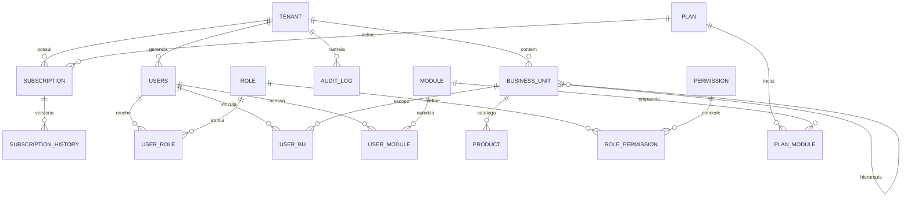

# DETAIL-LEVEL-DATA-ARCHITECTURE-DEFINITION — Arquitetura de Dados Detail-Level

- **Projeto:** PRJ-FIN-2026-0003-SAAS-FBSO-ORG
- **Data:** 31/07/2026
- **Fase:** F4 — Downstream Architecture Refinement
- **Padrão FBSO:** PostgreSQL
- **Referências:** [Arquitetura (F2)](./DETAIL-LEVEL-ARCHITECTURE-DEFINITION.md), [Segurança (F3)](./DETAIL-LEVEL-SECURITY-DEFINITION.md)

---

## 1. Modelo de Dados Completo (ERD)

### 1.1 Diagrama Entidade-Relacionamento



### 1.2 Dicionário de Entidades

#### TENANT — Conta de Cliente
| Coluna | Tipo | Constraint | Descrição |
|:---|:---|:---|:---|
| `id` | UUID | PK, DEFAULT gen_random_uuid() | Identificador único |
| `tenant_id` | UUID | NOT NULL, DEFAULT = id | Discriminator column (igual ao id para o próprio tenant) |
| `razao_social` | VARCHAR(255) | NOT NULL | Razão social da empresa |
| `nome_fantasia` | VARCHAR(255) | | Nome fantasia |
| `cnpj` | VARCHAR(18) | UNIQUE, índice parcial WHERE deleted_dt IS NULL | CNPJ único entre ativos |
| `segmento` | VARCHAR(100) | | Segmento de mercado |
| `email_contato` | VARCHAR(255) | NOT NULL | Email do admin do tenant |
| `status` | VARCHAR(30) | NOT NULL, DEFAULT 'PENDING_ONBOARDING' | PENDING_ONBOARDING, ACTIVE, SUSPENDED, INACTIVE |
| `created_dt` | TIMESTAMPTZ | NOT NULL, DEFAULT now() | Data de criação |
| `updated_dt` | TIMESTAMPTZ | | Data de atualização |
| `created_by` | UUID | | Usuário que criou |
| `updated_by` | UUID | | Usuário que atualizou |
| `deleted_dt` | TIMESTAMPTZ | | Soft delete |

**Índices:** `idx_tenant_status (tenant_id, status)`, `idx_tenant_search (tenant_id, razao_social text_pattern_ops)`, `idx_tenant_cnpj_active UNIQUE (cnpj) WHERE deleted_dt IS NULL`

#### PLAN — Plano Comercial
| Coluna | Tipo | Constraint | Descrição |
|:---|:---|:---|:---|
| `id` | UUID | PK | Identificador |
| `nome` | VARCHAR(100) | NOT NULL | Nome do plano |
| `descricao` | TEXT | | Descrição comercial |
| `valor_mensal` | DECIMAL(10,2) | NOT NULL | Preço mensal |
| `recorrencia` | VARCHAR(20) | NOT NULL | MONTHLY, QUARTERLY, YEARLY |
| `status` | VARCHAR(20) | NOT NULL, DEFAULT 'ACTIVE' | ACTIVE, INACTIVE |
| `version` | INTEGER | NOT NULL, DEFAULT 1 | Versão do plano (histórico) |
| `created_dt` | TIMESTAMPTZ | |
| `updated_dt` | TIMESTAMPTZ | |
| `deleted_dt` | TIMESTAMPTZ | |

**Índices:** `idx_plan_status (status) WHERE deleted_dt IS NULL`

#### SUBSCRIPTION — Assinatura
| Coluna | Tipo | Constraint | Descrição |
|:---|:---|:---|:---|
| `id` | UUID | PK | Identificador |
| `tenant_id` | UUID | FK→tenants(id), NOT NULL | Tenant vinculado |
| `plan_id` | UUID | FK→plans(id), NOT NULL | Plano contratado |
| `status` | VARCHAR(20) | NOT NULL | ACTIVE, SUSPENDED, CANCELLED, EXPIRED |
| `data_inicio` | DATE | NOT NULL | Início da vigência |
| `data_fim` | DATE | | Fim da vigência (nullable = recorrente) |
| `created_dt` | TIMESTAMPTZ | |
| `updated_dt` | TIMESTAMPTZ | |
| `deleted_dt` | TIMESTAMPTZ | |

**Índices:** `idx_sub_tenant (tenant_id, status)`, `idx_sub_plan (plan_id, status)`

#### SUBSCRIPTION_HISTORY — Histórico de Assinatura
| Coluna | Tipo | Constraint | Descrição |
|:---|:---|:---|:---|
| `id` | UUID | PK | Identificador |
| `tenant_id` | UUID | NOT NULL | Tenant |
| `subscription_id` | UUID | FK→subscriptions(id) | Assinatura original |
| `plan_id_anterior` | UUID | | Plano antes da mudança |
| `plan_id_novo` | UUID | | Plano após mudança |
| `acao` | VARCHAR(20) | NOT NULL | UPGRADE, DOWNGRADE, SUSPEND, REACTIVATE, CANCEL |
| `motivo` | TEXT | | Justificativa da mudança |
| `created_dt` | TIMESTAMPTZ | NOT NULL, DEFAULT now() | Quando ocorreu |

#### USERS — Usuário
| Coluna | Tipo | Constraint | Descrição |
|:---|:---|:---|:---|
| `id` | UUID | PK | Identificador interno |
| `tenant_id` | UUID | FK→tenants(id), NOT NULL | Tenant do usuário |
| `keycloak_id` | UUID | UNIQUE | ID do usuário no Keycloak |
| `nome` | VARCHAR(255) | NOT NULL | Nome completo |
| `email` | VARCHAR(255) | NOT NULL | Email (login) |
| `status` | VARCHAR(30) | NOT NULL, DEFAULT 'ACTIVE' | ACTIVE, INACTIVE, TEMP_SUSPENDED |
| `suspensao_inicio` | DATE | | Início da suspensão temporária |
| `suspensao_fim` | DATE | | Fim previsto da suspensão |
| `ultimo_login` | TIMESTAMPTZ | | Data do último login |
| `created_dt` | TIMESTAMPTZ | |
| `updated_dt` | TIMESTAMPTZ | |
| `deleted_dt` | TIMESTAMPTZ | |

**Índices:** `idx_user_tenant (tenant_id, status)`, `idx_user_email (tenant_id, email)`

#### ROLE — Papel
| Coluna | Tipo | Constraint | Descrição |
|:---|:---|:---|:---|
| `id` | UUID | PK | Identificador |
| `nome` | VARCHAR(50) | NOT NULL, UNIQUE | ROLE_FBSO_ADMIN, ROLE_TENANT_ADMIN, etc. |
| `descricao` | TEXT | | Descrição do papel |
| `tenant_scope` | VARCHAR(20) | NOT NULL | GLOBAL (FBSO), TENANT (cliente) |

#### PERMISSION — Permissão
| Coluna | Tipo | Constraint | Descrição |
|:---|:---|:---|:---|
| `id` | UUID | PK | Identificador |
| `codigo` | VARCHAR(50) | NOT NULL, UNIQUE | MANAGE_USERS, VIEW_DASHBOARD, etc. |
| `descricao` | TEXT | | O que a permissão permite |
| `recurso` | VARCHAR(50) | NOT NULL | TENANTS, USERS, PLANS, PRODUCTS, etc. |

#### USER_ROLE — Vínculo Usuário×Papel
| Coluna | Tipo | Constraint | Descrição |
|:---|:---|:---|:---|
| `id` | UUID | PK | |
| `user_id` | UUID | FK→users(id) | Usuário |
| `role_id` | UUID | FK→roles(id) | Papel |
| `tenant_id` | UUID | NOT NULL | Tenant (denormalizado para queries RLS) |

#### ROLE_PERMISSION — Vínculo Papel×Permissão
| Coluna | Tipo | Constraint | Descrição |
|:---|:---|:---|:---|
| `id` | UUID | PK | |
| `role_id` | UUID | FK→roles(id) | Papel |
| `permission_id` | UUID | FK→permissions(id) | Permissão |

#### BUSINESS_UNIT — Unidade de Negócio
| Coluna | Tipo | Constraint | Descrição |
|:---|:---|:---|:---|
| `id` | UUID | PK | Identificador |
| `tenant_id` | UUID | FK→tenants(id), NOT NULL | Tenant proprietário |
| `parent_id` | UUID | FK→business_units(id) | BU pai (NULL = matriz) |
| `cnpj` | VARCHAR(18) | NOT NULL | CNPJ da unidade |
| `razao_social` | VARCHAR(255) | NOT NULL | Razão social |
| `regime_tributario` | VARCHAR(50) | | Simples Nacional, Lucro Presumido, Lucro Real |
| `endereco` | TEXT | | Endereço completo |
| `status` | VARCHAR(20) | DEFAULT 'ACTIVE' | ACTIVE, INACTIVE |
| `created_dt` | TIMESTAMPTZ | |
| `updated_dt` | TIMESTAMPTZ | |
| `deleted_dt` | TIMESTAMPTZ | |

**Índices:** `idx_bu_tenant (tenant_id, parent_id)`, `idx_bu_hierarchy (tenant_id, parent_id NULLS FIRST)`

#### USER_BU — Vínculo Usuário×Unidade de Negócio
| Coluna | Tipo | Constraint | Descrição |
|:---|:---|:---|:---|
| `id` | UUID | PK | |
| `user_id` | UUID | FK→users(id) | Usuário |
| `business_unit_id` | UUID | FK→business_units(id) | Unidade de Negócio |
| `tenant_id` | UUID | NOT NULL | Tenant |

#### PRODUCT — Produto/Serviço
| Coluna | Tipo | Constraint | Descrição |
|:---|:---|:---|:---|
| `id` | UUID | PK | |
| `tenant_id` | UUID | NOT NULL | Tenant |
| `business_unit_id` | UUID | FK→business_units(id) | BU proprietária |
| `nome` | VARCHAR(255) | NOT NULL | Nome do produto |
| `sku` | VARCHAR(100) | | Código interno |
| `tipo` | VARCHAR(20) | NOT NULL | PRODUCT, SERVICE |
| `descricao` | TEXT | | Descrição |
| `status` | VARCHAR(20) | DEFAULT 'ACTIVE' | ACTIVE, INACTIVE |
| `created_dt` | TIMESTAMPTZ | |
| `updated_dt` | TIMESTAMPTZ | |
| `deleted_dt` | TIMESTAMPTZ | |

**Índices:** `idx_product_bu (tenant_id, business_unit_id, status)`, `idx_product_search (tenant_id, nome text_pattern_ops)`

#### MODULE — Módulo da Plataforma
| Coluna | Tipo | Constraint | Descrição |
|:---|:---|:---|:---|
| `id` | UUID | PK | |
| `codigo` | VARCHAR(50) | NOT NULL, UNIQUE | TRIBUTALI_ENGINE, STOREKEEPER_PORTAL |
| `nome` | VARCHAR(100) | NOT NULL | Nome do módulo |

#### USER_MODULE — Vínculo Usuário×Módulo
| Coluna | Tipo | Constraint | Descrição |
|:---|:---|:---|:---|
| `id` | UUID | PK | |
| `user_id` | UUID | FK→users(id) | Usuário |
| `module_id` | UUID | FK→modules(id) | Módulo |
| `tenant_id` | UUID | NOT NULL | Tenant |

#### PLAN_MODULE — Módulos Incluídos no Plano
| Coluna | Tipo | Constraint | Descrição |
|:---|:---|:---|:---|
| `id` | UUID | PK | |
| `plan_id` | UUID | FK→plans(id) | Plano |
| `module_id` | UUID | FK→modules(id) | Módulo incluído |

#### AUDIT_LOG — Log de Auditoria (particionada)
| Coluna | Tipo | Constraint | Descrição |
|:---|:---|:---|:---|
| `id` | UUID | DEFAULT gen_random_uuid() | Identificador |
| `tenant_id` | UUID | NOT NULL | Tenant |
| `table_name` | TEXT | NOT NULL | Tabela afetada |
| `record_id` | UUID | | ID do registro |
| `action` | TEXT | NOT NULL | INSERT, UPDATE, DELETE |
| `changed_by` | UUID | | Usuário que fez a ação |
| `old_values` | JSONB | | Valores antes |
| `new_values` | JSONB | | Valores depois |
| `created_at` | TIMESTAMPTZ | NOT NULL, DEFAULT now() | Timestamp |

**Particionamento:** `PARTITION BY RANGE (created_at)` — partições mensais

---

## 2. Estratégia de Multi-Tenancy

### 2.1 Abordagem: Shared Database + Shared Schema + RLS

| Aspecto | Decisão | Justificativa |
|:---|:---|:---|
| **Isolamento** | Discriminator column (`tenant_id`) | Simplicidade operacional; 500+ tenants gerenciáveis |
| **Filtro automático** | RLS FORCE + `TenantAwareDataSource` | Dupla camada: aplicação (proxy JDBC) + banco (RLS) |
| **Fail-secure** | Se `app.current_tenant_id` não setado → RLS bloqueia tudo | Segurança por padrão |
| **Admin bypass** | Admin FBSO usa `tenant_id = NULL` no contexto → RLS permite tudo | Controle explícito via `@AdminOnly` |

### 2.2 RLS Policies (Aplicadas a Todas as Tabelas)

```sql
-- Padrão para todas as tabelas do schema fbso_portal
ALTER TABLE fbso_portal.{tabela} ENABLE ROW LEVEL SECURITY;
ALTER TABLE fbso_portal.{tabela} FORCE ROW LEVEL SECURITY;

CREATE POLICY tenant_isolation ON fbso_portal.{tabela}
    FOR ALL
    USING (
        tenant_id = current_setting('app.current_tenant_id')::uuid
        OR current_setting('app.current_tenant_id') IS NULL  -- admin bypass
    );
```

---

## 3. Estratégia de Particionamento e Arquivamento

### 3.1 Tabela AUDIT_LOG

| Parâmetro | Valor |
|:---|:---|
| Método | `PARTITION BY RANGE (created_at)` |
| Granularidade | Mensal (ex: `audit_log_2026_07`, `audit_log_2026_08`) |
| Criação automática | Script agendado (cron) cria partições 3 meses à frente |
| Retenção PostgreSQL | 2 anos (partições antigas detached e archive) |
| Archive | DigitalOcean Spaces (S3-compatible) — 5 anos |
| Purge | Partições > 5 anos: exclusão definitiva |

### 3.2 Demais Tabelas

Sem particionamento inicial. Monitorar crescimento:
- `tenants`: ~500 registros/ano → sem particionamento
- `users`: ~5.000 registros/ano → sem particionamento
- `products`: ~10.000 registros/ano → sem particionamento
- Revisão em Year 2 se necessário

---

## 4. Query Patterns Otimizadas

### 4.1 Dashboard Admin (Métricas Agregadas)

```sql
-- Cache em Redis (TTL: 5 minutos) para evitar carga no PostgreSQL
-- Query de fallback:
SELECT
    COUNT(*) FILTER (WHERE status = 'ACTIVE') AS active_tenants,
    COUNT(*) FILTER (WHERE status = 'PENDING_ONBOARDING') AS pending_tenants,
    COUNT(*) FILTER (WHERE status = 'SUSPENDED') AS suspended_tenants,
    COUNT(*) FILTER (WHERE created_dt >= NOW() - INTERVAL '30 days') AS new_last_30_days
FROM fbso_portal.tenants
WHERE deleted_dt IS NULL;
```

**Índice de suporte:** `idx_tenant_status (tenant_id, status)` — usado com RLS

### 4.2 Lista de Contas com Filtros

```sql
SELECT id, razao_social, nome_fantasia, cnpj, status, created_dt
FROM fbso_portal.tenants
WHERE deleted_dt IS NULL
  AND (status = :status OR :status IS NULL)
  AND (razao_social ILIKE '%' || :search || '%' OR :search IS NULL)
ORDER BY created_dt DESC
LIMIT :limit OFFSET :offset;
```

**Índice de suporte:** `idx_tenant_search (tenant_id, razao_social text_pattern_ops)`

### 4.3 Auditoria — Filtro por Período

```sql
SELECT table_name, action, changed_by, new_values, created_at
FROM fbso_portal.audit_log
WHERE created_at BETWEEN :start_date AND :end_date
  AND action = ANY(:actions)
ORDER BY created_at DESC
LIMIT :limit;
```

**Índice de suporte:** Índice em `(created_at)` em cada partição mensal

---

## 5. Estratégia de Versionamento de Schema (Flyway)

### 5.1 Convenção

| Parâmetro | Valor |
|:---|:---|
| Ferramenta | Flyway 10.x |
| Localização | `src/main/resources/db/migration/` (backend) |
| Nomenclatura | `V{XXX}__{descricao}.sql` |
| Baseline | `V001__init_schema.sql` |
| Auto-aplicação | Spring Boot auto-config (`spring.flyway.enabled=true`) |

### 5.2 Sequência de Migrations

| Migration | Descrição |
|:---|:---|
| V001 | Schema `fbso_portal` + tabelas core (tenants, plans, subscriptions, users, roles, permissions) |
| V002 | Tabelas RBAC (user_role, role_permission, user_bu, user_module) |
| V003 | Tabelas de negócio (business_units, products, modules, plan_module) |
| V004 | Tabela audit_log + trigger function + particionamento inicial |
| V005 | RLS policies em todas as tabelas |
| V006 | Índices para queries de dashboard e busca |
| V007 | Seed data: roles padrão, módulos, permissões |
| V010+ | Migrações dos Sprints 01+ |

### 5.3 Rollback Strategy

- Ambiente dev: `flyway:clean` + reaplicação
- Ambiente staging/prod: migrations sempre aditivas (nunca destrutivas). Rollback = nova migration que reverte a anterior
- Nunca usar `flyway:clean` em staging ou produção

---

## 6. Volumes e Crescimento

| Métrica | Year 1 | Year 2 | Year 3 |
|:---|---:|---:|---:|
| Tenants | 500 | 2.000 | 5.000 |
| Usuários | 5.000 | 20.000 | 50.000 |
| Produtos | 50.000 | 200.000 | 500.000 |
| Audit Log (linhas/ano) | ~1M | ~5M | ~12M |
| Storage PostgreSQL | ~50 GB | ~200 GB | ~500 GB |
| Storage Archive (S3) | ~10 GB | ~50 GB | ~150 GB |

---

## 7. Riscos de Dados

| Risco | Prob. | Impacto | Mitigação |
|:---|:---:|:---|:---|
| RLS bypass — cross-tenant leakage | Baixa | Crítico | RLS FORCE + testes automatizados + pentest |
| audit_log crescimento descontrolado | Média | Médio | Particionamento + archive S3 + purge 5 anos |
| Índice faltante degrada dashboard | Média | Médio | Cache Redis (5min TTL) + query analysis trimestral |
| Flyway migration conflitante em times paralelos | Baixa | Baixo | Numeração sequencial estrita; code review de migrations |
| PostgreSQL connection pool exhaustion | Baixa | Alto | Connection pool configurado (HikariCP: max 20, min 5); monitoring |

---

🤖 *Documento gerado pelo Data Architect — Fase 4 do Downstream Architecture Refinement. Padrão FBSO: PostgreSQL. Stack detectada: PostgreSQL 17, Flyway 10.x, Redis 7.*
