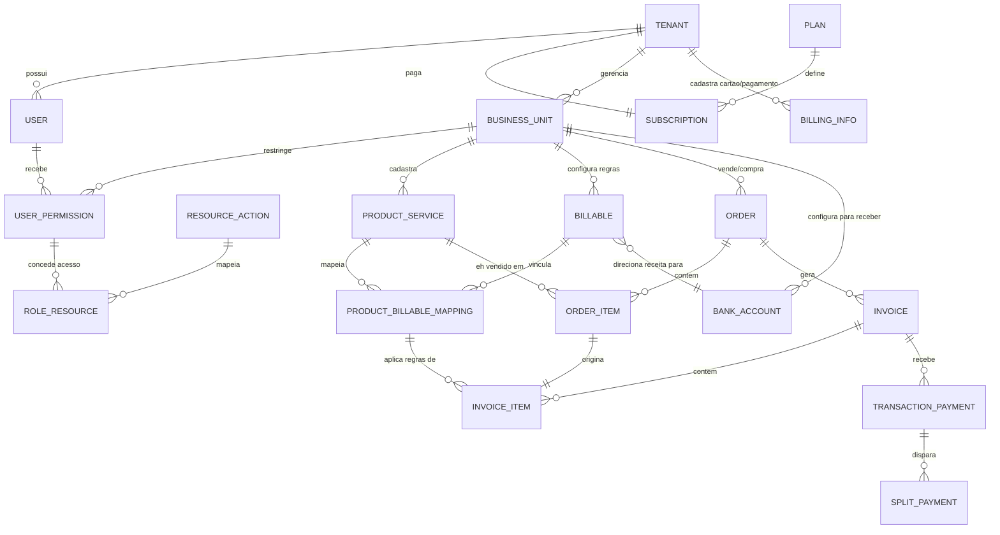

# SAAS: Nome: Tributali-Engine

---

### Diagrama de Entidades e Relacionamentos (ERD)

---

### Detalhamento Dicionário das Entidades

Abaixo está o mapeamento de campos essenciais para garantir que a arquitetura funcione conforme nossa discussão:

#### 1. Camada Administrativa (SaaS Core)

* **`TENANT`** (Conta Master / Pagadora)
    * `id` (PK)
    * `name_corporate` (Razão Social)
    * `status` (Ativo, Inativo)

* **`USER`** (Usuários do ecossistema)
    * `id` (PK)
    * `tenant_id` (FK)
    * `email` / `password_hash`

* **`PLAN`** / **`SUBSCRIPTION`** (Comercialização do SaaS)
    * Estrutura clássica de billing (Preço, recorrência, vigência).

#### 2. Camada de Isolamento Operacional (Governança)

* **`BUSINESS_UNIT`** (CNPJs Independentes / Filiais ou Clientes do Contador)
    * `id` (PK)
    * `tenant_id` (FK)
    * `parent_id` (FK - Auto-relacionamento para Matriz/Filial)
    * `cnpj` (Único)
    * `tax_regime` (Lucro Real, Presumido, Simples Nacional)

* **`USER_PERMISSION`** (Tabela Ponte de Segurança)
    * `user_id` (FK)
    * `business_unit_id` (FK)
    * `role` (Admin, Financeiro, Auditor, Contador)

#### 3. Camada de Catálogo e Inteligência Fiscal

* **`PRODUCT_SERVICE`** (O Catálogo Comercial da Unidade)
    * `id` (PK)
    * `business_unit_id` (FK)
    * `name` / `sku` / `type` (Produto, Serviço, Assinatura)

* **`BILLABLE`** (A "Engine" Fiscal, Tributária e Contábil)
    * `id` (PK)
    * `business_unit_id` (FK)
    * *Sub-Regras Embutidas/Tabelas Relacionadas:*
    * `ncm` / `nbs` / `cnae` (Códigos da Reforma)
    * `ibs_rate` / `cbs_rate` (Alíquotas da Reforma Tributária)
    * `chart_of_accounts_code` (Plano de contas contábil)
    * `split_payment_profile` (Regra de automação bancária)

* **`PRODUCT_BILLABLE_MAPPING`** (A Tabela Mapeamento / De-Para)
    * `id` (PK)
    * `product_service_id` (FK)
    * `billable_id` (FK)
    * `state_destination` (Filtro geográfico para a regra de destino do IBS)

#### 4. Camada Transacional e Arrecadação (A Execução)

* **`ORDER`** / **`ORDER_ITEM`** (O Pedido comercial feito na ponta)
* **`INVOICE`** / **`INVOICE_ITEM`** (O documento de cobrança)
    * `invoice_item.id` (PK)
    * `invoice_id` (FK)
    * `product_billable_mapping_id` (FK - *Aqui o item busca a regra exata de imposto e split*)
    * `amount_gross` (Valor Bruto)

* **`TRANSACTION_PAYMENT`** (A entrada do dinheiro no caixa / Gateway)
    * `id` (PK)
    * `invoice_id` (FK)
    * `amount_paid` (Dinheiro real recebido)

* **`SPLIT_PAYMENT`** (O dinheiro indo para o governo em tempo real)
    * `id` (PK)
    * `transaction_payment_id` (FK)
    * `tax_type` (IBS / CBS)
    * `amount_tax_split` (Calculado proporcionalmente com base nas regras do `Billable` acionado no `Invoice_Item`)

#### Camada de Autenticação, Telas e Governança (Keycloak Link + RBAC)

* **`USER`**
    * `id` (PK)
    * `tenant_id` (FK)
    * `external_keycloak_id` (String - UUID gerado pelo Keycloak via SAML/SSO para acoplamento seguro)
    * `email` (String)

* **`USER_PERMISSION`**
    * `id` (PK)
    * `user_id` (FK)
    * `business_unit_id` (FK)
    * `role` (Enum: `ADMIN_TENANT`, `MANAGER_BU`, `OPERATOR_BU`, `AUDITOR`)

* **`RESOURCE_ACTION`** (As telas e ações do portal do SaaS)
    * `id` (PK)
    * `resource_name` (String: `dashboard`, `product_catalog`, `billable_config`, `order_management`)
    * `action` (String: `view`, `create`, `edit`, `delete`)

* **`ROLE_RESOURCE`** (Tabela ponte para dizer o que cada papel do menu acessa)
    * `role` (Enum/Chave)
    * `resource_action_id` (FK)

#### Camada Transacional Flexível (Cotação + Pedido na mesma tabela)

* **`ORDER`**
    * `id` (PK)
    * `business_unit_id` (FK)
    * `type` (Enum: `QUOTE`, `SALE_ORDER` — *Crucial para o nosso último alinhamento*)
    * `status` (Enum: `QUOTE_DRAFT`, `QUOTE_SENT`, `ORDER_PENDING`, `ORDER_PAID`, `ORDER_CANCELED`)
    * `total_amount` (Decimal)

