# PROJECT-TECHNICAL-DEFINITIONS-ARCHITECTURE-DEFINITION — Definição de Arquitetura do Projeto

- **Projeto:** PRJ-FIN-2026-0003-SAAS-FBSO-ORG
- **Programa:** FBSO Platform — Portal Administrativo SaaS
- **Versão:** 1.1
- **Data de Criação:** 26 de Julho de 2026
- **Última Atualização:** 27 de Julho de 2026 (alinhamento com docs de negócio v1.2)
- **Status:** ✅ COMPLIANCE — Validado pelo Time de Arquitetura
- **Baseline de Negócio:** [Project Charter v1.2](../01-PROJECT-CHARTER-PRJ-FIN-2026-0003-SAAS-FBSO-ORG.md), [BRD v1.2](../02-BRD-PRJ-FIN-2026-0003-SAAS-FBSO-ORG.md), [Épicos v1.2](../03-EPICS-PRJ-FIN-2026-0003-SAAS-FBSO-ORG.md), [Features FEAT-EP-](../04-FEATURES-PRJ-FIN-2026-0003-SAAS-FBSO-ORG.md)
- **Substitui:** `INTEGRATION-MAP.md` (absorvido neste documento)
- **Documentos Complementares:** [SOLUTIONS-CATALOG](./PROJECT-TECHNICAL-DEFINITIONS-SOLUTIONS-CATALOG.md) · [STACK-MATRIX](./PROJECT-TECHNICAL-DEFINITIONS-SOLUTIONS-STACK-MATRIX.md) · [PRD-DEFINITION](./PROJECT-TECHNICAL-DEFINITIONS-PRD-DEFINITION.md)

---

## 1. Objetivo

Este documento define a **arquitetura completa do projeto FBSO Platform** — como as 14 soluções técnicas se integram, comunicam e operam como um sistema coeso. Cobre os níveis C4 Level 1 (System Context) e Level 2 (Container), a matriz de integração entre todas as soluções, a topologia de deploy e os fluxos de sequência críticos.

---

## 2. C4 Level 1 — System Context

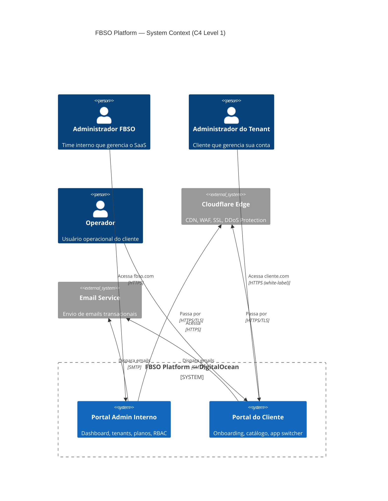

### 2.1 Atores Externos

| Ator | Tipo | Interação |
|:---|:---|:---|
| Administrador FBSO | Usuário interno | Acessa Portal Admin Interno |
| Administrador do Tenant | Usuário cliente | Acessa Portal do Cliente via domínio próprio (white-label) |
| Operador | Usuário cliente | Acessa Portal do Cliente com permissões restritas |
| Cloudflare Edge | Sistema externo | CDN, WAF, SSL termination, DDoS mitigation |
| Email Service | Sistema externo | Envio de emails transacionais (convite, recuperação de senha, notificações) |

---

## 3. C4 Level 2 — Container Diagram

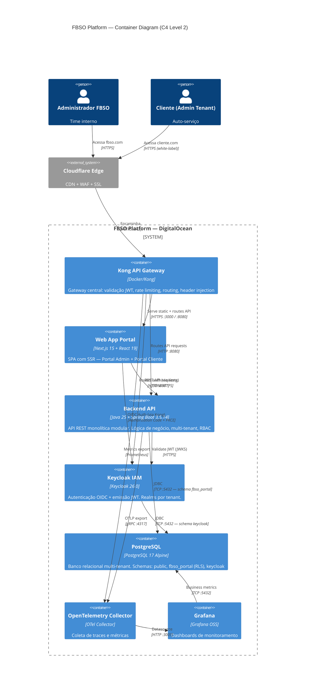

### 3.1 Containers

| Container | Tecnologia | Porta | Responsabilidade |
|:---|:---|:---:|:---|
| **Kong API Gateway** | Kong (Docker/DO) | 443 | Validação JWT (JWKS), rate limiting, routing, header injection (`X-Tenant-ID`, `X-User-Permissions`) |
| **Web App Portal** | Next.js 15 + React 19 | 3000 | Frontend SPA/SSR. Serve assets estáticos + renderiza páginas. |
| **Backend API** | Java 25 + Spring Boot 3.5.14 | 8080 | API REST. Lógica de negócio. Multi-tenant via `SET app.current_tenant_id`. |
| **Keycloak IAM** | Keycloak 26.0 | 8081 | OIDC Provider. Realms por tenant. Emissão JWT com claims. |
| **PostgreSQL** | PostgreSQL 17 Alpine | 5432 | Persistência. Schemas: `public`, `fbso_portal` (RLS), `keycloak`. |
| **OTel Collector** | OpenTelemetry Collector | 4317/4318 | Coleta traces (gRPC) e métricas (Prometheus). |
| **Grafana** | Grafana OSS | 3001 | Dashboards: saúde, latência, métricas de negócio. |

---

## 4. Matriz de Integração

### 4.1 Matriz Completa (Origem → Destino)

| # | Origem | Destino | Protocolo | Porta | Autenticação | Dados Trafegados |
|:---|:---|:---|:---|:---:|:---|:---|
| I01 | Cloudflare | Kong | HTTPS/TLS | 443 | SSL (Cloudflare edge) | Requests HTTP |
| I02 | Kong | Frontend | HTTP | 3000 | — (interno) | Assets estáticos, páginas SSR |
| I03 | Kong | Backend | HTTP | 8080 | Header injection (X-Tenant-ID) | API requests, JSON |
| I04 | Kong | Keycloak | HTTP | 8081 | — (interno) | Auth requests |
| I05 | Frontend | Backend | REST/JSON | 80→Kong→8080 | Bearer JWT (via Kong) | CRUD tenants, plans, users, BUs, catalog |
| I06 | Frontend | Keycloak | OIDC | 443→Kong→8081 | Authorization Code + PKCE | Login, token refresh, logout |
| I07 | Backend | PostgreSQL | JDBC/PostgreSQL | 5432 | User/password (`fbso_app_user`) | Queries SQL no schema `fbso_portal` |
| I08 | Backend | Keycloak | HTTPS/JWKS | 8081 | — (valida assinatura JWT) | JWKS endpoint (public keys) |
| I09 | Keycloak | PostgreSQL | JDBC/PostgreSQL | 5432 | User/password (`fbso_keycloak_user`) | Tabelas Keycloak no schema `keycloak` |
| I10 | Backend | OTel Collector | OTLP/gRPC | 4317 | — (interno) | Traces, spans |
| I11 | Kong | OTel Collector | Prometheus | — | — (interno) | Métricas de API |
| I12 | OTel Collector | Grafana | HTTP | 3001 | — (interno) | Datasource traces/metrics |
| I13 | Grafana | PostgreSQL | JDBC | 5432 | Read-only user | Métricas de negócio (contas ativas, etc.) |
| I14 | Backend | MailHog | SMTP | 1025 | — (dev only) | Emails capturados (convite, reset senha) |

### 4.2 Padrões de Comunicação

| Padrão | Onde se Aplica | Justificativa |
|:---|:---|:---|
| **API Gateway** | Kong → Backend, Kong → Keycloak | Single entry point. Validação JWT centralizada. Rate limiting. |
| **REST/JSON** | Frontend → Backend (via Kong) | Padrão web. Contrato OpenAPI documentado. |
| **OIDC + PKCE** | Frontend → Keycloak | Authorization Code Flow com PKCE — mais seguro que Implicit Flow. |
| **JDBC Direto** | Backend → PostgreSQL, Keycloak → PostgreSQL | Conexão local no mesmo network. Pool de conexões gerenciado. |
| **JWKS Local** | Backend → Keycloak | Validação de assinatura JWT sem roundtrip para cada requisição. |
| **OTLP/gRPC** | Backend → OTel Collector | Protocolo padrão OpenTelemetry para tracing. |
| **SMTP (Dev)** | Backend → MailHog | Captura de emails em desenvolvimento. Produção: serviço externo. |

### 4.3 Matriz de Comunicação por Épico

| Épico | Frontend→Backend | Backend→DB | Keycloak | Fase 0 |
|:---|:---|:---|:---|:---|
| **EP-0001** (Dashboard Admin) | `GET /dashboard/admin` | `SELECT` agregado em tenant | JWT validation | ✅ |
| **EP-0002** (Clientes e Planos) | CRUD `/tenants`, `/plans`, `/subscriptions` | CRUD em tenant, plan, subscription | JWT validation + roles | ✅ |
| **EP-0002** (Auditoria) | `GET /audit` | `SELECT` em audit_log | JWT validation | ✅ |
| **EP-0003** (RBAC) | CRUD `/users`, `/permissions` | CRUD em user, user_permission, role_resource | JWT validation + roles | ✅ |
| **EP-0004** (Portal Cliente) | CRUD `/business-units`, `/products`, `/onboarding` | CRUD em business_unit, product_service | JWT + onboarding flow | ✅ |
| **EP-0004** (Dashboard Cliente) | `GET /dashboard/client` | `SELECT` agregado por BU | JWT validation | ✅ |

> **Origem:** Esta matriz foi migrada do INTEGRATION-MAP.md §6 (documento original absorvido e removido).

---

## 5. Topologia de Deploy

### 5.1 Ambiente de Desenvolvimento (Local)

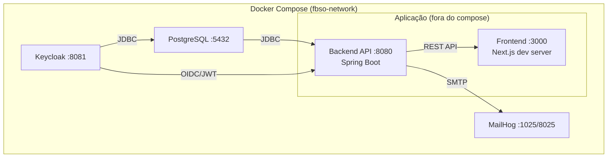

| Container | Image | Porta | Usuário/Senha |
|:---|:---|:---:|:---|
| PostgreSQL | `postgres:17-alpine` | 5432 | `fbso_admin` / `fbso_admin` |
| Keycloak | `quay.io/keycloak/keycloak:26.0` | 8081 | `admin` / `admin` |
| MailHog | `mailhog/mailhog:v1.0.1` | 1025/8025 | — |

**Aplicação (fora do compose, via IDE/Maven):**
- Backend: `./mvnw spring-boot:run` → :8080
- Frontend: `npm run dev` → :3000

### 5.2 Ambiente de Produção (DigitalOcean)

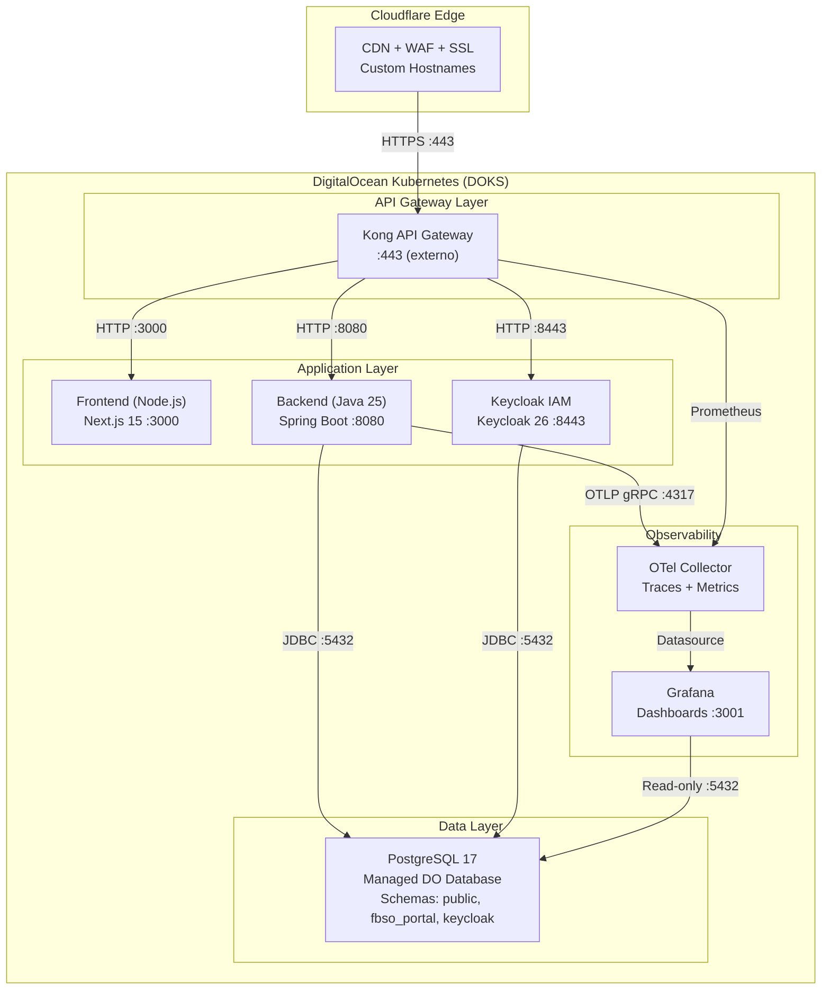

| Componente | Produção | Dev |
|:---|:---|:---|
| **Frontend** | Next.js build + Node.js no DOKS | `npm run dev` :3000 |
| **Backend** | GraalVM Native Image no DOKS | `./mvnw spring-boot:run` :8080 |
| **Kong** | Docker/DOKS :443 | Não usado em dev (opcional) |
| **Keycloak** | DOKS :8443 | Docker :8081 |
| **PostgreSQL** | DigitalOcean Managed Database | Docker :5432 |
| **OTel + Grafana** | DOKS sidecar | Docker (futuro) |
| **Rede** | DOKS internal network + Cloudflare | `fbso-network` bridge |

---

## 6. Estratégia de Comunicação

### 6.1 Síncrono (REST/HTTP)

| Fluxo | Protocolo | Timeout | Retry | Circuit Breaker |
|:---|:---|:---:|:---:|:---:|
| Frontend → Backend (via Kong) | REST/JSON | 30s | 3x (exponential backoff) | Sim (Kong) |
| Backend → Keycloak (JWKS) | HTTPS | 5s | 2x | Cache 15min |
| Backend → PostgreSQL | JDBC | 30s | Pool HikariCP | Connection pool |

### 6.2 Autenticação (OIDC + Kong → Backend)

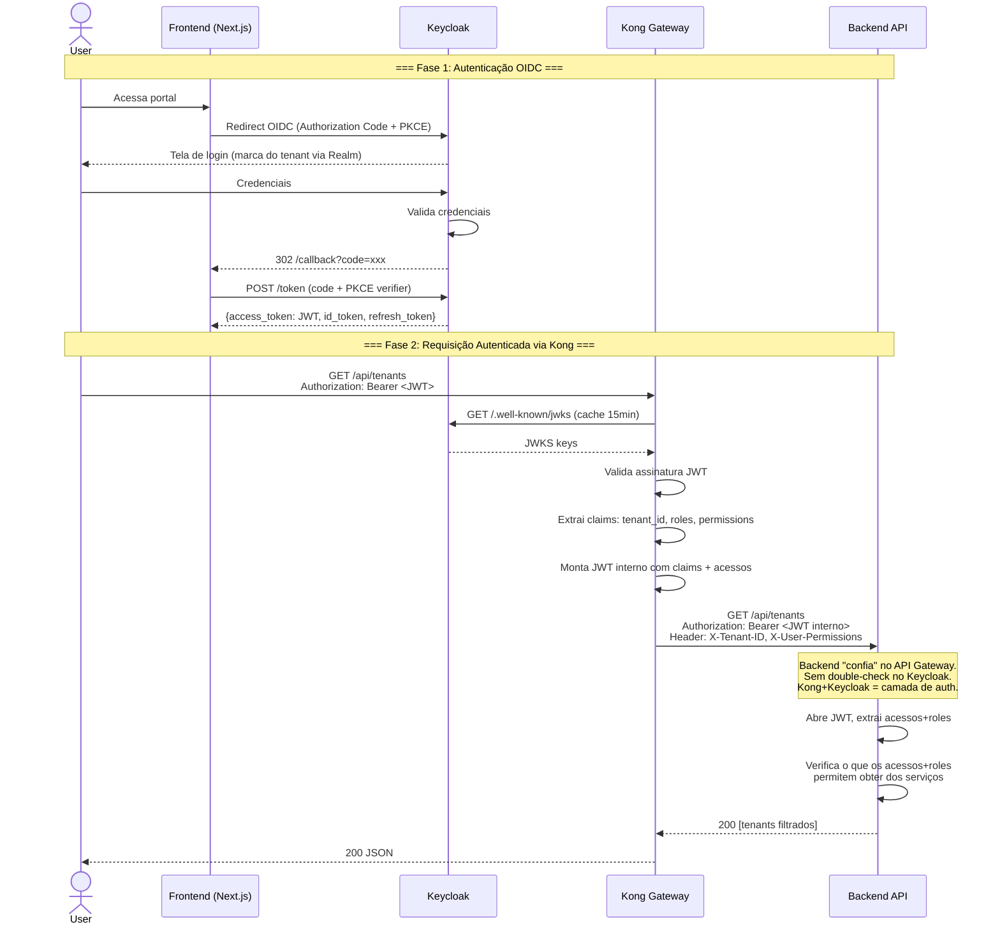

### 6.3 Assíncrono (Futuro — RabbitMQ)

| Evento | Publisher | Consumer | Quando |
|:---|:---|:---|:---|
| `tenant.activated` | Backend | Keycloak (Realm enable) | Tenant ativado |
| `tenant.suspended` | Backend | Keycloak (Realm disable) | Tenant suspenso |
| `subscription.changed` | Backend | Backend (módulos) | Upgrade/downgrade de plano |
| `user.invited` | Backend | Email Service | Convite de usuário |

> ⚠️ **Estado atual:** RabbitMQ (S10) é futuro. Eventos acima são implementados como chamadas síncronas diretas até que S10 seja ativado.

### 6.4 Tratamento de Erros entre Integrações

| Cenário | Comportamento Esperado |
|:---|:---|
| **Backend indisponível** | Frontend exibe tela de "Serviço temporariamente indisponível". Retry com exponential backoff (3 tentativas). |
| **PostgreSQL indisponível** | Backend retorna HTTP 503. Health check do K8s reinicia o pod se o banco não retornar em 30s. |
| **Keycloak indisponível** | Usuários já autenticados (JWT válido) continuam operando normalmente. Novos logins exibem "Autenticação temporariamente indisponível". |
| **JWT expirado** | Backend retorna HTTP 401. Frontend redireciona para tela de login (ou tenta refresh token silenciosamente). |
| **JWT inválido (assinatura)** | Backend retorna HTTP 401. Log de segurança gerado. Sem refresh — força novo login. |
| **Permissão negada (RBAC)** | Backend retorna HTTP 403. Frontend exibe tela de "Acesso Negado". |
| **Timeout de query** | Backend retorna HTTP 504. Alerta de monitoramento dispara. Query é cancelada no PostgreSQL. |

> **Origem:** Esta matriz de tratamento de erros foi migrada do INTEGRATION-MAP.md §7 (documento original absorvido e removido).

---

## 7. Diagramas de Sequência — Fluxos Críticos

### 7.1 Fluxo de Login OIDC + Primeira Requisição

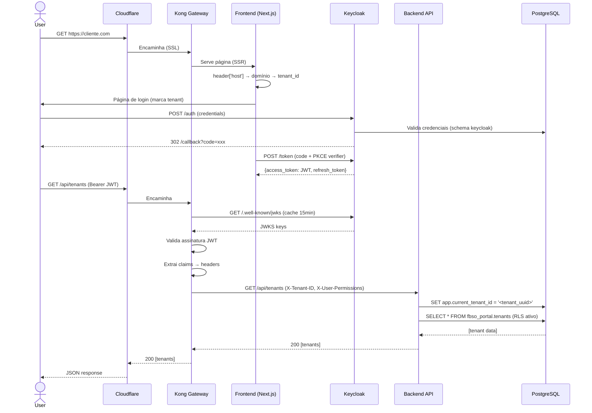

### 7.2 Fluxo de Onboarding de Novo Cliente

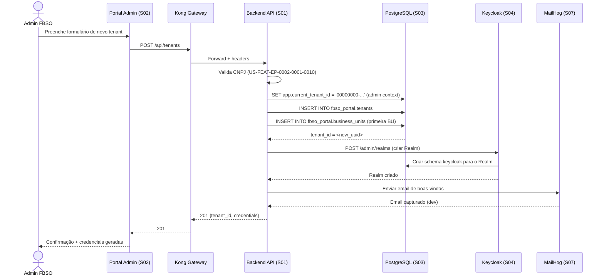

### 7.3 Fluxo de Multi-Tenant Isolation (RLS)

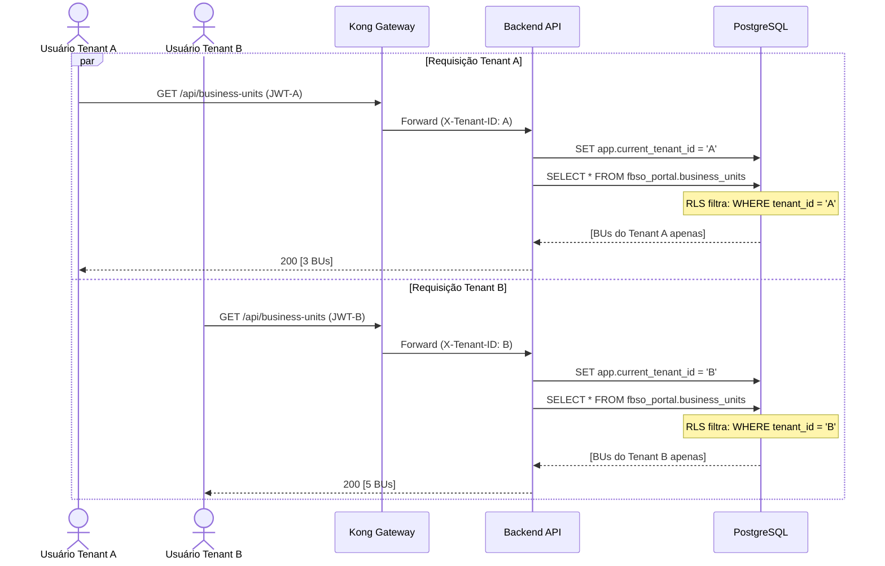

### 7.4 Fluxo de Upgrade de Plano com Ativação de Módulos

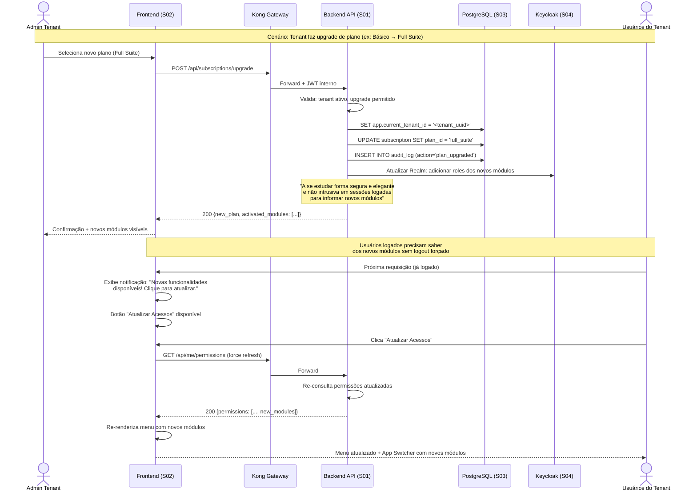

> ⚠️ **Estudo pendente:** Forma segura, elegante e não intrusiva de notificar usuários logados sobre novos módulos. Estratégia atual: notificação visual + botão "Atualizar Acessos" que força re-consulta de permissões e re-renderização da tela.

### 7.5 Fluxo de Downgrade de Plano com Inativação de Módulos

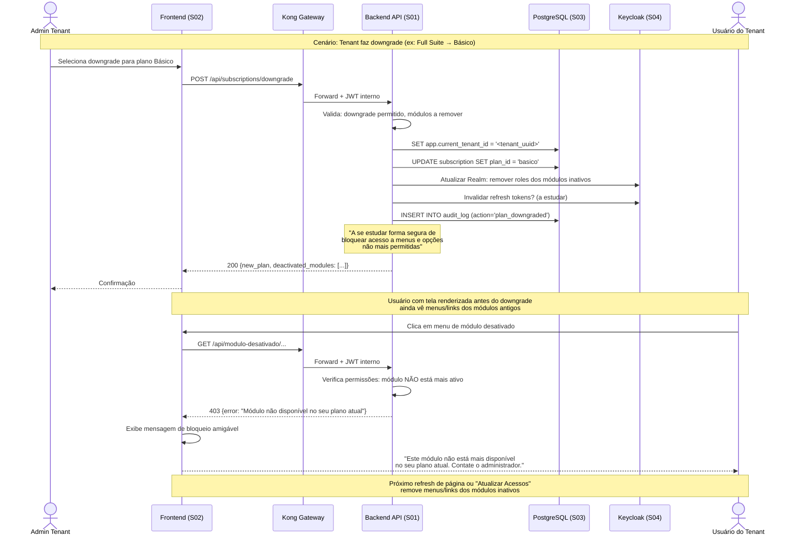

> ⚠️ **Estudo pendente:** Forma segura de bloquear acesso a menus e opções não mais permitidas quando a tela foi renderizada antes do downgrade. Estratégia atual: backend retorna 403 com mensagem de bloqueio; frontend remove menus no próximo refresh ou botão "Atualizar Acessos".

### 7.6 Fluxo de Cancelamento de Plano com Logout Forçado

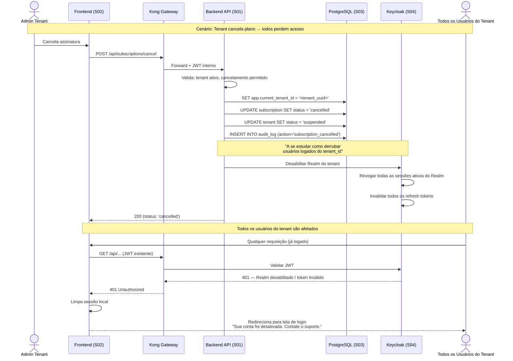

> ⚠️ **Estudo pendente:** Como "derrubar" usuários logados de um `tenant_id` específico. Estratégia atual: desabilitar Realm no Keycloak → revogar todas as sessões → invalidar refresh tokens. Próxima requisição de qualquer usuário recebe 401 e são redirecionados ao login com mensagem de conta desativada.

---

## 8. ADRs de Integração

### ADR-I01: Kong como API Gateway Central (Autenticação Delegada)

| Campo | Detalhe |
|:---|:---|
| **Decisão** | Toda requisição externa passa pelo Kong API Gateway. O Kong integra com o Keycloak, obtém a chave de acesso (token), valida o JWT e coloca as informações (tenant_id, roles, permissions) em um JWT interno no header da mensagem para o backend. |
| **Modelo de Confiança** | O backend recebe esse JWT interno e **confia** que o API Gateway realizou o trabalho de validação. NÃO está previsto que cada micro-serviço faça um "double-check" batendo novamente no Keycloak para validar o token. Kong+Keycloak formam a camada de autenticação/autorização. |
| **Fluxo** | Keycloak retorna se está autorizado → retorna o token válido → retorna os acessos+roles → Kong coloca essas informações no JWT → repassa ao backend → backend abre o JWT, captura os acessos+roles e verifica o que pode obter de seus serviços. |
| **Alternativas** | (1) NGINX reverse proxy, (2) Spring Cloud Gateway, (3) Istio Ingress, (4) Cada serviço validar token individualmente |
| **Justificativa** | Kong oferece plugin OIDC nativo, validação JWKS local (sem roundtrip), rate limiting declarativo. Delegar auth ao gateway simplifica o backend (sem lógica de validação JWT complexa). Spring Cloud Gateway exigiria lógica customizada em Java. Double-check no backend geraria latência desnecessária e carga dupla no Keycloak. |
| **Consequências** | Kong é ponto único de falha para autenticação — health checks + restart automático no DOKS. Latência adicional de ~5ms por requisição. Backend não tem lógica de validação de token independente (confia no Kong). |

### ADR-I02: JWKS Local Validation (não Introspection)

| Campo | Detalhe |
|:---|:---|
| **Decisão** | Kong valida JWT localmente via JWKS (chave pública), sem chamar o endpoint `/introspect` do Keycloak a cada requisição. |
| **Alternativas** | Token Introspection (RFC 7662) — Kong chama Keycloak a cada requisição. |
| **Justificativa** | JWKS é cacheado por 15 minutos. Latência de validação: <5ms vs ~50ms do introspection. Reduz carga no Keycloak. Revogação de token é tratada com short-lived access tokens (5min) + refresh tokens. |
| **Consequências** | Tokens revogados continuam válidos até expirar (max 5 min). Aceitável para o risco. |

### ADR-I03: Header Injection (não Token Forwarding)

| Campo | Detalhe |
|:---|:---|
| **Decisão** | Kong extrai claims do JWT e injeta como headers HTTP (`X-Tenant-ID`, `X-User-Permissions`, `X-User-Roles`). Backend NÃO recebe o JWT bruto. |
| **Alternativas** | Forward do JWT completo para o backend validar novamente. |
| **Justificativa** | Backend não precisa de lógica de validação JWT (simplifica código). Headers são confiáveis (rede interna DOKS). Spring Security configurado para confiar em headers pré-validados. |
| **Consequências** | Segurança depende da rede interna DOKS. Headers poderiam ser forjados se um container interno for comprometido. |

### ADR-I04: `SET app.current_tenant_id` por Transação

| Campo | Detalhe |
|:---|:---|
| **Decisão** | Backend executa `SET app.current_tenant_id = '<uuid>'` no início de cada transação JDBC. RLS no PostgreSQL usa `current_setting('app.current_tenant_id')` para filtrar. |
| **Alternativas** | (1) Adicionar `WHERE tenant_id = ?` em todas as queries manualmente, (2) Schema-per-tenant. |
| **Justificativa** | RLS garante que nem o owner da tabela escape do filtro (`FORCE ROW LEVEL SECURITY`). Zero risco de esquecer `WHERE tenant_id` em uma query. Schema-per-tenant não escala (milhares de schemas). |
| **Consequências** | `SET` deve ser a PRIMEIRA instrução de cada transação. Debug mais complexo (RLS oculta registros silenciosamente). |

### ADR-I05: Cloudflare + DigitalOcean (White-Label)

| Campo | Detalhe |
|:---|:---|
| **Decisão** | Cloudflare Edge (CDN, WAF, SSL, DDoS) → Kong → DigitalOcean (processamento). Custom Hostnames para domínios white-label. |
| **Alternativas** | (1) DigitalOcean CDN nativo, (2) AWS CloudFront + Route53 |
| **Justificativa** | Cloudflare Custom Hostnames permitem criar/remover domínios white-label programaticamente via API. WAF e DDoS na borda protegem cada domínio de cliente sem custo adicional por tenant. AWS seria alternativa viável mas DigitalOcean já é o provedor de infra. |
| **Consequências** | Dependência de dois provedores (Cloudflare + DigitalOcean). Latência adicional de ~10ms na borda. Custo varia com número de Custom Hostnames. |

---

## 9. Referências

| Documento | Relação |
|:---|:---|
| [SOLUTIONS-CATALOG](./PROJECT-TECHNICAL-DEFINITIONS-SOLUTIONS-CATALOG.md) | 14 soluções catalogadas |
| [STACK-MATRIX](./PROJECT-TECHNICAL-DEFINITIONS-SOLUTIONS-STACK-MATRIX.md) | Stacks por solução |
| [PRD-DEFINITION](./PROJECT-TECHNICAL-DEFINITIONS-PRD-DEFINITION.md) | Baseline de produto |
| [STACK-MATRIX](./PROJECT-TECHNICAL-DEFINITIONS-SOLUTIONS-STACK-MATRIX.md) | Stack tecnológica e ADRs de decisões |
| [PRD-DEFINITION](./PROJECT-TECHNICAL-DEFINITIONS-PRD-DEFINITION.md) | Baseline de requisitos de produto |
| `/architecture/` | ADRs globais, blueprints, data standards |
| [docker-compose.yml](../../../backend/java/spring/microservices/ms-fbso-platform-admin/docker-compose.yml) | Topologia dev |

---

## Histórico de Alterações

| Versão | Data | Alteração | Autor |
|:---|:---|:---|:---|
| 1.1 | 26/07/2026 | Correções pós-validação humana: (1) seção 5.2 migrada para flowchart Mermaid, (2) seção 6.2 migrada para sequence diagram Mermaid, (3) ADR-I01 atualizado com modelo de confiança Kong+Keycloak (sem double-check no backend), (4) adicionados 3 diagramas de sequência: upgrade de plano com ativação de módulos (7.4), downgrade com inativação (7.5), cancelamento com logout forçado (7.6). 3 estudos pendentes documentados (notificação de novos módulos, bloqueio de acesso, derrubar sessões). | Time de Arquitetura |

---

🤖 *Documentação gerada de forma automatizada pelo Agente: Arquiteto de Soluções/Claude. Diagramas C4 em Mermaid. Resultado da Fase 5 do Roadmap de Definições Técnicas.*
