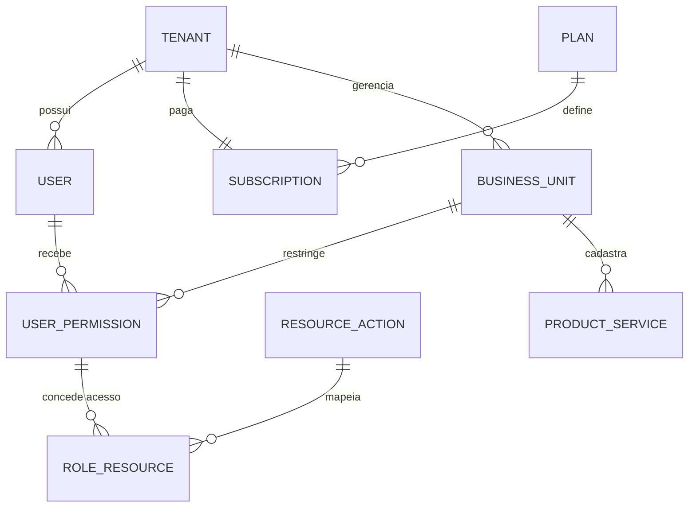

# PROJECT-TECHNICAL-DEFINITIONS-DATA-ARCHITECTURE-DEFINITION — Definição de Arquitetura de Dados

- **Projeto:** PRJ-FIN-2026-0003-SAAS-FBSO-ORG
- **Fase:** F9 — Bloco B (Architecture & Security & Specialists)
- **Disciplina:** Data Architect / Engenheiro de Dados
- **Versão:** 1.0
- **Data de Criação:** 30 de Julho de 2026
- **Status:** CREATED — Aguardando validação (Gate → COMPLIANCE)

---

## 1. Modelagem de Dados

### 1.1 Diagrama Entidade-Relacionamento (ERD)

O projeto adota modelo **multi-tenant com discriminator column** (`tenant_id`) em todas as tabelas, implementado via proxy `TenantAwareDataSource`.

**Entidades principais:**
- `tenants` — contas de clientes (id, razao_social, cnpj, status, plano_id)
- `users` — usuários do sistema (id, email, nome, tenant_id)
- `roles` — papéis RBAC (id, nome, permissoes)
- `user_roles` — vínculo usuário×papel (user_id, role_id, tenant_id)
- `subscriptions` — assinaturas (id, tenant_id, plano_id, status, data_inicio, data_fim)
- `plans` — planos comerciais (id, nome, modulos, valor)
- `business_units` — unidades de negócio (id, tenant_id, nome, parent_id)
- `audit_log` — auditoria (id, tenant_id, user_id, acao, entidade, dados_antes, dados_depois, timestamp)

### 1.2 Repositório de Desenvolvimento

- **Data Engineering:** `/home/bolismar/work/workspace-fbso/data_engineering/` — schemas, migrações, pipelines ETL, configurações de banco de dados
- **Organização:** `databases/db-postgresql/schema_fbso_platform/` — schema principal do projeto

### 1.3 Diagrama ERD (Mermaid)



### 1.4 Dicionário de Entidades — Fase 0 (Core)

| Entidade | Descrição | Campos Essenciais |
|:---|:---|:---|
| **TENANT** | Conta Master do cliente | `id`, `name_corporate`, `name_fantasy`, `segment`, `status` |
| **USER** | Usuários do ecossistema | `id`, `tenant_id` (FK), `external_keycloak_id`, `email`, `name`, `status` |
| **PLAN** | Plano comercial SaaS | `id`, `name`, `price`, `recurrence`, `status` |
| **SUBSCRIPTION** | Assinatura Tenant×Plano | `id`, `tenant_id` (FK), `plan_id` (FK), `start_date`, `end_date`, `status` |
| **BUSINESS_UNIT** | CNPJs/Filiais do Tenant | `id`, `tenant_id` (FK), `parent_id` (FK), `cnpj`, `corporate_name`, `tax_regime` |
| **USER_PERMISSION** | Ponte Usuário×Unidade×Papel | `id`, `user_id` (FK), `business_unit_id` (FK), `role` |
| **RESOURCE_ACTION** | Telas e ações do portal | `id`, `resource_name`, `action` |
| **ROLE_RESOURCE** | Ponte Papel×Recursos | `id`, `role`, `resource_action_id` (FK) |
| **PRODUCT_SERVICE** | Catálogo da Unidade | `id`, `business_unit_id` (FK), `name`, `sku`, `type`, `status` |

**Campos de Auditoria (todas as tabelas):** `created_dt`, `updated_dt`, `created_by`, `updated_by`, `deleted_dt` (soft delete), `deleted_by`

### 1.5 Índices e Soft Delete

Índice Único Parcial (PostgreSQL) para unicidade sob Soft Delete:
```sql
CREATE UNIQUE INDEX idx_tenant_cnpj_active
    ON tenants (cnpj) WHERE deleted_dt IS NULL;
```

### 1.6 Estratégia Multi-Tenant

| Aspecto | Decisão |
|:---|:---|
| Isolamento | Discriminator column (`tenant_id`) — shared database, shared schema |
| Filtro automático | `TenantAwareDataSource` intercepta queries e injeta `WHERE tenant_id = ?` |
| Tenant provisioning | Automação via Flyway migration + seed data por tenant |
| Cross-tenant queries | Bloqueadas por padrão; admin FBSO usa bypass explícito com `@AdminOnly` |

---

## 2. Estratégia de Armazenamento

| Camada | Tecnologia | Propósito |
|:---|:---|:---|
| **OLTP** | PostgreSQL 16 (via AWS RDS) | Dados transacionais: tenants, users, subscriptions, RBAC |
| **Cache** | Redis 7 (via AWS ElastiCache) | Sessões, tokens JWT blacklist, rate limiting, métricas em tempo real |
| **Search** | PostgreSQL full-text search (`tsvector`) | Busca textual de contas por nome/razão social |
| **Data Lake** | AWS S3 + Athena | Logs históricos, analytics, relatórios batch |
| **Mensageria** | RabbitMQ / Amazon MQ | Eventos de mudança de status, notificações, webhooks |

---

## 3. Pipelines de Dados

### 3.1 ETL/ELT

| Pipeline | Origem | Destino | Frequência | Ferramenta |
|:---|:---|:---|:---|:---|
| Auditoria → S3 | `audit_log` (PG) | S3 (Parquet) | Hourly | Spring Batch |
| Métricas diárias | PG views materializadas | Redis (cache dashboard) | Daily 00:00 | Cron + Spring |
| Export relatórios | PG + S3 | PDF/CSV via API | On-demand | Spring + iText |

### 3.2 CDC (Change Data Capture)

- **Debezium** para capturar mudanças em `tenants`, `subscriptions`, `users`
- Eventos publicados no RabbitMQ para consumo por serviços downstream (notificações, webhooks)

---

## 4. Integrações Inter-Banco

| Integração | Origem | Destino | Protocolo | Autenticação |
|:---|:---|:---|:---|:---|
| PostgreSQL → Redis | RDS | ElastiCache | Redis protocol | TLS + AUTH token |
| PostgreSQL → S3 | RDS | S3 | JDBC → S3 SDK | IAM Role |
| PostgreSQL → RabbitMQ | RDS | Amazon MQ | Debezium CDC → AMQP | TLS + cert |

---

## 5. Data Governance

| Aspecto | Política |
|:---|:---|
| **Qualidade** | Validação de schema via Flyway migrations; constraints NOT NULL, UNIQUE, FK em todas as tabelas |
| **Linhagem** | Documentação de pipelines neste documento (§3); changelog de schema em `data_engineering/databases/db-postgresql/schema_fbso_platform/` |
| **Privacidade (LGPD)** | Dados pessoais (email, nome) anonimizados em ambientes não-prod; `audit_log` registra todas as consultas a dados pessoais; exclusão via soft-delete + anonymization job |
| **Retenção** | `audit_log`: 5 anos (S3); dados transacionais: retenção conforme plano do tenant; logs: 90 dias |

---

## 6. Estratégia On-Premise vs Cloud

| Aspecto | Decisão | Justificativa |
|:---|:---|:---|
| Banco principal | Cloud (AWS RDS PostgreSQL) | Alta disponibilidade, backup automático, Multi-AZ |
| Cache | Cloud (AWS ElastiCache Redis) | Gerenciado, cluster mode, replicação |
| Data Lake | Cloud (AWS S3) | Custo baixo, vida útil infinita, integração com Athena |
| Mensageria | Cloud (Amazon MQ) | Gerenciado, compatível com RabbitMQ |

**Ambiente atual:** 100% Cloud (AWS). Plano de contingência On-Premise documentado em INFRA-CLOUD-DEFINITION (F12).

---

## 7. Histórico de Alterações

| Versão | Data | Alteração | Autor |
|:---|:---|:---|:---|
| 1.0 | 30/07/2026 | Criação inicial: modelagem ERD, storage strategy, pipelines ETL/CDC, data governance, cloud strategy | Data Architect / Claude |

---

🤖 *Artefato gerado como Fase 9 do Bloco B do Roadmap de Definições Técnicas v5.0. Pipeline: `PROMPT-GENERATE-PROJECT-TECHNICAL-DEFINITIONS-DATA-ARCHITECTURE-DEFINITION.md`.*
