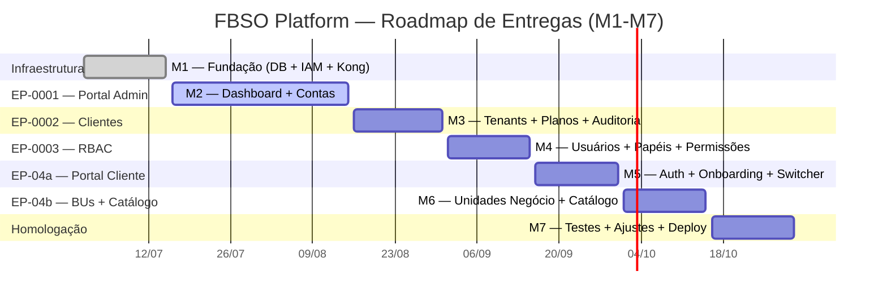
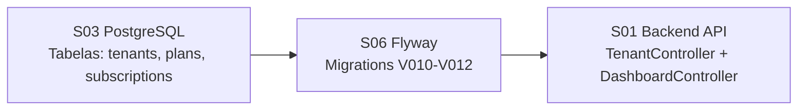
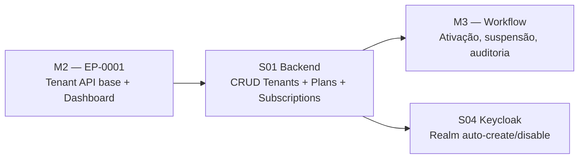
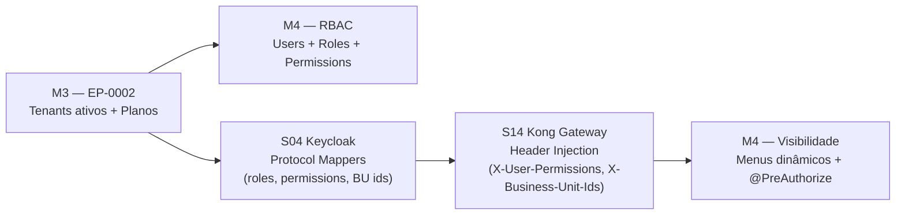
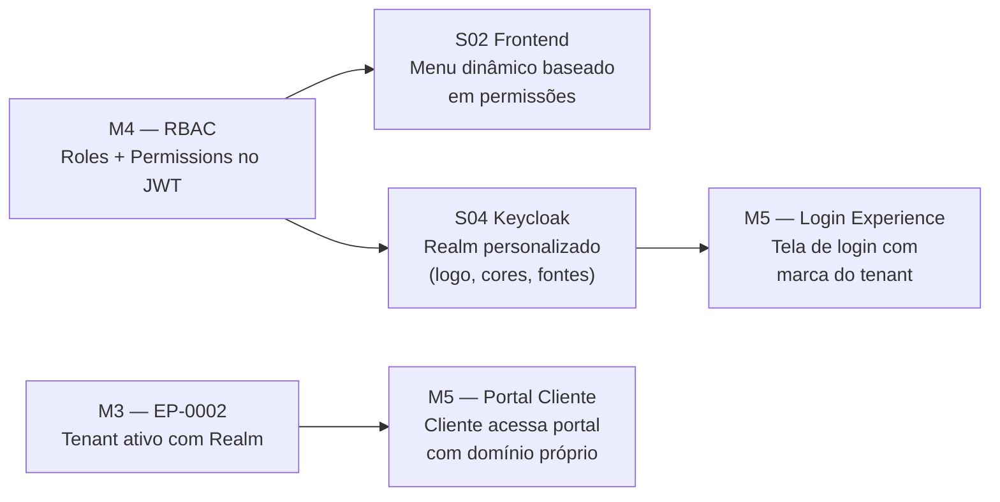
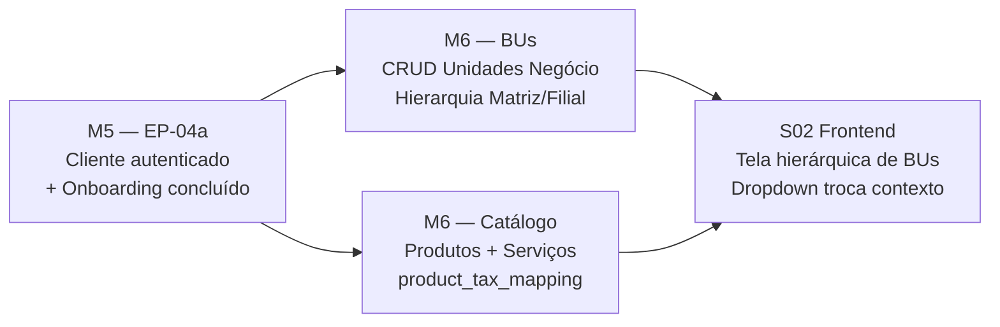
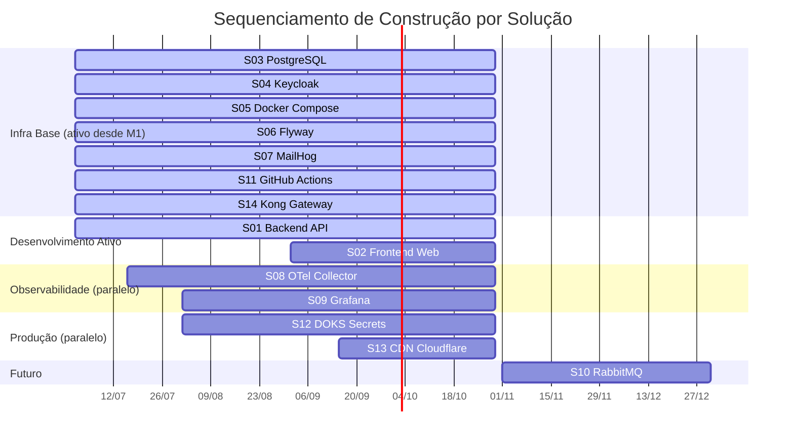

# PROJECT-TECHNICAL-DEFINITIONS-MILESTONES — Roadmap de Milestones Técnicos

- **Projeto:** PRJ-FIN-2026-0003-SAAS-FBSO-ORG
- **Programa:** FBSO Platform — Portal Administrativo SaaS
- **Versão:** 1.2
- **Data de Criação:** 26 de Julho de 2026
- **Última Atualização:** 27 de Julho de 2026 (alinhamento com docs de negócio v1.2)
- **Documentos Complementares:** [TEAM-SKILLS-MAP](./PROJECT-TECHNICAL-DEFINITIONS-TEAM-SKILLS-MAP.md) (Discovery Team) · [TEAM-CAPACITY](./PROJECT-TECHNICAL-DEFINITIONS-TEAM-CAPACITY.md) · [PRD-DEFINITION](./PROJECT-TECHNICAL-DEFINITIONS-PRD-DEFINITION.md) · [SPECS-DEFINITION](./PROJECT-TECHNICAL-DEFINITIONS-SPECS-DEFINITION.md)

---

- **Baseline de Negócio:** [Project Charter v1.2](../01-PROJECT-CHARTER-PRJ-FIN-2026-0003-SAAS-FBSO-ORG.md), [BRD v1.2](../02-BRD-PRJ-FIN-2026-0003-SAAS-FBSO-ORG.md), [Épicos v1.2](../03-EPICS-PRJ-FIN-2026-0003-SAAS-FBSO-ORG.md), [Features FEAT-EP-](../04-FEATURES-PRJ-FIN-2026-0003-SAAS-FBSO-ORG.md)

## 1. Visão Geral do Roadmap

---

## 2. Milestones Técnicos

### M1 — Fundação e Infraestrutura

| Campo | Detalhe |
|:---|:---|
| **Data** | 15 de Julho de 2026 ✅ (concluído) |
| **Entrega** | D1 — Infraestrutura e setup inicial |
| **Status** | ✅ COMPLETO |

#### Soluções Entregues

| Solução | Entregável | Estado |
|:---|:---|:---:|
| S03 PostgreSQL | Schema `fbso_portal` + RLS + índices | ✅ |
| S04 Keycloak | Realms template + OIDC client | ✅ |
| S05 Docker Compose | Ambiente dev com postgres, keycloak, mailhog | ✅ |
| S06 Flyway | Migrations iniciais (V001-V00X) | ✅ |
| S07 MailHog | Captura de emails dev | ✅ |
| S11 GitHub Actions | `pr-checks.yml` com SAST + Secret Scanning | ✅ |
| S14 Kong Gateway | Plugin OIDC + Rate Limiting configurados | ✅ |

#### Critérios de Aceitação

- [x] `docker compose up -d` sobe todos os serviços sem erro
- [x] Keycloak acessível em :8081 com realm `fbso-admin` funcional
- [x] PostgreSQL com schemas `public`, `fbso_portal`, `keycloak` criados
- [x] RLS ativado com `FORCE` em tabelas do `fbso_portal`
- [x] `pr-checks.yml` executando Semgrep + Gitleaks
- [x] Kong validando JWT e injetando headers

---

### M2 — Portal Admin (Dashboard + Contas)

| Campo | Detalhe |
|:---|:---|
| **Data** | 15 de Agosto de 2026 |
| **Entrega** | D2 — Portal Admin Interno |
| **Épico** | EP-0001 |
| **Status** | 🔄 EM PROGRESSO |

#### Features e User Stories

| Feature | US | Soluções |
|:---|:---|:---|
| FEAT-EP-0001-0001 Dashboard | US-FEAT-EP-0001-0001-0001, US-FEAT-EP-0001-0001-0002, US-FEAT-EP-0001-0001-0003 | S01, S03 |
| FEAT-EP-0001-0002 Visão de Contas | US-FEAT-EP-0001-0002-0004, US-FEAT-EP-0001-0002-0005 | S01, S03 |
| FEAT-EP-0001-0003 Alertas (Should) | US-FEAT-EP-0001-0003-0006, US-FEAT-EP-0001-0003-0007 | S01, S03 |

#### Soluções Afetadas

| Solução | O que Construir |
|:---|:---|
| **S01 Backend** | `TenantController` (GET list, GET by id, filtros). `DashboardController` (métricas: contas ativas, status, planos). Queries analíticas com agregação. |
| **S03 PostgreSQL** | Tabelas: `tenants`, `plans`, `subscriptions`. Índices para queries de dashboard. |
| **S06 Flyway** | Migrations V010-V012 (tabelas base de tenants e métricas). |

#### Dependências

#### Riscos

| Risco | Mitigação |
|:---|:---|
| Frontend sem dev dedicado (Tom só em 01/11) | Dashboard é 100% backend neste milestone. Frontend do EP-0001 feito por Bolismar como full-stack. |
| Maria Madalena (★☆☆) em tarefas backend | Tasks de complexidade baixa: testes, validação de DTOs, documentação de endpoints. |

#### Critérios de Aceitação

- [ ] `GET /api/v1/tenants` retorna lista paginada com filtros (status, plano, busca textual)
- [ ] `GET /api/v1/dashboard` retorna métricas: total contas ativas, por status, por plano
- [ ] Dashboard carrega em ≤ 3 segundos com 1000 tenants
- [ ] Filtros de período (7, 30, 90 dias) recalcularm métricas corretamente
- [ ] `GET /api/v1/tenants?search=Super` retorna "Supermercado ABC" e "Super Limpo Ltda"
- [ ] RLS ativo: admin FBSO vê todos os tenants (tenant_id = null context)

---

### M3 — Clientes e Assinaturas

| Campo | Detalhe |
|:---|:---|
| **Data** | 31 de Agosto de 2026 |
| **Entrega** | D3 — Gestão de clientes, planos e assinaturas |
| **Épico** | EP-0002 |
| **Status** | ⏳ PENDENTE |

#### Features e User Stories

| Feature | US | Soluções |
|:---|:---|:---|
| FEAT-EP-0002-0001 Cadastro Contas | US-FEAT-EP-0002-0001-0008 a US-FEAT-EP-0002-0001-0011 | S01, S03, S04, S07 |
| FEAT-EP-0002-0002 Gestão Status | US-FEAT-EP-0002-0002-0012 a US-FEAT-EP-0002-0002-0014 | S01, S03 |
| FEAT-EP-0002-0003 Config Planos | US-FEAT-EP-0002-0003-0015 a US-FEAT-EP-0002-0003-0018 | S01, S03 |
| FEAT-EP-0002-0004 Vinculação Assinaturas | US-FEAT-EP-0002-0004-0019 a US-FEAT-EP-0002-0004-0021 | S01, S03 |
| FEAT-EP-0002-0005 Auditoria | US-FEAT-EP-0002-0005-0022, US-FEAT-EP-0002-0005-0023 | S01, S03 |

#### Soluções Afetadas

| Solução | O que Construir |
|:---|:---|
| **S01** | CRUD Tenants (create, update, activate, suspend). CRUD Plans + `plan_modules`. Subscription workflow (vinculação, upgrade, downgrade). Audit log automático. Validação CNPJ. |
| **S03** | Tabelas: `subscriptions`, `plan_modules`, `audit_log`. Trigger para `audit_log`. |
| **S04** | Criação automática de Realm ao ativar tenant (ADR-I01). Desabilitar Realm ao suspender. |
| **S06** | Migrations V013-V018. |
| **S07** | Template de email de boas-vindas + ativação. |

#### Dependências

#### Riscos

| Risco | Mitigação |
|:---|:---|
| Fluxo de criação de Realm no Keycloak via API | Testar no Sprint 0 com realm template. Documentar timeout e retry. |
| Validação CNPJ (US-FEAT-EP-0002-0001-0010) | Integrar com `ms-cnpj-validacao` se disponível, ou mock no MVP. |
| Maria Madalena (★☆☆) | Continuar com tasks de baixa complexidade + pair programming. |

#### Critérios de Aceitação

- [ ] `POST /api/v1/tenants` cria tenant + primeira BU + Realm Keycloak automaticamente
- [ ] `POST /api/v1/tenants/{id}/activate` envia email, ativa Realm, muda status
- [ ] `POST /api/v1/plans` cria plano com `plan_modules` associativo
- [ ] `POST /api/v1/subscriptions` vincula tenant a plano com data de início
- [ ] `POST /api/v1/subscriptions/upgrade` altera plano e adiciona roles no Realm
- [ ] Toda ação administrativa gera registro em `audit_log` (quem, quando, o quê)
- [ ] `GET /api/v1/audit-log?tenantId=X&from=Y&to=Z` retorna registros filtrados

---

### M4 — RBAC (Usuários e Permissões)

| Campo | Detalhe |
|:---|:---|
| **Data** | 15 de Setembro de 2026 |
| **Entrega** | D4 — Gestão de usuários e permissões |
| **Épico** | EP-0003 |
| **Status** | ⏳ PENDENTE |

#### Features e User Stories

| Feature | US | Soluções |
|:---|:---|:---|
| FEAT-EP-0003-0001 Cadastro Usuários | US-FEAT-EP-0003-0001-0024 a US-FEAT-EP-0003-0001-0026 | S01, S03, S04, S07 |
| FEAT-EP-0003-0002 RBAC | US-FEAT-EP-0003-0002-0027 a US-FEAT-EP-0003-0002-0030 | S01, S03, S04 |
| FEAT-EP-0003-0003 Vínculo BU+Módulo | US-FEAT-EP-0003-0003-0031 a US-FEAT-EP-0003-0003-0033 | S01, S03, S04 |
| FEAT-EP-0003-0004 Visibilidade | US-FEAT-EP-0003-0004-0034 a US-FEAT-EP-0003-0004-0036 | S01, S02, S04, S14 |

#### Soluções Afetadas

| Solução | O que Construir |
|:---|:---|
| **S01** | `UserController`, `RoleController`, `PermissionController`. `PermissionEvaluator` customizado. `TenantContextFilter` completo. |
| **S02** | 🔴 Início previsto do frontend (Tom Santos em 01/11). Até lá: Bolismar faz telas críticas de RBAC. |
| **S03** | Tabelas: `users`, `roles`, `permissions`, `user_roles`, `role_permissions`, `user_business_units`. |
| **S04** | Protocol Mappers para injetar `roles` + `permissions` + `business_unit_ids` no JWT. |
| **S07** | Template de email de convite de usuário. |
| **S14** | Kong injetando headers `X-User-Roles`, `X-User-Permissions`, `X-Business-Unit-Ids`. |

#### Dependências

#### Riscos

| Risco | Mitigação |
|:---|:---|
| Frontend RBAC (Telas de gestão de papéis) sem dev dedicado | Bolismar prioriza telas de RBAC. Tom chega em 01/11 e assume. |
| Complexidade do modelo RBAC (roles + permissions + BUs) | Bruno (SA) revisa design. Testes de regressão RBAC automatizados. |

#### Critérios de Aceitação

- [ ] `POST /api/v1/users/invite` envia email com link de ativação
- [ ] `POST /api/v1/roles` cria papel customizado com permissões granulares
- [ ] `POST /api/v1/users/{id}/roles` atribui papéis a usuário
- [ ] JWT contém claims: `roles`, `permissions`, `business_unit_ids`
- [ ] Kong injeta headers `X-User-Permissions` corretamente
- [ ] `@PreAuthorize("hasPermission('CATALOG_WRITE')")` bloqueia acesso sem permissão
- [ ] Usuário sem permissão recebe 403 (não 500)

---

### M5 — Portal do Cliente (Auth + Onboarding + App Switcher)

| Campo | Detalhe |
|:---|:---|
| **Data** | 30 de Setembro de 2026 |
| **Entrega** | D5 — Portal do Cliente (parte 1) |
| **Épico** | EP-04a |
| **Status** | ⏳ PENDENTE |

#### Features e User Stories

| Feature | US | Soluções |
|:---|:---|:---|
| FEAT-EP-0004-0001 Autenticação | US-FEAT-EP-0004-0001-0037 a US-FEAT-EP-0004-0001-0039 | S01, S02, S04, S14 |
| FEAT-EP-0004-0002 Onboarding | US-FEAT-EP-0004-0002-0040 a US-FEAT-EP-0004-0002-0044 | S01, S02, S03 |
| FEAT-EP-0004-0003 Dashboard Cliente (Should) | US-FEAT-EP-0004-0003-0045, US-FEAT-EP-0004-0003-0046 | S01, S02 |
| FEAT-EP-0004-0004 App Switcher | US-FEAT-EP-0004-0004-0047 a US-FEAT-EP-0004-0004-0049 | S01, S02, S04 |

#### Soluções Afetadas

| Solução | O que Construir |
|:---|:---|
| **S01** | Endpoints de onboarding (wizard steps). `GET /api/v1/me` (perfil). `GET /api/v1/me/modules` (módulos ativos). `GET /api/v1/me/dashboard` (métricas do tenant). |
| **S02** | Tela de login (OIDC redirect). Wizard de 4 passos. Dashboard do cliente. App Switcher funcional. Menu dinâmico. 🔴 Sem Tom ainda — Bolismar cobre. |
| **S04** | Personalização de login por Realm (logo, cores, fontes do tenant). |
| **S14** | Rate limiting por tenant. Rotas públicas para onboarding. |

#### Dependências

#### Riscos

| Risco | Mitigação |
|:---|:---|
| **Frontend intensivo sem dev dedicado** | 🔴 Crítico. Todo o EP-04a é frontend. Bolismar full-stack precisa entregar sozinho. Features Should Have (FEAT-EP-0004-0003 Dashboard Cliente) podem ser postergadas. |
| Onboarding wizard com 4 passos de estado | Usar Zustand para gerenciar estado do wizard. Persistir progresso no backend. |
| App Switcher com módulos dinâmicos | Estrutura de dados preparada desde M3 (`plan_modules`). |

#### Critérios de Aceitação

- [ ] Login OIDC funcional: redirect → Keycloak → callback → JWT → sessão
- [ ] Keycloak exibe tela de login com logo + cores do tenant
- [ ] Wizard de 4 passos concluído com criação da primeira BU
- [ ] App Switcher exibe módulos ativos do plano contratado
- [ ] Menu lateral renderizado conforme permissões do usuário
- [ ] `GET /api/v1/me/dashboard` retorna métricas do tenant
- [ ] Recuperação de senha funcional (email → reset → novo login)

---

### M6 — Unidades de Negócio e Catálogo

| Campo | Detalhe |
|:---|:---|
| **Data** | 15 de Outubro de 2026 |
| **Entrega** | D6 — Unidades de negócio e catálogo |
| **Épico** | EP-04b |
| **Status** | ⏳ PENDENTE |

#### Features e User Stories

| Feature | US | Soluções |
|:---|:---|:---|
| FEAT-EP-0004-0005 Unidades Negócio | US-FEAT-EP-0004-0005-0050 a US-FEAT-EP-0004-0005-0054 | S01, S02, S03 |
| FEAT-EP-0004-0006 Catálogo Produtos | US-FEAT-EP-0004-0006-0055 a US-FEAT-EP-0004-0006-0058 | S01, S02, S03 |

#### Soluções Afetadas

| Solução | O que Construir |
|:---|:---|
| **S01** | CRUD Business Units com hierarquia Matriz/Filial. CRUD Product Catalog. `product_tax_mapping` (schema definido, sem regras). |
| **S02** | Interfaces: lista hierárquica de BUs, cadastro/edição. Cards/tabela de catálogo. |
| **S03** | Tabelas: `business_units` (hierarquia: `parent_bu_id`), `products`, `product_tax_mapping`. |
| **S06** | Migrations finais. |

#### Dependências

#### Risco

| Risco | Mitigação |
|:---|:---|
| Tom Santos chega em 01/11 — M6 ainda sem ele | Bolismar entrega sozinho. Features de frontend simplificadas. |

#### Critérios de Aceitação

- [ ] `POST /api/v1/business-units` cria BU com vínculo hierárquico (Matriz/Filial)
- [ ] `GET /api/v1/business-units` retorna árvore hierárquica
- [ ] `POST /api/v1/products` cadastra produto com tipo e classificação
- [ ] `product_tax_mapping` criada com schema definido (interface para Tributali-Engine)
- [ ] Troca de contexto entre BUs no frontend (dropdown)
- [ ] Usuário vinculado a múltiplas BUs vê dados da BU selecionada

---

### M7 — Homologação Final

| Campo | Detalhe |
|:---|:---|
| **Data** | 30 de Outubro de 2026 |
| **Entrega** | D7 — Homologação e ajustes |
| **Status** | ⏳ PENDENTE |

#### Atividades

| Atividade | Soluções | Responsável |
|:---|:---|:---|
| Testes de regressão completos (58 US) | S01, S02 | Felipe (QA) |
| Testes de performance (JMeter) | S01 | Felipe + Bolismar |
| Testes de segurança (OWASP ZAP) | S01, S02, S14 | Felipe + Davi |
| Testes de isolamento multi-tenant | S01, S03 | Carlos (DB) + QA |
| Correções de bugs | S01, S02 | Time completo |
| Documentação final | Todos | Francisco (TL) |
| Deploy staging (DOKS) | Todos | Davi (DevOps) |
| Homologação de negócio | S02 | Mauro (BA) |

#### Critérios de Aceitação

- [ ] 100% das user stories com testes passando (58/58)
- [ ] Zero vulnerabilidades críticas no SAST/Security Scan
- [ ] Teste de carga: 50 tenants simultâneos, 500 usuários, p95 < 500ms
- [ ] Teste de isolamento: zero vazamento cross-tenant
- [ ] Deploy staging funcional no DOKS
- [ ] Homologação de negócio aprovada por Mauro (BA)

---

## 3. Sequenciamento de Soluções

---

## 4. Capacidade vs. Demanda por Milestone

| Milestone | Features | Semanas | Backend (h) | Frontend (h) | QA (h) | Risco Capacidade |
|:---|:---:|:---:|:---:|:---:|:---:|:---|
| M2 (EP-0001) | 2-3 | 4 | 320h (2 devs × 40h × 4semanas) | 160h (Bolismar full-stack) | 80h | 🟢 OK |
| M3 (EP-0002) | 5 | 2 | 160h | — (backend-heavy) | 80h | 🟡 2 semanas é apertado para 5 features |
| M4 (EP-0003) | 4 | 2 | 160h | 80h (telas RBAC) | 80h | 🟡 Frontend sem Tom |
| M5 (EP-04a) | 3-4 | 2 | 120h | 200h (frontend intensivo!) | 80h | 🔴 Frontend intensivo sem dev dedicado |
| M6 (EP-04b) | 2 | 2 | 120h | 120h | 80h | 🟡 Tom chega 01/11 (após M6) |
| M7 (Homolog) | — | 2 | 80h | 80h | 160h | 🟢 OK |

> ⚠️ **Alerta M5:** Frontend intensivo (portal cliente, onboarding, wizard, app switcher) com apenas Bolismar full-stack. Risco 🔴 de atraso. Recomendação: antecipar contratação/re-alocação de frontend developer.

---

## 5. Referências

| Documento | Relação |
|:---|:---|
| [01-PROJECT-CHARTER](../01-PROJECT-CHARTER-PRJ-FIN-2026-0003-SAAS-FBSO-ORG.md) | Marcos M1-M7 originais |
| [04-FEATURES](../04-FEATURES-PRJ-FIN-2026-0003-SAAS-FBSO-ORG.md) | 18 features, datas-alvo |
| [PRD-DEFINITION](./PROJECT-TECHNICAL-DEFINITIONS-PRD-DEFINITION.md) | MVP, entregas D1-D7 |
| [TEAM-CAPACITY](./PROJECT-TECHNICAL-DEFINITIONS-TEAM-CAPACITY.md) | Horas/semana por profissional |

---

## Histórico de Alterações

| Versão | Data | Alteração | Autor |
|:---|:---|:---|:---|
| 1.0 | 26/07/2026 | Criação inicial: 7 milestones técnicos (M1-M7), soluções por milestone, features/US cobertas, dependências, sequenciamento, critérios de aceitação, capacidade vs demanda, riscos. | Time de Arquitetura |
| 1.1 | 26/07/2026 | Diagramas Mermaid: (1) seção 1 — Gantt chart do roadmap M1-M7, (2) seções M2-M6 — 5 flowcharts de dependências substituindo texto ASCII, (3) seção 3 — Gantt chart de sequenciamento de 14 soluções. | Time de Arquitetura |

---

🤖 *Documentação gerada de forma automatizada pelo Agente: Arquiteto de Soluções/Claude. Resultado da Fase 8 do Roadmap de Definições Técnicas.*
