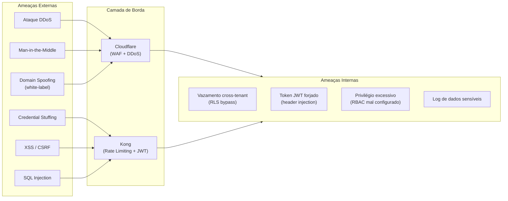
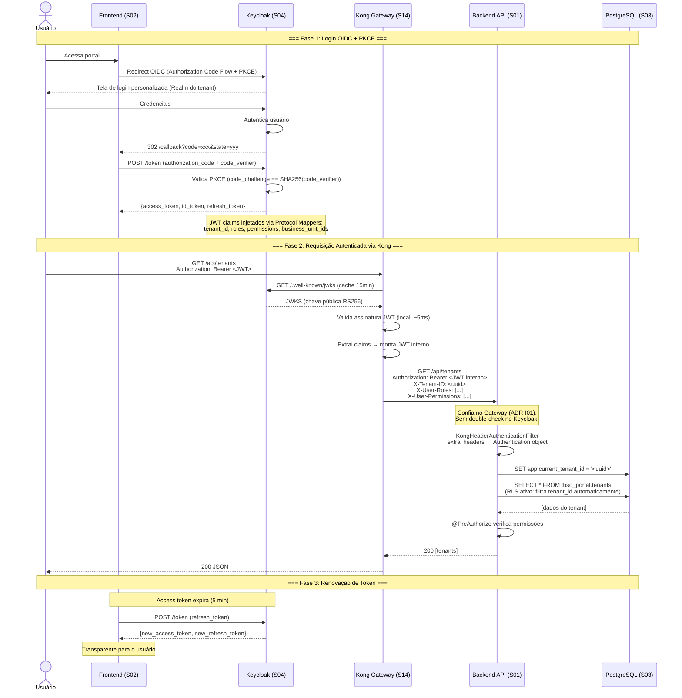

# PROJECT-TECHNICAL-DEFINITIONS-SECURITY-DEFINITION — Definição de Segurança do Projeto

- **Projeto:** PRJ-FIN-2026-0003-SAAS-FBSO-ORG
- **Programa:** FBSO Platform — Portal Administrativo SaaS
- **Versão:** 1.1
- **Data de Criação:** 26 de Julho de 2026
- **Última Atualização:** 26 de Julho de 2026 (seção 4.1 migrada para sequence diagram Mermaid)
- **Documento Mestre:** [GLOBAL-SECURITY.md](../../../.specs/security/GLOBAL-SECURITY.md) — este documento o especializa para o projeto
- **Documentos Complementares:** [ARCHITECTURE-DEFINITION](./PROJECT-TECHNICAL-DEFINITIONS-ARCHITECTURE-DEFINITION.md) · [STACK-MATRIX](./PROJECT-TECHNICAL-DEFINITIONS-SOLUTIONS-STACK-MATRIX.md)

---

## 1. Objetivo

Este documento **especializa** o [GLOBAL-SECURITY.md](../../../.specs/security/GLOBAL-SECURITY.md) para o contexto do projeto FBSO Platform. Ele NÃO repete as regras de ouro e o checklist SDD — ele os **aplica** ao contexto concreto das 14 soluções, stacks e integrações do projeto, definindo ameaças, controles, políticas de IAM, secrets, criptografia e pipeline DevSecOps.

---

## 2. Regras de Ouro — Aplicação ao Projeto

### 2.1 Menor Privilégio (GLOBAL-SECURITY.md §1.1)

| Regra Global | Aplicação no Projeto |
|:---|:---|
| Novos recursos são privados por padrão | Todo endpoint REST começa com `@PreAuthorize` exigindo role mínimo. Nenhum endpoint público sem autorização explícita no PRD. |
| Acesso granular por role | RBAC implementado em 3 camadas: Keycloak (roles + permissions como claims JWT) → Kong (header injection) → Backend (Spring Security `@PreAuthorize`). |

**Matriz de Roles × Acesso por Solução:**

| Role | S01 Backend | S02 Frontend | S04 Keycloak |
|:---|:---|:---|:---|
| `ROLE_FBSO_ADMIN` | Acesso total (admin context) | Portal Admin completo | — |
| `ROLE_TENANT_ADMIN` | Dados do próprio tenant | Portal Cliente admin | Gerencia usuários do Realm |
| `ROLE_TENANT_MANAGER` | Dados da sua BU | Portal Cliente restrito | — |
| `ROLE_TENANT_OPERATOR` | Leitura catálogo | Portal Cliente somente leitura | — |

### 2.2 Zero Hardcoded Secrets (GLOBAL-SECURITY.md §1.2)

| Regra Global | Aplicação no Projeto |
|:---|:---|
| Nunca hardcodar secrets | Todas as credenciais em variáveis de ambiente ou Kubernetes Secrets (DOKS). Nenhum secret em `application.yml`, `.env` commitado, ou código Java. |
| Secret scanning no CI/CD | GitHub Actions pipeline (`pr-checks.yml`) roda Semgrep + Gitleaks. Bloqueia merge se detectar secrets. |

**Secrets por Ambiente:**

| Secret | Dev (Docker Compose) | Produção (DOKS) |
|:---|:---|:---|
| `DB_PASSWORD` | `docker-compose.yml` (não commitado) | DOKS Secret → env var |
| `KEYCLOAK_ADMIN_PASSWORD` | `docker-compose.yml` | DOKS Secret |
| `JWT_SIGNING_KEY` | Keycloak auto-gerado | DOKS Secret (rotacionado) |
| `KONG_ADMIN_TOKEN` | — | DOKS Secret |
| `CLOUDFLARE_API_TOKEN` | — | DOKS Secret |

### 2.3 Não Confiar no Input do Usuário (GLOBAL-SECURITY.md §1.3)

| Regra Global | Aplicação no Projeto |
|:---|:---|
| Sanitizar todo input | Spring Validation (`@Valid`) em todos os DTOs. Zod no frontend (validação de formulários). Kong bloqueia payloads > 10MB. |
| XSS | React com JSX (escaping automático). Headers: `Content-Security-Policy`, `X-Content-Type-Options: nosniff`. |
| SQL Injection | Spring Data JDBC com prepared statements. RLS no PostgreSQL como camada adicional. |

---

## 3. Threat Model (Nível Macro)

### 3.1 Superfícies de Ataque



### 3.2 Matriz de Ameaças × Controles

| # | Ameaça | Severidade | Superfície | Controle Primário | Controle Secundário |
|:---|:---|:---:|:---|:---|:---|
| T1 | **Vazamento cross-tenant** | 🔴 Crítica | PostgreSQL | RLS com `FORCE` + `SET app.current_tenant_id` | Testes de isolamento 100% |
| T2 | **Token JWT forjado** | 🔴 Crítica | Kong → Backend | Kong valida JWT via JWKS. Rede interna DOKS. | Backend confia no header (ADR-I03) |
| T3 | **Credential Stuffing** | 🔴 Crítica | Keycloak | Rate limiting no Kong. OIDC + PKCE. | Lockout após N tentativas no Keycloak |
| T4 | **DDoS em tenant específico** | 🟡 Média | Cloudflare | WAF + DDoS protection na Cloudflare Edge | Rate limiting por domínio no Kong |
| T5 | **Acesso não autorizado a endpoint** | 🟡 Média | Backend API | `@PreAuthorize` + Kong extrai permissions → headers | Auditoria de acessos |
| T6 | **SQL Injection** | 🟡 Média | Backend → PostgreSQL | Prepared statements (Spring Data JDBC). RLS como defesa em profundidade. | — |
| T7 | **XSS** | 🟡 Média | Frontend | React JSX escaping. CSP headers. Input validation com Zod. | — |
| T8 | **Man-in-the-Middle** | 🟡 Média | Todas as rotas | TLS 1.3 (Cloudflare → Kong → interno). HSTS. | — |
| T9 | **Domain Spoofing (white-label)** | 🟡 Média | Cloudflare | Custom Hostnames com validação CNAME. SSL automático. | Frontend valida host header |
| T10 | **Log de dados sensíveis** | 🟢 Baixa | Backend | SLF4J filter: nunca loga `password`, `token`, `cpf`. | Code review |
| T11 | **RBAC mal configurado** | 🟢 Baixa | Keycloak + Backend | Testes de regressão RBAC. Permissions versionadas no `realm-config.json`. | — |
| T12 | **Secrets expostos em repositório** | 🔴 Crítica | GitHub | Gitleaks + Semgrep no CI/CD. Bloqueio de merge. | `.gitignore` validado |

---

## 4. Estratégia de IAM Cross-Solution

### 4.1 Fluxo de Autenticação/Autorização



### 4.2 Keycloak — Configuração de Realms

| Configuração | Detalhe |
|:---|:---|
| **Master Realm** | Apenas administração do Keycloak. Não usado pela aplicação. |
| **Realm `fbso-admin`** | Administradores internos FBSO.ORG. Gerencia tenants, planos, usuários globais. |
| **Realm por Tenant** | Um Realm por cliente. Isolamento total: clientes OIDC, roles, permissions, mapeamentos de claim independentes. |
| **Client OIDC** | `fbso-portal` — configurado com Authorization Code + PKCE. Redirect URIs restritas aos domínios do tenant. |
| **Protocol Mappers** | `tenant_id` → UUID do tenant. `roles` → lista de roles do usuário. `permissions` → lista de permissões granulares. `business_unit_ids` → UUIDs das BUs do usuário. |

### 4.3 Kong — Validação e Enriquecimento

| Configuração | Detalhe |
|:---|:---|
| **Plugin OIDC** | Configurado por rota. JWKS endpoint: `https://keycloak:8443/realms/{realm}/protocol/openid-connect/certs`. Cache: 15 minutos. |
| **Rate Limiting** | 100 req/s por IP (global). 20 req/s por tenant (header `X-Tenant-ID`). |
| **Header Injection** | `X-Tenant-ID`, `X-User-Id`, `X-User-Roles`, `X-User-Permissions`, `X-Business-Unit-Ids` |
| **IP Whitelist (admin)** | Rotas `/api/admin/*` restritas a IPs internos FBSO.ORG. |

### 4.4 Backend — Consumo de Headers

| Configuração | Detalhe |
|:---|:---|
| **Spring Security Filter** | `KongHeaderAuthenticationFilter` — extrai headers, cria `Authentication` object com authorities. |
| **`@PreAuthorize`** | `hasRole('TENANT_ADMIN')`, `hasPermission('CATALOG_WRITE')`. Resolução via `PermissionEvaluator` customizado. |
| **Tenant Context** | `TenantContextFilter` — extrai `X-Tenant-ID` → `SET app.current_tenant_id` no JDBC. |

---

## 5. Segurança de APIs

### 5.1 Headers de Segurança Obrigatórios

| Header | Valor | Onde |
|:---|:---|:---|
| `Strict-Transport-Security` | `max-age=31536000; includeSubDomains; preload` | Kong |
| `Content-Security-Policy` | `default-src 'self'; script-src 'self'; style-src 'self' 'unsafe-inline'` | Kong + Frontend |
| `X-Content-Type-Options` | `nosniff` | Kong |
| `X-Frame-Options` | `DENY` | Kong |
| `X-XSS-Protection` | `0` (deprecated, CSP cobre) | Kong |
| `Referrer-Policy` | `strict-origin-when-cross-origin` | Kong |
| `Cache-Control` | `no-store` (para endpoints autenticados) | Backend |

### 5.2 CORS

| Ambiente | Allowed Origins |
|:---|:---|
| **Dev** | `http://localhost:3000` |
| **Staging** | `https://staging.fbso.com` |
| **Produção** | `https://fbso.com` + domínios white-label (validados via Cloudflare) |

> ⚠️ **Nunca `Origin: *` em produção.**

### 5.3 Rate Limiting por Endpoint

| Endpoint | Limit | Justificativa |
|:---|:---|:---|
| `/auth/*` | 10 req/min por IP | Brute force protection |
| `/api/admin/*` | 100 req/min | Uso interno apenas |
| `/api/public/*` | 30 req/min por tenant | Evitar abuso cross-tenant |
| Demais `/api/*` | 60 req/min por tenant | Uso normal |

---

## 6. Criptografia em Trânsito e em Repouso

### 6.1 Em Trânsito

| Conexão | Protocolo | Versão Mínima |
|:---|:---|:---|
| Cliente → Cloudflare | HTTPS/TLS | TLS 1.3 |
| Cloudflare → Kong | HTTPS/TLS | TLS 1.3 |
| Kong → Backend | HTTP (rede interna DOKS) | — |
| Kong → Keycloak | HTTPS/TLS | TLS 1.3 |
| Backend → PostgreSQL | TLS (Managed DO Database) | TLS 1.3 |
| Keycloak → PostgreSQL | TLS | TLS 1.3 |
| Backend → OTel Collector | gRPC (interno) | — |

### 6.2 Em Repouso

| Dado | Algoritmo | Onde |
|:---|:---|:---|
| **Senhas de usuários** | bcrypt (Keycloak default) | Keycloak |
| **Senhas de admin** | bcrypt | Keycloak |
| **JWT Signing Key** | RS256 (asimétrico) | Keycloak — rotacionado a cada 90 dias |
| **Dados em disco** | Criptografia de volume (DigitalOcean) | DOKS + Managed Database |

---

## 7. Pipeline DevSecOps

### 7.1 Workflow `pr-checks.yml`

```yaml
name: PR Security Checks
on: [pull_request]

jobs:
  sast:
    runs-on: ubuntu-24.04
    steps:
      - uses: actions/checkout@v4
      - name: Semgrep SAST
        uses: semgrep/semgrep-action@v1
        with:
          config: p/default
      - name: CodeQL Analysis
        uses: github/codeql-action/analyze@v3

  secret-scanning:
    runs-on: ubuntu-24.04
    steps:
      - uses: actions/checkout@v4
        with:
          fetch-depth: 0  # Full history para detectar secrets em commits antigos
      - name: Gitleaks
        uses: gitleaks/gitleaks-action@v2

  dependency-check:
    runs-on: ubuntu-24.04
    steps:
      - name: OWASP Dependency Check (Maven)
        run: ./mvnw dependency-check:check
      - name: npm audit (Frontend)
        run: cd frontend && npm audit --audit-level=high
```

### 7.2 Gates de Segurança

| Gate | Ferramenta | Critério de Bloqueio |
|:---|:---|:---|
| **SAST** | Semgrep + CodeQL | Severidade `critical` ou `high` → bloqueia merge |
| **Secrets** | Gitleaks | Qualquer detecção → bloqueia merge |
| **Dependências** | OWASP DC + npm audit | Vulnerabilidade `critical` → bloqueia merge. `high` → alerta. |
| **Container** | Trivy (futuro) | Vulnerabilidade `critical` na imagem → bloqueia deploy |

---

## 8. Matriz de Conformidade Regulatória

### 8.1 LGPD (Lei Geral de Proteção de Dados)

| Requisito LGPD | Aplicação no Projeto | Soluções Afetadas |
|:---|:---|:---|
| **Art. 6º — Finalidade** | Dados coletados apenas para operação do SaaS (gestão de tenants, usuários, catálogo). | S01, S03 |
| **Art. 7º — Base Legal** | Consentimento (cadastro) + Execução de contrato (assinatura). | S01, S02 |
| **Art. 18 — Direitos do Titular** | Exportação de dados do tenant (futuro). Exclusão lógica (Soft Delete). | S01, S03 |
| **Art. 46 — Segurança** | RLS, criptografia, Kong rate limiting. | S01, S03, S04, S14 |
| **Art. 48 — Comunicação de Incidente** | Log de auditoria (`audit_log`) registra acessos e ações. | S01, S03 |
| **Dados Sensíveis** | CNPJ, razão social (dados de pessoa jurídica — menor sensibilidade). Sem CPF de pessoa física nesta fase. | S01, S03 |

### 8.2 Outras Regulamentações

| Regulamentação | Status | Observação |
|:---|:---|:---|
| **PCI DSS** | Não aplicável (MVP) | Sem processamento de pagamentos. Será aplicável quando houver faturamento. |
| **SOC 2** | Não aplicável (MVP) | Avaliar quando houver clientes enterprise exigindo. |
| **ISO 27001** | Referência | Boas práticas adotadas (controles de acesso, criptografia, auditoria) sem certificação formal. |

---

## 9. Checklist de Segurança por Sprint

### Sprint 0 (Setup)

- [ ] Kong configurado com plugin OIDC + Rate Limiting
- [ ] Keycloak com realms `fbso-admin` e realm template para tenants
- [ ] Gitleaks + Semgrep no GitHub Actions (`pr-checks.yml`)
- [ ] `.gitignore` validado (sem `.env`, `*.pem`, `*.jks`)
- [ ] ADRs de segurança publicados (ADR-002 RLS, ADR-003 OIDC)

### Sprint 1 (EP-01)

- [ ] RLS ativado com `FORCE` em todas as tabelas
- [ ] Spring Security configurado com `KongHeaderAuthenticationFilter`
- [ ] Testes de isolamento multi-tenant (CA-01)
- [ ] Headers de segurança HTTP configurados no Kong

### Toda Sprint

- [ ] `pr-checks.yml` passando (sem secrets, sem vulns críticas)
- [ ] Nenhum `System.out.println` com dados sensíveis
- [ ] Code review obrigatório em queries SQL (tenant_id presente?)
- [ ] Soft Delete em todas as operações de remoção

---

## 10. Referências

| Documento | Relação |
|:---|:---|
| [GLOBAL-SECURITY.md](../../../.specs/security/GLOBAL-SECURITY.md) | Documento mestre de segurança |
| [ARCHITECTURE-DEFINITION](./PROJECT-TECHNICAL-DEFINITIONS-ARCHITECTURE-DEFINITION.md) | Superfícies de ataque por solução |
| [PRD-DEFINITION](./PROJECT-TECHNICAL-DEFINITIONS-PRD-DEFINITION.md) | Funcionalidades a proteger |
| [SOLUTIONS-CATALOG](./PROJECT-TECHNICAL-DEFINITIONS-SOLUTIONS-CATALOG.md) | 14 soluções no escopo de segurança |
| [STACK-MATRIX](./PROJECT-TECHNICAL-DEFINITIONS-SOLUTIONS-STACK-MATRIX.md) | Versões de tecnologias de segurança |

---

## Histórico de Alterações

| Versão | Data | Alteração | Autor |
|:---|:---|:---|:---|
| 1.0 | 26/07/2026 | Criação inicial: regras de ouro aplicadas ao projeto, threat model com 12 ameaças, IAM cross-solution, políticas de API security, criptografia, pipeline DevSecOps, matriz LGPD, checklist por sprint. | Time de Arquitetura |
| 1.1 | 26/07/2026 | Seção 4.1 migrada para sequence diagram Mermaid (3 fases: Login OIDC+PKCE, Requisição via Kong, Refresh Token). | Time de Arquitetura |

---

🤖 *Documentação gerada de forma automatizada pelo Agente: Arquiteto de Soluções/Claude. Especialização do GLOBAL-SECURITY.md para o contexto FBSO Platform. Resultado da Fase 6 do Roadmap de Definições Técnicas.*
