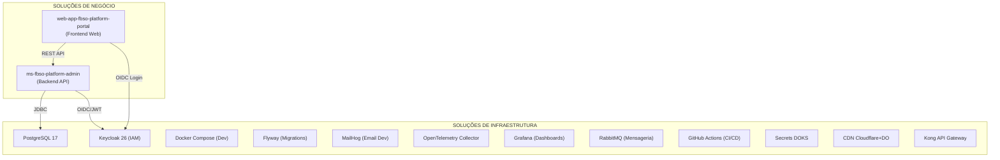
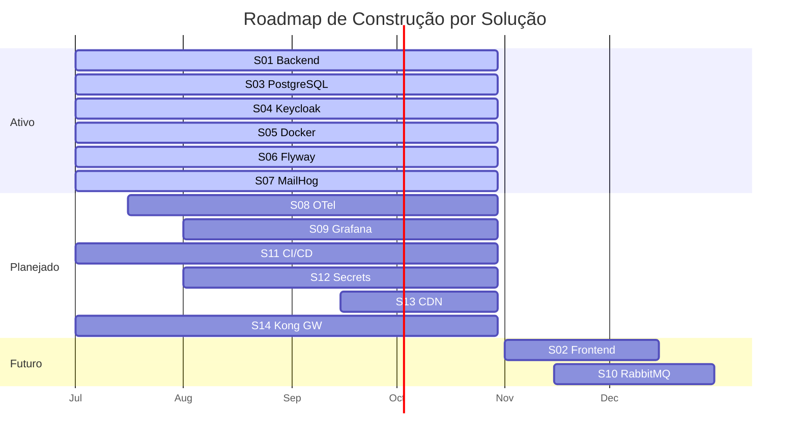
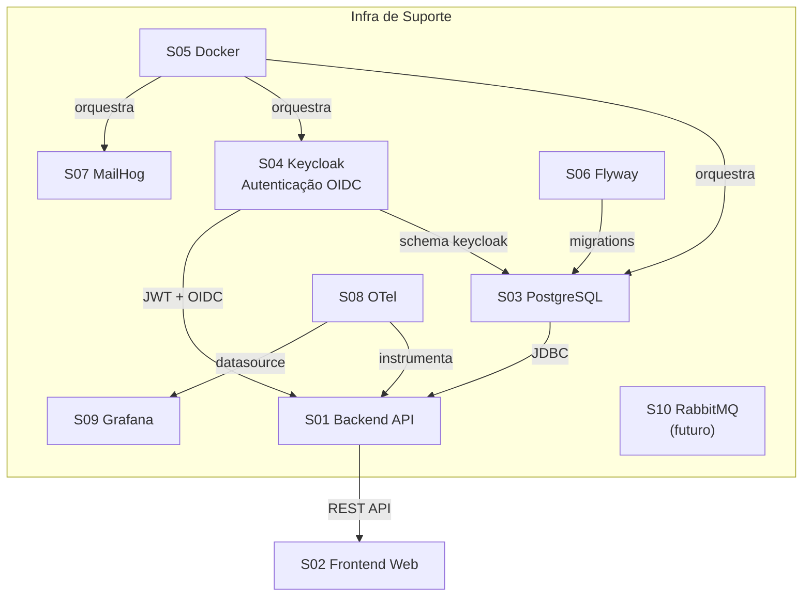

# PROJECT-TECHNICAL-DEFINITIONS-SOLUTIONS-CATALOG — Catálogo de Soluções Técnicas

- **Projeto:** PRJ-FIN-2026-0003-SAAS-FBSO-ORG
- **Programa:** FBSO Platform — Portal Administrativo SaaS
- **Versão:** 1.4
- **Data de Criação:** 25 de Julho de 2026
- **Última Atualização:** 27 de Julho de 2026 (alinhamento IDs de épicos/features com docs de negócio v1.2)
- **Status:** ✅ COMPLIANCE — Validado pelo Time de Arquitetura
- **Baseline de Negócio:** [Project Charter v1.2](../01-PROJECT-CHARTER-PRJ-FIN-2026-0003-SAAS-FBSO-ORG.md), [BRD v1.2](../02-BRD-PRJ-FIN-2026-0003-SAAS-FBSO-ORG.md), [Épicos v1.2](../03-EPICS-PRJ-FIN-2026-0003-SAAS-FBSO-ORG.md), [Features FEAT-EP-](../04-FEATURES-PRJ-FIN-2026-0003-SAAS-FBSO-ORG.md)
- **Documentos Complementares:** [TEAM-MAP](./PROJECT-TECHNICAL-DEFINITIONS-TEAM-MAP.md) · [TEAM-CAPACITY](./PROJECT-TECHNICAL-DEFINITIONS-TEAM-CAPACITY.md)

---

## 1. Objetivo

Este documento cataloga exaustivamente todas as **soluções técnicas** que compõem o projeto FBSO Platform — serviços, bancos de dados, provedores de identidade, frontends, ferramentas de infraestrutura, observabilidade e integrações. Cada solução é descrita com seu propósito, tipo, estado atual, prioridade e responsável técnico.

Serve como:
- **Mapa arquitetural:** Visão completa do ecossistema técnico do projeto
- **Referência de dependências:** O que cada solução precisa para funcionar
- **Plano de construção:** O que existe, o que precisa ser criado, o que é futuro

---

## 2. Visão Geral do Ecossistema



### 2.1 Distribuição por Tipo

| Tipo | Quantidade | Soluções |
|:---|:---:|:---|
| Backend API | 1 | ms-fbso-platform-admin |
| Frontend Web | 1 | web-app-fbso-platform-portal |
| Banco de Dados | 1 | PostgreSQL 17 |
| IAM / Segurança | 1 | Keycloak 26 |
| API Gateway | 1 | Kong API Gateway |
| Migrations | 1 | Flyway |
| Dev Environment | 1 | Docker Compose + MailHog |
| CI/CD | 1 | GitHub Actions |
| Secrets Management | 1 | DOKS Secrets (DigitalOcean Kubernetes) |
| CDN | 1 | Cloudflare + DigitalOcean |
| Observabilidade | 2 | OpenTelemetry Collector, Grafana |
| Mensageria | 1 | RabbitMQ |

---

## 3. Catálogo de Soluções

### 3.1 Soluções de Negócio (Aplicações)

---

#### S01 — ms-fbso-platform-admin (Backend API)

| Atributo | Valor |
|:---|:---|
| **ID** | S01 |
| **Nome Técnico** | `ms-fbso-platform-admin` |
| **Tipo** | Backend API — Monolítico Modular REST |
| **Propósito** | API central da FBSO Platform. Gerencia tenants, planos, assinaturas, usuários, permissões (RBAC), unidades de negócio e catálogo de produtos. Backend único que serve tanto o Portal Admin Interno quanto o Portal do Cliente. |
| **Stack** | Java 25 LTS, Spring Boot 3.5.14, Spring Security, Spring Data JDBC, Spring Validation, Maven, Oracle GraalVM 25.0.3+9.1 (Native Image) |
| **Estado Atual** | ✅ Existente — em desenvolvimento (Sprint 5 concluído) |
| **Maturidade** | v0.1.0-SNAPSHOT — funcionalidades EP-0001 e EP-0002 parcialmente implementadas |
| **Prioridade** | 🔴 Must Have — Core do projeto |
| **Épicos Relacionados** | EP-0001 (Portal Admin), EP-0002 (Clientes/Assinaturas), EP-0003 (RBAC), EP-0004 (Portal do Cliente) |
| **Dependências** | PostgreSQL 17 (S03), Keycloak 26 (S04), Flyway (S06) |
| **Owner Técnico** | Tech Lead (Francisco Oliveira) + Backend Team (Bolismar Oliveira, Maria Madalena) |
| **Repositório** | `backend/java/spring/microservices/ms-fbso-platform-admin/` |
| **Porta** | 8080 (app) |

**Estrutura de Pacotes (package-by-layer):**

| Camada | Pacote | Responsabilidade |
|:---|:---|:---|
| Controller | `controller/` | Endpoints REST — Tenant, Plan, Subscription, User, Permission, BusinessUnit, ProductCatalog, Dashboard |
| Service | `service/` | Lógica de negócio, validações, orquestração |
| Repository | `repository/` | Acesso a dados via Spring Data JDBC |
| Entity | `entity/` | Modelos de domínio com campos de auditoria |
| DTO | `dto/` | Objetos de transferência (request/response) |
| Config | `config/` | Configurações Spring, CORS, segurança, multi-tenant |
| Security | `security/` | Filtros JWT, extração de tenant_id, RBAC interceptor |
| Exception | `exception/` | Handlers globais de erro |
| Common | `common/` | Constantes, anotações customizadas |
| Enums | `enums/` | Enumerações (Status, Roles, PlanType) |
| Utils | `utils/` | Utilitários |

**Cobertura de Testes:**

| Tipo | Localização | Estado |
|:---|:---|:---|
| Unitários | `test/.../unit/` | ✅ Existente (exception, validator) |
| Integração | `test/.../integration/` | ✅ Existente (controller, repository, aspect, security) |
| Segurança | `test/.../security/` | ✅ Existente (owasp, multitenant, rbac) |

---

#### S02 — web-app-fbso-platform-portal (Frontend Web)

| Atributo | Valor |
|:---|:---|
| **ID** | S02 |
| **Nome Técnico** | `web-app-fbso-platform-portal` |
| **Tipo** | Frontend Web — Single Page Application (SPA) com SSR |
| **Propósito** | Interface web unificada da FBSO Platform. Duas áreas: (1) Portal Admin Interno — dashboard operacional, gestão de tenants, planos, usuários; (2) Portal do Cliente — onboarding, autenticação, dashboard, catálogo, app switcher. |
| **Stack** | React 19+, Next.js (App Router), Tailwind CSS, TypeScript, Playwright (testes E2E), MSW (mock API) |
| **Estado Atual** | 🔮 Planejado — início previsto para 01/11/2026 (chegada do Frontend Developer Tom Santos) |
| **Maturidade** | Pré-projeto — arquitetura definida no planejamento técnico original, sem código. Bolismar Oliveira fará setup inicial (Next.js + Tailwind) antes de 01/11 para não zerar o frontend. |
| **Prioridade** | 🔴 Must Have — Entrega D5 (Portal do Cliente), M5 (30/09/2026) |
| **Épicos Relacionados** | EP-0001 (Portal Admin — dashboards), EP-0002 (gestão de tenants/planos — interfaces admin), EP-0003 (gestão de usuários/permissões — interfaces admin), EP-0004 (Portal do Cliente — todas as interfaces) |
| **Dependências** | S01 (ms-fbso-platform-admin — API REST), S04 (Keycloak — autenticação) |
| **Owner Técnico** | Full-Stack (Bolismar Oliveira) até 01/11/2026 → Frontend (Tom Santos) assume |
| **Repositório** | `frontend/javascript/react/web_apps/web_app-fbso-platform-portal/` (a criar) |
| **Porta** | 3000 (dev) |

**Módulos Previstos:**

| Módulo | Área | Features |
|:---|:---|:---|
| Admin Dashboard | Portal Admin | FEAT-EP-0001-0001, FEAT-EP-0001-0002, FEAT-EP-0001-0003 |
| Tenant Manager | Portal Admin | FEAT-EP-0002-0001, FEAT-EP-0002-0002 |
| Plan & Subscription | Portal Admin | FEAT-EP-0002-0003, FEAT-EP-0002-0004, FEAT-EP-0002-0005 |
| User & RBAC Manager | Portal Admin | FEAT-EP-0003-0001, FEAT-EP-0003-0002, FEAT-EP-0003-0003, FEAT-EP-0003-0004 |
| Client Onboarding | Portal Cliente | FEAT-EP-0004-0001, FEAT-EP-0004-0002 |
| Client Dashboard | Portal Cliente | FEAT-EP-0004-0003 |
| App Switcher | Portal Cliente | FEAT-EP-0004-0004 |
| Business Units | Portal Cliente | FEAT-EP-0004-0005 |
| Product Catalog | Portal Cliente | FEAT-EP-0004-0006 |

---

### 3.2 Soluções de Infraestrutura

---

#### S03 — PostgreSQL 17 (Banco de Dados)

| Atributo | Valor |
|:---|:---|
| **ID** | S03 |
| **Nome Técnico** | `fbso_platform` (database) |
| **Tipo** | Banco de Dados Relacional |
| **Propósito** | Persistência de todos os dados operacionais da plataforma: tenants, planos, assinaturas, usuários, permissões, unidades de negócio, catálogo de produtos, registros de auditoria. |
| **Stack** | PostgreSQL 17 (Alpine), Docker |
| **Estado Atual** | ✅ Existente — configurado no docker-compose.yml |
| **Maturidade** | Produção-ready para ambiente dev. Schema em evolução via Flyway. |
| **Prioridade** | 🔴 Must Have — Sem banco, nada funciona |
| **Épicos Relacionados** | Todos (EP-0001 a EP-0004) |
| **Dependências** | Nenhuma (serviço base) |
| **Owner Técnico** | DB Developer (Carlos Caldas) + Backend Team |
| **Container** | `postgres:17-alpine` — porta 5432 |
| **Modelo de Dados** | Multi-Tenant lógico — coluna `tenant_id` em todas as tabelas operacionais. Soft Delete (`deleted_dt`). Campos de auditoria (`created_dt`, `updated_dt`, `created_by`, `updated_by`, `deleted_dt`, `deleted_by`). |
| **Schema Keycloak** | Schema separado `keycloak` para tabelas do IAM |

---

#### S04 — Keycloak 26 (Identity & Access Management)

| Atributo | Valor |
|:---|:---|
| **ID** | S04 |
| **Nome Técnico** | `fbso-keycloak` |
| **Tipo** | Identity Provider (IdP) — IAM |
| **Propósito** | Autenticação centralizada (SAML 2.0 para SSO corporativo + OAuth 2.0/OIDC), emissão de tokens JWT com roles e permissões, gerenciamento de realms e clients. |
| **Stack** | Keycloak 26.0, PostgreSQL (schema `keycloak`), Docker |
| **Estado Atual** | ✅ Existente — configurado no docker-compose.yml |
| **Maturidade** | Dev-ready. Realm config via `realm-config.json`. SAML e OIDC configurados. |
| **Prioridade** | 🔴 Must Have — Autenticação é obrigatória para todas as features |
| **Épicos Relacionados** | EP-0003 (RBAC), EP-0004 (Autenticação Cliente) |
| **Dependências** | PostgreSQL 17 (S03) |
| **Owner Técnico** | IAM Specialist (Gertrudes Paiva) + Tech Lead (Francisco Oliveira) |
| **Container** | `quay.io/keycloak/keycloak:26.0` — porta 8081 (mapeada para 8080 interno) |
| **Protocolos** | SAML 2.0, OAuth 2.0, OpenID Connect (OIDC) |
| **Admin Console** | http://localhost:8081 (admin/admin) |

---

#### S05 — Docker Compose (Ambiente de Desenvolvimento)

| Atributo | Valor |
|:---|:---|
| **ID** | S05 |
| **Nome Técnico** | `docker-compose.yml` + `.dockerignore` + `Dockerfile` |
| **Tipo** | Ambiente de Desenvolvimento Local |
| **Propósito** | Orquestração de todos os serviços necessários para desenvolvimento local: PostgreSQL, Keycloak, MailHog. Rede isolada `fbso-network`. Healthchecks e dependências entre serviços. |
| **Stack** | Docker Compose v3, Docker, bridge network |
| **Estado Atual** | ✅ Existente — funcional |
| **Maturidade** | Completo para dev. 3 serviços (postgres, keycloak, mailhog). Volumes persistentes. Healthchecks configurados. |
| **Prioridade** | 🔴 Must Have — Ambiente de desenvolvimento |
| **Épicos Relacionados** | Todos (suporte ao desenvolvimento) |
| **Dependências** | Docker Engine |
| **Owner Técnico** | DevOps (Davi Silva) + Tech Lead (Francisco Oliveira) |
| **Serviços** | postgres (5432), keycloak (8081), mailhog (1025 SMTP + 8025 UI) |

**Dockerfiles da Aplicação:**

| Arquivo | Propósito |
|:---|:---|
| `Dockerfile` | Build GraalVM Native Image (AOT compilation) |
| `Dockerfile.jvm` | Build JVM mode (fallback para desenvolvimento rápido) |

---

#### S06 — Flyway (Migrations)

| Atributo | Valor |
|:---|:---|
| **ID** | S06 |
| **Nome Técnico** | `flyway` (gerenciado pelo Spring Boot) |
| **Tipo** | Database Migration Tool |
| **Propósito** | Versionamento automatizado do schema do banco de dados. Cada migration é um arquivo SQL versionado (V001, V002...) aplicado sequencialmente. Garante que todos os ambientes (dev, staging, prod) tenham schema idêntico. |
| **Stack** | Flyway (integrado ao Spring Boot), migrations em `src/main/resources/db/migration/` |
| **Estado Atual** | ✅ Existente — migrations ativas |
| **Maturidade** | Em evolução — novas migrations adicionadas a cada sprint |
| **Prioridade** | 🔴 Must Have — Versionamento de schema é obrigatório |
| **Épicos Relacionados** | Todos (toda feature nova gera migration) |
| **Dependências** | PostgreSQL 17 (S03), Spring Boot (integrado ao S01) |
| **Owner Técnico** | DB Developer (Carlos Caldas) + Backend Team |

---

#### S07 — MailHog (Captura de Emails — Dev)

| Atributo | Valor |
|:---|:---|
| **ID** | S07 |
| **Nome Técnico** | `fbso-mailhog` |
| **Tipo** | SMTP Capture / Email Testing |
| **Propósito** | Capturar todos os emails enviados pelo sistema em ambiente de desenvolvimento (convites de usuário, recuperação de senha, notificações). Nenhum email é realmente enviado — todos ficam disponíveis na interface web do MailHog. |
| **Stack** | MailHog v1.0.1, Docker |
| **Estado Atual** | ✅ Existente — configurado no docker-compose.yml |
| **Maturidade** | Completo. Utilizado apenas em desenvolvimento. |
| **Prioridade** | 🟡 Should Have — Apenas desenvolvimento |
| **Épicos Relacionados** | EP-0003 (convite de usuários), EP-0004 (recuperação de senha) |
| **Dependências** | Docker |
| **Owner Técnico** | DevOps (Davi Silva) |
| **Container** | `mailhog/mailhog:v1.0.1` — SMTP 1025, Web UI 8025 |

---

#### S08 — OpenTelemetry Collector (Observabilidade)

| Atributo | Valor |
|:---|:---|
| **ID** | S08 |
| **Nome Técnico** | `fbso-otel-collector` |
| **Tipo** | Observability — Tracing + Metrics Pipeline |
| **Propósito** | Coleta de traces distribuídos e métricas de todos os serviços. Instrumentação automática (Spring Boot actuator + Micrometer) + spans manuais em pontos críticos. Export para análise. |
| **Stack** | OpenTelemetry Collector, Micrometer (app), SLF4J/Logback (logs) |
| **Estado Atual** | 🔮 Planejado — configuração prevista na Sprint 0 |
| **Maturidade** | Não iniciado |
| **Prioridade** | 🟡 Should Have — Essencial para produção, não bloqueia desenvolvimento |
| **Épicos Relacionados** | Todos (observabilidade transversal) |
| **Dependências** | S01 (instrumentação), S05 (Docker Compose) |
| **Owner Técnico** | DevOps (Davi Silva) + Full-Stack (Bolismar Oliveira) |

---

#### S09 — Grafana (Dashboards de Monitoramento)

| Atributo | Valor |
|:---|:---|
| **ID** | S09 |
| **Nome Técnico** | `fbso-grafana` |
| **Tipo** | Observability — Dashboards & Visualization |
| **Propósito** | Dashboards de monitoramento da plataforma: saúde dos serviços, métricas de negócio (contas ativas, taxas de conversão), latência de endpoints, uso de recursos. |
| **Stack** | Grafana (container Docker) |
| **Estado Atual** | 🔮 Planejado — configuração prevista na Sprint 1 |
| **Maturidade** | Não iniciado |
| **Prioridade** | 🟢 Could Have — Importante para operação, não bloqueia features |
| **Épicos Relacionados** | EP-0001 (métricas operacionais já cobertas pelo dashboard da aplicação) |
| **Dependências** | S08 (OpenTelemetry — fonte de dados) |
| **Owner Técnico** | DevOps (Davi Silva) — ★★★. Full-Stack (Bolismar Oliveira) — ★★☆ suporte |

---

#### S10 — RabbitMQ (Mensageria — Futuro)

| Atributo | Valor |
|:---|:---|
| **ID** | S10 |
| **Nome Técnico** | `fbso-rabbitmq` |
| **Tipo** | Message Broker |
| **Propósito** | Comunicação assíncrona entre módulos da plataforma no futuro — eventos de ativação de tenant, notificações de mudança de plano, integração com módulos fiscais (Tributali-Engine) e varejo (Storekeeper Portal). |
| **Stack** | RabbitMQ (container Docker) |
| **Estado Atual** | 🔮 Futuro — fora do escopo atual. Referenciado no planejamento técnico original como componente futuro. |
| **Maturidade** | Pré-projeto |
| **Prioridade** | ⚪ Won't Have (agora) — Apenas quando houver 2+ módulos de produto |
| **Épicos Relacionados** | Nenhum no escopo atual. Futuro: integração Tributali-Engine + Storekeeper Portal |
| **Dependências** | Docker |
| **Owner Técnico** | A definir (futuro) |

---

#### S14 — Kong API Gateway

| Atributo | Valor |
|:---|:---|
| **ID** | S14 |
| **Nome Técnico** | `fbso-kong-gateway` |
| **Tipo** | API Gateway |
| **Propósito** | Gateway central de todas as requisições da plataforma. Responsável por: (1) validação JWT via JWKS do Keycloak em ms (sem roundtrip), (2) injeção de headers (`X-Tenant-ID`, `X-User-Permissions`, `X-User-Roles`) para o backend consumir, (3) rate limiting por endpoint, (4) routing de requisições para o backend. |
| **Stack** | Kong API Gateway, plugin OIDC, plugin Rate Limiting, plugin Prometheus |
| **Estado Atual** | 🔮 Planejado — configuração prevista na Sprint 0 |
| **Maturidade** | Não iniciado |
| **Prioridade** | 🔴 Must Have — Autenticação e rate limiting dependem do Kong |
| **Épicos Relacionados** | Todos (gateway transversal) |
| **Dependências** | Keycloak 26 (S04 — JWKS endpoint), PostgreSQL 17 (S03) |
| **Owner Técnico** | DevOps (Davi Silva) ★★★, Tech Lead (Francisco Oliveira) ★★★ |
| **Porta** | 443 (HTTPS externo) |

**Fluxo de Autenticação OIDC via Kong:**
```
1. Frontend envia requisição com Authorization: Bearer <JWT>
2. Kong valida assinatura JWT via JWKS do Keycloak (local, milissegundos)
3. Kong extrai claims → injeta headers HTTP:
   - X-Tenant-ID: <uuid>
   - X-User-Permissions: <lista>
   - X-User-Roles: <lista>
4. Backend (S01) recebe headers limpos, sem revalidar token
```

---

#### S11 — GitHub Actions (CI/CD Pipeline)

| Atributo | Valor |
|:---|:---|
| **ID** | S11 |
| **Nome Técnico** | `fbso-ci-cd` (GitHub Actions workflows) |
| **Tipo** | CI/CD Pipeline |
| **Propósito** | Automação de build, testes e deploy. Pipeline de integração contínua para validação de PRs (build, testes unitários, integração, SAST). Pipeline de deploy para ambientes (dev, staging, produção). |
| **Stack** | GitHub Actions, Docker, Maven, GraalVM Native Image |
| **Estado Atual** | 🔮 Planejado — repositório central no GitHub |
| **Maturidade** | Pré-projeto — workflows ainda não criados |
| **Prioridade** | 🔴 Must Have — CI/CD é obrigatório para qualidade e deploy |
| **Épicos Relacionados** | Todos (suporte ao ciclo de desenvolvimento) |
| **Dependências** | GitHub, Docker, S01 (build da aplicação) |
| **Owner Técnico** | DevOps (Davi Silva) + Tech Lead (Francisco Oliveira) |

**Workflows Previstos:**

| Workflow | Trigger | Ações |
|:---|:---|:---|
| `pr-checks.yml` | PR aberto/atualizado | Build, Testes Unitários, Testes Integração, SAST, Lint |
| `deploy-dev.yml` | Push na branch principal | Build Native Image, Deploy em dev |
| `deploy-staging.yml` | Release tag | Build, Deploy staging |
| `deploy-prod.yml` | Release published | Build, Deploy produção |

---

#### S12 — Secrets Management (DigitalOcean Kubernetes — DOKS)

| Atributo | Valor |
|:---|:---|
| **ID** | S12 |
| **Nome Técnico** | `fbso-secrets` (DOKS Secrets) |
| **Tipo** | Secrets Management |
| **Propósito** | Armazenamento seguro de credenciais, chaves de API, strings de conexão e tokens no ambiente seguro do DigitalOcean Kubernetes. Centraliza segredos via Kubernetes Secrets. Injeção via variáveis de ambiente. Keycloak de produção também hospedado na DigitalOcean. |
| **Stack** | DigitalOcean Kubernetes (DOKS) |
| **Estado Atual** | 🔮 Planejado |
| **Maturidade** | Pré-projeto |
| **Prioridade** | 🔴 Must Have — GLOBAL-SECURITY.md exige "Zero Hardcoded Secrets" |
| **Épicos Relacionados** | Todos (segurança transversal) |
| **Dependências** | DigitalOcean, DOKS, S01 (injeção de secrets) |
| **Owner Técnico** | DevOps (Davi Silva) ★★★ |

---

#### S13 — CDN (Cloudflare + DigitalOcean)

| Atributo | Valor |
|:---|:---|
| **ID** | S13 |
| **Nome Técnico** | `fbso-cdn` (Cloudflare Edge + DigitalOcean Origin) |
| **Tipo** | Content Delivery Network + WAF |
| **Propósito** | Arquitetura: `[Domínio Cliente] → [Cloudflare Edge] → SSL → [DigitalOcean Origin]`. Cloudflare provê: validação de domínio, WAF, mitigação DDoS, SSL automático por cliente. DigitalOcean processa as requisições SaaS. Custom Hostnames para domínios white-label (API da Cloudflare). Isolamento: ataques DDoS em um cliente nunca afetam outros. |
| **Stack** | Cloudflare (Edge, WAF, SSL, Custom Hostnames) + DigitalOcean (Origin) |
| **Estado Atual** | 🔮 Planejado — a definir (ADR-005) |
| **Maturidade** | Pré-projeto |
| **Prioridade** | 🟡 Should Have — Necessário para produção, não bloqueia desenvolvimento |
| **Épicos Relacionados** | EP-0001, EP-0004 (frontend — performance e segurança de entrega) |
| **Dependências** | S02 (Frontend), Cloudflare, DigitalOcean |
| **Owner Técnico** | DevOps (Davi Silva) ★★★ + Tech Lead (Francisco Oliveira) ★★☆ |

---

## 4. Matriz de Cobertura Épicos × Soluções

| Épico | S01<br>BE | S02<br>FE | S03<br>PG | S04<br>KC | S05<br>Docker | S06<br>Flyway | S07<br>Mail | S08<br>OTel | S09<br>Graf | S10<br>RMQ | S11<br>CI | S12<br>Sec | S13<br>CDN | S14<br>Kong |
|:---|:---:|:---:|:---:|:---:|:---:|:---:|:---:|:---:|:---:|:---:|:---:|:---:|:---:|:---:|
| EP-0001 — Portal Admin | ✅ | ✅ | ✅ | — | ✅ | ✅ | — | — | ✅ | — | ✅ | ✅ | ✅ | ✅ |
| EP-0002 — Clientes | ✅ | ✅ | ✅ | — | ✅ | ✅ | — | — | — | — | ✅ | ✅ | — | ✅ |
| EP-0003 — RBAC | ✅ | ✅ | ✅ | ✅ | ✅ | ✅ | ✅ | — | — | — | ✅ | ✅ | — | ✅ |
| EP-0004 — Portal Cliente | ✅ | ✅ | ✅ | ✅ | ✅ | ✅ | ✅ | — | — | — | ✅ | ✅ | ✅ | ✅ |
| Observabilidade | ✅ | — | — | — | ✅ | — | — | ✅ | ✅ | — | ✅ | — | — | ✅ |
| Infraestrutura Base | — | — | ✅ | ✅ | ✅ | ✅ | ✅ | — | — | — | ✅ | ✅ | — | ✅ |

---

## 5. Roadmap de Construção por Solução

```

```

### Marcos de Entrega por Solução

| Solução | M1 (15/07) | M2 (15/08) | M3 (31/08) | M4 (15/09) | M5 (30/09) | M6 (15/10) | M7 (30/10) |
|:---|:---:|:---:|:---:|:---:|:---:|:---:|:---:|
| S01 Backend | EP-0001 | EP-0001 + EP-0002 | EP-0002 | EP-0003 | EP-04a | EP-04b | Homologação |
| S02 Frontend | — | — | — | — | — | Início (01/11) | EP-0001 + EP-04a |
| S03-S07 Infra | Setup | Manutenção | Manutenção | Manutenção | Manutenção | Manutenção | Manutenção |
| S08 OTel | — | Setup Sprint 0/1 | — | — | — | — | — |
| S09 Grafana | — | Setup Sprint 1 | — | — | — | — | — |
| S11 CI/CD | Setup Sprint 0 | Manutenção | Manutenção | Manutenção | Manutenção | Manutenção | Manutenção |
| S12 Secrets | — | Setup Sprint 1 | — | — | — | — | — |
| S13 CDN | — | — | — | — | — | — | Setup produção |
| S14 Kong GW | Setup Sprint 0 | Manutenção | Manutenção | Manutenção | Manutenção | Manutenção | Manutenção |

---

## 6. Dependências entre Soluções



---

## 7. Riscos Técnicos Identificados

| Risco | Severidade | Soluções Afetadas | Mitigação |
|:---|:---:|:---|:---|
| Frontend sem desenvolvedor dedicado até 01/11 | 🔴 Crítica | S02 | Bolismar fará setup inicial (Next.js + Tailwind). Desenvolvimento efetivo começa em 01/11/2026 com Tom Santos. Features de frontend concentradas a partir de novembro. |
| GitHub Actions + Secrets — não iniciados | 🟡 Média | S11, S12 | CI/CD e Secrets Management são Must Have. Setup na Sprint 0/1 com Davi Silva (★★★) e Francisco (★★★). |
| SAML 2.0 — conhecimento concentrado | 🔴 Crítica | S04 | Treinar Francisco em SAML. Documentar no ADR. |
| GraalVM Native Image — erros de AOT | 🟡 Média | S01 | Configurar reflection metadata no Sprint 0. Manter fallback JVM. |
| Multi-Tenant — vazamento de dados entre tenants | 🔴 Crítica | S01, S03 | Code review obrigatório em queries. Testes de isolamento por tenant. |
| Keycloak 26 — versão recente, breaking changes | 🟡 Média | S04 | Testar fluxos de autenticação no Sprint 0. Manter documentação de configuração. |

---

## 8. Referências

| Documento | Relação |
|:---|:---|
| [STACK-MATRIX](./PROJECT-TECHNICAL-DEFINITIONS-SOLUTIONS-STACK-MATRIX.md) | Stack tecnológica e decisões de arquitetura |
| [01-PROJECT-CHARTER](../01-PROJECT-CHARTER-PRJ-FIN-2026-0003-SAAS-FBSO-ORG.md) | Escopo e entregas D1-D7 |
| [04-FEATURES](../04-FEATURES-PRJ-FIN-2026-0003-SAAS-FBSO-ORG.md) | 18 funcionalidades, 58 user stories |
| [PROJECT-TECHNICAL-DEFINITIONS-TEAM-MAP.md](./PROJECT-TECHNICAL-DEFINITIONS-TEAM-MAP.md) | Owners técnicos e skills |
| [docker-compose.yml](../../../backend/java/spring/microservices/ms-fbso-platform-admin/docker-compose.yml) | Configuração do ambiente dev |

---

## Histórico de Alterações

| Versão | Data | Alteração | Autor |
|:---|:---|:---|:---|
| 1.0 | 25/07/2026 | Criação inicial: catálogo com 10 soluções (2 aplicações + 8 componentes de infra). Matriz épicos×soluções, roadmap, dependências, riscos. | Time de Arquitetura |
| 1.1 | 25/07/2026 | Correções pós-validação humana: (1) contagem corrigida de 9→13 soluções, (2) adicionados S11 (GitHub Actions CI/CD), S12 (Secrets Hostinger), S13 (CDN DigitalOcean), (3) S02 Frontend ajustado para início em 01/11/2026, (4) roadmap e milestones atualizados. | Time de Arquitetura |
| 1.2 | 26/07/2026 | Adição S14 (Kong API Gateway). Atualização S12 (Hostinger→DOKS Secrets) e S13 (DigitalOcean→Cloudflare+DigitalOcean). Total: 14 soluções. | Time de Arquitetura |
| 1.3 | 26/07/2026 | Diagramas Mermaid: (1) seção 2 — flowchart do ecossistema, (2) seção 5 — Gantt chart de roadmap, (3) seção 6 — flowchart de dependências. ASCII removido. | Time de Arquitetura |

---

🤖 *Documentação gerada de forma automatizada pelo Agente: Arquiteto de Soluções/Claude. Resultado da Fase 2 do Roadmap de Definições Técnicas — Pipeline: Generate → Gate → Fix → COMPLIANCE.*
