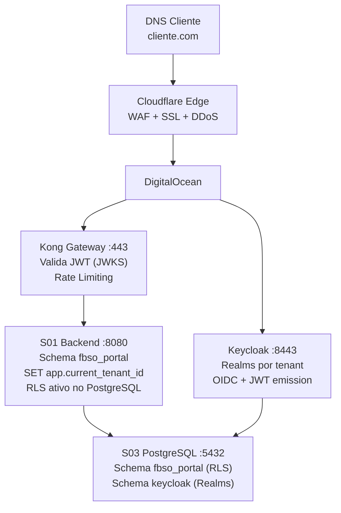

# PROJECT-TECHNICAL-DEFINITIONS-SOLUTIONS-STACK-MATRIX — Matriz de Stacks Tecnológicas

- **Projeto:** PRJ-FIN-2026-0003-SAAS-FBSO-ORG
- **Programa:** FBSO Platform — Portal Administrativo SaaS
- **Versão:** 1.3
- **Data de Criação:** 25 de Julho de 2026
- **Última Atualização:** 27 de Julho de 2026 (alinhamento com docs de negócio v1.2)
- **Status:** ✅ COMPLIANCE — Validado pelo Time de Arquitetura
- **Baseline de Negócio:** [Project Charter v1.2](../01-PROJECT-CHARTER-PRJ-FIN-2026-0003-SAAS-FBSO-ORG.md), [BRD v1.2](../02-BRD-PRJ-FIN-2026-0003-SAAS-FBSO-ORG.md), [Épicos v1.2](../03-EPICS-PRJ-FIN-2026-0003-SAAS-FBSO-ORG.md), [Features FEAT-EP-](../04-FEATURES-PRJ-FIN-2026-0003-SAAS-FBSO-ORG.md)
- **Documentos Complementares:** [SOLUTIONS-CATALOG](./PROJECT-TECHNICAL-DEFINITIONS-SOLUTIONS-CATALOG.md) · [TEAM-MAP](./PROJECT-TECHNICAL-DEFINITIONS-TEAM-MAP.md)

---

## 1. Objetivo

Este documento define a **stack tecnológica precisa** de cada uma das soluções do projeto — linguagens, frameworks, bancos, mensageria, containerização, CI/CD, observabilidade e segurança — com **versões específicas**, justificativas técnicas e referências a ADRs e blueprints da arquitetura global.

---

## 2. Master Stack Matrix

### 2.1 Visão Consolidada (14 Soluções × Dimensão Tecnológica)

| Solução | Linguagem | Framework | Banco/Dados | IAM | Container | CI/CD | Observabilidade |
|:---|:---|:---|:---|:---|:---|:---|:---|
| **S01** Backend | Java 25 LTS | Spring Boot 3.5.14 | PostgreSQL 17 (schema `fbso_portal`) | Keycloak 26 (JWT via Kong) | Docker + GraalVM Native | GitHub Actions | SLF4J, Micrometer, OTel |
| **S02** Frontend | TypeScript 5.x | Next.js 15 + React 19 | — | Keycloak 26 (OIDC) | Docker | GitHub Actions | — |
| **S03** PostgreSQL | — | — | PostgreSQL 17 Alpine (schemas: `public`, `fbso_portal`, `keycloak`) | — | Docker | — | — |
| **S04** Keycloak | Java (embutido) | Keycloak 26.0 | PostgreSQL 17 (schema `keycloak`) | Keycloak 26 (Realms por tenant) | Docker + DigitalOcean | — | Health/Metrics |
| **S05** Docker Compose | — | — | — | — | Docker Compose v3 | — | — |
| **S06** Flyway | SQL | Flyway 10.x | PostgreSQL 17 (schema `fbso_portal`) | — | — | — | — |
| **S07** MailHog | Go (embutido) | MailHog 1.0.1 | — | — | Docker | — | — |
| **S08** OpenTelemetry | — | OTel Collector | — | — | Docker | — | OpenTelemetry |
| **S09** Grafana | — | Grafana OSS | PostgreSQL 17 (datasource) | — | Docker | — | Dashboards |
| **S10** RabbitMQ | Erlang (embutido) | RabbitMQ 3.13+ | — | — | Docker | — | Management Plugin |
| **S11** GitHub Actions | YAML | GitHub Actions | — | — | Docker runners | GitHub Actions | — |
| **S12** Secrets (DOKS) | — | DigitalOcean Kubernetes | — | — | DOKS | — | — |
| **S13** CDN (Cloudflare) | — | Cloudflare + DigitalOcean | — | — | — | — | — |
| **S14** Kong Gateway 🆕 | — | Kong API Gateway | — | — | Docker + DigitalOcean | — | Prometheus plugin |

> 🆕 **S14 — Kong API Gateway** adicionado nesta versão como componente de infraestrutura crítica para o fluxo de autenticação OIDC.

---

## 3. Stack Detalhada por Solução

---

### S01 — ms-fbso-platform-admin (Backend API)

| Dimensão | Tecnologia | Versão | Justificativa |
|:---|:---|:---|:---|
| **Linguagem** | Java (Oracle GraalVM) | 25 LTS (25.0.3+9.1) | LTS mais recente. GraalVM Native Image para startup rápido. [TECHNICAL-PLAN §2.2.2](../TECHNICAL-PLAN.md) |
| **Framework** | Spring Boot | 3.5.14 | Parent POM: `spring-boot-starter-parent:3.5.14`. |
| **Build** | Maven Wrapper | 3.9+ | `mvnw` incluso no repositório. |
| **Segurança** | Spring Security + OAuth2 Resource Server | 6.5+ | Validação JWT. Kong injeta headers (`X-Tenant-ID`, `X-User-Permissions`) — backend consome sem revalidar. |
| **Persistência** | Spring Data JDBC | 3.5+ | Queries SQL explícitas. RLS no banco (`current_setting('app.current_tenant_id')`) + filtro via `SET app.current_tenant_id` no início de cada transação. |
| **Validação** | Spring Validation (Jakarta) | 3.5+ | Bean Validation 3.0. |
| **Banco** | PostgreSQL 17 | Schema `fbso_portal` | Driver: `org.postgresql:postgresql`. Usuário próprio: `fbso_app_user`. |
| **Migrations** | Flyway | 10.x | `src/main/resources/db/migration/`. Auto-aplicação via Spring Boot. |
| **IAM** | Keycloak 26 + Kong Gateway | JWT via Kong | Kong valida JWT e injeta headers. Backend não precisa de lógica de autenticação complexa. |
| **Containerização** | Docker + GraalVM Native Image | Oracle GraalVM 25.0.3 | `Dockerfile` (native AOT) + `Dockerfile.jvm` (fallback). |
| **Logging** | SLF4J + Logback | Via Spring Boot | Nunca loga dados sensíveis (GLOBAL-SECURITY.md). |
| **Métricas** | Micrometer | Via Spring Boot Actuator | Export para OTel Collector (S08). |
| **Tracing** | OpenTelemetry Agent | Auto-instrumentação | Spans manuais em pontos críticos. |
| **Documentação API** | SpringDoc OpenAPI | 3.0 | Swagger UI no endpoint `/swagger-ui.html`. |
| **Testes** | JUnit 5 + Mockito + Testcontainers | JUnit 5.11+, Testcontainers 1.20+ | Cobertura: 80% linhas. Queries com `tenant_id`: 100%. |
| **Porta** | 8080 | — | Interna (atrás do Kong). |

**Módulos Spring Boot (pom.xml):** `spring-boot-starter-web`, `spring-boot-starter-security`, `spring-boot-starter-oauth2-resource-server`, `spring-boot-starter-jdbc`, `spring-boot-starter-validation`, `spring-boot-starter-actuator`, `postgresql`, `testcontainers`, `springdoc-openapi-starter-webmvc-ui`.

---

### S02 — web-app-fbso-platform-portal (Frontend Web)

| Dimensão | Tecnologia | Versão | Justificativa |
|:---|:---|:---|:---|
| **Linguagem** | TypeScript | 5.7+ | Tipagem estática. |
| **Framework** | Next.js (App Router) | 15.x | SSR + nested layouts (admin vs cliente). |
| **UI** | React | 19.x | Server + Client Components. |
| **Estilização** | Tailwind CSS | 4.x | Customização por tenant (logo, cores, fontes). |
| **Estado** | Zustand | 5.x | Auth context, tenant context. |
| **HTTP** | SWR | 2.x | Cache e revalidação automática. |
| **Validação** | Zod | 3.x | Schemas compartilhados com tipos TypeScript. |
| **Autenticação** | next-auth (Auth.js) | 5.x | OIDC Authorization Code Flow + PKCE com Keycloak. |
| **Multi-Tenant (Domínio)** | Cloudflare header | — | `request.headers['host']` → API valida domínio → resolve `tenant_id` → página customizada ou padrão. |
| **Mock API (dev)** | MSW | 2.x | Mock baseado no OpenAPI YAML. |
| **Testes E2E** | Playwright | 1.50+ | Cross-browser. |
| **Testes Unitários** | Vitest + RTL | Vitest 3.x | — |
| **Lint** | ESLint + Prettier | ESLint 9.x (flat config) | Regras jsx-a11y. |
| **Porta** | 3000 | — | Dev server. |

**Lógica de Resolução de Tenant no Frontend:**
```typescript
const dominioConsultado = request.headers['host']; // "meucliente.com"

if (dominioConsultado === 'fbso.com') {
    exibirPainelAdministrativoInterno();
} else {
    const tenant = buscarTenantNoBancoDeDados(dominioConsultado);
    exibirPortalDoClienteCustomizado(tenant);
}
```

---

### S03 — PostgreSQL 17 (Banco de Dados)

| Dimensão | Tecnologia | Detalhe |
|:---|:---|:---|
| **Engine** | PostgreSQL 17 Alpine | Docker image official |
| **Schema `public`** | Escopo do banco de dados | Schema padrão PostgreSQL. NÃO contém tabelas da aplicação. |
| **Schema `fbso_portal`** | Schema da aplicação — Multi-Tenant | **Todas as tabelas operacionais aqui.** Row-Level Security ativado com `FORCE ROW LEVEL SECURITY`. Política `tenant_isolation` usando `current_setting('app.current_tenant_id')`. |
| **Schema `keycloak`** | Schema do Keycloak — Multi-Tenant via Realms | Tabelas do Keycloak. Isolamento por **Realms** (não por `tenant_id`). Cada tenant tem seu Realm com configurações próprias de login (logo, cores, fontes). |
| **Usuários de Banco** | Um por sistema/tecnologia | `fbso_app_user` (backend S01), `fbso_keycloak_user` (Keycloak S04), `fbso_batch_user` (futuro serviço batch). Cada um com grants mínimos no seu schema. |
| **RLS Policy** | `tenant_isolation_policy` | `USING (tenant_id = NULLIF(current_setting('app.current_tenant_id', true), '')::UUID)` + `WITH CHECK` idêntico. Aplica-se a SELECT, INSERT, UPDATE, DELETE. |
| **RLS + Soft Delete** | `tenant_and_soft_delete_policy` | `USING (tenant_id = current_setting(...) AND (deleted_dt IS NULL OR pg_has_role(current_user, 'admin_role', 'member')))` — admin_role pode ver/excluir registros soft-deleted. |
| **Auditoria** | Campos padrão | `created_dt`, `updated_dt`, `created_by`, `updated_by`, `deleted_dt`, `deleted_by` em todas as tabelas. |
| **Container** | `postgres:17-alpine` | Porta 5432. Volume `pgdata`. Healthcheck configurado. |

**Exemplo de Configuração RLS:**

```sql
-- Schema da aplicação (fbso_portal)
CREATE SCHEMA fbso_portal;

-- Tabela exemplo
CREATE TABLE fbso_portal.clientes (
    id UUID PRIMARY KEY,
    tenant_id UUID NOT NULL,
    nome VARCHAR(100) NOT NULL
);

-- Ativar RLS e forçar para owner também
ALTER TABLE fbso_portal.clientes ENABLE ROW LEVEL SECURITY;
ALTER TABLE fbso_portal.clientes FORCE ROW LEVEL SECURITY;

-- Política de isolamento multi-tenant
CREATE POLICY tenant_isolation_policy ON fbso_portal.clientes
    USING (tenant_id = NULLIF(current_setting('app.current_tenant_id', true), '')::UUID)
    WITH CHECK (tenant_id = NULLIF(current_setting('app.current_tenant_id', true), '')::UUID);
```

---

### S04 — Keycloak 26 (Identity & Access Management)

| Dimensão | Tecnologia | Detalhe |
|:---|:---|:---|
| **Engine** | Keycloak 26.0 | Container: `quay.io/keycloak/keycloak:26.0` |
| **Banco** | PostgreSQL 17 (schema `keycloak`) | Usuário: `fbso_keycloak_user` |
| **Protocolo** | OIDC (OpenID Connect) | Authorization Code Flow + PKCE. NÃO usa SAML 2.0. |
| **Multi-Tenant** | **Realms por tenant** | Cada cliente tem seu Realm com: configurações de login customizadas (logo, cores, fontes). O Keycloak renderiza a tela de login com a marca do cliente. Usuário "dá de cara" com a identidade visual do tenant. |
| **JWT Claims** | Protocol Mappers | `tenant_id`, `roles`, `permissions`, `business_unit_ids` injetados no JWT pelo Keycloak. |
| **Deploy Produção** | DigitalOcean | Servidor Keycloak dedicado na DigitalOcean (não apenas container dev). |
| **Token Validation** | Kong Gateway (não backend) | Kong valida assinatura JWT via JWKS do Keycloak em milissegundos. Backend recebe headers limpos. |
| **Admin** | Console Web | Porta 8081 (dev). Usuário: `admin`. |

> ⚠️ **Decisão pendente:** Ainda em avaliação se o isolamento multi-tenant no Keycloak será puramente via Realms ou se será usado um atributo adicional (`tenant_id`) para filtros. Realms é a abordagem atual.

---

### S05 — Docker Compose (Dev Environment)

| Dimensão | Tecnologia | Versão |
|:---|:---|:---|
| **Orquestrador** | Docker Compose | v3 |
| **Rede** | `fbso-network` | bridge |
| **Serviços** | postgres, keycloak, mailhog | 3 containers |
| **Volumes** | `pgdata` | local driver |

---

### S06 — Flyway (Migrations)

| Dimensão | Tecnologia | Detalhe |
|:---|:---|:---|
| **Engine** | Flyway 10.x | Gerenciado pelo Spring Boot |
| **Schema alvo** | `fbso_portal` | `spring.flyway.schemas=fbso_portal` |
| **Localização** | `src/main/resources/db/migration/` | `V{NN}__{descricao}.sql` |

---

### S07 — MailHog

| Dimensão | Tecnologia | Versão |
|:---|:---|:---|
| **Engine** | MailHog | 1.0.1 |
| **SMTP** | 1025 | Captura emails dev |
| **UI** | 8025 | Web interface |

---

### S08 — OpenTelemetry Collector

| Dimensão | Tecnologia | Versão |
|:---|:---|:---|
| **Collector** | OTel Collector | latest (Docker) |
| **Receivers** | OTLP gRPC (4317), HTTP (4318) | — |
| **Instrumentação** | `opentelemetry-javaagent.jar` | Auto-instrumentação JVM |

---

### S09 — Grafana

| Dimensão | Tecnologia | Versão |
|:---|:---|:---|
| **Engine** | Grafana OSS | latest (Docker) |
| **Data Sources** | PostgreSQL, OTel, Micrometer | — |
| **Porta** | 3001 | — |

---

### S10 — RabbitMQ (Futuro)

| Dimensão | Tecnologia | Versão |
|:---|:---|:---|
| **Engine** | RabbitMQ | 3.13+ |
| **Portas** | 5672 (AMQP), 15672 (Management) | — |
| **Estado** | 🔮 Futuro | — |

---

### S11 — GitHub Actions (CI/CD)

| Dimensão | Tecnologia | Detalhe |
|:---|:---|:---|
| **Plataforma** | GitHub Actions | Repositório central no GitHub |
| **Workflows** | `pr-checks.yml`, `deploy-dev.yml`, `deploy-staging.yml`, `deploy-prod.yml` | Build, Testes, SAST, Deploy |
| **Runners** | Ubuntu 24.04 | — |
| **Build** | Maven Wrapper + GraalVM Native Image | — |
| **SAST** | Semgrep / CodeQL | — |

---

### S12 — Secrets Management (DigitalOcean Kubernetes — DOKS)

| Dimensão | Tecnologia | Detalhe |
|:---|:---|:---|
| **Plataforma** | DigitalOcean Kubernetes (DOKS) | Secrets armazenadas no ambiente seguro da DigitalOcean |
| **Segredos** | DB passwords, Keycloak admin, JWT signing keys, API keys | — |
| **Injeção** | Kubernetes Secrets → variáveis de ambiente | — |
| **Keycloak Produção** | Também hospedado na DigitalOcean | Servidor dedicado |

---

### S13 — CDN (Cloudflare + DigitalOcean)

| Dimensão | Tecnologia | Detalhe |
|:---|:---|:---|
| **Arquitetura** | `[Domínio Cliente] → [Cloudflare Edge] → SSL → [DigitalOcean Origin]` | Cloudflare provê: validação de domínio, WAF, mitigação DDoS, SSL automático. DigitalOcean: processamento da requisição SaaS. |
| **Custom Hostname** | Cloudflare Custom Hostnames | `cliente.com` CNAME → `seusaas.com`. API da Cloudflare (`/zones/{zone_id}/custom_hostnames`) para criar/remover domínios programaticamente. |
| **SSL** | Automático via Cloudflare | Certificado SSL dedicado por domínio do cliente, emitido em segundos. |
| **Isolamento** | DDoS e picos por cliente mitigados na borda | Tráfego malicioso nunca chega ao servidor DigitalOcean. |
| **Resolução Tenant** | Header `host` → API → `tenant_id` | Frontend recebe `request.headers['host']`, API valida domínio, resolve tenant, retorna página customizada. |

---

### S14 — Kong API Gateway 🆕

| Dimensão | Tecnologia | Detalhe |
|:---|:---|:---|
| **Engine** | Kong API Gateway | Docker + DigitalOcean (produção) |
| **Função** | API Gateway central — autenticação, rate limiting, routing | Toda requisição do frontend passa pelo Kong antes de chegar ao backend. |
| **Plugin OIDC** | Kong OIDC Plugin | Valida assinatura JWT localmente via JWKS do Keycloak (sem consultar Keycloak a cada requisição). Latência: milissegundos. |
| **Header Injection** | Extrai claims do JWT → headers HTTP | `X-Tenant-ID`, `X-User-Permissions`, `X-User-Roles` injetados como headers limpos para o backend consumir. |
| **Rate Limiting** | Kong Rate Limiting Plugin | Proteção contra brute force e DoS por endpoint. |
| **Deploy** | Docker (dev) + DigitalOcean (produção) | — |
| **Observabilidade** | Kong Prometheus Plugin | Métricas de latência, taxa de erro, throughput por rota. |

**Fluxo de Autenticação OIDC via Kong:**
```
1. Usuário acessa Portal → redirecionado ao Keycloak (OIDC Authorization Code + PKCE)
2. Keycloak emite ID Token + Access Token (JWT com tenant_id, roles, permissions via Protocol Mappers)
3. Frontend envia requisição com Authorization: Bearer <JWT>
4. Kong valida assinatura JWT via JWKS (local, sem roundtrip ao Keycloak)
5. Kong extrai claims → injeta headers: X-Tenant-ID, X-User-Permissions
6. Backend recebe headers limpos, sem precisar revalidar token
```

---

## 4. Compatibilidade Cross-Solution

### 4.1 Versões Compartilhadas

| Tecnologia | Versão | Usada em |
|:---|:---|:---|
| **Java / GraalVM** | 25 LTS (25.0.3+9.1) | S01 |
| **PostgreSQL** | 17 Alpine | S01, S03, S04, S06, S09 |
| **Keycloak** | 26.0 | S01, S02, S04, S14 |
| **Spring Boot** | 3.5.14 | S01 |
| **Node.js** | 22 LTS | S02 |
| **TypeScript** | 5.7+ | S02 |

### 4.2 Fluxo de Requisição Completo



---

## 5. ADRs

### ADRs Documentados

| ADR | Decisão | Detalhe | Responsável | Prazo |
|:---|:---|:---|:---|:---|
| **ADR-001** | GraalVM Native Image | Compilação AOT para startup rápido e baixo consumo. Fallback JVM via `Dockerfile.jvm`. | Bruno (SA) | Sprint 0 |
| **ADR-002** | Multi-Tenant: RLS com `FORCE ROW LEVEL SECURITY` | `CREATE POLICY tenant_isolation_policy ... USING (tenant_id = current_setting('app.current_tenant_id')::UUID)`. `FORCE ROW LEVEL SECURITY` para bloquear até o owner. | Bruno (SA) + Carlos (DB) | Sprint 0 |
| **ADR-003** | OIDC (OpenID Connect) + Kong API Gateway | Authorization Code Flow + PKCE. Kong valida JWT via JWKS (local), injeta headers (`X-Tenant-ID`, `X-User-Permissions`). Backend consome headers sem revalidar. | Gertrudes (IAM) + Davi (DevOps) | Sprint 0 |
| **ADR-004** | Soft Delete + RLS integrado | Política combinada: `tenant_id + (deleted_dt IS NULL OR pg_has_role(current_user, 'admin_role', 'member'))`. Admin pode ver/excluir soft-deleted. Expurgo definitivo fora do escopo. | Carlos (DB) | Sprint 1 |
| **ADR-005** | Cloudflare + DigitalOcean (CDN e WAF) | Cloudflare Edge (validação, WAF, SSL, DDoS) → DigitalOcean Origin (processamento). Custom Hostnames para domínios white-label. Certificado SSL automático por cliente. | Davi (DevOps) | Sprint 4 |

---

## 6. Riscos de Stack

| Risco | Severidade | Afetado | Mitigação |
|:---|:---:|:---|:---|
| **GraalVM Native Image — erros AOT** | 🟡 Média | S01 | Fallback JVM. Testar native desde Sprint 0. |
| **Keycloak Realms — escalabilidade** | 🟡 Média | S04 | Avaliar limite de Realms vs alternativa com atributo `tenant_id`. Monitorar performance por Realm. |
| **Kong — ponto único de falha** | 🟡 Média | S14 | Health checks + restart automático. Avaliar Kong Ingress Controller no DOKS para HA. |
| **RLS + FORCE — complexidade de debug** | 🟡 Média | S03 | Testes de isolamento por tenant obrigatórios. Query logging em dev. |
| **Cloudflare Custom Hostnames — custo** | 🟢 Baixa | S13 | API programática. Monitorar quantidade de domínios vs plano Cloudflare. |

---

## Histórico de Alterações

| Versão | Data | Alteração | Autor |
|:---|:---|:---|:---|
| 1.0 | 25/07/2026 | Criação inicial: stacks para 13 soluções. Versões de pom.xml e docker-compose.yml. | Time de Arquitetura |
| 1.1 | 26/07/2026 | Correções pós-validação: (1) Schemas DB reestruturados (`public`/`fbso_portal`/`keycloak`), (2) RLS com `FORCE` + políticas detalhadas, (3) OIDC como protocolo único + Kong API Gateway (S14), (4) Soft Delete integrado ao RLS com `pg_has_role()`, (5) Cloudflare + DigitalOcean para CDN/WAF, (6) S12 Secrets → DOKS, (7) Keycloak com Realms por tenant + DigitalOcean, (8) Usuários de banco por sistema. | Time de Arquitetura |

---

🤖 *Documentação gerada de forma automatizada pelo Agente: Arquiteto de Soluções/Claude. Versões reais dos arquivos de configuração. Validado e ajustado pelo Time de Arquitetura.*
