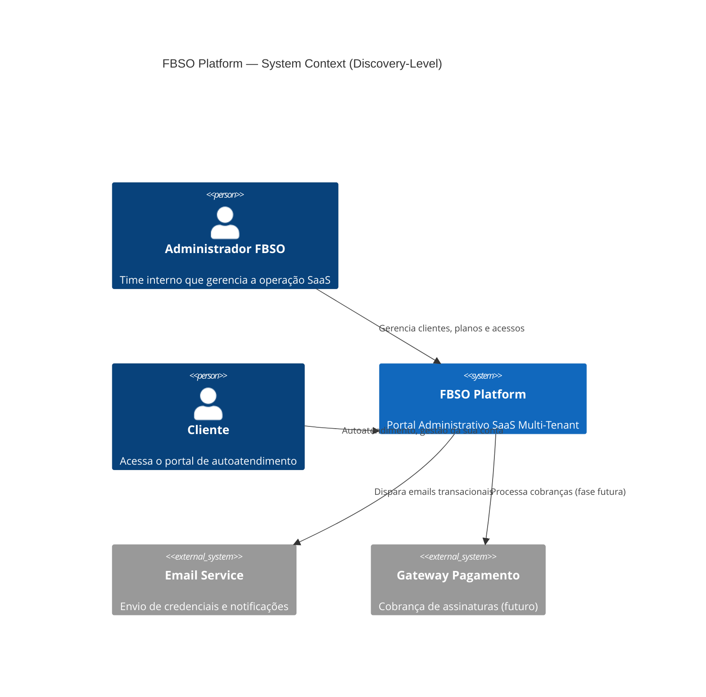

# DISCOVERY-LEVEL-ARCHITECTURE-DEFINITION — Definição de Arquitetura (Discovery)

- **Projeto:** PRJ-FIN-2026-0003-SAAS-FBSO-ORG
- **Fase:** F2 — Bloco B (Architecture & Security & Specialists — Discovery-Level)
- **Disciplina:** Solution Architect
- **Versão:** 1.0 · **Data:** 30/07/2026 · **Status:** CREATED
- **Input upstream:** [DISCOVERY-LEVEL-PRD](../upstream-architecture-discovery/DISCOVERY-LEVEL-PRD.md) (F1)

---

## 1. C4 Level 1 — System Context (Macro)

## 2. Containers Macro

| Container | Responsabilidade | Tipo |
|:---|:---|:---|
| **Backend API** | Lógica de negócio, CRUD, RBAC, métricas | Aplicação (Java/Spring) |
| **Frontend Portal** | Interface do administrador FBSO e do cliente | Aplicação Web (React/Next.js) |
| **Banco de Dados** | Persistência multi-tenant com isolamento por tenant_id | PostgreSQL |
| **IAM** | Autenticação OIDC e gestão de identidades | Keycloak (padrão corporativo) |
| **API Gateway** | Roteamento, autenticação delegada, rate limiting | Kong (padrão corporativo) |

## 3. Estratégia de Integração (Macro)

| Origem | Destino | Protocolo | Autenticação |
|:---|:---|:---|:---|
| Frontend | Backend API | HTTPS/REST | JWT (OIDC) |
| Backend API | Banco de Dados | JDBC/PostgreSQL | User/password |
| Backend API | IAM (Keycloak) | OIDC/OAuth2 | Client credentials |
| API Gateway | Backend API | HTTPS/REST | Header injection (JWT) |
| Cliente | API Gateway | HTTPS | OIDC + PKCE |

## 4. Decisões Arquiteturais (ADRs Macro)

| ADR | Decisão | Justificativa |
|:---|:---|:---|
| **ADR-01** | Multi-tenant com discriminator column (tenant_id) | Isolamento lógico, sem schema-per-tenant (não escala para milhares) |
| **ADR-02** | Kong como API Gateway central | Autenticação delegada, header injection (não token forwarding) |
| **ADR-03** | Kong↔Keycloak Service-ID validation + JWT header injection | Kong valida Service-ID/Token-ID no Keycloak, recebe autenticação + roles, injeta JWT no cabeçalho. Microserviços NÃO revalidam JWT — premissa: toda comunicação passa pelo Kong |
| **ADR-04** | Row-Level Security (RLS) no PostgreSQL | Garante isolamento total entre tenants no banco |
| **ADR-05** | Trust Boundary: Kong → Microserviços | Microserviços não revalidam JWT. Kong é o único ponto de validação. Segurança delegada ao API Gateway |

### 4.1 Riscos Arquiteturais
| Keycloak como ponto único de falha | Alto | Multi-replica Keycloak, cache local de JWKS |
| Complexidade do Kong + OIDC para time reduzido | Médio | OIDC Plugin do Kong, documentação detalhada |
| Escalabilidade do banco com crescimento de tenants | Médio | Read replicas, connection pooling (HikariCP) |

## 6. Estimativa de Esforço de Arquitetura

| Componente | Complexidade | Esforço Estimado |
|:---|:---:|:---:|
| Backend API + Multi-Tenant | Alta | 3-4 homem-mês |
| Frontend Portal | Média | 2-3 homem-mês |
| Configuração Keycloak + Kong | Média | 1-2 homem-mês |
| Integrações (email, futuras) | Baixa | 0.5-1 homem-mês |
| **Total Arquitetura** | — | **7-10 homem-mês** |

---

## Histórico de Alterações

| Versão | Data | Alteração | Autor |
|:---|:---|:---|:---|
| 1.0 | 30/07/2026 | Criação inicial: arquitetura Discovery-Level — C4, containers, integração, ADRs, riscos | Solution Architect / Discovery Team |

🤖 *Upstream Architecture Discovery — Fase 2 · Bloco B*
