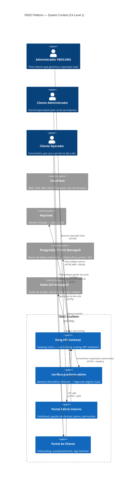
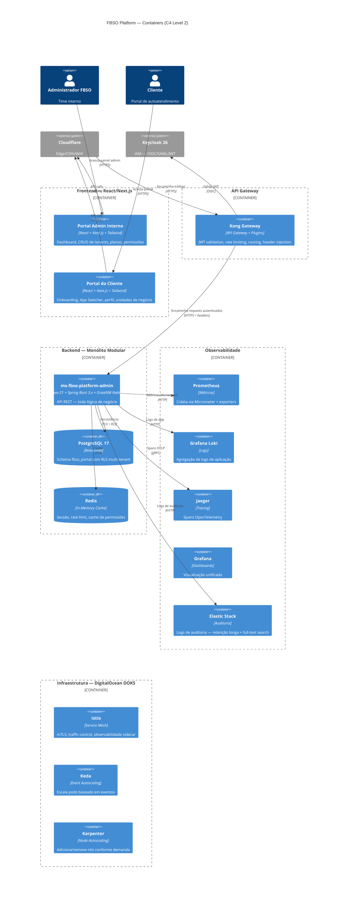

# DISCOVERY-LEVEL-ARCHITECTURE-DEFINITION.md
## Fase 2 — Bloco B: Architecture & Security & Specialists (Discovery-Level)

| Campo | Detalhe |
|-------|---------|
| **Projeto** | PRJ-FIN-2026-0003-SAAS-FBSO-ORG |
| **Documento** | DISCOVERY-LEVEL-ARCHITECTURE-DEFINITION-v1.0 |
| **Versão** | 1.0 — Discovery-Level (Análise de Viabilidade) |
| **Data** | 02 de agosto de 2026 |
| **Autor** | Solution Architect / Tech Lead |
| **Status** | [STATUS: COMPLIANCE] — Aprovado em 02/08/2026 |

**Documentos Vinculados:**
- [`DISCOVERY-LEVEL-PRD.md`](DISCOVERY-LEVEL-PRD.md) — PRD Discovery-Level (F1)
- [`STACK-PADROES-CORPORATIVOS-FBSO-ORG.md`](../../../.specs/standards/STACK-PADROES-CORPORATIVOS-FBSO-ORG.md) — Padrões Corporativos
- [`GLOBAL-SECURITY.md`](../../../.specs/security/GLOBAL-SECURITY.md) — Política de Segurança Global
- [`architecture/adr/`](../../../architecture/adr/) — ADRs globais (Java, Protobuf, Kestra)

---

## 1. Visão Arquitetural Macro

### 1.1 Abordagem Arquitetural

O projeto adota uma arquitetura **Monolítica Modular** no backend com **frontend web SPA**. Esta decisão é fundamentada no estágio atual do produto (Core fundacional, time enxuto, necessidade de entrega rápida) e na previsão de evolução futura para extração de módulos como serviços independentes conforme o portfólio de produtos crescer.

**Princípios arquiteturais (Discovery-Level):**
- **Monólito Modular → Extração Gradual:** Todos os módulos (admin, tenants, planos, permissões, portal cliente) nascem dentro do mesmo deploy, com boundaries internas bem definidas. Quando um módulo atingir maturidade e demanda de escala independente, é extraído para serviço próprio
- **API Gateway como Trust Boundary:** Kong é o ponto único de entrada para todo tráfego externo. Nenhum serviço backend recebe tráfego que não tenha passado pelo Kong
- **Multi-Tenant Lógico via RLS:** Isolamento de dados entre tenants implementado na camada de banco via Row-Level Security (PostgreSQL), sem necessidade de schemas ou bancos separados por cliente
- **Identity Propagation:** Kong valida JWT via Keycloak (Service-ID/Token-ID) e propaga identidade do usuário e tenant context para os serviços downstream via headers

### 1.2 Soluções Técnicas do Projeto

| Solução | Tipo | Propósito | Repositório | Status |
|---------|------|-----------|-------------|--------|
| **ms-fbso-platform-admin** | Backend (Java/Spring Boot) | API REST do Portal Administrativo — gestão de tenants, planos, assinaturas, permissões, unidades de negócio, catálogo | `backend/java/spring/microservices/ms-fbso-platform-admin` | Existente (em desenvolvimento) |
| **web-app-fbso-platform-portal** | Frontend (React/Next.js) | Interface web — portal administrativo interno + portal do cliente com autoatendimento | Novo (a ser criado) | Planejado |

---

## 2. Diagrama C4 Level 1 — System Context

O diagrama abaixo mostra a FBSO Platform no contexto de seus usuários e sistemas externos. Cada ator (humano ou sistema) interage com a plataforma através de pontos de entrada bem definidos.



**Pontos de Controle de Segurança no Contexto:**
1. **Cloudflare → Internet:** WAF, DDoS, SSL termination — primeira camada de defesa
2. **Cloudflare → Kong:** Tráfego já filtrado, Kong aplica rate limiting e valida JWT
3. **Kong → Keycloak:** Validação Service-ID/Token-ID — Kong nunca expõe segredos
4. **Kong → Backend:** Headers injetados com identidade do usuário e tenant context
5. **Backend → PostgreSQL:** Conexão TLS, RLS ativo — isolamento enforced no banco

---

## 3. Diagrama C4 Level 2 — Containers

O diagrama abaixo detalha os containers (unidades de deploy) que compõem cada solução e como se comunicam.



---

## 4. Matriz de Integração

| # | Origem | Destino | Protocolo | Autenticação | Propósito |
|---|--------|---------|-----------|-------------|-----------|
| 1 | Portal Admin (SPA) | Kong Gateway | HTTPS/REST | JWT (via Keycloak) | Todas as operações administrativas |
| 2 | Portal Cliente (SPA) | Kong Gateway | HTTPS/REST | JWT (via Keycloak) | Onboarding, perfil, unidades de negócio |
| 3 | Kong Gateway | Keycloak | OIDC | Service-ID/Token-ID | Validação de JWT + obtenção de roles |
| 4 | Kong Gateway | ms-fbso-platform-admin | HTTPS/REST | Headers (user-id, tenant-id, roles) | Encaminhamento de requests autenticados |
| 5 | ms-fbso-platform-admin | PostgreSQL 17 | PostgreSQL Wire Protocol (TLS) | Certificate + credentials | Persistência de dados com RLS |
| 6 | ms-fbso-platform-admin | Redis | Redis Protocol (TLS) | Token | Cache de sessão, permissões, rate limit |
| 7 | ms-fbso-platform-admin | Prometheus | HTTP (scrape) | — | Métricas Micrometer |
| 8 | ms-fbso-platform-admin | Grafana Loki | HTTP (push) | — | Logs de aplicação |
| 9 | ms-fbso-platform-admin | Jaeger | gRPC (OTLP) | — | Distributed tracing |
| 10 | ms-fbso-platform-admin | Elastic Stack | HTTP | Token | Logs de auditoria (audit trail) |

---

## 5. Arquitetura de Módulos — Monólito Modular

### 5.1 Módulos Internos do Backend

O backend `ms-fbso-platform-admin` é organizado internamente como um monólito modular com boundaries de domínio bem definidas, preparado para extração futura de módulos como serviços independentes.

```
ms-fbso-platform-admin/
├── modules/
│   ├── admin-dashboard/       — EP-0001: Dashboard, métricas, visão consolidada
│   ├── tenant-management/     — EP-0002: CRUD de tenants, ativação/suspensão
│   ├── plan-management/       — EP-0002: Planos comerciais, módulos incluídos
│   ├── subscription-management/ — EP-0002: Assinaturas, vínculo tenant↔plano
│   ├── rbac/                  — EP-0003: Papéis, permissões, escopos por BU
│   ├── user-management/       — EP-0003: Convite e gestão de usuários
│   ├── business-unit/         — EP-0004: Unidades de Negócio, hierarquia Matriz/Filial
│   ├── product-catalog/       — EP-0004: Catálogo de produtos/serviços do cliente
│   └── onboarding/            — EP-0004: Fluxo de onboarding guiado
└── shared/
    ├── audit/                 — Trilha de auditoria (cross-module)
    ├── tenant-context/        — Resolução de tenant via header
    └── rls-enforcer/          — Configuração de políticas RLS
```

### 5.2 Regras de Modularização

| Regra | Descrição |
|-------|-----------|
| **R1 — Comunicação Interna** | Módulos comunicam-se via interfaces Java (in-process). Sem chamadas HTTP entre módulos no monólito |
| **R2 — Banco por Domínio** | Cada módulo possui suas próprias tabelas no schema `fbso_portal`. Módulo A não acessa tabelas do Módulo B sem contrato explícito |
| **R3 — Dependências Unidirecionais** | `rbac → tenant-management` (permissões dependem de tenants). Sem dependência reversa |
| **R4 — Contrato de Extração** | Cada módulo expõe uma interface `*Contract.java` que define o contrato de comunicação. Se o módulo for extraído para serviço próprio, o contrato vira API REST |

---

## 6. ADRs — Decisões Arquiteturais (Discovery-Level)

### ADR-0001: Kong↔Keycloak Service-ID/Token-ID como Trust Boundary

**Contexto:** O sistema precisa autenticar e autorizar todas as requisições antes que alcancem os serviços backend. O backend não deve revalidar tokens JWT — essa responsabilidade é do gateway.

**Decisão:** Kong será configurado como trust boundary exclusiva. Toda requisição ao backend chega com headers injetados pelo Kong contendo identidade do usuário e tenant context, validados previamente via Keycloak (protocolo Service-ID/Token-ID).

**Rationale:** Centralizar autenticação no gateway reduz complexidade nos serviços backend, elimina duplicação de lógica de validação JWT e garante consistência no enforcement de segurança.

**Consequências:**
- Backend confia cegamente nos headers injetados pelo Kong (trust boundary implícita)
- Kong NUNCA deve ser bypassed — rede Kubernetes configurada para que apenas Kong tenha acesso externo aos pods backend
- Keycloak é ponto único de falha para autenticação — alta disponibilidade mandatória

### ADR-0002: Multi-Tenant Lógico via PostgreSQL RLS

**Contexto:** A plataforma serve múltiplos clientes (tenants) cujos dados devem ser completamente isolados. O modelo de "database-per-tenant" foi descartado por complexidade operacional.

**Decisão:** Adotar isolamento lógico via Row-Level Security (RLS) no PostgreSQL, com coluna `tenant_id` em todas as tabelas de dados do cliente. O backend resolve o tenant context do header injetado pelo Kong e configura a sessão PostgreSQL com o `tenant_id` ativo.

**Rationale:** RLS oferece isolamento forte no nível do banco (enforced pelo PostgreSQL, não pela aplicação), com complexidade operacional muito menor que database-per-tenant. Para o volume de tenants previsto (< 1.000 nos primeiros 2 anos), o overhead de RLS é insignificante.

**Consequências:**
- Toda query ao banco deve ter o tenant context configurado na sessão antes da execução
- RLS policies devem ser revisadas a cada nova tabela criada
- Migração futura para database-per-tenant é possível com custo moderado se o volume crescer significativamente

### ADR-0003: Soft Delete como Padrão de Exclusão

**Contexto:** Requisitos de auditoria e compliance (LGPD) exigem que dados não sejam permanentemente destruídos sem rastreabilidade.

**Decisão:** Adotar Soft Delete como padrão em todas as entidades de negócio. Registros marcados como `deleted_at = NOW()` não são removidos fisicamente. A camada de aplicação filtra registros deletados por padrão.

**Rationale:** Soft Delete preserva o histórico de auditoria e permite recuperação de dados em caso de erro operacional. Alinha-se com o requisito BRD de audit trail imutável.

**Consequências:**
- Todas as queries devem incluir filtro `WHERE deleted_at IS NULL` (automatizado via JPA/Hibernate `@Where` ou RLS policy)
- Armazenamento cresce com registros deletados — estratégia de arquivamento/expurgo será necessária em 18-24 meses

### ADR-0004: Comunicação Backend↔Frontend via REST (sem WebSockets na Fase Core)

**Contexto:** O portal administrativo e de cliente exigem comunicação em tempo real para algumas operações (status de onboarding, bloqueio de conta).

**Decisão:** Adotar exclusivamente REST/HTTPS para comunicação na fase Core. Funcionalidades que exigem atualização em tempo real usarão polling com intervalos configuráveis. WebSockets/SSE serão considerados em fase futura quando houver casos de uso que justifiquem (ex: notificações cross-tenant, chat de suporte).

**Rationale:** REST simplifica o desenvolvimento, debugging, testes e operação. Para os casos de uso do Core (dashboard, CRUD, onboarding), polling é suficiente e evita a complexidade adicional de gerenciar conexões persistentes.

---

## 7. Estratégia de Comunicação

### 7.1 Síncrono (REST/HTTPS)

| Caso de Uso | Endpoint Pattern | Exemplo |
|-------------|-----------------|---------|
| Operações CRUD | `GET/POST/PUT/DELETE /api/v1/{resource}` | `POST /api/v1/tenants` |
| Consultas com filtro | `GET /api/v1/{resource}?filter=...&page=...` | `GET /api/v1/tenants?status=active` |
| Ações de domínio | `POST /api/v1/{resource}/{action}` | `POST /api/v1/tenants/{id}/suspend` |
| Dashboard/metrics | `GET /api/v1/dashboard/{metric}` | `GET /api/v1/dashboard/active-accounts` |

### 7.2 Assíncrono (Mensageria — Fase Futura)

RabbitMQ será introduzido em fase futura para cenários que exigem desacoplamento temporal:

| Cenário Futuro | Gatilho | Consumidor |
|----------------|---------|------------|
| Notificação de onboarding concluído | Onboarding finalizado | Envio de e-mail de boas-vindas |
| Sincronização de status de tenant | Tenant suspenso/reativado | Bloqueio/liberação de acesso |
| Eventos de auditoria cross-module | Qualquer ação administrativa | Elastic Stack (indexação) |

Na fase Core atual, estes cenários serão tratados de forma síncrona (chamadas diretas) para reduzir complexidade operacional.

---

## 8. Topologia de Deploy (Discovery-Level)

```
                         ┌──────────────┐
                         │  Cloudflare   │
                         │ DNS+WAF+CDN  │
                         └──────┬───────┘
                                │
                    ┌───────────┴───────────┐
                    │   DigitalOcean DOKS    │
                    │  (Kubernetes Cluster)  │
                    │                        │
                    │  ┌──────────────────┐  │
                    │  │  Kong Gateway     │  │
                    │  │  (LoadBalancer)   │  │
                    │  └────────┬─────────┘  │
                    │           │             │
                    │  ┌────────┴─────────┐  │
                    │  │  Istio Ingress   │  │
                    │  │  (mTLS + Envoy)  │  │
                    │  └────────┬─────────┘  │
                    │           │             │
                    │  ┌────────┴─────────┐  │
                    │  │  Backend Pods     │  │
                    │  │  ms-fbso-         │  │
                    │  │  platform-admin   │  │
                    │  │  (2+ replicas)    │  │
                    │  └────────┬─────────┘  │
                    │           │             │
                    └───────────┼─────────────┘
                                │
              ┌─────────────────┼─────────────────┐
              │                 │                  │
     ┌────────┴──────┐  ┌──────┴──────┐  ┌───────┴────────┐
     │ PostgreSQL 17  │  │   Redis     │  │  Observabilidade │
     │ (DO Managed)   │  │ (DO Managed)│  │  (Prometheus +   │
     │                │  │             │  │   Loki + Jaeger) │
     └───────────────┘  └─────────────┘  └─────────────────┘

     Ambientes:
     ├── Dev:    cluster reduzido (1 node, recursos mínimos)
     ├── Staging: cluster equivalente a Prod (validação pré-release)
     └── Prod:   cluster principal (2+ nodes, HA, backups automáticos)
```

### 8.1 Recursos Estimados (DigitalOcean)

| Recurso | Dev | Staging | Prod |
|---------|-----|---------|------|
| **K8s Nodes** | 1× (4 vCPU, 8 GB) | 2× (4 vCPU, 8 GB) | 2-3× (8 vCPU, 16 GB) |
| **PostgreSQL** | 1× (1 vCPU, 2 GB) | 1× (2 vCPU, 4 GB) | 1× (4 vCPU, 8 GB, HA) |
| **Redis** | 1× (1 vCPU, 1 GB) | 1× (1 vCPU, 2 GB) | 1× (2 vCPU, 4 GB, HA) |
| **Load Balancer** | 1× | 1× | 1× |
| **Spaces (S3)** | 50 GB | 100 GB | 250 GB |

---

## 9. Stack Tecnológica — Validação contra Padrões Corporativos

| Camada | Padrão Corporativo | Stack do Projeto | Conformidade |
|--------|-------------------|------------------|-------------|
| **Cloud** | DigitalOcean (exclusivo) | DigitalOcean (DOKS) | ✅ Conforme |
| **Edge/CDN/WAF** | Cloudflare | Cloudflare | ✅ Conforme |
| **IAM** | Keycloak (OIDC) | Keycloak 26 (OIDC + SAML 2.0) | ✅ Conforme · `SAML 2.0` é adição justificada (integração enterprise legada) |
| **API Gateway** | Kong (Service-ID/Token-ID) | Kong Gateway | ✅ Conforme |
| **Backend** | Java + Spring Boot | Java 21 LTS + Spring Boot 3.x | ⚠️ Java 25 LTS é o declarado pelo time; Java 21 é o padrão corporativo atual. Justificativa: adoção da LTS mais recente disponível |
| **Build** | — | Maven + GraalVM Native Image AOT | 🆕 Tecnologia adicional — justificativa: inicialização sub-segundo em containers K8s |
| **Banco** | PostgreSQL 17 | PostgreSQL 17 (DO Managed) | ✅ Conforme |
| **Cache** | Redis | Redis (DO Managed) | ✅ Conforme |
| **Observabilidade** | Prometheus + Loki + Grafana + Jaeger + OTel + Elastic | Prometheus + Loki + Grafana + Jaeger + OpenTelemetry + Elastic Stack | ✅ Conforme |
| **IaC** | Terraform + Ansible | Terraform (provisioning DOKS, DBs, Spaces) + Ansible (config) | ✅ Conforme |
| **Orquestração** | K8s (DOKS) + Istio + Keda + Karpenter | Docker/K8s + Istio + Keda + Karpenter | ✅ Conforme |
| **CI/CD** | GitHub Actions | GitHub Actions (build, SAST, test, Docker, deploy) | ✅ Conforme |
| **Frontend** | React + TypeScript | React + Next.js + Tailwind CSS | ✅ Conforme |
| **Mensageria** | — | RabbitMQ (fase futura) | 🆕 Tecnologia adicional — fora do escopo Core atual |

### 🆕 Tecnologias Adicionais (Fora do Padrão — Justificativas)

| Tecnologia | Justificativa Técnica | Risco |
|------------|----------------------|-------|
| **GraalVM Native Image AOT** | Inicialização de containers em < 1s (vs ~3-5s com JVM), crítica para Keda scaling rápido. Menor footprint de memória. Compilação AOT detecta erros em build time | Curva de aprendizado para configuração de reflection, proxies e recursos nativos |
| **SAML 2.0 (Keycloak)** | Suporte a integrações enterprise legadas que usam SAML para SSO corporativo. Clientes enterprise são público-alvo estratégico | Complexidade adicional na configuração Keycloak |
| **Java 25 LTS** | Última versão LTS disponível no momento do desenvolvimento. Virtual threads (Project Loom) como standard, melhorias de performance e segurança | Pode não estar disponível em todos os ambientes (DO, CI/CD runners). Fallback: Java 21 LTS |
| **RabbitMQ** | Mensageria para desacoplamento de módulos em fases futuras (notificações, eventos cross-module). Não utilizado na fase Core atual | Complexidade operacional adicional quando ativado |

---

## 10. Validação de Capacidade do Time (Step 2.5)

### PROJECT-TEAM-SKILLS-MAP

| Papel | Profissional | Nível | Skills-Chave |
|-------|-------------|-------|-------------|
| Engenheiro de Sistemas / Tech Lead | Francisco Oliveira | ★★★ | Arquitetura, Spring Boot, integração |
| Arquiteto de Soluções | Alfredo Salomao | ★★★ | C4, ADRs, padrões cross-solution |
| DB Developer | William Alves | ★★★ | PostgreSQL, RLS, modelagem multi-tenant |
| DevOps | Lucas Silva Neto | ★★★ | K8s, Terraform, CI/CD, observabilidade |
| IAM Specialist | Daniel Bruno Castro | ★★★ | Keycloak, Kong, OIDC/SAML |
| QA Engineer | Valeria Lucanete | ★★★ | Testes, qualidade, automação |
| Full-Stack | Bolismar Oliveira | ★★★ | Integrações, APIs, contratos |

### PROJECT-TEAM-CAPACITY

| Indicador | Valor |
|-----------|-------|
| **Duração** | Sprint 0 — 1 semana (5 dias úteis) |
| **Alocação** | Time exclusivo (100% dedicado ao Discovery) |
| **Senioridade** | 7 profissionais, todos seniores (★★★) |
| **Foco** | Análise de viabilidade e estimativa ROM 50% |

### PROJECT-STACK (Validada)

✅ Stack 100% alinhada com `STACK-PADROES-CORPORATIVOS-FBSO-ORG.md`. Tecnologias adicionais documentadas com justificativa técnica na Seção 9.

---

## 11. Riscos Arquiteturais e Estimativa de Esforço

### 11.1 Riscos Técnicos

| ID | Risco | Prob. | Impacto | Mitigação |
|----|-------|-------|---------|-----------|
| R1 | GraalVM Native Image com Spring Boot — problemas de reflection/proxies em runtime | Média | Alto | Prova de conceito nas primeiras 48h do Sprint 0; fallback para JVM HotSpot se inviável |
| R2 | Kong↔Keycloak Service-ID/Token-ID — complexidade de configuração inicial | Média | Alto | Daniel Bruno Castro (IAM Specialist) dedicado à configuração; documentar passo a passo |
| R3 | PostgreSQL RLS — performance com múltiplos tenants e políticas complexas | Baixa | Médio | Teste de carga com 100 tenants simulados; índice em `tenant_id` em todas as tabelas |
| R4 | Monólito Modular — risco de acoplamento excessivo entre módulos internos | Média | Médio | Boundaries de domínio com interfaces explícitas (`*Contract.java`); code review focado em violações de boundary |
| R5 | Istio + Keda + Karpenter — complexidade operacional do service mesh completo | Média | Médio | Lucas Silva Neto (DevOps) com experiência prévia em Istio; iniciar com configuração mínima |

### 11.2 Estimativa de Esforço (Discovery-Level)

| Área | Complexidade | Esforço Estimado (dias) | Responsável |
|------|-------------|------------------------|-------------|
| Arquitetura C4 + ADRs | Moderada | 2 | Alfredo Salomao |
| Validação GraalVM Native Image | Moderada | 1 | Francisco Oliveira |
| Configuração Kong↔Keycloak | Complexa | 2 | Daniel Bruno Castro |
| Modelagem RLS Multi-Tenant | Moderada | 1.5 | William Alves |
| Infra DOKS + Terraform + Istio | Complexa | 2 | Lucas Silva Neto |
| Stack Observabilidade | Moderada | 1 | Lucas Silva Neto |
| Contratos API REST | Moderada | 1 | Bolismar Oliveira |
| Estratégia Testes | Moderada | 1 | Valeria Lucanete |
| Diagramas e Documentação | Leve | 1 | Time |
| **Total** | — | **~12.5 dias (2.5 sprints de 1 semana)** | —

> **Nota:** Esta é uma estimativa Discovery-Level para o esforço de ANÁLISE e DEFINIÇÃO apenas (Sprint 0). A estimativa ROM de implementação será produzida na Fase 11.

---

## Registro de Alterações

| Versão | Data | Alteração | Autor |
|:---|:---|:---|:---|
| 1.0 | 02/08/2026 | Criação inicial: Architecture Definition Discovery-Level. C4 L1+L2, matriz de integração, 4 ADRs, topologia de deploy, 4 módulos internos, validação de stack, riscos e estimativa de esforço de análise | Solution Architect |

---

🤖 *Upstream Architecture Discovery — Fase 2. Documento gerado pelo Solution Architect como parte do Bloco B (Architecture & Security & Specialists).*
