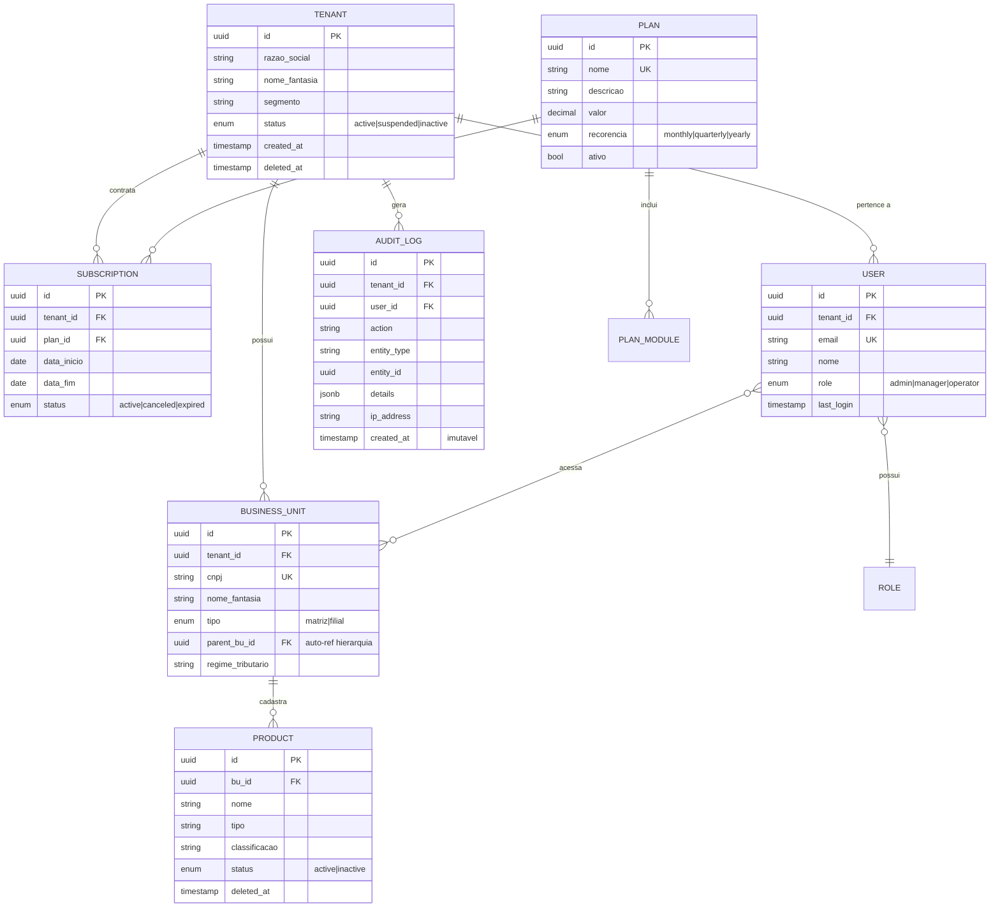

# DISCOVERY-LEVEL-DATA-ARCHITECTURE-DEFINITION.md
## Fase 4 — Bloco B: Architecture & Security & Specialists (Discovery-Level)

| Campo | Detalhe |
|-------|---------|
| **Projeto** | PRJ-FIN-2026-0003-SAAS-FBSO-ORG |
| **Documento** | DISCOVERY-LEVEL-DATA-ARCHITECTURE-DEFINITION-v1.0 |
| **Versão** | 1.0 — Discovery-Level (Análise de Viabilidade) |
| **Data** | 02 de agosto de 2026 |
| **Autor** | Data Architect / DB Developer |
| **Status** | [STATUS: COMPLIANCE] — Aprovado em 02/08/2026 |

**Documentos Vinculados:**
- [`DISCOVERY-LEVEL-PRD.md`](DISCOVERY-LEVEL-PRD.md) — PRD Discovery-Level (F1)
- [`DISCOVERY-LEVEL-ARCHITECTURE-DEFINITION.md`](DISCOVERY-LEVEL-ARCHITECTURE-DEFINITION.md) — Definição de Arquitetura (F2)
- [`DISCOVERY-LEVEL-SECURITY-DEFINITION.md`](DISCOVERY-LEVEL-SECURITY-DEFINITION.md) — Definição de Segurança (F3)

---

## 1. Estratégia de Dados — Visão Macro

### 1.1 Abordagem de Armazenamento

| Decisão | Escolha | Rationale |
|---------|---------|-----------|
| **Banco Primário** | PostgreSQL 17 (DO Managed) | Padrão corporativo FBSO; RLS nativo; JSONB para flexibilidade; ecossistema maduro |
| **Cache** | Redis (DO Managed) | Sessão, rate limiting, cache de permissões, dados voláteis |
| **Object Storage** | DigitalOcean Spaces (S3-compatible) | Documentos, logos de clientes, exports, backups off-site |
| **Search** | Elastic Stack (audit logs) | Full-text search em logs de auditoria com retenção longa |

### 1.2 Multi-Tenant — Modelo de Isolamento

```
┌──────────────────────────────────────────────────────────┐
│                 PostgreSQL 17 — DO Managed                │
│                                                          │
│  ┌────────────────────────────────────────────────────┐  │
│  │              Schema: fbso_portal                    │  │
│  │                                                    │  │
│  │  Todas as tabelas de negócio com coluna tenant_id  │  │
│  │  + RLS policy: tenant_id = current_tenant_id       │  │
│  │                                                    │  │
│  │  ┌──────────┐  ┌──────────┐  ┌──────────┐        │  │
│  │  │ Tenant A  │  │ Tenant B  │  │ Tenant C  │        │  │
│  │  │ (RLS)    │  │ (RLS)    │  │ (RLS)    │        │  │
│  │  └──────────┘  └──────────┘  └──────────┘        │  │
│  └────────────────────────────────────────────────────┘  │
│                                                          │
│  ┌─────────────────────┐  ┌────────────────────────────┐ │
│  │  Schema: public      │  │  Schema: keycloak          │ │
│  │  (tabelas globais,   │  │  (tabelas do IAM —        │ │
│  │   sem tenant_id)     │  │   gerenciado pelo KC)     │ │
│  └─────────────────────┘  └────────────────────────────┘ │
└──────────────────────────────────────────────────────────┘
```

---

## 2. Entidades Macro — Modelo de Domínio

### 2.1 Entidades Core

| Entidade | Descrição | Épico | Volume Estimado (Ano 1) |
|----------|-----------|-------|--------------------------|
| **Tenant** | Empresa/cliente na plataforma | EP-0002 | ~500 |
| **User** | Usuário do sistema (interno + cliente) | EP-0003 | ~2.000 |
| **Role** | Papel de acesso (Admin, Gerente, Operador) | EP-0003 | 3-5 |
| **BusinessUnit** | Unidade de Negócio (Matriz/Filial) | EP-0004 | ~1.500 |
| **Plan** | Plano comercial | EP-0002 | ~10 |
| **Subscription** | Assinatura — vínculo Tenant↔Plano | EP-0002 | ~500 |
| **PlanModule** | Módulos incluídos em cada plano | EP-0002 | ~30 |
| **Product** | Produto/serviço do catálogo do cliente | EP-0004 | ~50.000 |
| **AuditLog** | Registro imutável de ações administrativas | EP-0002 | ~100.000/ano |

### 2.2 Diagrama de Entidades Macro



### 2.3 Estrutura de Schemas PostgreSQL

| Schema | Propósito | Acesso |
|--------|-----------|--------|
| `fbso_portal` | Todas as tabelas de negócio com RLS | Backend (app user) |
| `public` | Tabelas globais (sem tenant_id): configurações, migrations | Backend (admin) |
| `keycloak` | Tabelas gerenciadas pelo Keycloak | Keycloak apenas |

---

## 3. Estratégia de RLS — Row-Level Security

### 3.1 Mecanismo

O backend configura o tenant context na sessão PostgreSQL antes de qualquer query:

```sql
-- Configurado pelo backend no início de cada request
SET app.current_tenant_id = '<tenant_id>';
SET app.current_user_id = '<user_id>';

-- RLS Policy padrão em TODAS as tabelas de negócio:
CREATE POLICY tenant_isolation ON {table}
    FOR ALL
    USING (tenant_id = current_setting('app.current_tenant_id')::uuid);
```

### 3.2 Tabelas com RLS vs. Tabelas Globais

| RLS Ativado (tenant_id) | Sem RLS (globais) |
|--------------------------|-------------------|
| tenants, users, business_units, subscriptions, plans, products, audit_log | plan_modules (config de plataforma), roles (catálogo de papéis), migrations |

### 3.3 Soft Delete — Implementação

```sql
-- Todas as tabelas de negócio incluem:
deleted_at   TIMESTAMPTZ,
deleted_by   UUID

-- RLS policy adicional para filtrar deletados:
AND deleted_at IS NULL  -- política padrão
```

---

## 4. Indexação e Performance

### 4.1 Índices Críticos

| Tabela | Índice | Tipo | Justificativa |
|--------|--------|------|---------------|
| **Todas** | `tenant_id` | B-tree | RLS — toda query filtra por tenant |
| **users** | `email` | UNIQUE B-tree | Login e convite |
| **business_units** | `cnpj` | UNIQUE B-tree | Validação de unicidade |
| **business_units** | `(tenant_id, parent_bu_id)` | B-tree | Consulta hierárquica Matriz↔Filial |
| **audit_log** | `(tenant_id, created_at DESC)` | B-tree | Consulta de auditoria por período |
| **audit_log** | `entity_type, entity_id` | B-tree | Rastreabilidade de entidade |
| **subscriptions** | `(tenant_id, status)` | B-tree | Contas ativas por tenant |
| **products** | `(bu_id, tipo)` | B-tree | Catálogo por unidade e tipo |

### 4.2 Volumes e Crescimento Projetado

| Ano | Tenants | Usuários | Produtos | Audit Logs | DB Size Estimado |
|-----|---------|----------|----------|------------|------------------|
| Ano 1 | 500 | 2.000 | 50.000 | 100.000 | ~5 GB |
| Ano 2 | 1.000 | 5.000 | 150.000 | 500.000 | ~15 GB |
| Ano 3 | 2.500 | 15.000 | 500.000 | 2.000.000 | ~50 GB |

> **Nota:** Com o modelo RLS (tenant lógico), o crescimento é linear e previsível. O PostgreSQL 17 suporta confortavelmente esses volumes. Migração para database-per-tenant seria considerada apenas se ultrapassar 5.000 tenants ou 500 GB.

---

## 5. Estratégia de Cache (Redis)

| Padrão | TTL | Propósito |
|--------|-----|-----------|
| **Sessão de usuário** | 15 min (alinhado com JWT) | Evitar consulta ao Keycloak a cada request |
| **Permissões do usuário** | 5 min | Roles + BU access — consultado em toda request |
| **Rate limiting** | Por janela (1 min) | Contador de requests por tenant/usuário |
| **Plan modules** | 30 min | Módulos ativos por plano — muda raramente |
| **Catálogo de roles** | 1 hora | Catálogo de papéis é essencialmente estático |

---

## 6. Riscos e Estimativa de Esforço

### 6.1 Riscos de Dados

| ID | Risco | Prob. | Impacto | Mitigação |
|----|-------|-------|---------|-----------|
| RD1 | RLS mal configurado — vazamento cross-tenant | Baixa | 🔴 Crítico | Teste automatizado de isolamento; revisão de policies a cada migration |
| RD2 | Performance de RLS com múltiplos tenants | Baixa | 🟡 Médio | Índice em tenant_id em toda tabela; teste de carga com 100 tenants |
| RD3 | Soft Delete — acúmulo de registros e degradação | Baixa | 🟡 Médio | Estratégia de arquivamento/expurgo prevista para 18-24 meses |

### 6.2 Estimativa de Esforço

| Atividade | Complexidade | Esforço (dias) | Responsável |
|-----------|-------------|----------------|-------------|
| Modelagem de entidades e schemas | Moderada | 1.5 | William Alves |
| Definição e implementação de RLS policies | Moderada | 1.5 | William Alves |
| Estratégia de cache Redis | Leve | 0.5 | William Alves |
| Índices e plano de performance | Leve | 0.5 | William Alves |
| Documentação e diagramas | Leve | 0.5 | William Alves |
| **Total Data Architecture** | — | **~4.5 dias** | — |

---

## Registro de Alterações

| Versão | Data | Alteração | Autor |
|:---|:---|:---|:---|
| 1.0 | 02/08/2026 | Criação inicial: Data Architecture Discovery-Level. 9 entidades, modelo ER, RLS strategy, índices, cache, volumes projetados, 3 riscos | Data Architect / DB Developer |

---

🤖 *Upstream Architecture Discovery — Fase 4. Documento gerado pelo Data Architect como parte do Bloco B.*
