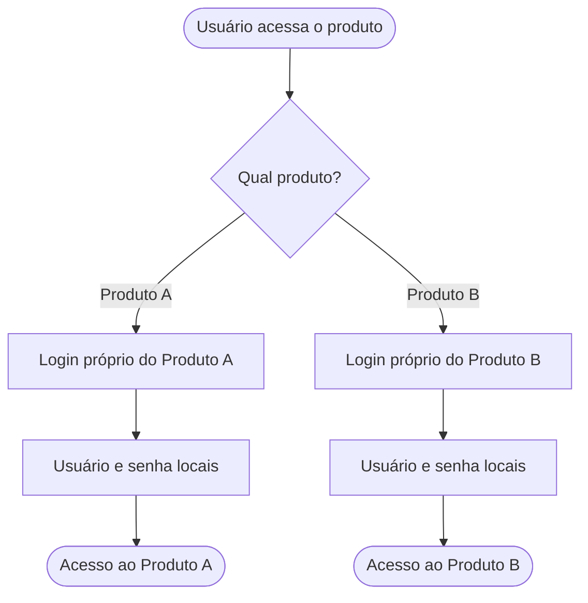
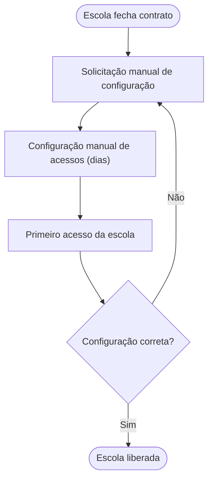
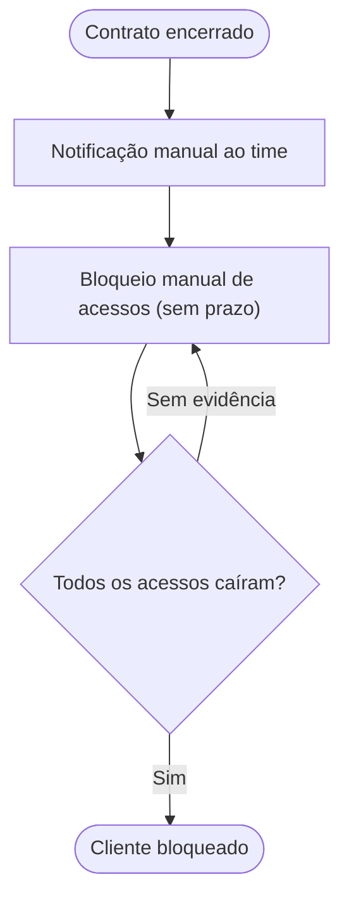
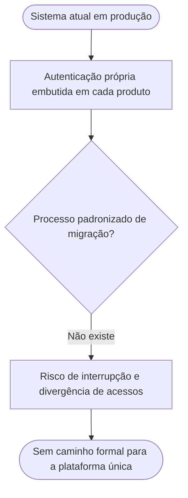
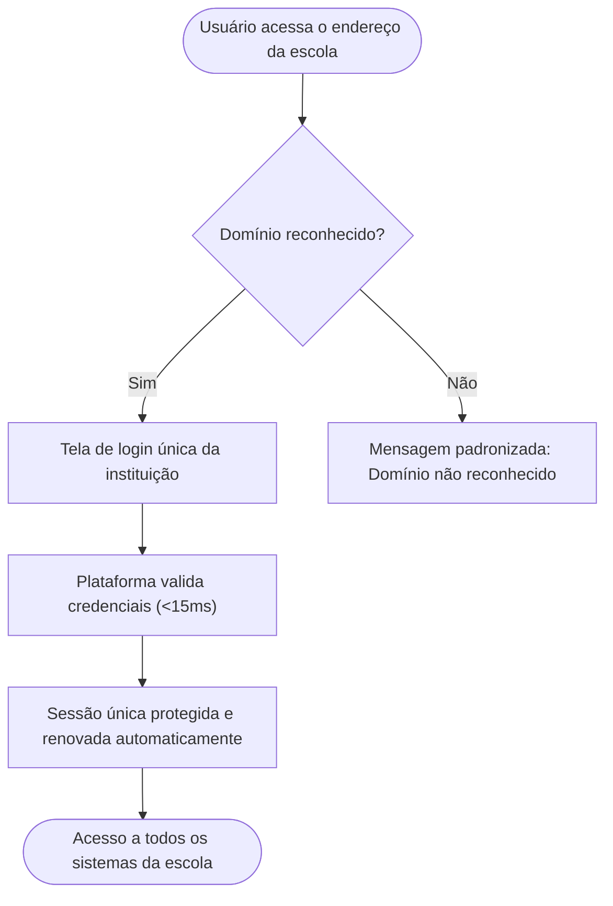
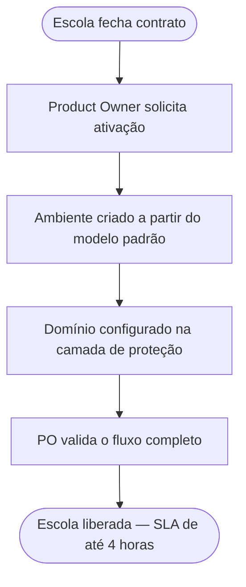
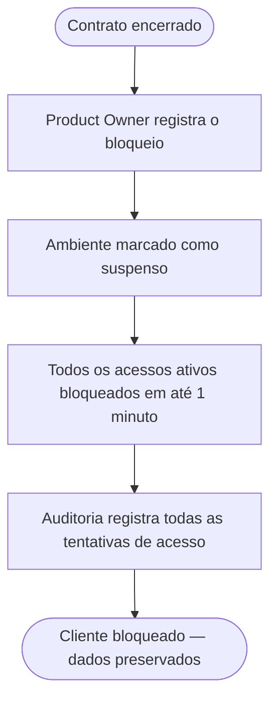
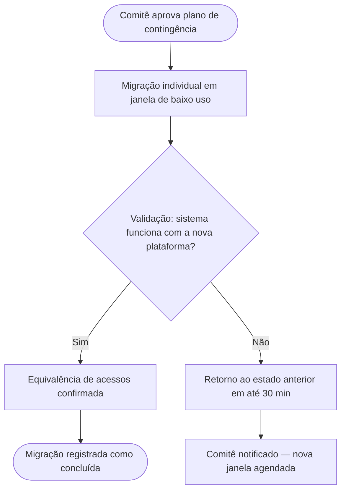

# Mapeamento de Processos AS-IS / TO-BE: PROJETO SHIELD — Plataforma de Identidade e Segurança
## [STATUS: COMPLIANCE]

| Campo | Detalhe |
|-------|---------|
| **Projeto** | PRJ-TEC-2026-0004-PROJETO-SHIELD |
| **Documentos Base** | 001-PROJECT-CHARTER, 002-STAKEHOLDER-MAP, 003-PERSONAS-JORNADAS |
| **Data de Elaboração** | 19/08/2026 |
| **Versão** | 1.5 — Aprovação humana (19/08/2026, P1=SIM/P2–P4=NÃO — atalho OK) — documento congelado em COMPLIANCE |
| **Metodologia** | WATERFALL |

---

### Siglas definidas no documento

- **B-PROCESS-** _(Business Process)_: Processo de negócio (AS-IS/TO-BE) — prefixo de identificação PROC→B-PROCESS
- **B-GAP-ANALYSIS-** _(Business Gap Analysis)_: Gap AS-IS → TO-BE — prefixo de identificação GAP→B-GAP-ANALYSIS
- **B-PERSONA-** / **B-JOURNEY-**: siglas definidas no 003-PERSONAS-JORNADAS

---

## Mapeamento de Processos AS-IS / TO-BE

O **documento de Mapeamento de Processos** registra COMO o negócio funciona hoje (AS-IS) e COMO deverá funcionar após o projeto (TO-BE), explicitando os gaps entre os dois estados. É a base processual que fundamenta os requisitos de negócio do 005-BRD e os fluxos dos casos de uso do 010-FRD.

### O que contém

- **Inventário de Processos (B-PROCESS-NN):** cada processo impactado com fluxo AS-IS diagramado (Mermaid), atores (personas/stakeholders) e pontos de dor
- **Fluxos TO-BE:** o desenho futuro de cada processo, incorporando as oportunidades identificadas nas jornadas (003)
- **Gap Analysis (B-GAP-ANALYSIS-NN):** diferenças AS-IS → TO-BE com impacto e requisito derivado (candidato a REQ-NN do BRD)
- **Rastreabilidade:** cada processo/gap aponta jornada (003), persona (003) e objetivo de negócio (001)

### Conexão com o Pipeline

- **UPSTREAM:** Consome jornadas e personas do 003, objetivos do 001 e partes interessadas do 002
- **DOWNSTREAM:** Alimenta 005-BRD (requisitos derivados dos gaps), 010-FRD (fluxos dos UCs), 016-PROTOTIPOS-UX-UI (telas dos processos TO-BE), 030-SAD (contexto processual da arquitetura) e 088-PRODUCT-BACKLOG-LIST

---

## 1. Inventário de Processos AS-IS (B-PROCESS-NN)

| ID | Processo | Descrição | Atores Envolvidos | Jornadas Relacionadas (003) | Pontos de Dor |
|----|----------|-----------|-------------------|------------------------------|---------------|
| B-PROCESS-01 | Acesso e Autenticação de Usuários | Cada produto do ecossistema gerencia seus próprios usuários e senhas | B-PERSONA-01, B-PERSONA-02, B-PERSONA-03 | B-JOURNEY-01 | Login repetido por produto; credenciais fragmentadas; risco de vazamento entre clientes |
| B-PROCESS-02 | Ativação de Novo Cliente (Onboarding) | Configuração manual de acessos a cada nova escola contratada | B-PERSONA-01, Product Owner (002), Gerência Comercial (002) | B-JOURNEY-02 | Processo manual que leva dias; sem SLA; configuração errada descoberta no primeiro uso |
| B-PROCESS-03 | Suspensão e Bloqueio de Cliente | Bloqueio de acessos quando um contrato é encerrado | B-PERSONA-01, Product Owner (002), Gerência Comercial (002) | B-JOURNEY-03 | Bloqueio manual e demorado; sem evidência imediata de efetivação |
| B-PROCESS-04 | Migração de Sistemas Existentes | Hoje cada produto mantém autenticação própria — não há processo padronizado de integração a uma plataforma única | B-PERSONA-04, Product Owner (002), Gerência de Tecnologia (002) | B-JOURNEY-04 | Migração sem padrão; risco de interrupção para usuários ativos; divergência de acessos/permissões |

### Fluxo AS-IS — B-PROCESS-01

### Fluxo AS-IS — B-PROCESS-02

### Fluxo AS-IS — B-PROCESS-03

### Fluxo AS-IS — B-PROCESS-04

> **REGRA:** Todo processo da Seção 1 deve ter vínculo com pelo menos uma jornada do 003-PERSONAS-JORNADAS.

---

## 2. Processos TO-BE

### TO-BE — B-PROCESS-01: Acesso e Autenticação de Usuários

| Mudança em Relação ao AS-IS | Oportunidade de Origem (B-JOURNEY-NN) |
|---|---|
| Login único para todos os produtos (porta única) | B-JOURNEY-01 — etapa 2 |
| Reconhecimento automático pelo domínio da escola | B-JOURNEY-01 — etapa 1 |
| Sessão protegida, sem credenciais expostas, com renovação automática | B-JOURNEY-01 — etapa 2/3 |

### TO-BE — B-PROCESS-02: Ativação de Novo Cliente (Onboarding)

| Mudança em Relação ao AS-IS | Oportunidade de Origem (B-JOURNEY-NN) |
|---|---|
| Ativação a partir de modelo padrão pré-configurado | B-JOURNEY-02 — etapa 2 |
| SLA formal de 4 horas com validação completa antes da liberação | B-JOURNEY-02 — etapa 3 |

### TO-BE — B-PROCESS-03: Suspensão e Bloqueio de Cliente

| Mudança em Relação ao AS-IS | Oportunidade de Origem (B-JOURNEY-NN) |
|---|---|
| Bloqueio automático e imediato (até 1 minuto), sem depender de expiração de sessão | B-JOURNEY-03 — etapa 1 |
| Evidência via registro de auditoria de todas as tentativas | B-JOURNEY-03 — etapa 2 |

### TO-BE — B-PROCESS-04: Migração de Sistemas Existentes

| Mudança em Relação ao AS-IS | Oportunidade de Origem (B-JOURNEY-NN) |
|---|---|
| Migração individual por sistema, com plano de contingência aprovado pelo Comitê | B-JOURNEY-04 — etapa 1 |
| Validação da equivalência de acessos/permissões antes da confirmação | B-JOURNEY-04 — etapa 3 |
| Retorno ao estado anterior em até 30 minutos em caso de falha | B-JOURNEY-04 — etapa 4 |

---

## 3. Gap Analysis (B-GAP-ANALYSIS-NN)

| ID | Processo | Gap (AS-IS → TO-BE) | Tipo | Impacto | Requisito Derivado (candidato a REQ) |
|----|----------|---------------------|------|---------|---------------------------------------|
| B-GAP-ANALYSIS-01 | B-PROCESS-01 | Autenticação fragmentada por produto → porta única de acesso para todo o ecossistema | Processo | Onboarding lento, custo duplicado de manutenção | B-REQ-01, B-REQ-04, B-REQ-10 — reconhecimento automático e portal padronizado |
| B-GAP-ANALYSIS-02 | B-PROCESS-01 | Sem isolamento garantido entre clientes → isolamento estrito de ambientes | Segurança | Risco de vazamento entre escolas (reputação + LGPD) | B-REQ-02 — isolamento total entre clientes |
| B-GAP-ANALYSIS-03 | B-PROCESS-01 | Credenciais expostas no navegador → credenciais invisíveis ao navegador | Segurança | Roubo de credenciais e sessão | B-REQ-03 — proteção de credenciais |
| B-GAP-ANALYSIS-04 | B-PROCESS-01 | Latência e capacidade sem controle sob demanda crescente → validação de identidade <15ms e adaptação automática mesmo em pico | Desempenho | Abandono em horário de entrada e risco de queda sob crescimento da base | B-REQ-05, B-REQ-06, B-REQ-09 — resposta rápida, suporte a picos e adaptação automática da capacidade |
| B-GAP-ANALYSIS-05 | B-PROCESS-02 | Ativação manual de dias → ativação padronizada em até 4 horas | Processo | Atraso na receita de novas escolas | B-REQ-08 — ativação em até 4 horas |
| B-GAP-ANALYSIS-06 | B-PROCESS-03 | Bloqueio manual sem evidência → bloqueio imediato com auditoria | Processo/Regulatório | Acessos remanescentes após encerramento de contrato | B-REQ-07 — rastreabilidade de acessos |
| B-GAP-ANALYSIS-07 | B-PROCESS-04 | Inexistência de processo padronizado de migração → migração individual com plano de contingência e rollback em até 30 min | Processo | Interrupção perceptível para usuários finais e divergência de acessos na transição | B-REQ-11 — transição sem interrupção |

> **REGRA:** Todo gap deve gerar pelo menos um requisito candidato a REQ-NN. O 005-BRD formalizará esses requisitos com numeração oficial. (Os IDs acima já correspondem aos requisitos formalizados no 005-BRD.)

---

## 4. Rastreabilidade

| Item | Origem (001/002/003) | Consumidores Previstos | Status |
|------|----------------------|------------------------|--------|
| B-PROCESS-01 | B-JOURNEY-01 (003), B-PERSONA-01/B-PERSONA-02/B-PERSONA-03 (003) | 005, 010, 016 | ✅ Vinculado |
| B-PROCESS-02 | B-JOURNEY-02 (003), B-PERSONA-01 (003), PO (002) | 005, 010, 016 | ✅ Vinculado |
| B-PROCESS-03 | B-JOURNEY-03 (003), B-PERSONA-01 (003), PO (002) | 005, 010, 016 | ✅ Vinculado |
| B-GAP-ANALYSIS-01..04 | B-PROCESS-01, B-JOURNEY-01 | 005 | ✅ Vinculado |
| B-GAP-ANALYSIS-05 | B-PROCESS-02, B-JOURNEY-02 | 005 | ✅ Vinculado |
| B-GAP-ANALYSIS-06 | B-PROCESS-03, B-JOURNEY-03 | 005 | ✅ Vinculado |
| B-PROCESS-04 | B-JOURNEY-04 (003), B-PERSONA-04 (003), PO/Ger. Tecnologia (002) | 005, 010, 016 | ✅ Vinculado |
| B-GAP-ANALYSIS-07 | B-PROCESS-04, B-JOURNEY-04 | 005 | ✅ Vinculado |

> **REGRA DE OURO:** Nenhum processo ou gap pode existir sem lastro em jornada do 003 ou objetivo do Charter (001). A RTM-FASE-1 (015) validará esta rastreabilidade formalmente.

---

## 5. Registro de Alterações

| Versão | Data | Alteração | Autor |
|--------|------|-----------|-------|
| 1.0 | 19/08/2026 | Criação inicial a partir do Charter, Stakeholder Map e Personas/Jornadas | Time de Negócios / skill waterfall-business-documents |
| 1.1 | 19/08/2026 | Correção cirúrgica (review FASE 1): B-GAP-ANALYSIS-04 estendido — gap de desempenho sob demanda agora deriva B-REQ-05, B-REQ-06 e B-REQ-09 (alinhamento com a RTM-FASE-1, seção 2.3) | Time de Negócios / skill waterfall-business-documents |
| 1.2 | 19/08/2026 | Correção cirúrgica (review FASE 1, F1): B-PROCESS-04 (Migração de Sistemas Existentes, AS-IS/TO-BE) e B-GAP-ANALYSIS-07 adicionados — cadeia de origem do B-REQ-11 completa | Time de Negócios / skill waterfall-business-documents |
| 1.3 | 19/08/2026 | Aprovação humana (P1=SIM, P2/P3/P4=NÃO — atalho OK) — documento congelado em COMPLIANCE | Orquestrador / skill waterfall-business-documents |
| 1.4 | 19/08/2026 | Correção cirúrgica (update pós-selo, F3/F4/F6): atores dos B-PROCESS-02/03 harmonizados ('Gerência Comercial (002)'); título com subtítulo do produto; campo Versão do cabeçalho alinhado | Time de Negócios / skill waterfall-business-documents |
| 1.5 | 19/08/2026 | Aprovação humana (P1=SIM, P2/P3/P4=NÃO — atalho OK) — correções do update pós-selo aprovadas; documento congelado em COMPLIANCE | Orquestrador / skill waterfall-business-documents |
