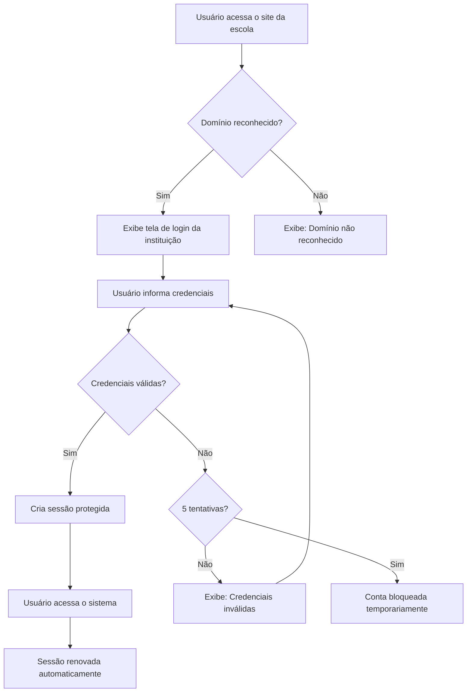
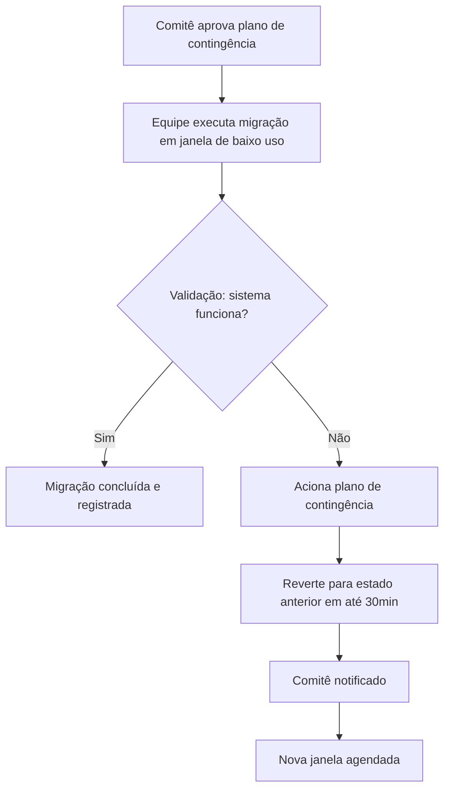

# Functional Requirements Document (FRD): PROJETO SHIELD — Plataforma de Identidade e Segurança
## [STATUS: COMPLIANCE]

| Campo | Detalhe |
|-------|---------|
| **Projeto** | PRJ-TEC-2026-0004-PROJETO-SHIELD |
| **Documentos Base** | 001-PROJECT-CHARTER, 002-STAKEHOLDER-MAP, 003-PERSONAS-JORNADAS, 004-MAPEAMENTO-AS-IS-TO-BE, 005-BRD |
| **Data de Elaboração** | 08/08/2026 |
| **Versão** | 1.6 — Aprovação humana (19/08/2026, P1=SIM/P2–P4=NÃO — atalho OK) — documento congelado em COMPLIANCE |
| **Metodologia** | WATERFALL |

---

## FRD — Functional Requirements Document (Documento de Requisitos Funcionais)

O **FRD (Functional Requirements Document)** é o guia que detalha exatamente **como** o produto deve funcionar para atender às necessidades de negócio definidas no BRD. Ele traduz os requisitos de negócio (`B-REQ-NN`) em funcionalidades (`B-FEAT-NN`), regras operacionais (`B-RULE-NN`) e casos de uso (`B-UC-NN`), sempre sob a ótica do usuário e do negócio — sem decisões técnicas de implementação.

### O Papel do FRD no Pipeline Waterfall

- **Contrato funcional** entre o negócio e a equipe técnica — define o escopo funcional antes de qualquer linha de código
- **Tradução do BRD:** Transforma necessidades genéricas de negócio em comportamentos práticos e verificáveis
- **Insumo direto para TEST-CASES (050):** A equipe de QA utiliza os Fluxos Alternativos e de Exceção dos Casos de Uso para criar a matriz de testes
- **Base para Estimativa Downstream (PERT ±15-25%):** Cenários de erro, validações e regras operacionais são essenciais para estimar com precisão

### Siglas definidas neste documento

| Prefixo | Significado | Origem |
|---------|-------------|--------|
| `B-REQ-` | Requisito de Negócio | 005-BRD |
| `B-RULE-` | Regra de Negócio | 005-BRD |
| `B-LIMIT-` | Restrição de Negócio | 005-BRD |
| `B-FEAT-` | Funcionalidade de Negócio | Este documento (010-FRD) |
| `B-UC-` | Caso de Uso de Negócio | Este documento (010-FRD) |
| `B-UC-**-FA-` | Fluxo Alternativo em caso de uso | Este documento (010-FRD) |
| `B-UC-**-EX-` | Exceções em Caso de Uso de Negócio | Este documento (010-FRD) |
| `B-PREMISE-` | Premissas Funcionais | Este documento (010-FRD) |
| `B-PERSONA-` | Persona de Negócio | 003-PERSONAS-JORNADAS |
| `B-JOURNEY-` | Jornada de Negócio | 003-PERSONAS-JORNADAS |
| `B-PROCESS-` | Processo de Negócio (AS-IS/TO-BE) | 004-MAPEAMENTO-AS-IS-TO-BE |
| `B-GAP-ANALYSIS-` | Gap AS-IS → TO-BE | 004-MAPEAMENTO-AS-IS-TO-BE |

---

### 1. Funcionalidades de Negócio (B-FEAT-NN)

Cada funcionalidade deriva diretamente de um ou mais requisitos de negócio do BRD (`B-REQ-NN`).

| ID | Funcionalidade | O que entrega para o negócio | Origem BRD | Prioridade |
|----|---------------|------------------------------|------------|------------|
| B-FEAT-01 | Reconhecimento de Cliente pelo Domínio | Quando um usuário acessa o endereço da sua escola, a plataforma identifica automaticamente qual cliente é e direciona para o ambiente correto — sem qualquer intervenção manual | B-REQ-01 | **Alta** |
| B-FEAT-02 | Isolamento de Ambientes por Cliente | Cada escola opera em seu próprio ambiente isolado. Um usuário autenticado no ambiente da Escola A não pode, de forma alguma, acessar informações da Escola B | B-REQ-02 | **Alta** |
| B-FEAT-03 | Proteção de Credenciais do Usuário | As senhas e tokens de acesso dos usuários jamais ficam expostos no navegador ou em qualquer lugar fora do ambiente seguro de autenticação | B-REQ-03 | **Alta** |
| B-FEAT-04 | Portal de Acesso Padronizado | Conjunto único de funcionalidades de autenticação (entrar, sair, ver perfil, trocar senha) que qualquer produto do ecossistema FBSO pode consumir | B-REQ-04, B-REQ-10 | **Alta** |
| B-FEAT-05 | Resposta Rápida na Validação de Identidade | A plataforma confirma a identidade do usuário em menos de 15 milissegundos, garantindo uma navegação fluida | B-REQ-05 | **Média** |
| B-FEAT-06 | Suporte a Picos de Acesso | A plataforma suporta o acesso simultâneo de milhares de usuários no horário de entrada das escolas sem apresentar falhas ou lentidão | B-REQ-06 | **Média** |
| B-FEAT-07 | Registro de Auditoria de Acessos | Toda tentativa de acesso (bem-sucedida ou não) é registrada de forma rastreável, sem armazenar informações sensíveis como senhas | B-REQ-07 | **Média** |
| B-FEAT-08 | Ativação Rápida de Novo Cliente | Uma nova escola pode ser configurada na plataforma em até 4 horas — incluindo criação do ambiente isolado e configuração do domínio | B-REQ-08 | **Média** |
| B-FEAT-09 | Adaptação Automática ao Crescimento | A plataforma ajusta automaticamente sua capacidade conforme novos clientes entram ou o volume de acessos aumenta, sem intervenção manual | B-REQ-09 | **Baixa** |
| B-FEAT-10 | Transição Transparente de Sistemas | Os sistemas atuais são migrados para a nova plataforma um a um, com plano de contingência, sem que o usuário final perceba interrupção no serviço | B-REQ-11 | **Alta** |

#### 1.1 Matriz de Funcionalidades Detalhadas

| FEAT | Módulo/Tela | Campos | Validações | Obrigatoriedade |
|------|------------|--------|------------|-----------------|
| B-FEAT-01 | Página de entrada da escola | Endereço acessado (domínio) | Domínio configurado → direciona ao ambiente; não configurado → mensagem padronizada | Obrigatório |
| B-FEAT-02 | Ambiente do cliente | Ambiente da sessão | Acesso restrito ao próprio ambiente; tentativa externa → "nada encontrado" | Obrigatório |
| B-FEAT-03 | Tela de login | Credenciais do usuário | Credenciais nunca visíveis no navegador; falha → "Credenciais inválidas" sem revelar qual campo errou | Obrigatório |
| B-FEAT-04 | Portal de acesso (entrar/sair/perfil/trocar senha) | Sessão, perfil | Logout encerra a sessão em todos os níveis; sessão renovada em segundo plano | Obrigatório |
| B-FEAT-05 | Validação de identidade | Identidade do usuário | 95% das validações abaixo de 15ms; acima de 20ms alerta a Gerência de Tecnologia | Obrigatório |
| B-FEAT-06 | Pico de acesso | Carga de acessos simultâneos | Degradação de serviços não críticos antes de afetar o login | Obrigatório |
| B-FEAT-07 | Registro de auditoria | Tentativas de acesso (data, hora, origem) | Sem senha, CPF ou e-mail completo; retenção mínima de 6 meses | Obrigatório |
| B-FEAT-08 | Ativação de nova escola | Nome da escola, domínio, responsável | Ambiente criado a partir do modelo padrão; prazo máximo de 4 horas | Obrigatório |
| B-FEAT-09 | Capacidade da plataforma | Volume de clientes e acessos | Confirmação de capacidade antes da contratação de novo lote de escolas | Obrigatório |
| B-FEAT-10 | Migração de sistema | Sistema alvo, plano de contingência | Migração individual por sistema; rollback em até 30 minutos | Obrigatório |

#### 1.2 Matriz de Telas/Módulos

| Módulo | Funcionalidades | Descrição |
|--------|----------------|-----------|
| Portal de Acesso | B-FEAT-01, B-FEAT-03, B-FEAT-04, B-FEAT-05 | Porta de entrada única para todos os produtos do ecossistema |
| Ambiente do Cliente | B-FEAT-02 | Isolamento estrito entre escolas |
| Auditoria de Acessos | B-FEAT-07 | Registro e rastreabilidade de todas as tentativas de acesso |
| Ativação de Cliente | B-FEAT-08 | Onboarding de novas escolas em até 4 horas |
| Capacidade e Picos | B-FEAT-06, B-FEAT-09 | Suporte a picos de acesso e crescimento da base |
| Migração de Sistemas | B-FEAT-10 | Transição transparente dos sistemas atuais |

---

### 2. Regras de Negócio por Funcionalidade

Regras operacionais que detalham o comportamento esperado de cada funcionalidade. Estas complementam as `B-RULE-` do BRD, que definem as regras macro do negócio.

| ID | Regra | Descrição | Funcionalidade Vinculada | UC Vinculado |
|----|-------|-----------|-------------------------|--------------|
| B-RULE-10 | Roteamento por Domínio | O endereço digitado pelo usuário (ex: `escola-alfa.com`) é a única informação usada para determinar em qual ambiente ele será atendido. Não há menu de seleção de escola | B-FEAT-01 | B-UC-01 |
| B-RULE-11 | Mensagem Padronizada para Domínio Desconhecido | Se um domínio não está configurado na plataforma, o sistema exibe a mensagem "Domínio não reconhecido" — sem revelar detalhes internos da infraestrutura | B-FEAT-01 | B-UC-01 |
| B-RULE-12 | Sessão Vinculada ao Ambiente | Uma vez autenticado, o usuário só pode acessar recursos do seu próprio ambiente. Qualquer tentativa de acessar recursos de outro ambiente retorna "nada encontrado" | B-FEAT-02 | B-UC-03 |
| B-RULE-13 | Bloqueio Imediato na Suspensão | Quando um cliente é suspenso, todos os acessos ativos daquele ambiente são bloqueados em até 1 minuto, sem depender da expiração natural da sessão | B-FEAT-02 | B-UC-03 |
| B-RULE-14 | Invisibilidade de Credenciais | Em nenhum momento o navegador do usuário tem acesso direto a tokens ou senhas — essas informações são gerenciadas exclusivamente pela plataforma | B-FEAT-03 | B-UC-01 |
| B-RULE-15 | Logout Completo | Quando o usuário sai do sistema, sua sessão é encerrada na plataforma e todas as informações de acesso são removidas do navegador | B-FEAT-04 | B-UC-01 |
| B-RULE-16 | Renovação sem Interrupção | A sessão do usuário é renovada automaticamente em segundo plano enquanto ele estiver ativo — sem precisar fazer login novamente | B-FEAT-04 | B-UC-01 |
| B-RULE-17 | Latência Máxima por Validação | 95% das validações de identidade devem responder em menos de 15 milissegundos. Acima de 20ms, o time técnico é alertado | B-FEAT-05 | B-UC-01 |
| B-RULE-18 | Degradação Controlada em Pico | Se a demanda ultrapassar a capacidade máxima, a plataforma não pode cair — ela degrada serviços não críticos antes de afetar o login | B-FEAT-06 | B-UC-05 |
| B-RULE-19 | Retenção de Logs por 6 Meses | Registros de auditoria de acesso são mantidos por no mínimo 6 meses. Após esse período, seguem a política de expurgo da empresa | B-FEAT-07 | B-UC-07 |
| B-RULE-20 | Logs sem Dados Pessoais | Nenhum registro de auditoria pode conter senha, CPF, e-mail completo ou qualquer identificador pessoal do usuário — apenas identificadores internos | B-FEAT-07 | B-UC-07 |
| B-RULE-21 | Ambiente Novo a Partir de Modelo | Todo novo cliente é criado a partir de um modelo padrão que já inclui as configurações de segurança básicas. Customizações são tratadas à parte | B-FEAT-08 | B-UC-02 |
| B-RULE-22 | Prazo Máximo de Ativação | O processo completo de ativação de um novo cliente — da solicitação à liberação para uso — não pode ultrapassar 4 horas | B-FEAT-08 | B-UC-02 |
| B-RULE-23 | Migração Individual por Sistema | Cada sistema corporativo é migrado para a nova plataforma separadamente. A migração do Sistema A não pode afetar o funcionamento do Sistema B | B-FEAT-10 | B-UC-04 |
| B-RULE-24 | Rollback em Até 30 Minutos | Se um sistema apresentar falha após a migração, a equipe tem até 30 minutos para reverter ao estado anterior. Este prazo está documentado no plano de contingência aprovado pelo Comitê | B-FEAT-10 | B-UC-04 |
| B-RULE-25 | Confirmação de Capacidade antes da Expansão | Antes da contratação de um novo lote de escolas, a Gerência Comercial deve consultar a Gerência de Tecnologia para confirmar a capacidade atual da plataforma e, se necessário, solicitar expansão | B-FEAT-09 | B-UC-06 |

---

### 3. Casos de Uso de Negócio (B-UC-NN)

Cada caso de uso descreve um cenário completo de interação entre o usuário e a plataforma, sob a ótica de valor para o negócio.

#### B-UC-01: Acesso do Usuário à Sua Escola

| Campo | Detalhe |
|-------|---------|
| **Atores** | Usuário final (professor, coordenador, aluno) |
| **Funcionalidades Vinculadas** | B-FEAT-01, B-FEAT-03, B-FEAT-04, B-FEAT-05 |
| **Pré-condições** | O usuário possui credenciais válidas na sua instituição |
| **Pós-condições (Sucesso)** | Usuário autenticado, sessão protegida ativa, acessando os sistemas da sua escola |
| **Pós-condições (Falha)** | Acesso negado, mensagem padronizada exibida, tentativa registrada em auditoria |

**Fluxo Principal (Caminho Feliz):**
1. O usuário acessa o endereço da sua escola no navegador
2. A plataforma reconhece o domínio e direciona para a tela de login da instituição
3. O usuário informa suas credenciais
4. A plataforma valida as credenciais e cria uma sessão protegida
5. O usuário é redirecionado para o sistema que deseja acessar
6. Durante o uso, a sessão é renovada automaticamente em segundo plano

**Fluxos Alternativos:**
- **B-UC-01-FA-01 — Usuário já possui sessão ativa:** Se o usuário já estiver autenticado, acessar o endereço da escola o leva diretamente ao sistema, sem nova tela de login
- **B-UC-01-FA-02 — Usuário acessa de outro dispositivo:** A sessão anterior permanece ativa no dispositivo original. Uma nova sessão independente é criada

**Fluxos de Exceções:**
- **B-UC-01-EX-01 — Domínio não reconhecido:** O sistema exibe "Domínio não reconhecido". Nenhuma informação interna é revelada
- **B-UC-01-EX-02 — Credenciais inválidas:** O sistema informa "Credenciais inválidas" sem especificar se o erro foi no usuário ou na senha. Após 5 tentativas, a conta é temporariamente bloqueada
- **B-UC-01-EX-03 — Ambiente do cliente suspenso:** O sistema exibe "Acesso temporariamente indisponível"

---

#### B-UC-02: Ativação de Uma Nova Escola na Plataforma

| Campo | Detalhe |
|-------|---------|
| **Atores** | Product Owner, Equipe Técnica |
| **Funcionalidades Vinculadas** | B-FEAT-08 |
| **Pré-condições** | Contrato com a nova escola está assinado; domínio da escola está definido |
| **Pós-condições (Sucesso)** | Ambiente isolado criado, domínio configurado, acesso liberado para a escola |
| **Pós-condições (Falha)** | Processo interrompido, Product Owner notificado, prazo de 4 horas pausado |

**Fluxo Principal:**
1. O Product Owner recebe a solicitação de ativação de uma nova escola
2. O Product Owner aciona a equipe técnica com as informações: nome da escola, domínio, responsável
3. A equipe cria o ambiente isolado a partir do modelo padrão
4. A equipe configura o domínio da escola na camada de proteção
5. O Product Owner valida o fluxo completo: acesso ao domínio → tela de login → autenticação → acesso ao sistema
6. A escola é liberada para uso

**Fluxos de Exceções:**
- **B-UC-02-EX-01 — Domínio já cadastrado:** O sistema alerta que o domínio já está em uso por outro cliente. Product Owner verifica e confirma
- **B-UC-02-EX-02 — Prazo de 4 horas excedido:** Se o processo ultrapassar 4 horas, o Product Owner é notificado e deve comunicar a Gerência Comercial

---

#### B-UC-03: Bloqueio de Acesso de Uma Escola

| Campo | Detalhe |
|-------|---------|
| **Atores** | Product Owner, Gerência Comercial |
| **Funcionalidades Vinculadas** | B-FEAT-02 |
| **Pré-condições** | Decisão de suspensão ou encerramento do contrato foi tomada |
| **Pós-condições (Sucesso)** | Todos os acessos do cliente bloqueados; dados preservados |
| **Pós-condições (Falha)** | Bloqueio não confirmado em todos os níveis |

**Fluxo Principal:**
1. A Gerência Comercial notifica o Product Owner sobre a suspensão ou encerramento do contrato
2. O Product Owner registra a solicitação de bloqueio
3. O ambiente da escola é marcado como suspenso
4. Em até 1 minuto, todos os acessos ativos daquela escola são bloqueados
5. O Product Owner confirma que o bloqueio foi efetivado
6. Os dados permanecem armazenados para eventual reativação ou extração

**Fluxos de Exceções:**
- **B-UC-03-EX-01 — Falha no bloqueio:** Se o bloqueio não for confirmado em 5 minutos, a Gerência de Tecnologia é acionada

---

#### B-UC-04: Migração de um Sistema Existente para a Nova Plataforma

| Campo | Detalhe |
|-------|---------|
| **Atores** | Product Owner, Gerência de Tecnologia, Equipe Técnica |
| **Funcionalidades Vinculadas** | B-FEAT-10 |
| **Jornada Vinculada (003)** | B-JOURNEY-04 — Migração dos Sistemas Atuais |
| **Pré-condições** | Plano de contingência aprovado pelo Comitê de Projeto; sistema alvo identificado |
| **Pós-condições (Sucesso)** | Sistema migrado e operando com a nova plataforma; usuários finais não perceberam interrupção |
| **Pós-condições (Falha)** | Sistema revertido ao estado anterior em até 30 minutos; Comitê notificado |

**Fluxo Principal:**
1. O Comitê de Projeto aprova o plano de contingência para o sistema alvo
2. A equipe técnica executa a migração em janela de baixo uso
3. O Product Owner valida o funcionamento do sistema com a nova plataforma
4. O Gerente de Tecnologia confirma que o sistema está operando normalmente
5. A migração é registrada como concluída

**Fluxos de Exceções:**
- **B-UC-04-EX-01 — Falha detectada na validação:** A equipe aciona o plano de contingência e reverte a migração em até 30 minutos. O Comitê é notificado e uma nova janela é agendada
- **B-UC-04-EX-02 — Impacto em usuários finais detectado:** A migração é imediatamente revertida. A Gerência Comercial é comunicada para gerenciar expectativas com os clientes

---

#### B-UC-05: Pico de Acesso no Horário de Entrada

| Campo | Detalhe |
|-------|---------|
| **Atores** | Usuário final, Gerência de Tecnologia |
| **Funcionalidades Vinculadas** | B-FEAT-06 |
| **Pré-condições** | Plataforma está operando normalmente; horário de pico previsto (ex: 7h da manhã) |
| **Pós-condições (Sucesso)** | Todos os usuários autenticados com sucesso; latência dentro do limite de 15ms; Gerência de Tecnologia não recebeu alertas |
| **Pós-condições (Falha)** | Parte dos usuários enfrenta lentidão; Gerência de Tecnologia notificada; serviços não críticos degradados para preservar o login |

**Fluxo Principal:**
1. No horário de entrada, milhares de alunos e professores acessam simultaneamente os endereços de suas escolas
2. A plataforma processa as validações de identidade mantendo a latência abaixo de 15ms
3. A plataforma distribui automaticamente a carga entre os recursos disponíveis
4. O horário de pico passa sem incidentes
5. A Gerência de Tecnologia revisa os relatórios de desempenho do período

**Fluxos Alternativos:**
- **B-UC-05-FA-01 — Pico acima do previsto:** Se a demanda ultrapassar o maior pico já registrado, a plataforma continua operando e escala automaticamente

**Fluxos de Exceções:**
- **B-UC-05-EX-01 — Latência acima de 20ms:** A Gerência de Tecnologia é alertada. Serviços não críticos são temporariamente reduzidos para preservar a velocidade do login. Nenhum usuário é impedido de acessar
- **B-UC-05-EX-02 — Risco de queda detectado:** Se a plataforma atingir 90% da capacidade máxima, a Gerência de Tecnologia é notificada preventivamente para avaliar expansão antes do próximo pico

---

#### B-UC-06: Expansão da Base de Clientes

| Campo | Detalhe |
|-------|---------|
| **Atores** | Gerência Comercial, Gerência de Tecnologia, Gerência de Finanças |
| **Funcionalidades Vinculadas** | B-FEAT-09 |
| **Pré-condições** | A empresa planeja contratar um novo lote de escolas |
| **Pós-condições (Sucesso)** | Capacidade confirmada ou expansão aprovada; novo lote de escolas pode ser contratado |
| **Pós-condições (Falha)** | Expansão da plataforma necessária antes da contratação; cronograma ajustado |

**Fluxo Principal:**
1. A Gerência Comercial identifica oportunidade de contratar 50 novas escolas
2. A Gerência Comercial consulta a Gerência de Tecnologia: "A plataforma suporta mais 50 escolas?"
3. A Gerência de Tecnologia avalia a capacidade atual da plataforma
4. A Gerência de Tecnologia confirma que a plataforma suporta o novo volume sem alterações
5. A Gerência Comercial prossegue com a contratação

**Fluxos Alternativos:**
- **B-UC-06-FA-01 — Expansão necessária:** A Gerência de Tecnologia identifica que a capacidade atual não suporta o novo lote. Solicita orçamento à Gerência de Finanças para expansão. Após aprovação, a expansão é executada antes da contratação das novas escolas

**Fluxos de Exceções:**
- **B-UC-06-EX-01 — Expansão inviável no momento:** Se a expansão não for possível dentro do prazo desejado, a Gerência Comercial ajusta o cronograma de contratação ou reduz o tamanho do lote

---

#### B-UC-07: Investigação de Incidente de Acesso

| Campo | Detalhe |
|-------|---------|
| **Atores** | Gerência de Tecnologia, Gerência de Finanças (papel de auditoria/compliance) |
| **Funcionalidades Vinculadas** | B-FEAT-07 |
| **Pré-condições** | Um incidente foi reportado (ex: cliente alega acesso indevido à sua conta) |
| **Pós-condições (Sucesso)** | Relatório de acessos do período emitido; causa do incidente identificada; ações corretivas registradas |
| **Pós-condições (Falha)** | Dados insuficientes para concluir a investigação; melhorias na auditoria são propostas |

**Fluxo Principal:**
1. Um cliente reporta suspeita de acesso indevido à sua conta
2. A Gerência de Tecnologia é acionada para investigar
3. A Gerência de Tecnologia consulta os registros de auditoria da plataforma filtrando pelo identificador do cliente e pelo período da suspeita
4. Os registros mostram todas as tentativas de acesso (bem-sucedidas e malsucedidas) com data, hora e origem
5. A Gerência de Tecnologia emite relatório com a análise dos acessos
6. O cliente é informado sobre o resultado da investigação (sem expor dados internos)

**Fluxos Alternativos:**
- **B-UC-07-FA-01 — Auditoria programada:** A Gerência de Finanças solicita relatório trimestral de acessos para fins de conformidade LGPD, sem que haja um incidente específico

**Fluxos de Exceções:**
- **B-UC-07-EX-01 — Período fora da janela de retenção:** Se o incidente ocorreu há mais de 6 meses, os registros podem não estar mais disponíveis. A Gerência de Tecnologia informa a limitação e recomenda extensão do período de retenção

---

### 4. Fluxos de Trabalho (Workflows)

#### 4.1 Fluxo de Acesso do Usuário

#### 4.2 Fluxo de Migração de Sistema

---

### 5. Restrições e Premissas Funcionais

#### 5.1 Restrições Operacionais

| ID | Restrição | Descrição | Impacto se não observada |
|----|-----------|-----------|-------------------------|
| B-LIMIT-07 | Janela de Migração | Migrações de sistemas em produção devem ocorrer fora do horário comercial (preferencialmente madrugada ou finais de semana) | Risco de impacto em usuários ativos durante o horário de pico |
| B-LIMIT-08 | Tempo Máximo de Rollback | O plano de contingência deve garantir retorno ao estado anterior em até 30 minutos | Exceder esse prazo significa que usuários finais perceberão a interrupção |

#### 5.2 Premissas Funcionais

| ID | Premissa | Validação |
|----|----------|-----------|
| B-PREMISE-01 | Cada escola possui um domínio próprio (ex: `escola-alfa.com`) | Confirmar com Gerência Comercial antes da ativação |
| B-PREMISE-02 | Os sistemas corporativos atuais podem ser adaptados para consumir a nova plataforma de acesso | Validar com Gerência de Tecnologia durante a Fase 2 (020-SRS) |
| B-PREMISE-03 | O processo de ativação de 4 horas pressupõe que a equipe técnica está disponível e não há dependências externas | Monitorar durante as primeiras ativações |

---

### 6. Matriz de Rastreabilidade (FRD → BRD)

Cada funcionalidade do FRD rastreia a pelo menos um requisito de negócio do BRD.

| Funcionalidade (FRD) | Requisito de Negócio (BRD) | Regras de Negócio Vinculadas | Casos de Uso |
|----------------------|----------------------------|------------------------------|--------------|
| B-FEAT-01 — Reconhecimento pelo Domínio | B-REQ-01 | B-RULE-01, B-RULE-10, B-RULE-11 | B-UC-01 |
| B-FEAT-02 — Isolamento de Ambientes | B-REQ-02 | B-RULE-02, B-RULE-06, B-RULE-08, B-RULE-12, B-RULE-13 | B-UC-03 |
| B-FEAT-03 — Proteção de Credenciais | B-REQ-03 | B-RULE-03, B-RULE-14 | B-UC-01 |
| B-FEAT-04 — Portal de Acesso Padronizado | B-REQ-04, B-REQ-10 | B-RULE-04, B-RULE-05, B-RULE-15, B-RULE-16 | B-UC-01 |
| B-FEAT-05 — Resposta Rápida | B-REQ-05 | B-RULE-17 | B-UC-01 |
| B-FEAT-06 — Suporte a Picos | B-REQ-06 | B-RULE-18 | B-UC-05 |
| B-FEAT-07 — Registro de Auditoria | B-REQ-07 | B-RULE-19, B-RULE-20 | B-UC-07 |
| B-FEAT-08 — Ativação de Novo Cliente | B-REQ-08 | B-RULE-07, B-RULE-21, B-RULE-22 | B-UC-02 |
| B-FEAT-09 — Adaptação ao Crescimento | B-REQ-09 | B-RULE-25 | B-UC-06 |
| B-FEAT-10 — Transição Transparente | B-REQ-11 | B-RULE-23, B-RULE-24 | B-UC-04 |

**Cobertura:** 10/10 funcionalidades vinculadas a requisitos de negócio do BRD. 11/11 B-REQs cobertos por pelo menos um B-FEAT. 7/7 Casos de Uso documentados. 25 regras de negócio (B-RULE-01 a B-RULE-25) com lastro. **Zero órfãos. 100% rastreável.**

---

## 7. Registro de Alterações

| Versão | Data | Alteração | Autor |
|--------|------|-----------|-------|
| 1.0 | 08/08/2026 | Criação inicial a partir do BRD (005) | Time de Negócios / Orquestrador WATERFALL |
| 1.1 | 19/08/2026 | Revisão de atualização: matrizes 1.1/1.2 adicionadas; linguagem de negócio | Time de Negócios / skill waterfall-business-documents |
| 1.2 | 19/08/2026 | Correção cirúrgica (review FASE 1): marcador residual de status removido do rodapé — o status oficial permanece no cabeçalho | Time de Negócios / skill waterfall-business-documents |
| 1.3 | 19/08/2026 | Correção cirúrgica (review FASE 1, F1): B-UC-04 vinculado à B-JOURNEY-04 (003-PERSONAS-JORNADAS) — espelho da cadeia de origem do B-REQ-11 | Time de Negócios / skill waterfall-business-documents |
| 1.4 | 19/08/2026 | Aprovação humana (P1=SIM, P2/P3/P4=NÃO — atalho OK) — documento congelado em COMPLIANCE | Orquestrador / skill waterfall-business-documents |
| 1.5 | 19/08/2026 | Correção cirúrgica (update pós-selo, F3/F4/F6): 'Gerente Comercial' → 'Gerência Comercial' (B-UC-03, B-UC-02-EX-02 e B-UC-04-EX-02); títulos das Seções 1 e 3 sem glosa inglesa; campo Versão do cabeçalho alinhado | Time de Negócios / skill waterfall-business-documents |
| 1.6 | 19/08/2026 | Aprovação humana (P1=SIM, P2/P3/P4=NÃO — atalho OK) — correções do update pós-selo aprovadas; documento congelado em COMPLIANCE | Orquestrador / skill waterfall-business-documents |
