# Software Architecture Document (SAD): PROJETO SHIELD
## [STATUS: COMPLIANCE]

| Campo | Detalhe |
|-------|---------|
| **Projeto** | PRJ-TEC-2026-0004-PROJETO-SHIELD |
| **Solução Técnica** | ms-shield-identity-auth |
| **Documentos Base** | 01-PROJECT-CHARTER, 02-BRD, 03-SRS |
| **Arquitetura Global** | `/home/bolismar/work/workspace-fbso/architecture/` |
| **Segurança Global** | `/home/bolismar/work/workspace-fbso/.specs/security/GLOBAL-SECURITY.md` |
| **Stack** | Java 21 + Quarkus + GraalVM Native + Keycloak + Kong + Istio + DOKS + PostgreSQL + Redis |
| **Data** | 03/08/2026 | **Versão** | 2.0 | **Metodologia** | WATERFALL |

---

## 1. Architectural Overview

**Estilo Arquitetural:** Microserviço de borda (Backend-For-Frontend) com arquitetura reativa e compilação nativa GraalVM. O Shield atua como **serviço de validação de sessão acoplado ao Kong API Gateway** — não é chamado diretamente pelo frontend.

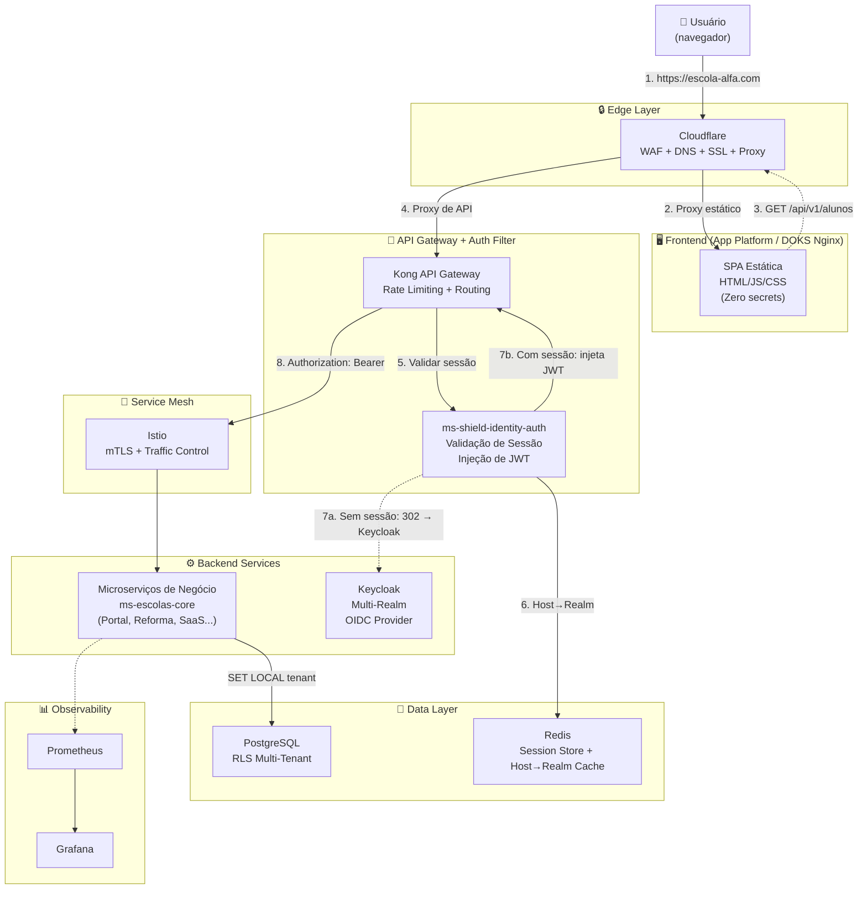

### ADR Registry

```mermaid
requirementDiagram
    requirement ADR_001 {
        id: "ADR-001"
        text: "GraalVM Native — binário nativo para latência <15ms e ~40MB RAM"
    }
    requirement ADR_002 {
        id: "ADR_002"
        text: "BFF único ponto Keycloak — microsserviços nunca chamam Keycloak"
    }
    requirement ADR_003 {
        id: "ADR_003"
        text: "Istio mTLS + Kong — comunicação interna criptografada"
    }
    requirement ADR_004 {
        id: "ADR_004"
        text: "Redis Host→Realm — cache com TTL 1h e invalidação sob demanda"
    }
    requirement ADR_005 {
        id: "ADR_005"
        text: "RLS Multi-Tenant — SET LOCAL app.current_tenant"
    }
    requirement ADR_006 {
        id: "ADR_006"
        text: "GitOps Argo CD — deploy declarativo via PR"
    }
    requirement ADR_007 {
        id: "ADR_007"
        text: "Cookies HttpOnly — tokens nunca expostos ao JS"
    }

    element NFR_Performance {
        type: "NFR-01,03,16"
    }
    element NFR_Security {
        type: "NFR-04 a 08"
    }
    element NFR_Availability {
        type: "NFR-09,11"
    }

    ADR_001 - satisfies -> NFR_Performance
    ADR_007 - satisfies -> NFR_Security
    ADR_006 - satisfies -> NFR_Availability
```

---

## 2. Solution Architecture

O `ms-shield-identity-auth` expõe endpoints REST mas **não é chamado diretamente pelo frontend**. O Kong API Gateway é o entry point — ele encaminha a validação de sessão para o Shield, que decide se libera a requisição (injetando JWT) ou redireciona para o Keycloak.

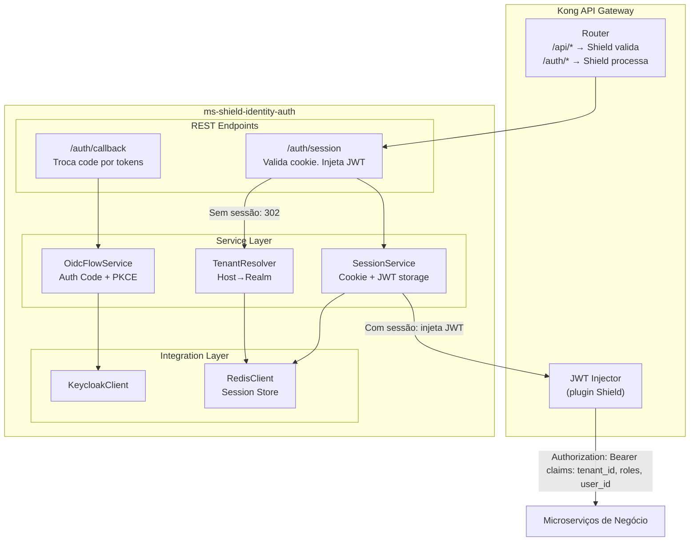

### Passo a Passo — Interceptação de API pelo Shield

**1. Acesso e Entrega do Frontend:**
- O cliente digita `https://escola-alfa.com`
- A Cloudflare recebe e repassa para a DigitalOcean (App Platform ou DOKS/Nginx), que entrega os arquivos estáticos (HTML/JS/CSS) da SPA para o navegador
- O frontend é **100% estático e sem segredos** — não conhece client_secret do Keycloak

**2. Tentativa de Chamada de API:**
- O JavaScript carrega no navegador e faz uma requisição de dados (ex: `GET /api/v1/alunos`)
- A chamada passa pela Cloudflare (proxy de API) e chega ao Kong API Gateway no DOKS

**3. Interceptação pelo Shield (onde ele atua):**
- O Kong repassa a checagem de sessão para o `ms-shield-identity-auth`
- **Se o usuário NÃO estiver logado:** O Shield consulta Redis (host → realm), descobre o Realm no Keycloak baseado na URL (`escola-alfa.com`) e devolve `302` para a tela de login do Keycloak
- **Se o usuário ESTIVER logado:** O navegador envia o cookie `HttpOnly`. O Shield decodifica a sessão, recupera o JWT do Redis e **injeta o JWT no header `Authorization: Bearer <JWT>`** da requisição interna, liberando a chamada para o microserviço de negócio

**4. Autenticação no Keycloak:**
- O cliente digita usuário e senha na tela do Keycloak (tema visual da escola)
- O Keycloak valida as credenciais e devolve um *Authorization Code* para a URL de callback (`/auth/callback`)

**5. Troca do Código por Tokens (Back-Channel):**
- A rota `/auth/callback` é processada pelo Shield
- O Shield faz a chamada interna (back-channel) para o Keycloak, trocando o código pelo **Access Token (JWT)** e **Refresh Token**
- Em vez de devolver o JWT para o frontend, o Shield **armazena os tokens no Redis** e responde ao navegador gravando o cookie seguro: `Set-Cookie: SHIELD_SESSION=...; HttpOnly; Secure; SameSite=Strict`

**6. Retorno ao Cliente:**
- A resposta atravessa DOKS → Cloudflare → Navegador
- O cliente está com a SPA carregada na URL `escola-alfa.com`, com sessão gravada via cookie seguro e **pronto para usar a aplicação**
- Nas próximas chamadas de API, o fluxo repete a partir do passo 2 — mas agora o cookie existe, então o Shield vai direto para a injeção do JWT (passo 3, caminho "com sessão")

### System Integration Architecture — Shield como Filtro de Sessão do Kong

O `ms-shield-identity-auth` **não é chamado diretamente pelo frontend**. Ele atua como um serviço de validação de sessão acoplado ao Kong API Gateway. O frontend (SPA estática) faz chamadas de API normalmente — o Kong + Shield interceptam e gerenciam a autenticação de forma transparente.

**Por que esta separação:**
- **Frontend 100% estático:** A SPA no App Platform/Nginx não conhece segredos do Keycloak (client_secret). Ela apenas faz chamadas de API.
- **Isolamento de responsabilidade:** O Shield cuida de OIDC, cookies HttpOnly, gestão de sessão e injeção de JWT. O frontend cuida de UI/UX.
- **Escala independente:** Se o volume de logins disparar, o KEDA escala apenas as instâncias do Shield (Quarkus Native, ~40MB RAM, cold start <100ms).

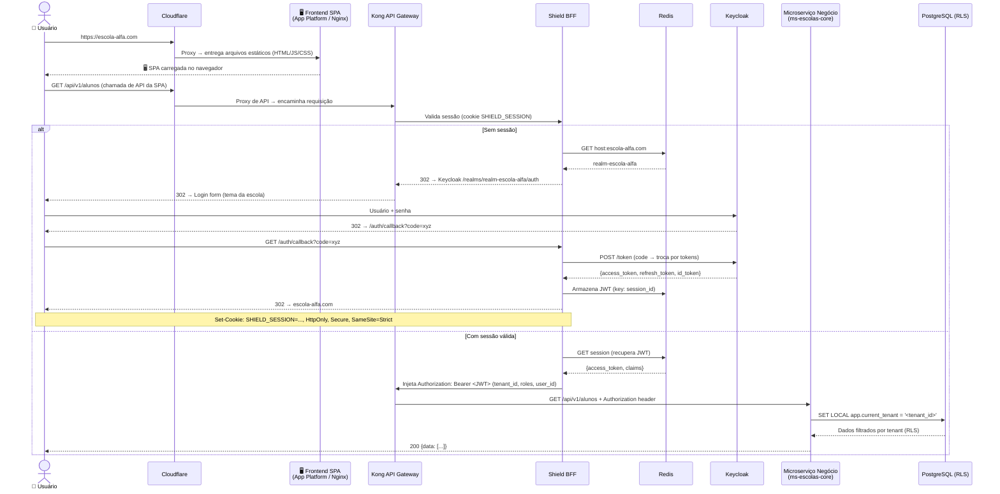

**Fluxo pós-autenticação (sessão válida):**
1. SPA faz chamada de API → Cloudflare → Kong
2. Kong encaminha para o Shield validar cookie `SHIELD_SESSION`
3. Shield recupera JWT do Redis, injeta `Authorization: Bearer <JWT>` no header
4. Kong encaminha requisição com JWT para o microserviço de negócio
5. Microserviço executa `SET LOCAL app.current_tenant` e consulta PostgreSQL com RLS
6. Resposta retorna ao cliente — **transparente, sem intervenção do frontend**

**Regra de Ouro:** Microserviços de negócio **NUNCA** chamam Keycloak ou Shield diretamente. Eles apenas recebem o header `Authorization` injetado pelo Kong e confiam nas claims (tenant_id, roles, user_id).

---

## 3. Data Architecture

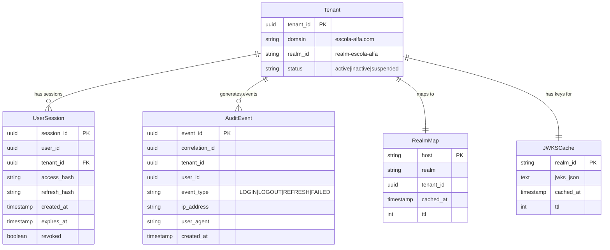

---

## 4. Security Architecture

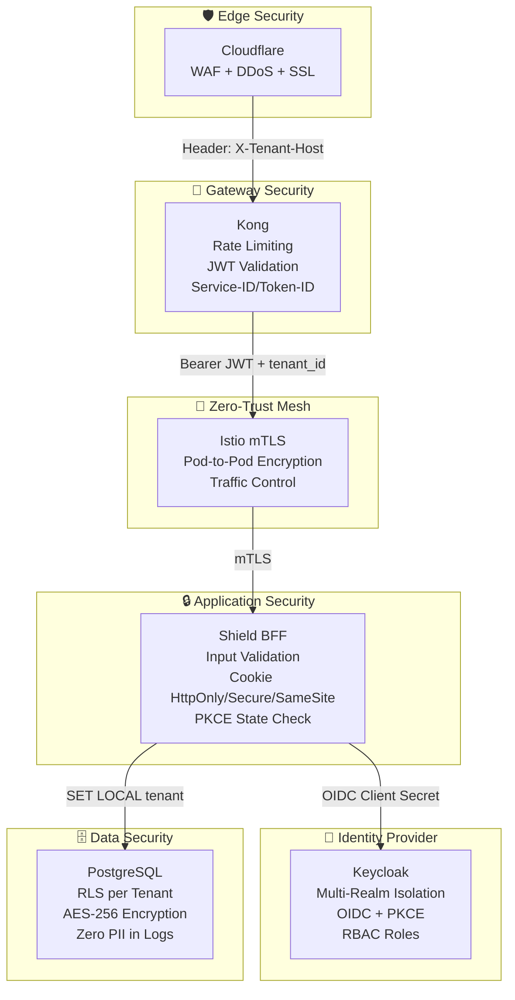

### Threat Model (STRIDE)

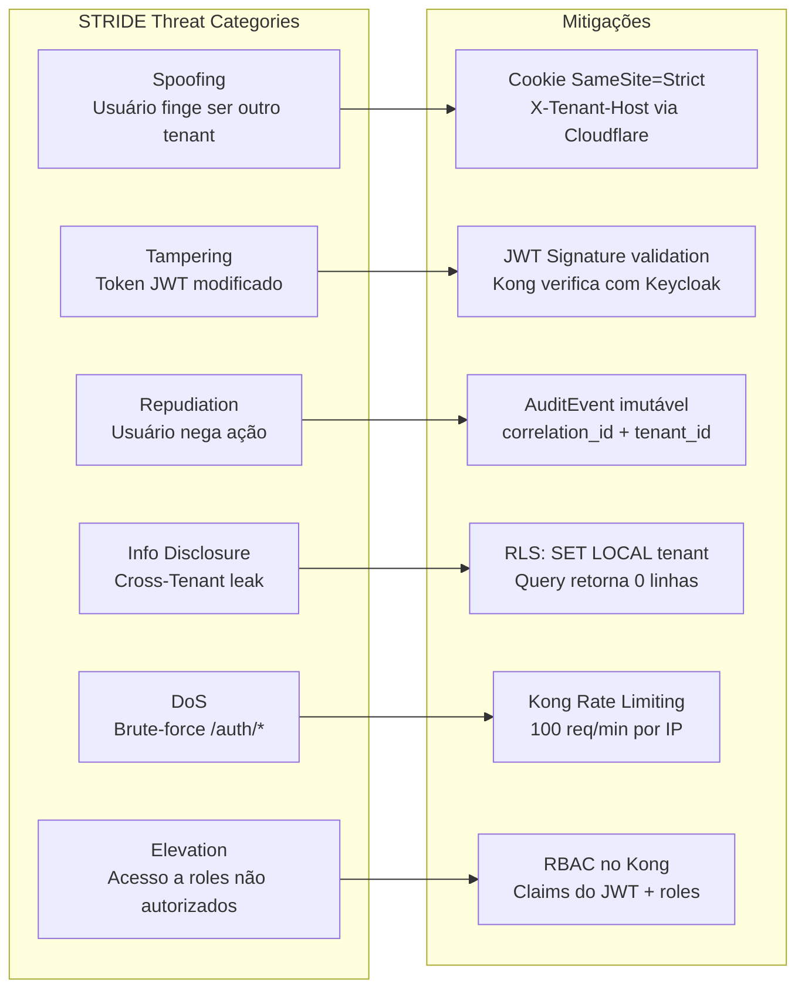

---

## 5. DevOps / SRE Architecture

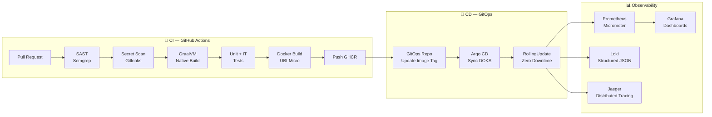

### CI/CD Pipeline (Git Graph)

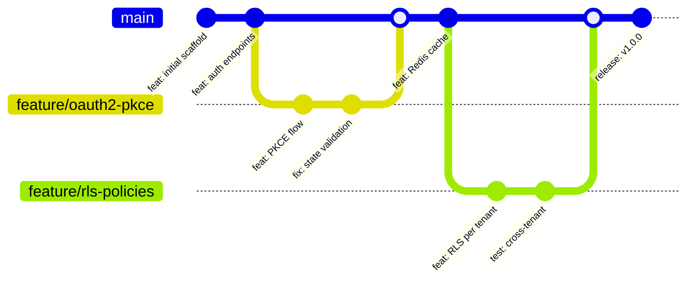

---

## 6. Infrastructure / Cloud Architecture

### Deployment Topology

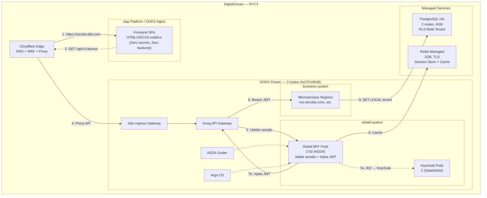

---

## 7. Testing Architecture

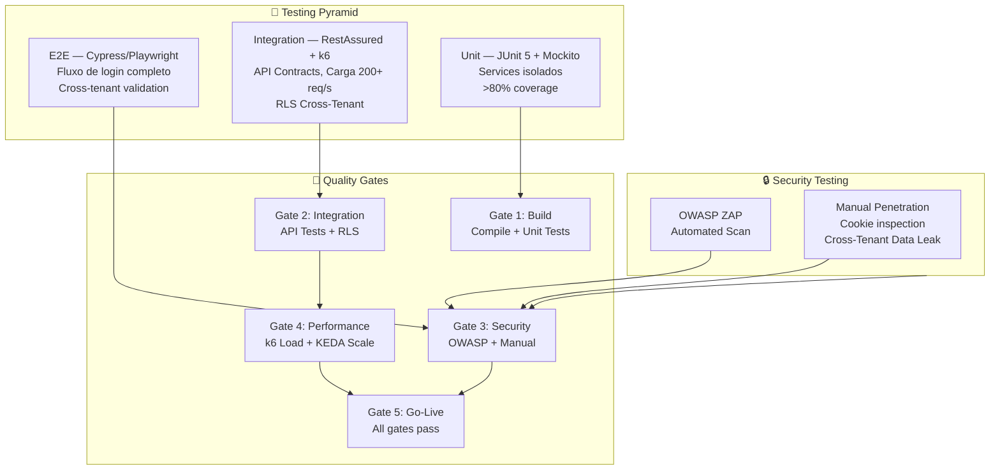

---

## 8. Cross-Cutting Concerns

| Concern | Implementação |
|---------|--------------|
| **Logging** | JSON estruturado: `{correlation_id, tenant_id, event, timestamp}` — Zero PII |
| **Error Handling** | Exceções mapeadas para HTTP status codes; stack traces nunca expostos |
| **Caching** | Redis: Host→Realm (TTL 1h), JWKS (TTL 15min). Invalidação sob demanda |
| **Rate Limiting** | Kong: 100 req/min/IP em /auth/*; 1000 req/min para endpoints internos |

---

## 9. Traceability SAD → SRS → BRD → Charter

| ADR (SAD) | NFR (SRS) | REQ (BRD) | OBJ (Charter) |
|-----------|-----------|-----------|---------------|
| ADR-001 GraalVM | NFR-01, NFR-03, NFR-16 | REQ-05, REQ-09 | C3, C4 |
| ADR-002 BFF único | NFR-04 a NFR-08 | REQ-02, REQ-03, REQ-04 | C1, C2 |
| ADR-003 Istio+Kong | NFR-07, NFR-09 | REQ-02, REQ-06 | C1, C4, C7 |
| ADR-004 Redis Cache | NFR-02 | REQ-01, REQ-08 | C1, C6 |
| ADR-005 RLS | NFR-08 | REQ-02 | C1 |
| ADR-006 GitOps | NFR-09, NFR-11 | REQ-09 | C4, C7 |
| ADR-007 Cookies | NFR-04 a NFR-06 | REQ-03 | C2 |

---

**[STATUS: SUCESSO]** — SAD v2.0 com diagramas Mermaid (flowchart, requirementDiagram, erDiagram, architecture-beta, gitGraph).
