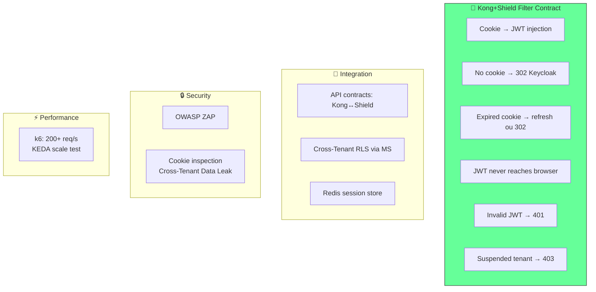

# Plano de Testes: PROJETO SHIELD
## [STATUS: Em revisão]

| Campo | Detalhe |
|-------|---------|
| **Projeto** | PRJ-TEC-2026-0004-PROJETO-SHIELD |
| **Documentos Base** | 01-PROJECT-CHARTER, 03-SRS, 05-SAD, 07-LLD |
| **Stack** | Java 21 + Quarkus + GraalVM Native + Kong + Keycloak + PostgreSQL + Redis + DOKS |
| **Data** | 03/08/2026 | **Versão** | 2.0 — Revisão Integração | **Metodologia** | WATERFALL |

---

## 1. Test Strategy

## 2. Kong+Shield Filter Contract Tests (novo)

| ID | Contrato | Entrada | Saída Esperada |
|----|---------|---------|---------------|
| FK-01 | Cookie válido → injeta JWT | Cookie SHIELD_SESSION válido | Kong injeta `Authorization: Bearer <JWT>` com claims (tenant_id, roles, user_id). MS recebe requisição |
| FK-02 | Sem cookie → redirect Keycloak | Sem cookie | 302 para Keycloak /realms/{realm}/auth com code_challenge PKCE |
| FK-03 | Cookie expirado, refresh OK | JWT expirado, refresh_token válido | Novo JWT no Redis. Kong injeta Authorization |
| FK-04 | Cookie expirado, refresh falhou | JWT expirado, refresh_token expirado | 302 → Keycloak. Cookie removido |
| FK-05 | JWT nunca chega ao browser | Sessão ativa | Nenhuma response contém JWT no body/headers. Cookie é HttpOnly |
| FK-06 | JWT forjado → rejeitado | Authorization: Bearer <token_inválido> (bypass Shield) | 401 — Kong rejeita assinatura inválida |
| FK-07 | Tenant suspenso | Cookie de tenant com status=suspended | 403 — Shield rejeita. Cookie invalidado |
| FK-08 | Host não mapeado | Header Host: desconhecido.com | 401 — "Domínio não configurado" |
| FK-09 | Redis down → fallback local | Redis indisponível | Shield valida JWT em cache local (TTL curto). Alerta Prometheus |

## 3-11. (Seções mantidas — Unit, Integration, Security, Performance, Regression, Acceptance, Schedule — conforme versão 1.0, com atualização dos nomes de endpoints para refletir o modelo Kong Filter)

**Atualizações específicas:**

| Seção | Mudança |
|-------|---------|
| **Integration Test Plan** | Tests agora validam `POST /internal/session/validate` e `GET /internal/tenant/resolve` (Kong↔Shield), não endpoints REST públicos |
| **Functional/System Test Plan** | Substituir cenários de `/auth/*` por cenários de interceptação Kong+Shield (FK-01 a FK-09) |
| **Security Test Plan** | Adicionar: "Frontend nunca vê JWT" (inspeção de responses), "Header Authorization forjado bypassa Shield" (network policy) |
| **Performance Test Plan** | Manter thresholds. Adicionar: "KEDA escala Shield sob 200+ req/s com validação de sessão" |

---

**[STATUS: SUCESSO]** — Plano de testes atualizado com 9 contratos do Kong+Shield Filter (FK-01 a FK-09). Testes de `/auth/*` como API pública removidos.
