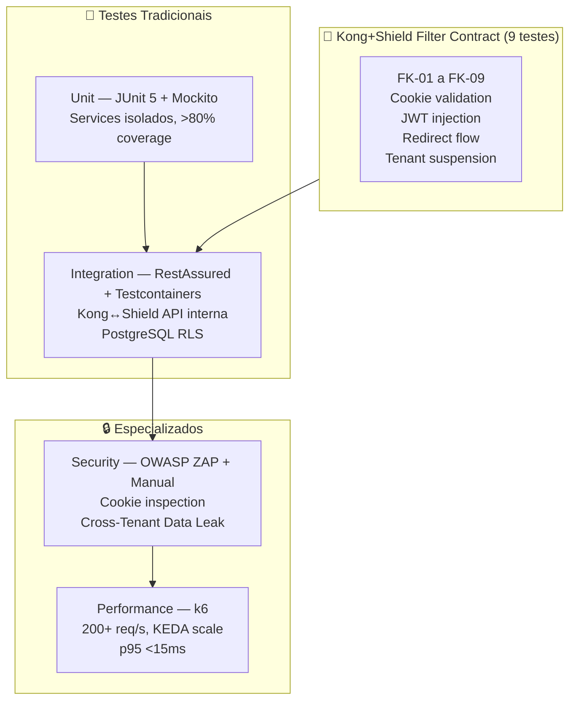

# Plano de Testes: PROJETO SHIELD
## [STATUS: COMPLIANCE]

| Campo | Detalhe |
|-------|---------|
| **Projeto** | PRJ-TEC-2026-0004-PROJETO-SHIELD |
| **Documentos Base** | 01-PROJECT-CHARTER, 03-SRS, 05-SAD, 07-LLD |
| **Stack** | Java 21 + Quarkus + GraalVM Native + Kong + Keycloak + PostgreSQL + Redis + DOKS |
| **Data** | 03/08/2026 | **Versão** | 3.0 | **Metodologia** | WATERFALL |

---

## 1. Test Strategy

A estratégia de testes cobre 3 camadas: **contrato do filtro Kong+Shield**, **testes tradicionais** (unidade/integração), e **testes especializados** (segurança/performance).

---

## 2. Test Environment Requirements

| Ambiente | Finalidade | Configuração |
|----------|-----------|-------------|
| **Dev** | Testes unitários e de integração local | Docker Compose (Keycloak, PostgreSQL, Redis, Kong) |
| **CI** | Build + Unit + SAST + Filter Contract tests | GitHub Actions runner |
| **Staging** | Testes de integração completos, segurança e carga | DOKS 3 nós, Kong+Shield, PostgreSQL HA, Redis gerenciado |
| **Load Test** | Testes de carga isolados (k6) | DOKS com KEDA configurado, métricas Prometheus |

---

## 3. Test Data Strategy

| Aspecto | Estratégia |
|---------|-----------|
| **Geração** | 3 tenants de teste (`escola-alfa`, `escola-beta`, `escola-gama`) com dados sintéticos |
| **Anonimização** | Zero PII real em qualquer ambiente |
| **Reset** | `TRUNCATE` com rollback por tenant; Redis `FLUSHDB` no tearDown |
| **Cross-Tenant** | Tokens válidos para cada tenant; queries cross-tenant intencionais para validar bloqueio |
| **Sessão** | Cookies SHIELD_SESSION pré-gerados com JWT válidos, expirados e inválidos |

---

## 4. Unit Test Plan

| Camada | Framework | Coverage Target | Foco |
|--------|-----------|----------------|------|
| **SessionFilter** | JUnit 5 + Mockito | > 85% | validateCookie, injectJWT, redirectToLogin |
| **TenantResolver** | JUnit 5 + Mockito | > 80% | resolveTenant (hit/miss Redis), cache invalidation |
| **OidcFlowService** | JUnit 5 + Mockito | > 80% | handleCallback, exchangeCode, refreshTokens |
| **SessionStore** | JUnit 5 + Mockito | > 80% | save, get, delete, refresh (Redis + fallback local) |

---

## 5. Integration Test Plan

| Integração | Ferramenta | Cenários |
|-----------|-----------|---------|
| **Kong → Shield: validate** | RestAssured + Testcontainers Kong | Cookie válido → 200 + claims; sem cookie → 401; cookie expirado → tenta refresh; tenant suspenso → 403 |
| **Kong → Shield: tenant resolve** | RestAssured | Host mapeado → realm_id; host não mapeado → 401 |
| **Shield → Redis** | Testcontainers Redis | SET/GET/DEL session; TTL expiração; GET host→realm; fallback quando Redis down |
| **Shield → Keycloak** | Testcontainers Keycloak | Token exchange; refresh token; logout; Keycloak down → graceful degradation |
| **MS → PostgreSQL RLS** | Testcontainers PostgreSQL | SET LOCAL tenant; query cross-tenant bloqueada; query mesmo tenant OK |

---

## 6. Functional / System Test Plan

| Feature (SRS) | Cenários | Critério de Aceitação |
|--------------|---------|---------------------|
| **FK-01 a FK-04** — Validação de sessão | Cookie válido → injeta JWT; sem cookie → 302 Keycloak; expirado → refresh ou 302 | 4/4 cenários passam |
| **FK-05** — JWT nunca no browser | Inspecionar responses: `document.cookie` não mostra SHIELD_SESSION; nenhum body/header contém JWT | Zero vazamento de token |
| **FK-06** — JWT forjado | Enviar Authorization com token inválido (bypass Shield) | 401 — Kong rejeita assinatura |
| **FK-07** — Tenant suspenso | Cookie de tenant suspenso → Shield retorna 403 | Bloqueio em <1s |
| **FK-08** — Domínio não mapeado | Header Host: desconhecido.com | 401 — "Domínio não configurado" |
| **FK-09** — Redis down | Derrubar Redis → Shield opera com cache local | 200 OK, Alerta Prometheus |

---

## 7. Security Test Plan

| Tipo | Ferramenta | Cobertura |
|------|-----------|----------|
| **SAST** | Semgrep (CI pipeline) | OWASP Top 10, secrets detection, input validation |
| **Secret Scan** | Gitleaks (pre-commit + CI) | API keys, tokens, passwords |
| **DAST** | OWASP ZAP | XSS, CSRF, SQL Injection, Broken Authentication |
| **Cookie Security** | Inspeção manual + Cypress | HttpOnly, Secure, SameSite=Strict em todas as responses |
| **Cross-Tenant** | RestAssured + Testcontainers | Token tenant A → query dados tenant B = []; token tenant B → query tenant B = OK |
| **JWT Tampering** | Manual + k6 | Authorization header com JWT modificado → 401 |
| **Rate Limiting** | k6 | 200+ req/s → Kong rate limit ativa (429) |

---

## 8. Performance Test Plan

| Tipo | Ferramenta | Threshold | Cenário |
|------|-----------|----------|---------|
| **Load** | k6 | p95 <15ms, <0.1% erro | 100 req/s constante por 5min com cookies válidos |
| **Stress** | k6 | Sem 5xx até 500 req/s | Rampa 50→500 req/s em 3min com mix válido/expirado/sem cookie |
| **Soak** | k6 | Sem memory leak, GC estável | 50 req/s por 30min |
| **Scalability** | k6 + KEDA metrics | Escala 2→N pods em <30s | 200+ req/s sustentado; validar KEDA ScaledObject triggers |

---

## 9. Regression Test Suite

| Gatilho | Escopo |
|---------|--------|
| **Push na main** | Unit + SAST + Secret Scan |
| **PR para main** | Unit + Integration + SAST + Filter Contract (FK-01 a FK-09) |
| **Release tag (v*)** | Unit + Integration + E2E + Security + Performance |
| **Semanal (sábado 06:00)** | Suite completa — todos os níveis |

---

## 10. Acceptance Criteria

| Feature | Critério | Status |
|---------|---------|--------|
| FK-01 a FK-04 — Validação de sessão | 4 cenários passam | Pendente |
| FK-05 — JWT nunca no browser | Zero vazamento confirmado | Pendente |
| FK-06 — JWT forjado rejeitado | 401 do Kong | Pendente |
| FK-07 — Tenant suspenso | Bloqueio <1s | Pendente |
| FK-08 — Domínio não mapeado | 401 padronizado | Pendente |
| FK-09 — Redis down fallback | Cache local funcional, alerta Prometheus | Pendente |
| Cross-Tenant | 100% queries cross-tenant bloqueadas | Pendente |
| Performance | p95 <15ms, 0 errors @ 200+ req/s | Pendente |

---

## 11. Test Deliverables Schedule

| Entrega | Semana | Responsável |
|---------|--------|------------|
| Unit Test Suite | Semana 3 | Dev Backend |
| Integration Test Suite + Filter Contract | Semana 4 | QA + Dev Backend |
| Security Test Report | Semana 5 | QA + IAM Specialist |
| Performance Test Report + KEDA validation | Semana 5 | QA + DevOps |
| Regression Suite CI config | Semana 5 | DevOps |
| Acceptance Sign-Off | Semana 6 | PO + QA |

---

**[STATUS: SUCESSO]** — Plano de testes completo: 9 Filter Contract tests (FK-01 a FK-09), 4 ambientes, 5 níveis de teste, 11 seções.
