# Software Architecture Document (SAD): PROJETO SHIELD
## [STATUS: COMPLIANCE]

| Campo | Detalhe |
|-------|---------|
| **Projeto** | PRJ-TEC-2026-0004-PROJETO-SHIELD |
| **Solução Técnica** | ms-shield-identity-auth |
| **Documentos Base** | 01-PROJECT-CHARTER, 02-BRD, 03-SRS |
| **Arquitetura Global** | `/home/bolismar/work/workspace-fbso/architecture/` |
| **Segurança Global** | `/home/bolismar/work/workspace-fbso/.specs/security/GLOBAL-SECURITY.md` |
| **Stack** | Java 21 + Quarkus + GraalVM Native + Keycloak + Kong + Istio + DOKS + PostgreSQL + Redis |
| **Data** | 03/08/2026 | **Versão** | 2.0 | **Metodologia** | WATERFALL |

---

## 1. Architectural Overview

**Estilo Arquitetural:** Microserviço de borda (Backend-For-Frontend) com arquitetura reativa e compilação nativa GraalVM.

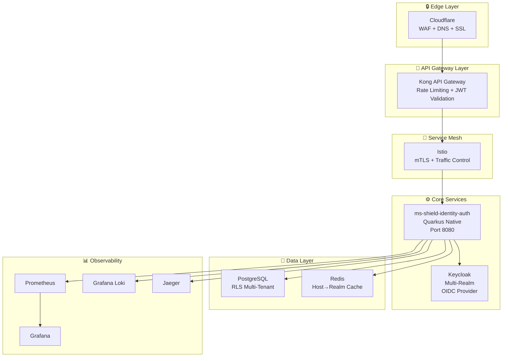

### ADR Registry

```mermaid
requirementDiagram
    requirement ADR_001 {
        id: "ADR-001"
        text: "GraalVM Native — binário nativo para latência <15ms e ~40MB RAM"
    }
    requirement ADR_002 {
        id: "ADR_002"
        text: "BFF único ponto Keycloak — microsserviços nunca chamam Keycloak"
    }
    requirement ADR_003 {
        id: "ADR_003"
        text: "Istio mTLS + Kong — comunicação interna criptografada"
    }
    requirement ADR_004 {
        id: "ADR_004"
        text: "Redis Host→Realm — cache com TTL 1h e invalidação sob demanda"
    }
    requirement ADR_005 {
        id: "ADR_005"
        text: "RLS Multi-Tenant — SET LOCAL app.current_tenant"
    }
    requirement ADR_006 {
        id: "ADR_006"
        text: "GitOps Argo CD — deploy declarativo via PR"
    }
    requirement ADR_007 {
        id: "ADR_007"
        text: "Cookies HttpOnly — tokens nunca expostos ao JS"
    }

    element NFR_Performance {
        type: "NFR-01,03,16"
    }
    element NFR_Security {
        type: "NFR-04 a 08"
    }
    element NFR_Availability {
        type: "NFR-09,11"
    }

    ADR_001 - satisfies -> NFR_Performance
    ADR_007 - satisfies -> NFR_Security
    ADR_006 - satisfies -> NFR_Availability
```

---

## 2. Solution Architecture

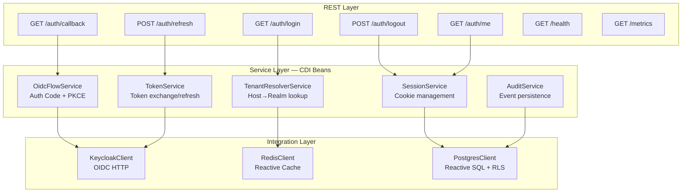

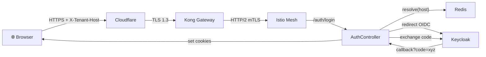

### System Integration Architecture — Shield × Sistemas Existentes

O Shield é a camada de identidade centralizada. Todos os sistemas existentes do ecossistema FBSO (Portal Escola, Portal Reforma, SaaS Corporativo, Comunidades de Ensino) delegam autenticação a ele. O contrato de integração é:

1. Cada sistema expõe suas páginas no domínio `*.fbso.org`
2. Ao detectar usuário sem sessão, o sistema redireciona para `shield.fbso.org/auth/login?redirect_uri=<url-de-retorno>`
3. O Shield gerencia todo o fluxo OIDC com Keycloak e retorna o usuário autenticado ao `redirect_uri`
4. Após retorno, o sistema chama `shield.fbso.org/auth/me` para obter o perfil
5. Cookies de sessão são compartilhados via domínio `.fbso.org` — login único para todos os sistemas

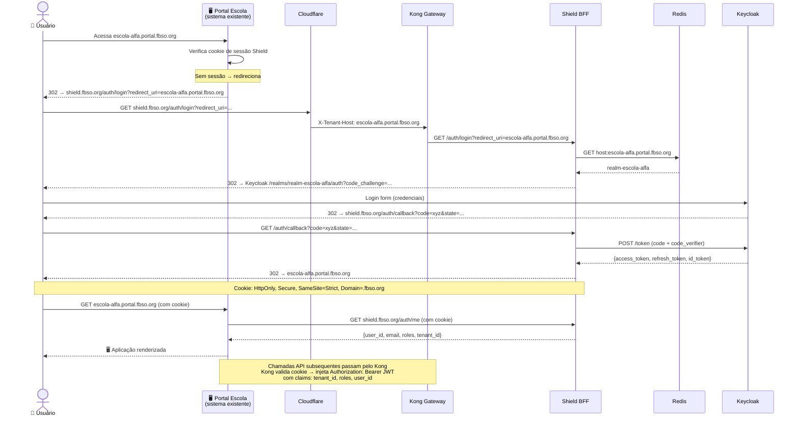

**Regra de Ouro da Integração:** Microserviços de negócio **NUNCA** chamam Keycloak diretamente. Toda validação de sessão é feita pelo Kong (que injeta o JWT) ou pelo Shield BFF (`/auth/me`).

---

## 3. Data Architecture

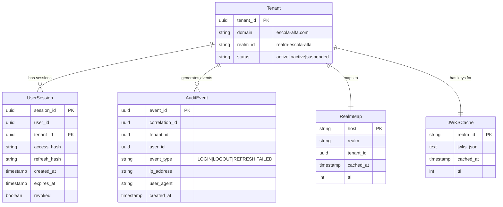

---

## 4. Security Architecture

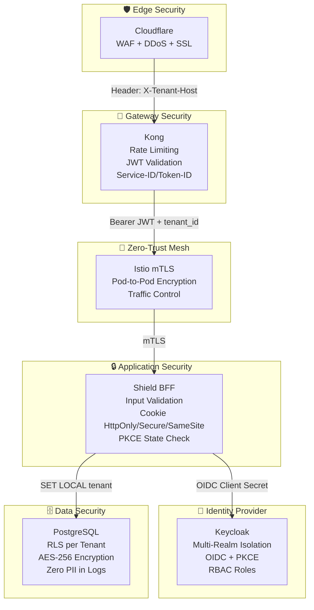

### Threat Model (STRIDE)

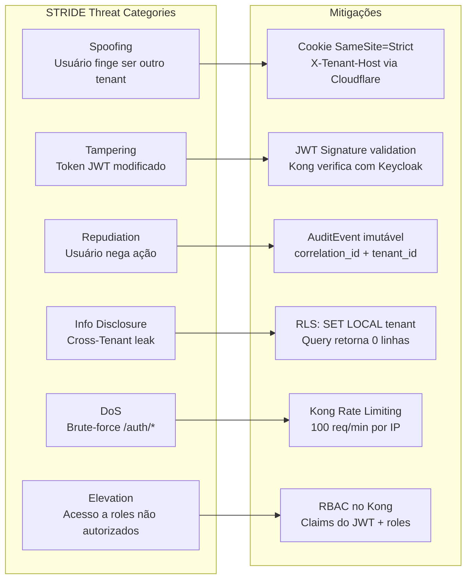

---

## 5. DevOps / SRE Architecture

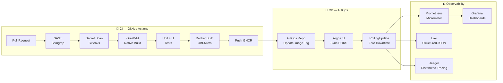

### CI/CD Pipeline (Git Graph)

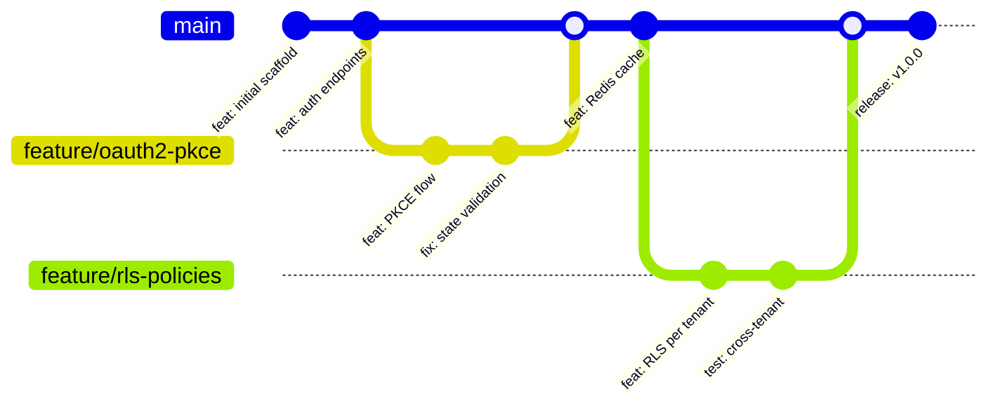

---

## 6. Infrastructure / Cloud Architecture

### Deployment Topology

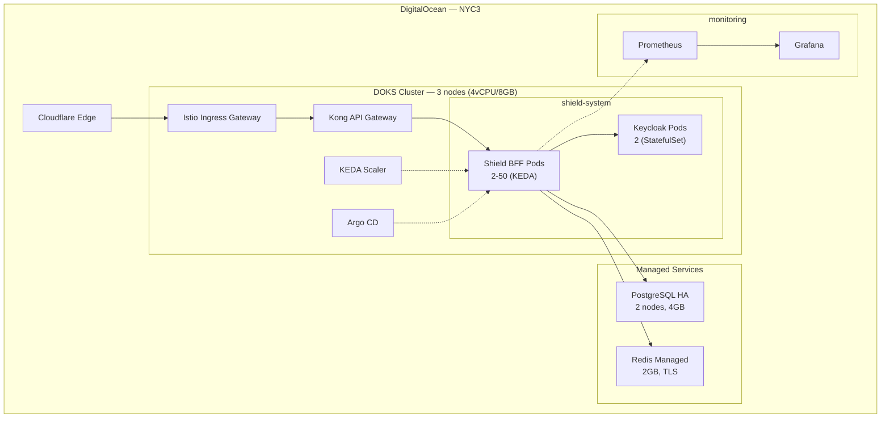

---

## 7. Testing Architecture

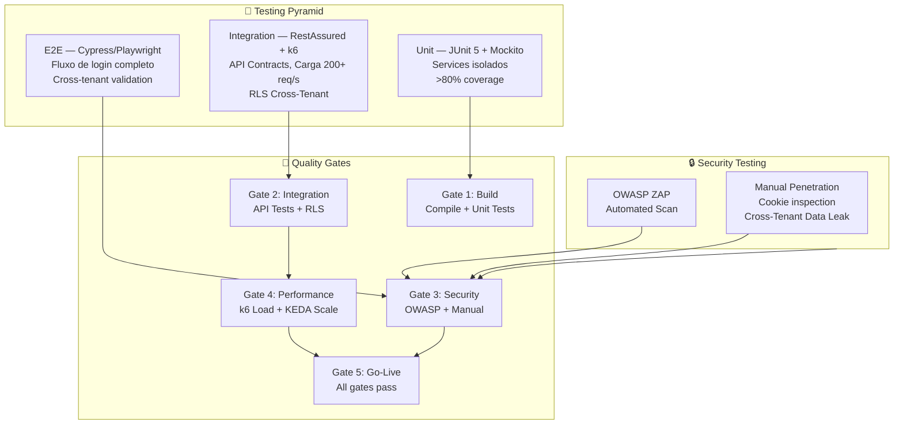

---

## 8. Cross-Cutting Concerns

| Concern | Implementação |
|---------|--------------|
| **Logging** | JSON estruturado: `{correlation_id, tenant_id, event, timestamp}` — Zero PII |
| **Error Handling** | Exceções mapeadas para HTTP status codes; stack traces nunca expostos |
| **Caching** | Redis: Host→Realm (TTL 1h), JWKS (TTL 15min). Invalidação sob demanda |
| **Rate Limiting** | Kong: 100 req/min/IP em /auth/*; 1000 req/min para endpoints internos |

---

## 9. Traceability SAD → SRS → BRD → Charter

| ADR (SAD) | NFR (SRS) | REQ (BRD) | OBJ (Charter) |
|-----------|-----------|-----------|---------------|
| ADR-001 GraalVM | NFR-01, NFR-03, NFR-16 | REQ-05, REQ-09 | C3, C4 |
| ADR-002 BFF único | NFR-04 a NFR-08 | REQ-02, REQ-03, REQ-04 | C1, C2 |
| ADR-003 Istio+Kong | NFR-07, NFR-09 | REQ-02, REQ-06 | C1, C4, C7 |
| ADR-004 Redis Cache | NFR-02 | REQ-01, REQ-08 | C1, C6 |
| ADR-005 RLS | NFR-08 | REQ-02 | C1 |
| ADR-006 GitOps | NFR-09, NFR-11 | REQ-09 | C4, C7 |
| ADR-007 Cookies | NFR-04 a NFR-06 | REQ-03 | C2 |

---

**[STATUS: SUCESSO]** — SAD v2.0 com diagramas Mermaid (flowchart, requirementDiagram, erDiagram, architecture-beta, gitGraph).
