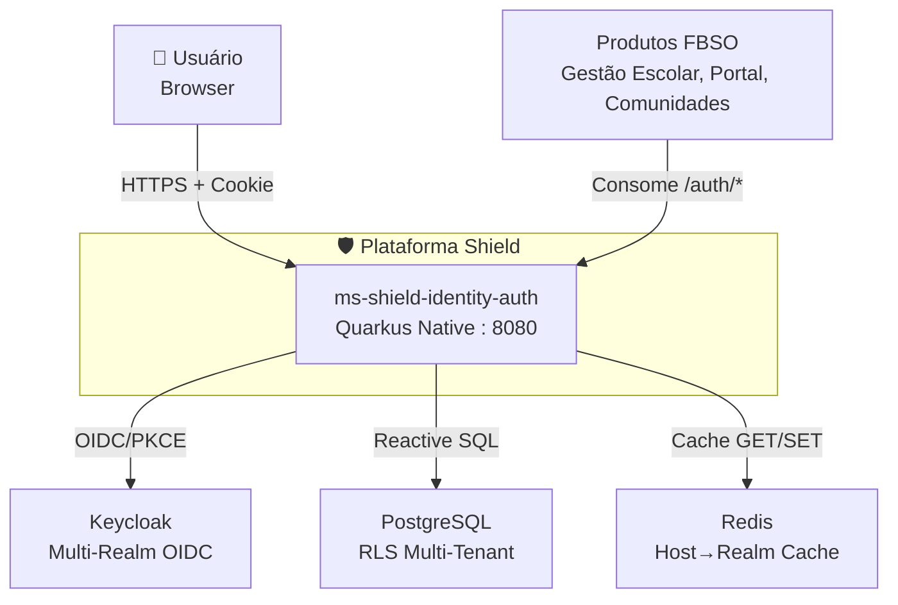
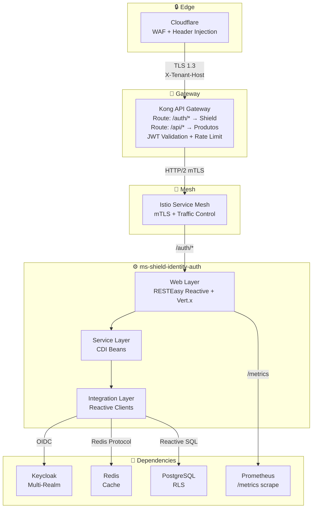
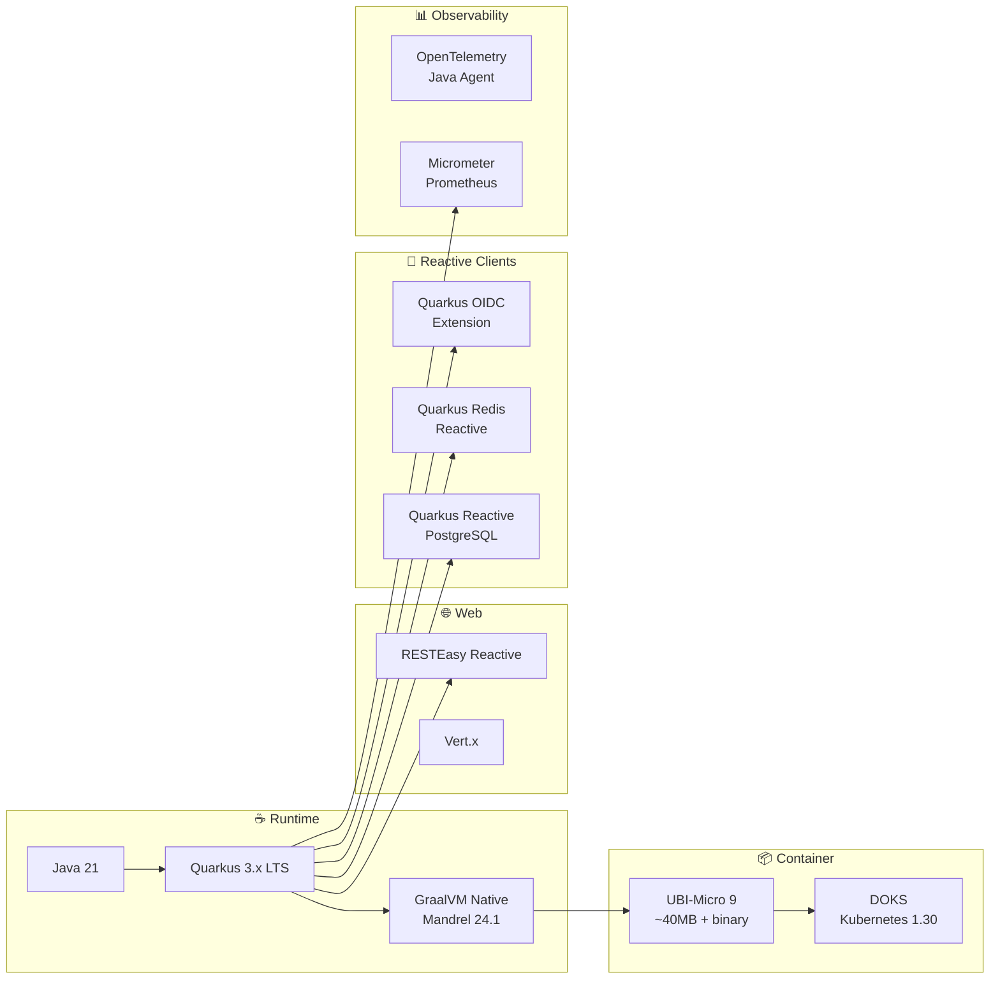
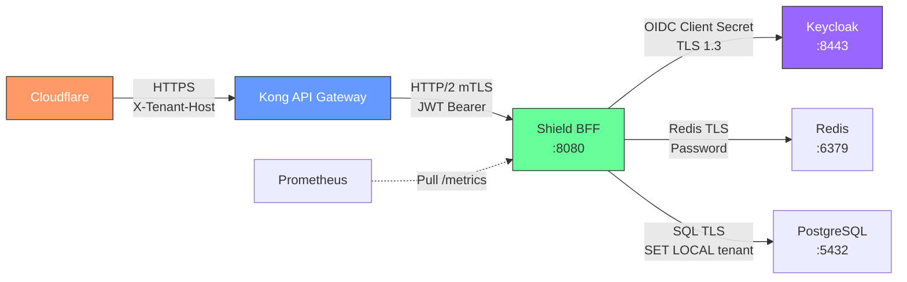
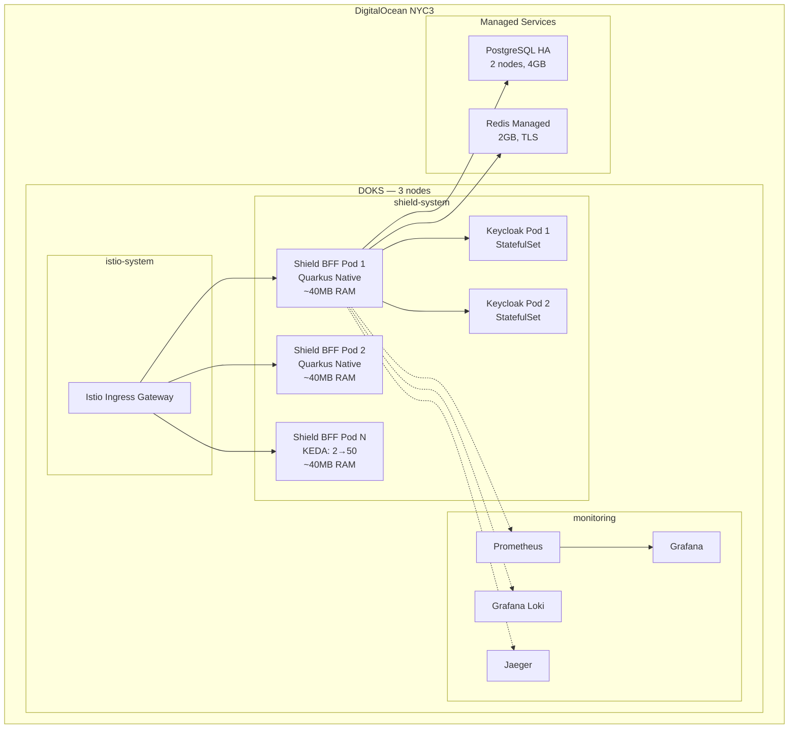
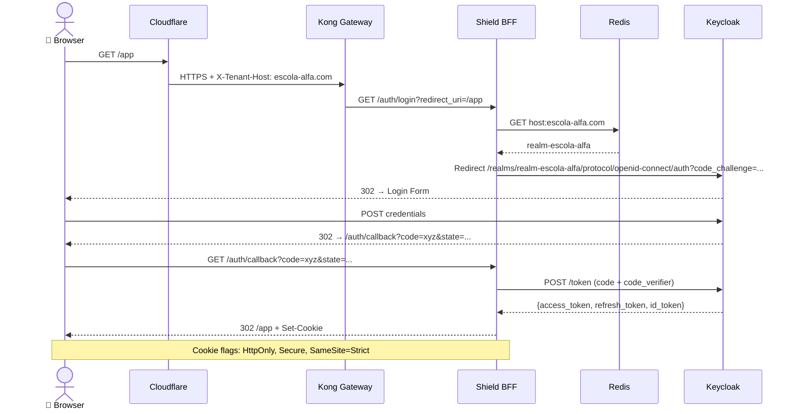
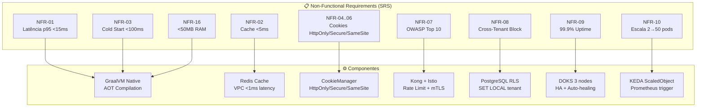

# High-Level Design (HLD): PROJETO SHIELD — ms-shield-identity-auth
## [STATUS: COMPLIANCE]

| Campo | Detalhe |
|-------|---------|
| **Projeto** | PRJ-TEC-2026-0004-PROJETO-SHIELD |
| **Solução Técnica** | ms-shield-identity-auth |
| **Documentos Base** | 01-PROJECT-CHARTER, 10-SAD |
| **Stack** | Java 21 + Quarkus + GraalVM Native |
| **Data** | 03/08/2026 | **Versão** | 2.0 | **Metodologia** | WATERFALL |

---

## 1. System Context (C4 Level 1)

---

## 2. Container Diagram (C4 Level 2)

---

## 3. Technology Stack

---

## 4. Integration Topology

---

## 5. Deployment Topology

---

## 6. Data Flow — Login Sequence

---

## 7. NFR Allocation

---

**[STATUS: SUCESSO]** — HLD v2.0 com diagramas Mermaid (C4 L1/L2, flowchart, sequenceDiagram, deployment topology, NFR allocation).
