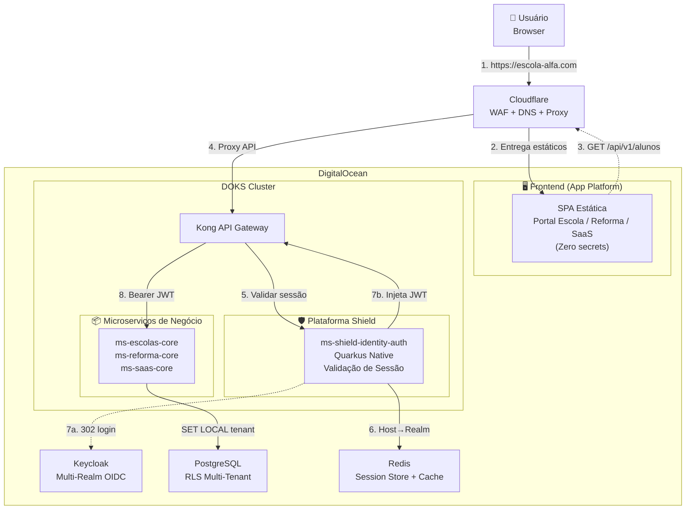
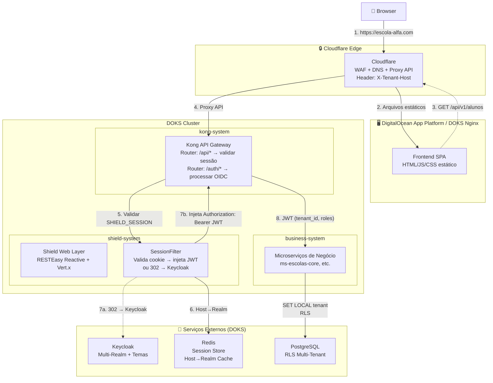
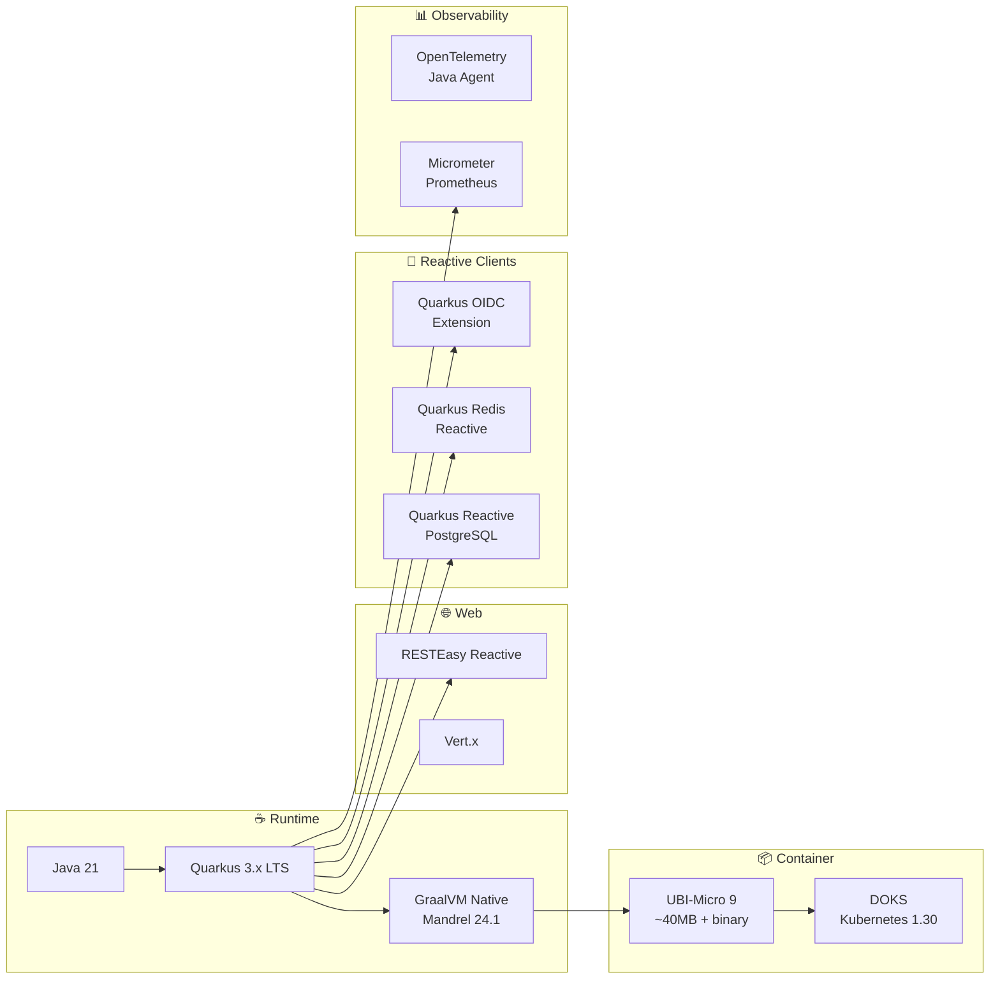
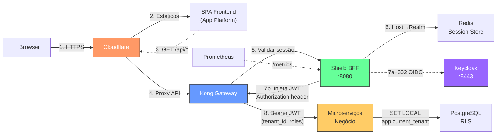
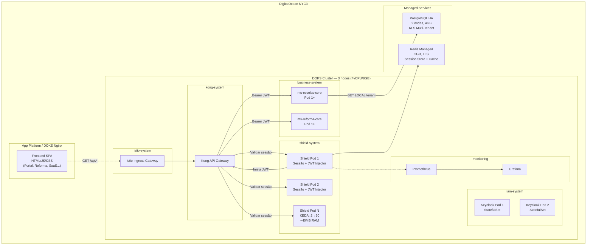
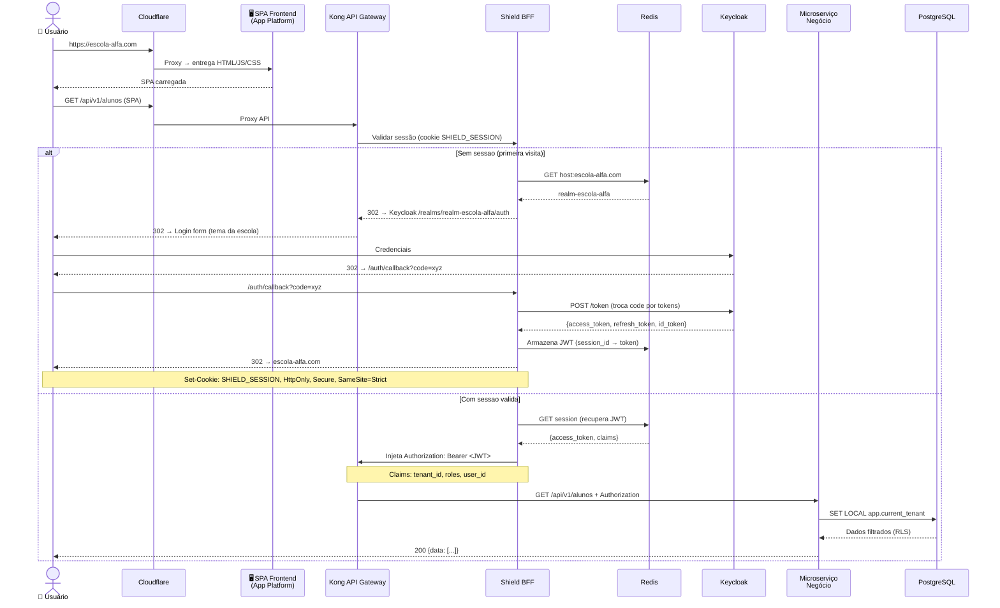
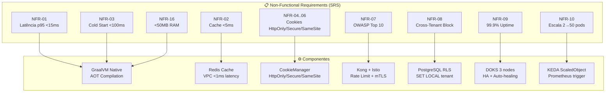

# High-Level Design (HLD): PROJETO SHIELD — ms-shield-identity-auth
## [STATUS: COMPLIANCE]

| Campo | Detalhe |
|-------|---------|
| **Projeto** | PRJ-TEC-2026-0004-PROJETO-SHIELD |
| **Solução Técnica** | ms-shield-identity-auth |
| **Documentos Base** | 01-PROJECT-CHARTER, 10-SAD |
| **Stack** | Java 21 + Quarkus + GraalVM Native |
| **Data** | 03/08/2026 | **Versão** | 2.0 | **Metodologia** | WATERFALL |

---

## 1. System Context (C4 Level 1)

---

## 2. Container Diagram (C4 Level 2)

---

## 3. Technology Stack

---

## 4. Integration Topology

---

## 5. Deployment Topology

---

## 6. Data Flow — Interceptação de API pelo Shield (Kong Plugin)

O Shield atua como serviço de validação de sessão acoplado ao Kong. O frontend SPA **não chama o Shield diretamente** — ele faz chamadas de API normalmente, e o Kong+Shield interceptam a autenticação.

**Fluxo pós-login (chamadas subsequentes):**
1. SPA faz `GET /api/v1/alunos` → Cloudflare → Kong
2. Kong encaminha cookie para o Shield validar
3. Shield recupera JWT do Redis → injeta `Authorization: Bearer <JWT>` no header
4. Microserviço de negócio recebe o JWT com claims (tenant_id, roles, user_id)
5. Microserviço executa `SET LOCAL app.current_tenant` e consulta PostgreSQL com RLS
6. **O frontend nunca vê o JWT.** Toda a orquestração de segurança é transparente para a SPA.

**Por que o Shield fica separado do Frontend:**
- **Zero-Trust:** A SPA no App Platform é 100% estática, sem acesso a segredos do Keycloak
- **Escala independente:** KEDA escala apenas o Shield (Quarkus Native, ~40MB, cold start <100ms)
- **Isolamento:** Frontend cuida de UI/UX; Shield cuida de OIDC, cookies, injeção de JWT

---

## 7. NFR Allocation

---

**[STATUS: SUCESSO]** — HLD v2.0 com diagramas Mermaid (C4 L1/L2, flowchart, sequenceDiagram, deployment topology, NFR allocation).
