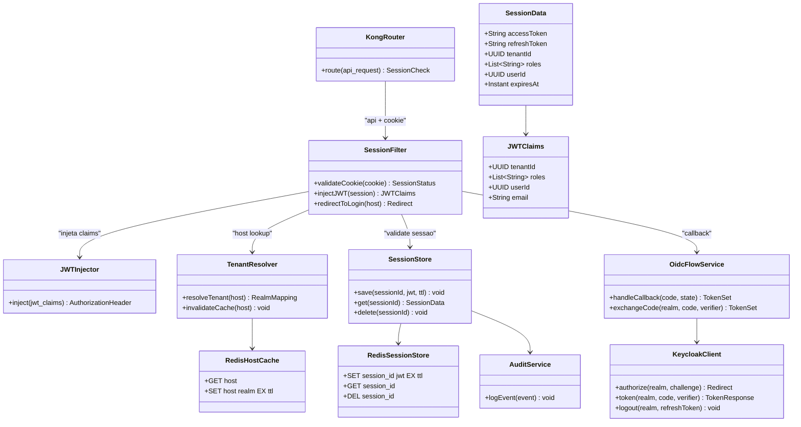
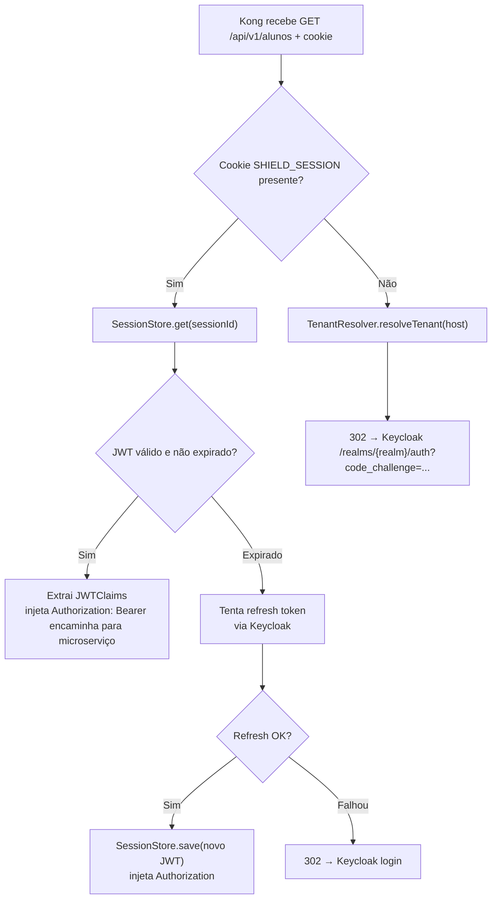
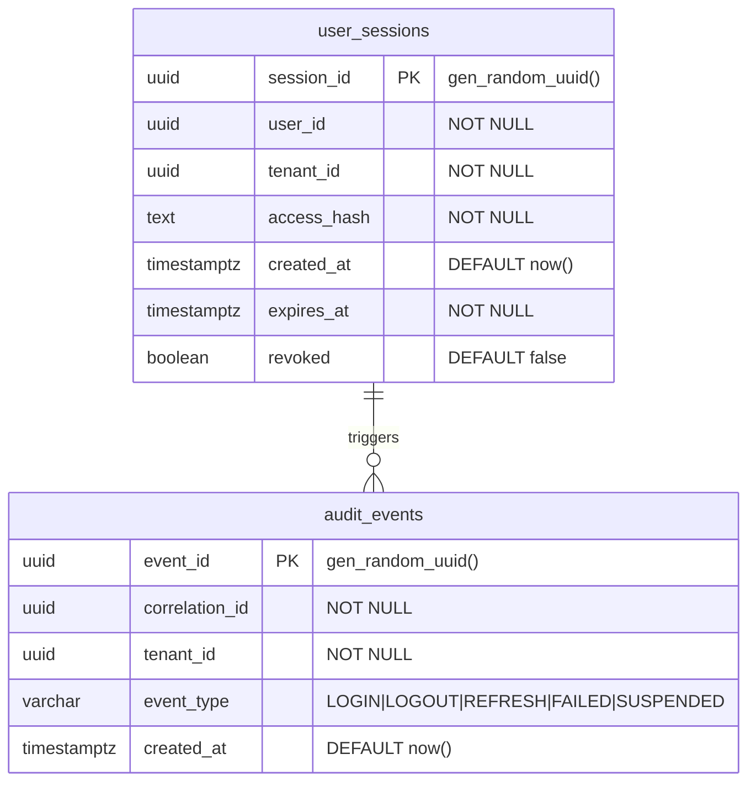
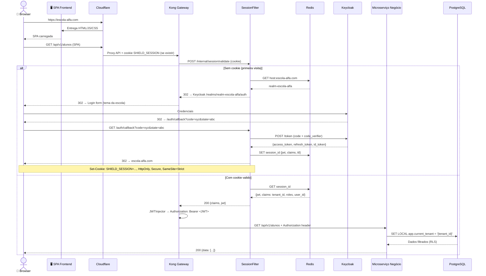
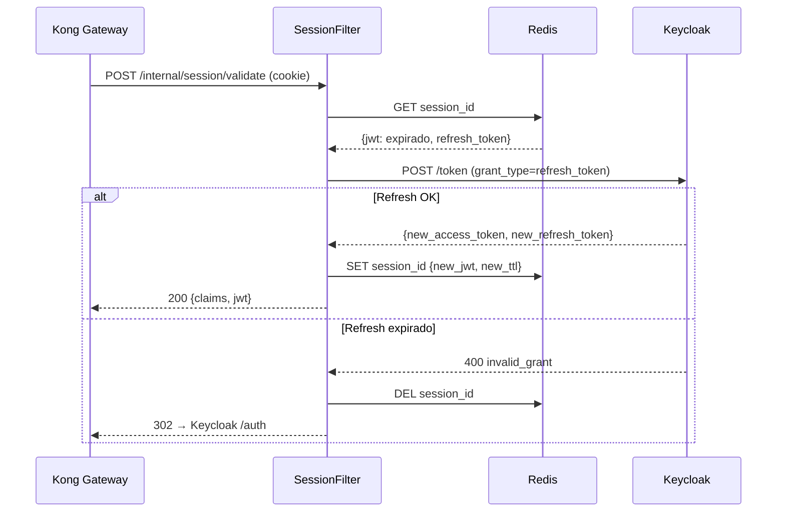
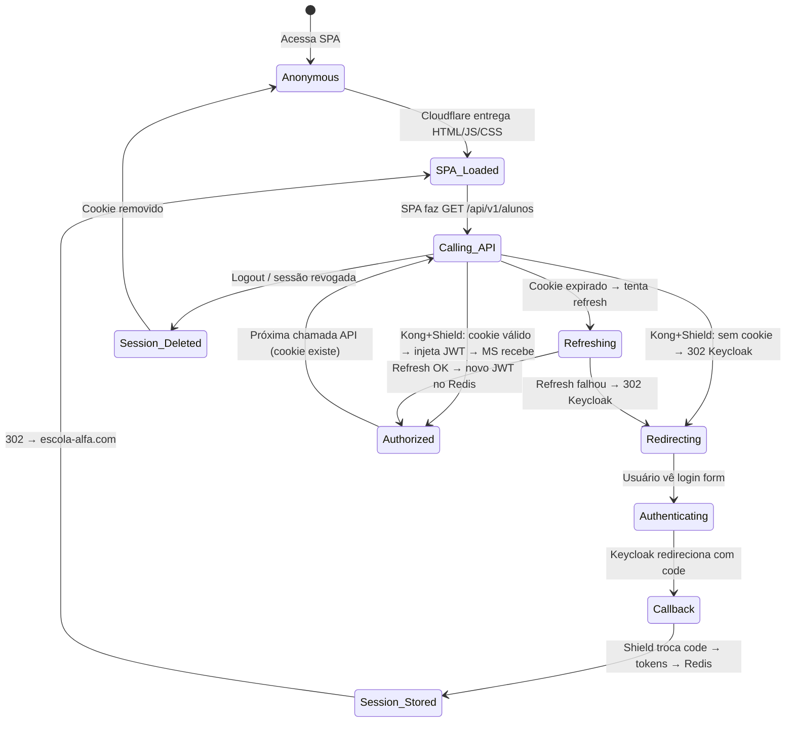
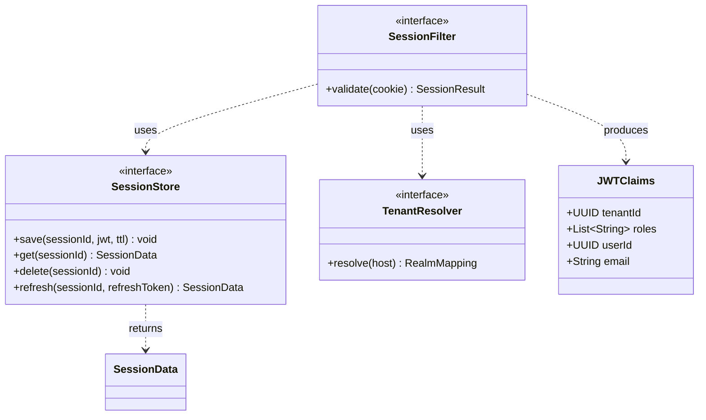

# Low-Level Design (LLD): PROJETO SHIELD — ms-shield-identity-auth
## [STATUS: Em revisão]

| Campo | Detalhe |
|-------|---------|
| **Projeto** | PRJ-TEC-2026-0004-PROJETO-SHIELD |
| **Solução Técnica** | ms-shield-identity-auth |
| **Documentos Base** | 01-PROJECT-CHARTER, 10-SAD, 11-HLD |
| **Stack** | Java 21 + Quarkus + GraalVM Native |
| **Data** | 03/08/2026 | **Versão** | 3.0 — Revisão de Integração | **Metodologia** | WATERFALL |

---

## 1. Component Diagram — Package Structure (Kong Filter Model)

O Shield atua como **serviço de validação de sessão acoplado ao Kong**. A SPA nunca chama o Shield diretamente — o Kong encaminha a validação de cookie para o Shield, que decide: injetar JWT (sessão válida) ou redirecionar para Keycloak (sem sessão).

### Fluxo de Decisão do SessionFilter

---

## 2. Endpoints — Uso Interno (Kong)

Estes endpoints são chamados **apenas pelo Kong API Gateway**, nunca diretamente pelo frontend:

| Endpoint | Quem Chama | Função |
|----------|-----------|--------|
| `POST /internal/session/validate` | Kong | Recebe cookie SHIELD_SESSION → retorna JWT claims (válido) ou 401 (expirado/inválido) |
| `GET /internal/tenant/resolve?host=` | Kong | Recebe host → retorna realm_id (para construir redirect Keycloak) |
| `GET /auth/callback?code=&state=` | Browser (via redirect Keycloak) | Recebe authorization code → troca por tokens → salva no Redis → seta cookie → redirect |
| `GET /health` | Kong / Prometheus | Health check |
| `GET /metrics` | Prometheus | Métricas operacionais |

**Nota:** Endpoints como `/auth/login`, `/auth/logout`, `/auth/refresh`, `/auth/me` **não existem mais como API pública**. O fluxo de login é disparado pela interceptação do Kong (passo 3 do SessionFilter). O logout é gerenciado pelo cookie — a SPA apenas remove o cookie local. O perfil do usuário está nas claims do JWT injetado — o microserviço de negócio as extrai diretamente.

---

## 3. Database Schema (inalterado — mantido para referência)

---

## 4. Sequence Diagrams

### 4.1 Login — SPA faz chamada API, Kong+Shield interceptam

### 4.2 Cookie Expirado — Refresh ou Re-login

---

## 5. State Machine — Sessão do Usuário

---

## 6. Error Handling Strategy

| Situação | Onde Ocorre | Resposta |
|----------|------------|---------|
| Cookie ausente | SessionFilter.validateCookie() | Kong retorna 302 → Keycloak login |
| Cookie expirado, refresh OK | SessionFilter + KeycloakClient | Novo JWT armazenado no Redis, Kong injeta Authorization |
| Cookie expirado, refresh falhou | SessionFilter + KeycloakClient | Kong retorna 302 → Keycloak login |
| JWT inválido (assinatura/tampering) | Kong JWTInjector | 401 — descartar cookie |
| Host não mapeado | TenantResolver.resolveTenant() | 401 — "Domínio não configurado" |
| Keycloak indisponível | KeycloakClient.token() | 503 — "Serviço de autenticação temporariamente indisponível" |
| Redis indisponível | SessionStore.get() | Degradado: validar JWT localmente (cache em memória, TTL curto). Alertar |
| Tenant suspenso | SessionFilter.validateCookie() | 403 — tenant_id bloqueado |

---

## 7. Component Interfaces (Key)

### Kickback para o Kong

O SessionFilter retorna ao Kong uma destas 3 respostas:

| Resposta | Código | Ação do Kong |
|----------|--------|-------------|
| `{action: "INJECT", claims: {...}, jwt: "..."}` | 200 | JWTInjector insere `Authorization: Bearer <jwt>`, encaminha para MS |
| `{action: "REDIRECT", location: "https://keycloak/.../auth"}` | 302 | Kong retorna redirect HTTP para o browser |
| `{action: "REJECT", status: 403, reason: "tenant_suspended"}` | 403 | Kong retorna 403 para o browser |

---

**[STATUS: SUCESSO]** — LLD v3.0 alinhado com arquitetura Kong Filter. Shield não expõe endpoints REST públicos. SessionFilter decide: injetar JWT ou redirecionar.
