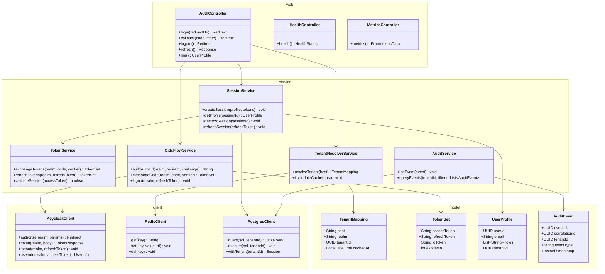
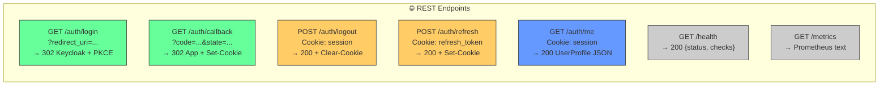
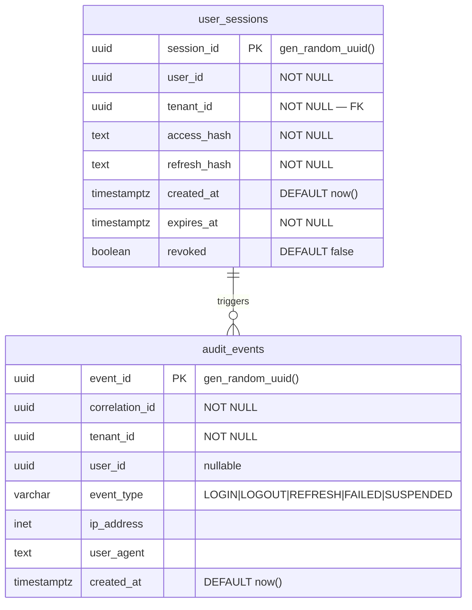
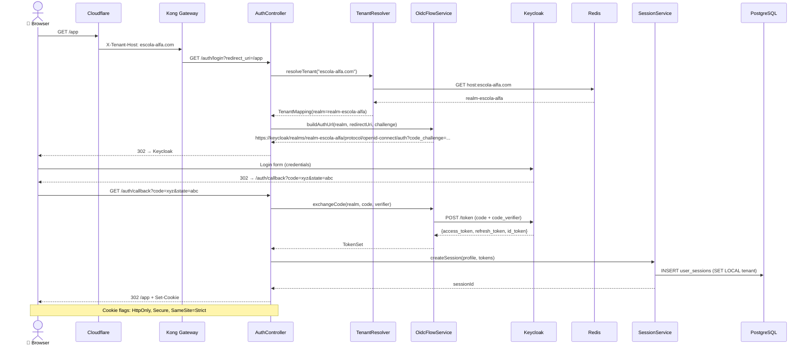
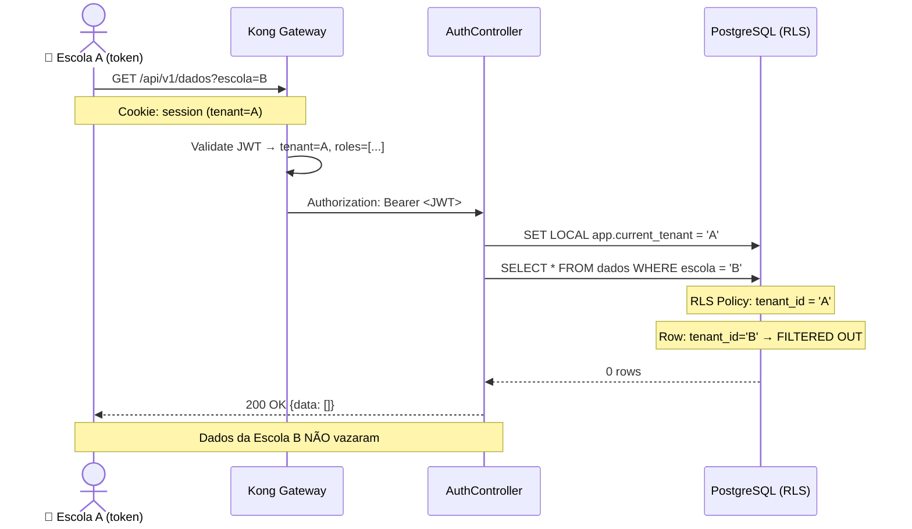
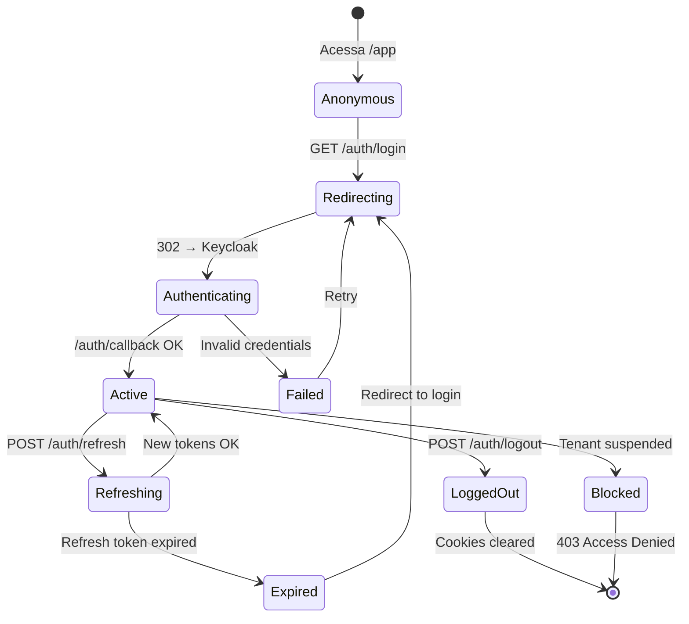
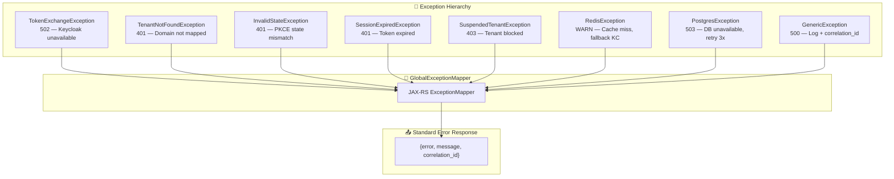
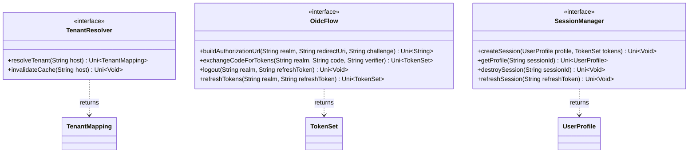

# Low-Level Design (LLD): PROJETO SHIELD — ms-shield-identity-auth
## [STATUS: COMPLIANCE]

| Campo | Detalhe |
|-------|---------|
| **Projeto** | PRJ-TEC-2026-0004-PROJETO-SHIELD |
| **Solução Técnica** | ms-shield-identity-auth |
| **Documentos Base** | 01-PROJECT-CHARTER, 10-SAD, 11-HLD |
| **Stack** | Java 21 + Quarkus + GraalVM Native |
| **Data** | 03/08/2026 | **Versão** | 2.0 | **Metodologia** | WATERFALL |

---

## 1. Component Diagram (C4 Level 3) — Package Structure



---

## 2. API Contracts



---

## 3. Database Schema



### RLS Policies

```sql
ALTER TABLE shield.user_sessions ENABLE ROW LEVEL SECURITY;
ALTER TABLE shield.audit_events   ENABLE ROW LEVEL SECURITY;

CREATE POLICY tenant_isolation_sessions ON shield.user_sessions
    FOR ALL USING (
        tenant_id = current_setting('app.current_tenant')::UUID
    );

CREATE POLICY tenant_isolation_audit ON shield.audit_events
    FOR ALL USING (
        tenant_id = current_setting('app.current_tenant')::UUID
    );
```

---

## 4. Sequence Diagrams

### Login Flow (Authorization Code + PKCE)



### Cross-Tenant Attack Blocked



---

## 5. State Machine — User Session



---

## 6. Error Handling Strategy



---

## 7. Component Interfaces (Key)



---

**[STATUS: SUCESSO]** — LLD v2.0 com diagramas Mermaid (classDiagram, erDiagram, sequenceDiagram ×2, stateDiagram-v2, flowchart).
