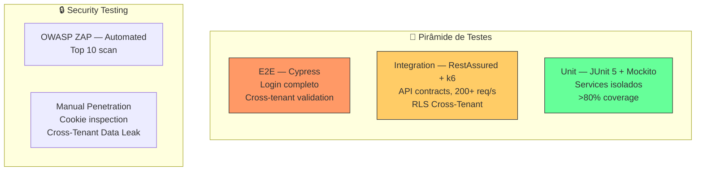

# Plano de Testes: PROJETO SHIELD
## [STATUS: COMPLIANCE]

| Campo | Detalhe |
|-------|---------|
| **Projeto** | PRJ-TEC-2026-0004-PROJETO-SHIELD |
| **Documentos Base** | 01-PROJECT-CHARTER, 03-SRS, 10-SAD, 12-LLD |
| **Stack** | Java 21 + Quarkus + GraalVM Native + Keycloak + PostgreSQL + Redis + DOKS |
| **Data** | 03/08/2026 | **Versão** | 1.0 | **Metodologia** | WATERFALL |

---

## 1. Test Strategy

## 2. Test Environment Requirements

| Ambiente | Finalidade | Configuração |
|----------|-----------|-------------|
| **Dev** | Testes unitários e de integração local | Docker Compose (Keycloak, PostgreSQL, Redis) |
| **CI** | Build + Unit + SAST no pipeline | GitHub Actions runner |
| **Staging** | Testes de integração completos, carga e segurança | DOKS 3 nós, PostgreSQL HA, Redis gerenciado |
| **Load Test** | Testes de carga isolados (k6) | DOKS com KEDA configurado, métricas no Prometheus |

## 3. Test Data Strategy

| Aspecto | Estratégia |
|---------|-----------|
| **Geração** | Flyway migrations com seed data multi-tenant (3 tenants de teste: `escola-alfa`, `escola-beta`, `escola-gama`) |
| **Anonimização** | Dados sintéticos — sem PII real em nenhum ambiente |
| **Reset entre testes** | `TRUNCATE` com rollback por tenant; Redis `FLUSHDB` no tearDown |
| **Cross-Tenant** | Massa com tenants A, B e C; tokens válidos para cada um; queries cross-tenant intencionais |

## 4. Unit Test Plan

| Camada | Framework | Coverage Target | Foco |
|--------|-----------|----------------|------|
| **Service** | JUnit 5 + Mockito | > 80% | TenantResolver, OidcFlowService, SessionService |
| **Client** | JUnit 5 + Mockito | > 70% | KeycloakClient, RedisClient, PostgresClient |
| **Config** | JUnit 5 | > 60% | CookieConfig, OidcConfig, RedisConfig |

## 5. Integration Test Plan

| Integração | Tipo | Cenários |
|-----------|------|---------|
| **API /auth/*** | REST Assured | Login PKCE completo, callback com code inválido, logout, refresh, /me com e sem sessão |
| **Redis Cache** | Testcontainers Redis | GET hit/miss, SET com TTL, invalidação sob demanda, fallback Keycloak |
| **PostgreSQL RLS** | Testcontainers PostgreSQL | Query cross-tenant bloqueada (0 rows), query mesmo tenant OK, SET LOCAL tenant_id |
| **Keycloak OIDC** | Testcontainers Keycloak | Token exchange, refresh token, logout remoto, userinfo |

## 6. Functional / System Test Plan

| Feature (SRS) | Cenários | Critério de Aceitação |
|--------------|---------|---------------------|
| F-01 — Reconhecimento de Cliente | Domínio mapeado → redireciona; domínio não mapeado → 401; cache miss → fallback Keycloak | 3/3 cenários passam |
| F-02 — Login Protegido | PKCE completo; cookies HttpOnly/Secure/SameSite setados; JS não lê cookies | Cookies inacessíveis via `document.cookie` |
| F-03 — Portal de Sessão | /me retorna perfil <15ms; refresh renova tokens; logout limpa cookies + Keycloak | Latência p95 <15ms em 1000 requisições |
| F-04 — Isolamento de Dados | Token Escola A → query dados Escola B = []; Token Escola B → query dados Escola B = [dados] | 0% cross-tenant leak |
| F-08 — Suspensão de Cliente | Tenant marcado suspenso → /me retorna 403; sessões ativas revogadas | Bloqueio em <1s |

## 7. Security Test Plan

| Tipo | Ferramenta | Cobertura |
|------|-----------|----------|
| **SAST** | Semgrep (CI pipeline) | OWASP Top 10, secrets detection |
| **Secret Scan** | Gitleaks (pre-commit + CI) | API keys, tokens, passwords |
| **DAST** | OWASP ZAP | XSS, CSRF, SQL Injection, Broken Auth |
| **Cookie Security** | Cypress + manual | HttpOnly, Secure, SameSite=Strict flags |
| **Cross-Tenant** | RestAssured | Token A → dados B = 403/[] |
| **Rate Limiting** | k6 | 200+ req/s → Kong rate limit ativa |

## 8. Performance Test Plan

| Tipo | Ferramenta | Threshold | Cenário |
|------|-----------|----------|---------|
| **Load** | k6 | p95 <15ms, <0.1% erro | 100 req/s constante por 5min |
| **Stress** | k6 | Sem 5xx até 500 req/s | Rampa 50→500 req/s em 3min |
| **Soak** | k6 | Sem memory leak, GC estável | 50 req/s por 30min |
| **Scalability** | k6 + KEDA metrics | Escala 2→N pods em <30s | 200+ req/s sustentado |

## 9. Regression Test Suite

| Gatilho | Escopo |
|---------|--------|
| **Push na main** | Unit + SAST + Secret Scan |
| **PR para main** | Unit + Integration + SAST |
| **Release tag** | Unit + Integration + E2E + Security + Performance |
| **Semanal (sábado)** | Suite completa (todos os níveis) |

## 10. Acceptance Criteria

| Feature | Acceptance Criteria | Status |
|---------|-------------------|--------|
| F-01 — Reconhecimento | Domínio mapeado redireciona; não mapeado retorna erro padronizado | Pendente |
| F-02 — Login Protegido | PKCE funcional; cookies HttpOnly/Secure/SameSite | Pendente |
| F-03 — Sessão | /me <15ms; refresh funciona; logout completo | Pendente |
| F-04 — Isolamento | Cross-tenant bloqueado 100% | Pendente |
| F-08 — Suspensão | Bloqueio imediato de tenant | Pendente |

## 11. Test Deliverables Schedule

| Entrega | Data | Responsável |
|---------|------|------------|
| Unit Test Suite | Semana 3 | Dev Backend |
| Integration Test Suite | Semana 4 | QA + Dev Backend |
| Security Test Report | Semana 5 | QA + IAM Specialist |
| Performance Test Report | Semana 5 | QA + DevOps |
| Regression Suite Config | Semana 5 | DevOps |
| Acceptance Sign-Off | Semana 6 | PO + QA |

---

**[STATUS: SUCESSO]** — Plano de testes com pirâmide completa, 11 seções, 4 ambientes, 5 níveis de teste.
