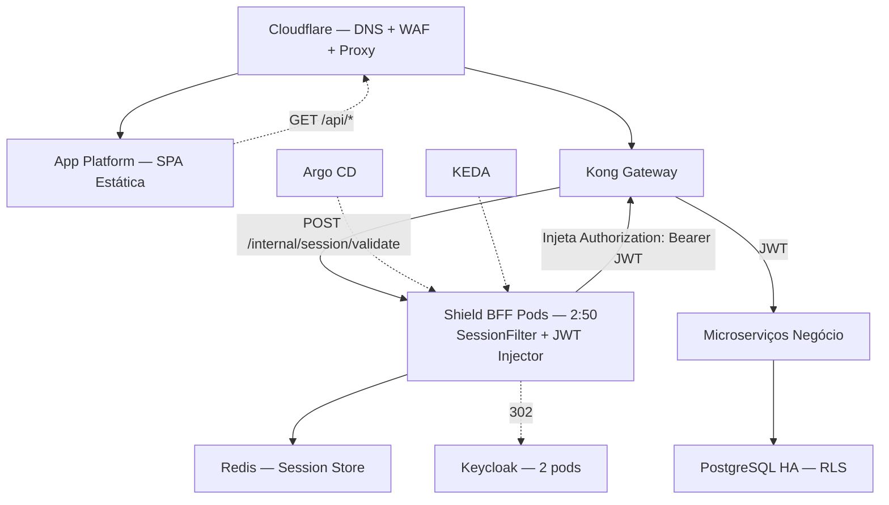

# Manuais Operacionais: Plataforma Shield
## [STATUS: Em revisão]

| Campo | Detalhe |
|-------|---------|
| **Projeto** | PRJ-TEC-2026-0004-PROJETO-SHIELD |
| **Documentos Base** | 01-PROJECT-CHARTER, 05-SAD, 16-DEPLOYMENT-PLAN |
| **Stack** | DOKS + Kong + Shield + Istio + Argo CD + PostgreSQL + Redis |
| **Data** | 03/08/2026 | **Versão** | 2.0 — Revisão Integração | **Metodologia** | WATERFALL |

---

## 1. System Architecture Overview (para Operações)

## 2. Runbooks

| Operação | Procedimento | Comando |
|----------|-------------|---------|
| **Health Check — Shield** | Verificar status dos pods | `kubectl get pods -n shield-system` |
| **Health Check — Kong+Shield** | Testar validação de sessão | `curl -s -b "SHIELD_SESSION=test" -w "%{http_code}" http://kong-admin:8001/...` |
| **Verificar sessões ativas no Redis** | Contar chaves de sessão | `redis-cli -h $REDIS_HOST --scan --pattern 'session:*' \| wc -l` |
| **Invalidar sessão específica** | Remover chave do Redis | `redis-cli -h $REDIS_HOST DEL session:<session_id>` |
| **Restart Shield** | Rolling restart | `kubectl rollout restart deployment/ms-shield-identity-auth -n shield-system` |
| **Verificar Kong routes** | Listar rotas configuradas | `curl -s http://kong-admin:8001/routes \| jq '.data[].name'` |
| **Verificar Redis connectivity** | Testar conexão Shield→Redis | `kubectl exec -n shield-system deploy/ms-shield-identity-auth -- redis-cli -h $REDIS_HOST PING` |

## 3. Alert & Escalation Procedures

| Alerta | Severity | Procedimento | Escalar para |
|--------|---------|-------------|-------------|
| Shield pod CrashLoop | Critical | `kubectl describe pod` → logs → restart | DevOps on-call |
| **Kong→Shield validation timeout** | Critical | Verificar latência Shield; verificar Redis; checar network policy | DevOps + Tech Lead |
| **Redirect loop detectado** (302 → 302 → ...) | Critical | Cookie não está sendo setado. Verificar flags HttpOnly/Secure/SameSite. Verificar domínio do cookie | DevOps + Tech Lead |
| **JWT injection failure** (MS recebe sem Authorization) | Critical | Shield SessionFilter retornando INJECT mas Kong não injetando. Verificar Kong plugin config | DevOps |
| Latência Shield p95 > 50ms | Warning | Verificar Redis latency; verificar KEDA scaling | DevOps |
| Redis memory > 75% | Warning | Aumentar TTL de sessões ou escalar instância | DevOps |
| **Frontend recebe JWT no body** | Critical | Regressão de segurança. Rollback imediato. Verificar Kong plugin | Tech Lead + IAM + DevOps |

## 4. Disaster Recovery Runbook

| Cenário | RPO | RTO | Procedimento |
|---------|-----|-----|-------------|
| Falha do Shield (todos pods down) | 0 (stateless, JWT no Redis) | < 2min | KEDA/Kubernetes reescala pods. Kong retorna 503 até Shield recuperar |
| Falha do Redis | 0 (cache local TTL curto) | < 5min | Shield opera com cache local em memória. Restaurar Redis. Sessões perdidas → usuários refazem login |
| **Kong+Shield dessincronizados** (rotas erradas) | 0 | < 5min | Argo CD rollback para última configuração válida do Kong |
| Perda total região DO | < 24h | < 4h | Terraform apply + restore PostgreSQL + Redis + Kong config |

## 5. Maintenance Procedures

| Procedimento | Frequência | Janela | Impacto |
|-------------|-----------|--------|---------|
| Atualização Shield BFF | Por release | Qualquer (RollingUpdate) | Zero downtime. Sessões no Redis preservadas |
| **Atualização Kong config (rotas/plugins)** | Por release | Qualquer | RollingUpdate do Kong. Sessões preservadas |
| Atualização Keycloak | Mensal | Domingo 02:00-04:00 | ~5min indisponibilidade de login. Sessões ativas mantidas |
| Rotação de secrets (Redis password, client secrets) | Trimestral | Sábado 22:00 | Rolling restart do Shield necessário |
| Limpeza de sessões expiradas | Automático (TTL Redis) | N/A | Zero |
| Teste de DR | Trimestral | Sábado 08:00-12:00 | Ambiente isolado |

---

**[STATUS: SUCESSO]** — Manual operacional atualizado com runbooks Kong+Shield, alertas de redirect loop e JWT injection failure, DR para dessincronização Kong+Shield.
