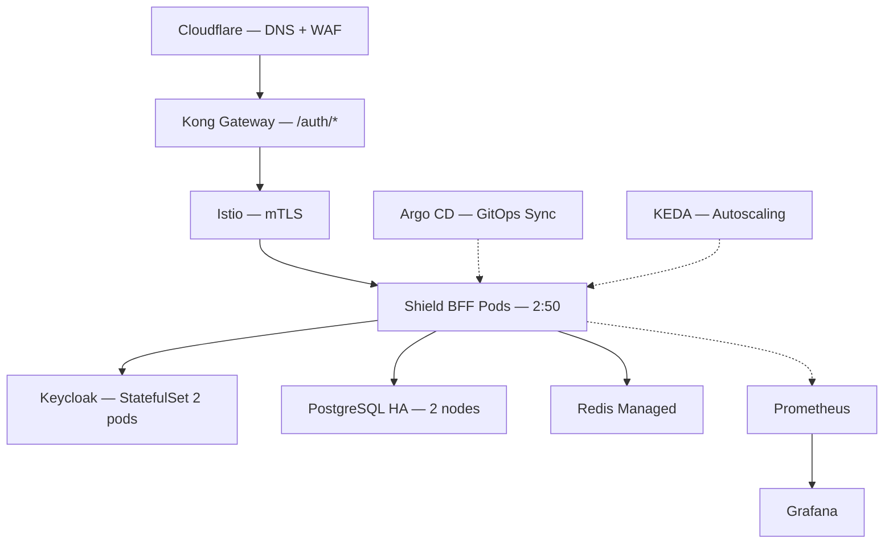

# Manuais Operacionais: Plataforma Shield
## [STATUS: COMPLIANCE]

| Campo | Detalhe |
|-------|---------|
| **Projeto** | PRJ-TEC-2026-0004-PROJETO-SHIELD |
| **Documentos Base** | 01-PROJECT-CHARTER, 10-SAD, 16-DEPLOYMENT-PLAN |
| **Stack** | DOKS + Istio + Kong + Argo CD + PostgreSQL + Redis |
| **Data** | 03/08/2026 | **Versão** | 1.0 | **Metodologia** | WATERFALL |

---

## 1. System Architecture Overview (para Operações)

## 2. Runbooks

| Operação | Procedimento | Comando | Tempo |
|----------|-------------|---------|-------|
| **Health Check** | Verificar status dos pods | `kubectl get pods -n shield-system` | < 30s |
| **Restart Shield BFF** | Rolling restart dos pods | `kubectl rollout restart deployment/ms-shield-identity-auth -n shield-system` | < 2min |
| **Scale Up Manual** | Aumentar réplicas (emergência) | `kubectl scale deployment/ms-shield-identity-auth --replicas=10 -n shield-system` | < 30s |
| **View Logs** | Visualizar logs do BFF | `kubectl logs -l app=shield-bff -n shield-system --tail=100` | < 10s |
| **Check RLS** | Verificar política de tenant ativa | `SELECT tablename, policyname FROM pg_policies WHERE schemaname='shield'` | < 5s |
| **Flush Redis Cache** | Limpar cache de mapeamento | `redis-cli -h $REDIS_HOST FLUSHDB` | < 1s |
| **View Metrics** | Dashboard Grafana Shield | `https://grafana.fbso.org/d/shield-overview` | — |

## 3. Alert & Escalation Procedures

| Alerta | Severity | Procedimento | Escalar para |
|--------|---------|-------------|-------------|
| Shield BFF pod CrashLoop | Critical | `kubectl describe pod` → verificar logs → restart | DevOps on-call |
| Latência p95 > 50ms | Warning | Verificar carga no Redis/PostgreSQL; verificar KEDA scaling | DevOps |
| Erro > 1% por 5min | Critical | Verificar dependências (Keycloak, PostgreSQL, Redis); preparar rollback | DevOps + Tech Lead |
| Cross-Tenant alert (QA) | Critical | War room imediata; blocker de deploy | Tech Lead + IAM + QA |
| Certificado TLS expirando | Warning | Renovar no Cloudflare/Kong | DevOps |
| PostgreSQL low disk space | Warning | Verificar retenção de logs; escalar storage | DevOps + DBA |

## 4. Disaster Recovery Runbook

| Cenário | RPO | RTO | Procedimento |
|---------|-----|-----|-------------|
| Falha de 1 nó DOKS | 0 (stateless) | < 5min | KEDA reescala pods em nó saudável; sem ação manual |
| Falha de 2+ nós DOKS | 0 | < 15min | DOKS auto-recovery; verificar node pool |
| Falha PostgreSQL primário | < 1h (backup autom.) | < 30min | Failover automático para réplica (HA); verificar aplicação |
| Perda total região DO | < 24h | < 4h | 1. Terraform apply nova região; 2. Restore PostgreSQL backup; 3. Repopular Redis; 4. Apontar Cloudflare DNS |
| Deleção acidental de schema | < 1h | < 30min | PITR (Point-in-Time Recovery) do PostgreSQL |

## 5. Maintenance Procedures

| Procedimento | Frequência | Janela | Impacto |
|-------------|-----------|--------|---------|
| Atualização de imagem Shield BFF | Por release | Qualquer (RollingUpdate) | Zero downtime |
| Atualização Keycloak | Mensal | Domingo 02:00-04:00 | Indisponibilidade de login (~5min) |
| PostgreSQL minor upgrade | Conforme DO agenda | Janela de manutenção DO | Zero (HA failover) |
| Rotação de secrets (client secrets, DB passwords) | Trimestral | Sábado 22:00-23:00 | Rolling restart necessário |
| Limpeza de sessões expiradas | Semanal (automatizado) | N/A | Zero |
| Teste de DR | Trimestral | Sábado 08:00-12:00 | Nenhum (ambiente isolado) |

## 6. Capacity Planning Guide

| Métrica | Threshold | Ação |
|---------|----------|------|
| CPU pods > 70% | 3+ réplicas | Revisar KEDA thresholds |
| Memória pods > 40MB | Normal (Native) | Alerta se > 80MB |
| Conexões PostgreSQL > 80% pool | PgBouncer configurado | Aumentar pool size |
| Redis memory > 75% | Configurado 2GB | Aumentar instância ou TTL |
| Sessões ativas > 1000 | Verificar comportamento | Considerar sharding de tenant |

---

**[STATUS: SUCESSO]** — Manual com 6 seções: diagrama ops, 7 runbooks, 6 alertas, 5 cenários DR, 6 manutenções, 5 métricas de capacidade.
