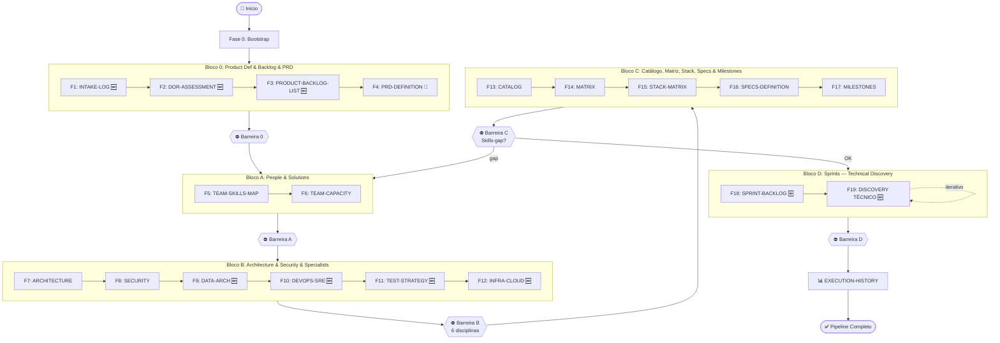

# Roadmap Definições Técnicas v5.0 — Implementation Plan

> **For agentic workers:** REQUIRED SUB-SKILL: Use superpowers:subagent-driven-development (recommended) or superpowers:executing-plans to implement this plan task-by-task. Steps use checkbox (`- [ ]`) syntax for tracking.

**Goal:** Reestruturar o roadmap `PROMPT-ROADMAP-GENERATE-PROJECT-TECHNICAL-DEFINITIONS.md` da versão 4.0 para 5.0, implementando 5 mudanças estruturais: Bloco 0 (ponte Negócio→TI), Bloco B expandido (6 disciplinas), Bloco C reorganizado, Bloco D = Sprints com Discovery Técnico, History standalone.

**Architecture:** Pipeline totalmente sequencial com 20 fases agrupadas em 7 blocos (0, A, B, C, D + Bootstrap + History). Cada fase segue o loop trifásico Generate→Gate→Fix→Validação Humana. Barreiras de sincronização entre blocos. 58 prompts no total (20 Generate, 19 Gate, 19 Fix), sendo 30 novos e 28 atualizados.

**Tech Stack:** Markdown, Mermaid (flowcharts), Bash (mkdir), Git (versionamento)

## Global Constraints

- Pipeline totalmente sequencial — sem paralelismo entre blocos
- PRD-DEFINITION (F4) é PRD de Negócio congelado após Barreira 0; SPECS-DEFINITION (F16) é a consolidação técnica enxuta
- Bloco B: 6 disciplinas com artefatos independentes; disciplinas N/A devem ter justificativa documentada
- Barreira C: skills-gap detection com feedback loop para Bloco A
- Pasta `sprints/` substituída por `technical-discovery/`
- SPRINT-BACKLOG.md mantém modelo T-NNN → US-ID → Sprint-Alvo, enriquecido com coluna CONTRACTS
- Tech Lead + Principal Architecture são revisores transversais no Bloco B (sem artefato próprio)
- Todas as fases 1-19 seguem o loop trifásico (Generate→Gate→Fix→Validação Humana)
- EXECUTION-HISTORY: Generate → Revisão Humana direta (sem gate)
- Documentos gerados em `{TECHNICAL_DEFINITIONS_PATH}/`

---

## File Structure

### Arquivos a Criar (30 novos prompts)

```
.specs/prompts/project-technical-definitions/
├── PROMPT-GENERATE-PROJECT-TECHNICAL-DEFINITIONS-INTAKE-LOG.md           🆕 F1
├── PROMPT-GATE-PROJECT-TECHNICAL-DEFINITIONS-INTAKE-LOG.md              🆕 F1
├── PROMPT-FIX-PROJECT-TECHNICAL-DEFINITIONS-INTAKE-LOG.md               🆕 F1
├── PROMPT-GENERATE-PROJECT-TECHNICAL-DEFINITIONS-DOR-ASSESSMENT.md      🆕 F2
├── PROMPT-GATE-PROJECT-TECHNICAL-DEFINITIONS-DOR-ASSESSMENT.md          🆕 F2
├── PROMPT-FIX-PROJECT-TECHNICAL-DEFINITIONS-DOR-ASSESSMENT.md           🆕 F2
├── PROMPT-GENERATE-PROJECT-TECHNICAL-DEFINITIONS-PRODUCT-BACKLOG-LIST.md 🆕 F3
├── PROMPT-GATE-PROJECT-TECHNICAL-DEFINITIONS-PRODUCT-BACKLOG-LIST.md    🆕 F3
├── PROMPT-FIX-PROJECT-TECHNICAL-DEFINITIONS-PRODUCT-BACKLOG-LIST.md     🆕 F3
├── PROMPT-GENERATE-PROJECT-TECHNICAL-DEFINITIONS-DATA-ARCHITECTURE-DEFINITION.md  🆕 F9
├── PROMPT-GATE-PROJECT-TECHNICAL-DEFINITIONS-DATA-ARCHITECTURE-DEFINITION.md      🆕 F9
├── PROMPT-FIX-PROJECT-TECHNICAL-DEFINITIONS-DATA-ARCHITECTURE-DEFINITION.md       🆕 F9
├── PROMPT-GENERATE-PROJECT-TECHNICAL-DEFINITIONS-DEVOPS-SRE-DEFINITION.md         🆕 F10
├── PROMPT-GATE-PROJECT-TECHNICAL-DEFINITIONS-DEVOPS-SRE-DEFINITION.md             🆕 F10
├── PROMPT-FIX-PROJECT-TECHNICAL-DEFINITIONS-DEVOPS-SRE-DEFINITION.md              🆕 F10
├── PROMPT-GENERATE-PROJECT-TECHNICAL-DEFINITIONS-TEST-STRATEGY-DEFINITION.md      🆕 F11
├── PROMPT-GATE-PROJECT-TECHNICAL-DEFINITIONS-TEST-STRATEGY-DEFINITION.md          🆕 F11
├── PROMPT-FIX-PROJECT-TECHNICAL-DEFINITIONS-TEST-STRATEGY-DEFINITION.md           🆕 F11
├── PROMPT-GENERATE-PROJECT-TECHNICAL-DEFINITIONS-INFRA-CLOUD-DEFINITION.md        🆕 F12
├── PROMPT-GATE-PROJECT-TECHNICAL-DEFINITIONS-INFRA-CLOUD-DEFINITION.md            🆕 F12
├── PROMPT-FIX-PROJECT-TECHNICAL-DEFINITIONS-INFRA-CLOUD-DEFINITION.md             🆕 F12
├── PROMPT-GENERATE-PROJECT-TECHNICAL-DEFINITIONS-SPRINT-BACKLOG-REFINED.md        🆕 F18
├── PROMPT-GATE-PROJECT-TECHNICAL-DEFINITIONS-SPRINT-BACKLOG-REFINED.md            🆕 F18
├── PROMPT-FIX-PROJECT-TECHNICAL-DEFINITIONS-SPRINT-BACKLOG-REFINED.md             🆕 F18
├── PROMPT-GENERATE-PROJECT-TECHNICAL-DEFINITIONS-TECHNICAL-DISCOVERY.md           🆕 F19
├── PROMPT-GATE-PROJECT-TECHNICAL-DEFINITIONS-TECHNICAL-DISCOVERY.md               🆕 F19
├── PROMPT-FIX-PROJECT-TECHNICAL-DEFINITIONS-TECHNICAL-DISCOVERY.md                🆕 F19
```

### Arquivos a Modificar (28 prompts existentes + 2 docs principais)

```
.specs/prompts/
├── PROMPT-ROADMAP-GENERATE-PROJECT-TECHNICAL-DEFINITIONS.md           🔄 v4.0→v5.0
└── project-technical-definitions/
    ├── FLOWCHART-PROMPT-ROADMAP-GENERATE-PROJECT-TECHNICAL-DEFINITIONS.md 🔄 v4.0→v5.0
    ├── PROMPT-GENERATE-PROJECT-TECHNICAL-DEFINITIONS-PRD-DEFINITION.md    🔄 Bloco 0
    ├── PROMPT-GATE-PROJECT-TECHNICAL-DEFINITIONS-PRD-DEFINITION.md        🔄 Bloco 0
    ├── PROMPT-FIX-PROJECT-TECHNICAL-DEFINITIONS-PRD-DEFINITION.md         🔄 Bloco 0
    ├── PROMPT-GENERATE-PROJECT-TECHNICAL-DEFINITIONS-TEAM-SKILLS-MAP.md   🔄 F5
    ├── PROMPT-GATE-PROJECT-TECHNICAL-DEFINITIONS-TEAM-SKILLS-MAP.md       🔄 F5
    ├── PROMPT-FIX-PROJECT-TECHNICAL-DEFINITIONS-TEAM-SKILLS-MAP.md        🔄 F5
    ├── PROMPT-GENERATE-PROJECT-TECHNICAL-DEFINITIONS-TEAM-CAPACITY.md     🔄 F6
    ├── PROMPT-GATE-PROJECT-TECHNICAL-DEFINITIONS-TEAM-CAPACITY.md         🔄 F6
    ├── PROMPT-FIX-PROJECT-TECHNICAL-DEFINITIONS-TEAM-CAPACITY.md          🔄 F6
    ├── PROMPT-GENERATE-PROJECT-TECHNICAL-DEFINITIONS-ARCHITECTURE-DEFINITION.md 🔄 F7
    ├── PROMPT-GATE-PROJECT-TECHNICAL-DEFINITIONS-ARCHITECTURE-DEFINITION.md     🔄 F7
    ├── PROMPT-FIX-PROJECT-TECHNICAL-DEFINITIONS-ARCHITECTURE-DEFINITION.md      🔄 F7
    ├── PROMPT-GENERATE-PROJECT-TECHNICAL-DEFINITIONS-SECURITY-DEFINITION.md     🔄 F8
    ├── PROMPT-GATE-PROJECT-TECHNICAL-DEFINITIONS-SECURITY-DEFINITION.md         🔄 F8
    ├── PROMPT-FIX-PROJECT-TECHNICAL-DEFINITIONS-SECURITY-DEFINITION.md          🔄 F8
    ├── PROMPT-GENERATE-PROJECT-TECHNICAL-DEFINITIONS-SOLUTIONS-CATALOG.md       🔄 F13
    ├── PROMPT-GATE-PROJECT-TECHNICAL-DEFINITIONS-SOLUTIONS-CATALOG.md           🔄 F13
    ├── PROMPT-FIX-PROJECT-TECHNICAL-DEFINITIONS-SOLUTIONS-CATALOG.md            🔄 F13
    ├── PROMPT-GENERATE-PROJECT-TECHNICAL-DEFINITIONS-SOLUTIONS-MATRIX.md        🔄 F14
    ├── PROMPT-GATE-PROJECT-TECHNICAL-DEFINITIONS-SOLUTIONS-MATRIX.md            🔄 F14
    ├── PROMPT-FIX-PROJECT-TECHNICAL-DEFINITIONS-SOLUTIONS-MATRIX.md             🔄 F14
    ├── PROMPT-GENERATE-PROJECT-TECHNICAL-DEFINITIONS-SOLUTIONS-STACK-MATRIX.md  🔄 F15
    ├── PROMPT-GATE-PROJECT-TECHNICAL-DEFINITIONS-SOLUTIONS-STACK-MATRIX.md      🔄 F15
    ├── PROMPT-FIX-PROJECT-TECHNICAL-DEFINITIONS-SOLUTIONS-STACK-MATRIX.md       🔄 F15
    ├── PROMPT-GENERATE-PROJECT-TECHNICAL-DEFINITIONS-SPECS-DEFINITION.md        🔄 F16
    ├── PROMPT-GATE-PROJECT-TECHNICAL-DEFINITIONS-SPECS-DEFINITION.md            🔄 F16
    ├── PROMPT-FIX-PROJECT-TECHNICAL-DEFINITIONS-SPECS-DEFINITION.md             🔄 F16
    ├── PROMPT-GENERATE-PROJECT-TECHNICAL-DEFINITIONS-MILESTONES.md              🔄 F17
    ├── PROMPT-GATE-PROJECT-TECHNICAL-DEFINITIONS-MILESTONES.md                  🔄 F17
    ├── PROMPT-FIX-PROJECT-TECHNICAL-DEFINITIONS-MILESTONES.md                   🔄 F17
    └── PROMPT-GENERATE-PROJECT-TECHNICAL-DEFINITIONS-EXECUTION-HISTORY.md       🔄 standalone
```

---

## Task Groups

### Group 1: Atualizar Roadmap Principal (Orquestrador)

---

### Task 1: Atualizar PROMPT-ROADMAP-GENERATE-PROJECT-TECHNICAL-DEFINITIONS.md (v4.0 → v5.0)

**Files:**
- Modify: `.specs/prompts/PROMPT-ROADMAP-GENERATE-PROJECT-TECHNICAL-DEFINITIONS.md`

**Interfaces:**
- Consumes: Spec `docs/superpowers/specs/2026-07-30-roadmap-tech-defs-v5-redesign.md`
- Produces: Roadmap v5.0 com 7 blocos, 20 fases, barreiras atualizadas, nova estrutura de diretórios

- [ ] **Step 1: Atualizar cabeçalho para v5.0**

Edit: linha 2 — `Versão: 4.0` → `Versão: 5.0`
Subtítulo: `TOGAF-Aligned Blocks + Discovery Team` → `Ponte Negócio→TI + 6 Disciplinas Técnicas + Discovery Contínuo`

- [ ] **Step 2: Substituir seção "ARQUITETURA DE FASES" (linhas 38-60)**

Replace the old block architecture with:

```
O roadmap é organizado em **20 fases** agrupadas em **7 blocos**:

```
FASE 0: BOOTSTRAP (sequencial)
  │
  ├─▶ BLOCO 0: Product Definition & Product Backlog & PRD (NOVO)
  │     Fase 1 → Fase 2 → Fase 3 → Fase 4
  │     ⛔ Barreira 0
  │
  ├─▶ BLOCO A: People & Solutions
  │     Fase 5 → Fase 6
  │     ⛔ Barreira A
  │
  ├─▶ BLOCO B: Architecture & Security & Specialists (EXPANDIDO)
  │     Fase 7 → Fase 8 → Fase 9 → Fase 10 → Fase 11 → Fase 12
  │     ⛔ Barreira B
  │
  ├─▶ BLOCO C: Catálogo, Matriz, Stack, Specs & Milestones (REORGANIZADO)
  │     Fase 13 → Fase 14 → Fase 15 → Fase 16 → Fase 17
  │     ⛔ Barreira C (com feedback loop → Bloco A)
  │
  ├─▶ BLOCO D: Sprints — Technical Discovery (REPROPOSITADO)
  │     Fase 18 → Fase 19 (iterativo)
  │     ⛔ Barreira D
  │
  └─▶ EXECUTION-HISTORY 📊 (standalone)
```

- [ ] **Step 3: Reescrever seção "FASES DO ROADMAP" (linhas 64-111)**

Replace all phases with the new 20-phase structure per the spec:

```markdown
### Fase 0 — Bootstrap Inteligente
(Mantido igual — solicitar inputs, criar estrutura, auditar artefatos)

### Fase 1 — PROJECT-TECHNICAL-DEFINITIONS-INTAKE-LOG.md 🆕
Registro de lotes de ingestão de requisitos do Negócio. Pipeline: `PROMPT-GENERATE-...-INTAKE-LOG.md` → Gate → Fix → COMPLIANCE

### Fase 2 — PROJECT-TECHNICAL-DEFINITIONS-DOR-ASSESSMENT.md 🆕
Aplicação do DoR de Negócio (PO/PM). Pipeline: `PROMPT-GENERATE-...-DOR-ASSESSMENT.md` → Gate → Fix → COMPLIANCE

### Fase 3 — PROJECT-TECHNICAL-DEFINITIONS-PRODUCT-BACKLOG-LIST.md 🆕
Backlog consolidado "Pronto para TI". Pipeline: `PROMPT-GENERATE-...-PRODUCT-BACKLOG-LIST.md` → Gate → Fix → COMPLIANCE

### Fase 4 — PROJECT-TECHNICAL-DEFINITIONS-PRD-DEFINITION.md 🔄
PRD de Negócio (movido do Bloco C). Pipeline: `PROMPT-GENERATE-...-PRD-DEFINITION.md` → Gate → Fix → COMPLIANCE

### Fase 5 — PROJECT-TECHNICAL-DEFINITIONS-TEAM-SKILLS-MAP.md
Skills matrix do Discovery Team. Pipeline: `PROMPT-GENERATE-...-TEAM-SKILLS-MAP.md` → Gate → Fix → COMPLIANCE

### Fase 6 — PROJECT-TECHNICAL-DEFINITIONS-TEAM-CAPACITY.md
Capacidade de trabalho do time. Pipeline: `PROMPT-GENERATE-...-TEAM-CAPACITY.md` → Gate → Fix → COMPLIANCE

### Fase 7 — PROJECT-TECHNICAL-DEFINITIONS-ARCHITECTURE-DEFINITION.md
Solution Architect — integração C4, ADRs, topologia. Pipeline: `PROMPT-GENERATE-...-ARCHITECTURE-DEFINITION.md` → Gate → Fix → COMPLIANCE

### Fase 8 — PROJECT-TECHNICAL-DEFINITIONS-SECURITY-DEFINITION.md
Security Architect — threat model, IAM, compliance. Pipeline: `PROMPT-GENERATE-...-SECURITY-DEFINITION.md` → Gate → Fix → COMPLIANCE

### Fase 9 — PROJECT-TECHNICAL-DEFINITIONS-DATA-ARCHITECTURE-DEFINITION.md 🆕
Data Architect — modelagem, pipelines, storage strategy. Pipeline: `PROMPT-GENERATE-...-DATA-ARCHITECTURE-DEFINITION.md` → Gate → Fix → COMPLIANCE

### Fase 10 — PROJECT-TECHNICAL-DEFINITIONS-DEVOPS-SRE-DEFINITION.md 🆕
DevOps/SRE Architect — CI/CD, IaC, observabilidade, SLOs. Pipeline: `PROMPT-GENERATE-...-DEVOPS-SRE-DEFINITION.md` → Gate → Fix → COMPLIANCE

### Fase 11 — PROJECT-TECHNICAL-DEFINITIONS-TEST-STRATEGY-DEFINITION.md 🆕
Test Specialist — pirâmide de testes, automação, performance. Pipeline: `PROMPT-GENERATE-...-TEST-STRATEGY-DEFINITION.md` → Gate → Fix → COMPLIANCE

### Fase 12 — PROJECT-TECHNICAL-DEFINITIONS-INFRA-CLOUD-DEFINITION.md 🆕
Infra/Cloud Specialist — topologia, compute, networking, DR. Pipeline: `PROMPT-GENERATE-...-INFRA-CLOUD-DEFINITION.md` → Gate → Fix → COMPLIANCE

### Fase 13 — PROJECT-TECHNICAL-DEFINITIONS-SOLUTIONS-CATALOG.md
Catálogo de soluções técnicas. Pipeline: `PROMPT-GENERATE-...-SOLUTIONS-CATALOG.md` → Gate → Fix → COMPLIANCE

### Fase 14 — PROJECT-TECHNICAL-DEFINITIONS-SOLUTIONS-MATRIX.md
Matriz solução×disciplina×owner. Pipeline: `PROMPT-GENERATE-...-SOLUTIONS-MATRIX.md` → Gate → Fix → COMPLIANCE

### Fase 15 — PROJECT-TECHNICAL-DEFINITIONS-SOLUTIONS-STACK-MATRIX.md
Stacks tecnológicas por solução. Pipeline: `PROMPT-GENERATE-...-SOLUTIONS-STACK-MATRIX.md` → Gate → Fix → COMPLIANCE

### Fase 16 — PROJECT-TECHNICAL-DEFINITIONS-SPECS-DEFINITION.md
Consolidação técnica enxuta — sumariza e referencia artefatos anteriores. Pipeline: `PROMPT-GENERATE-...-SPECS-DEFINITION.md` → Gate → Fix → COMPLIANCE

### Fase 17 — PROJECT-TECHNICAL-DEFINITIONS-MILESTONES.md
Roadmap alinhado ao negócio. Pipeline: `PROMPT-GENERATE-...-MILESTONES.md` → Gate → Fix → COMPLIANCE

### Fase 18 — PROJECT-TECHNICAL-DEFINITIONS-SPRINT-BACKLOG-REFINED.md 🆕
Backlog refinado com tarefas T-NNN → US-ID → Sprint-Alvo → CONTRACTS. Pipeline: `PROMPT-GENERATE-...-SPRINT-BACKLOG-REFINED.md` → Gate → Fix → COMPLIANCE

### Fase 19 — PROJECT-TECHNICAL-DEFINITIONS-TECHNICAL-DISCOVERY.md 🆕
Discovery Técnico Contínuo — contratos API/Data/Security/SRE por sprint + increments. Iterativo. Pipeline: `PROMPT-GENERATE-...-TECHNICAL-DISCOVERY.md` → Gate → Fix → COMPLIANCE

### Execution History — PROJECT-TECHNICAL-DEFINITIONS-EXECUTION-HISTORY.md 📊
Dashboard de controle — estado de todos os documentos. Pipeline: Generate → Revisão humana (sem gate próprio).
```

- [ ] **Step 4: Atualizar seção "MECANISMO DE ORQUESTRAÇÃO DINÂMICA" (linhas 114-140)**

Edit: linha 116 — `Toda fase (1-10)` → `Toda fase (1-19)`

- [ ] **Step 5: Adicionar seção "REGRAS DE BLOQUEIO (GATING RULES)" após orquestração**

Insert new section:

```markdown
---
## REGRAS DE BLOQUEIO (GATING RULES)

### Barreiras de Bloco

| Barreira | Posição | Validação | Regra Especial |
|---|---|---|---|
| ⛔ Barreira 0 | Após Bloco 0 (F4) | Rastreabilidade Backlog→Docs Negócio. DoR 100%. PRD cobre todo backlog. | Itens sem DoR → voltam F2. PRD incompleto → volta F4 |
| ⛔ Barreira A | Após Bloco A (F6) | TEAM-SKILLS-MAP cobre todos os papéis. TEAM-CAPACITY preenchido. | — |
| ⛔ Barreira B | Após Bloco B (F12) | 6 disciplinas OK. N/A justificados. Consistência horizontal. | Disciplina N/A sem justificativa = NÃO COMPLIANCE |
| ⛔ Barreira C | Após Bloco C (F17) | SPECS referencia todos artefatos. MILESTONES alinhado. | **Skills-Gap Detection:** Se skill necessária não coberta pelo Bloco A → `[SKILLS-GAP-DETECTED]` → propõe reabertura Bloco A |
| ⛔ Barreira D | Após Bloco D (F19) | 100% US da sprint com contratos. SPRINT-BACKLOG atualizado. | Iterativo — pergunta se continua próxima sprint ou encerra |

### Consistência Horizontal (Bloco B)

A Barreira B deve validar que os 6 artefatos do Bloco B são consistentes entre si:
- ARCHITECTURE ↔ SECURITY: controles de segurança implementam padrões arquiteturais
- ARCHITECTURE ↔ DATA: modelo de dados alinhado com topologia de containers
- ARCHITECTURE ↔ DEVOPS-SRE: pipeline de deploy suporta a topologia definida
- SECURITY ↔ INFRA-CLOUD: controles de rede e IAM consistentes
- TEST-STRATEGY ↔ ARCHITECTURE: pirâmide de testes cobre a topologia de integração
- TEST-STRATEGY ↔ SECURITY: testes de segurança (SAST/DAST) alinhados com threat model

### Skills-Gap Detection (Barreira C)

Se durante a validação do Bloco C for identificado que uma skill/disciplina não está coberta pelo TEAM-SKILLS-MAP ou TEAM-CAPACITY:

1. Emitir alerta `[SKILLS-GAP-DETECTED]` com:
   - Skill ausente
   - Impacto no projeto
   - Recomendação de ação
2. Propor reabertura do Bloco A para atualização dos documentos People
3. Aguardar decisão humana:
   - Prosseguir sem a skill (risco aceito)
   - Reabrir Bloco A (F5-F6) para atualização
   - Adicionar exceção documentada no TEAM-CAPACITY-EXCEPTIONS.md
```

- [ ] **Step 6: Atualizar "ESTRUTURA DE DIRETÓRIOS GERADA" (linhas 145-162)**

Replace with the full v5.0 structure per spec section 5.

- [ ] **Step 7: Atualizar "Localização dos Prompts das Fases" (linhas 189-203)**

Update to reflect 58 prompts (20G + 19Gate + 19Fix) with new files listed.

- [ ] **Step 8: Atualizar "Registro de Alterações do Documento" (linhas 207-214)**

Add entry:
```
| 5.0 | 30/07/2026 | Redesign estrutural: Bloco 0 (ponte Negócio→TI com 4 fases), Bloco B expandido (6 disciplinas: +DATA, +DEVOPS-SRE, +TEST, +INFRA), Bloco C reorganizado (CATALOG→MATRIX→STACK→SPECS→MILESTONES), Bloco D=Sprints com Discovery Técnico, History standalone. 20 fases, pipeline sequencial, 58 prompts. | Time de Arquitetura |
```

- [ ] **Step 9: Commit**

```bash
git add .specs/prompts/PROMPT-ROADMAP-GENERATE-PROJECT-TECHNICAL-DEFINITIONS.md
git commit -m "docs: roadmap de definições técnicas v4.0 → v5.0 — redesign estrutural

- Bloco 0 (ponte Negócio→TI): F1-F4 (Intake, DoR, Backlog, PRD Negócio)
- Bloco B expandido: 6 disciplinas (+Data, +DevOps/SRE, +Test, +Infra/Cloud)
- Bloco C reorganizado: CATALOG→MATRIX→STACK→SPECS→MILESTONES
- Bloco D = Sprints com Discovery Técnico (technical-discovery/)
- Barreira C com skills-gap detection → feedback loop Bloco A
- Pipeline totalmente sequencial, 20 fases, 58 prompts
- History standalone após último bloco

Co-Authored-By: Claude <noreply@anthropic.com>"
```

---

### Group 2: Atualizar Flowchart

---

### Task 2: Atualizar FLOWCHART-PROMPT-ROADMAP-GENERATE-PROJECT-TECHNICAL-DEFINITIONS.md (v4.0 → v5.0)

**Files:**
- Modify: `.specs/prompts/project-technical-definitions/FLOWCHART-PROMPT-ROADMAP-GENERATE-PROJECT-TECHNICAL-DEFINITIONS.md`

**Interfaces:**
- Consumes: Roadmap v5.0 principal (Task 1 output), Spec §2-4
- Produces: Flowchart atualizado com 7 blocos, 20 fases, barreiras em sequência

- [ ] **Step 1: Atualizar cabeçalho (linhas 1-3)**

Edit: `Versão: 4.0` → `Versão: 5.0`, update subtitle

- [ ] **Step 2: Reescrever "1. Visão Macro do Pipeline Completo" (linhas 11-77)**

Replace the Mermaid diagram with sequential block architecture (no parallelism). The diagram should show:



- [ ] **Step 3: Atualizar seção "4. Fases 1-10 — Pipeline Sequencial" (linhas 176-281)**

Rename to "Fases 1-19 — Pipeline Sequencial com Blocos". Update all phase diagrams to match new numbering and add new phases.

- [ ] **Step 4: Atualizar "Artefatos Produzidos por Fase" (linhas 283-298)**

Add all 20 artifacts with new numbering.

- [ ] **Step 5: Reescrever "5. Arquitetura de Blocos e Regras de Paralelismo" (linhas 302-368)**

Replace with sequential architecture — remove all parallelism references. The table becomes:

| Bloco | Fases | Modo | Dispara Quando |
|---|---|---|---|
| **0** | 1, 2, 3, 4 | Sequencial | Imediatamente após Bootstrap |
| **A** | 5, 6 | Sequencial | Barreira 0: Bloco 0 100% COMPLIANCE |
| **B** | 7, 8, 9, 10, 11, 12 | Sequencial | Barreira A: Bloco A 100% COMPLIANCE |
| **C** | 13, 14, 15, 16, 17 | Sequencial | Barreira B: Bloco B 100% COMPLIANCE |
| **D** | 18, 19 | Sequencial (iterativo) | Barreira C: Bloco C 100% COMPLIANCE |
| **History** | — | Standalone | Barreira D: Bloco D 100% COMPLIANCE |

- [ ] **Step 6: Atualizar "6. Fases Especiais" (linhas 372-410)**

Update to cover: F19 (iterativa), EXECUTION-HISTORY (Generate→Revisão Humana)

- [ ] **Step 7: Atualizar "7. Diagrama de Estados" (linhas 414-582)**

Regenerate state diagram for all 20 phases + barriers.

- [ ] **Step 8: Atualizar "8. Matriz de Consistência" (linhas 586-613)**

Add cross-reference validation for the 6 Bloco B disciplines.

- [ ] **Step 9: Atualizar "9. Integração com os Demais Roadmaps" (linhas 618-653)**

Add Bloco 0 as the bridge between Negócio and Técnico.

- [ ] **Step 10: Atualizar referências de arquivos (linhas 696-702)**

Update file counts and names.

- [ ] **Step 11: Commit**

```bash
git add .specs/prompts/project-technical-definitions/FLOWCHART-PROMPT-ROADMAP-GENERATE-PROJECT-TECHNICAL-DEFINITIONS.md
git commit -m "docs: flowchart tech-defs v4.0 → v5.0 — blocos sequenciais, 20 fases

Co-Authored-By: Claude <noreply@anthropic.com>"
```

---

### Group 3: Criar Prompts do Bloco 0 (12 novos: F1-F3)

---

### Task 3: Criar prompts INTAKE-LOG (F1) — Generate, Gate, Fix

**Files:**
- Create: `PROMPT-GENERATE-PROJECT-TECHNICAL-DEFINITIONS-INTAKE-LOG.md`
- Create: `PROMPT-GATE-PROJECT-TECHNICAL-DEFINITIONS-INTAKE-LOG.md`
- Create: `PROMPT-FIX-PROJECT-TECHNICAL-DEFINITIONS-INTAKE-LOG.md`

**Interfaces:**
- Consumes: Bootstrap variables (8 inputs padrão)
- Produces: `PROJECT-TECHNICAL-DEFINITIONS-INTAKE-LOG.md` — registro versionado de lotes de ingestão

- [ ] **Step 1: Criar GENERATE-INTAKE-LOG.md**

Seguir o template padrão dos prompts existentes. Estrutura:

```markdown
# PROMPT-GENERATE-PROJECT-TECHNICAL-DEFINITIONS-INTAKE-LOG

## Contexto

Este prompt gera o artefato `PROJECT-TECHNICAL-DEFINITIONS-INTAKE-LOG.md` 🆕 — o **registro de lotes de ingestão de requisitos** do Negócio para a TI. Documenta cada onda/lote de requisitos recebido, sua origem, data, responsável e escopo.

**Regra de versionamento:** Cada novo lote de ingestão recebe um número de versão (`v1`, `v2`, ...). Em projetos Waterfall, tipicamente há um único lote. Em projetos Ágeis (Scrum/Kanban/OKR), múltiplas ondas são registradas ao longo do ciclo de vida do projeto.

**Papel no Bloco 0 (Product Definition & Product Backlog & PRD):** Fase 1 de 4. Este artefato é o ponto de entrada formal dos requisitos de negócio no pipeline técnico.

## Parâmetros de Entrada

(8 parâmetros padrão do roadmap)

## Fluxo de Execução

### Passo 0 — Validação de Parâmetros
### Passo 1 — Carregar Documentos Base
Ler documentos de negócio (Charter, BRD, Epics, Features, User Stories) para identificar o escopo de cada lote.
### Passo 2 — Invocar Skills Especializadas
Invocar skills de análise de negócio, product management e stakeholder analysis.
### Passo 3 — Gerar o Artefato
Gerar com:
1. **Registro de Lotes** — tabela: Versão, Data, Origem (PO/PM/Stakeholder), Tipo (Waterfall/Ágil), Escopo (descrição), Status
2. **Detalhamento por Lote** — para cada lote: lista de documentos de negócio associados, User Stories/Features/Epics incluídos
3. **Matriz de Cobertura** — gráfico de quais documentos de negócio foram cobertos em qual lote
4. **Histórico de Alterações** — changelog do próprio INTAKE-LOG
### Passo 4 — Validação Pós-Geração
Verificar: lotes versionados, rastreabilidade com docs de negócio, cobertura completa.

## Skills Utilizados

| Ordem | Skill | Propósito |
|---|---|---|
| 1 | `business-analyst` | Análise dos documentos de negócio para identificar escopo |
| 2 | `product-manager` | Visão de produto e ondas de entrega |
| 3 | `stakeholder-analysis` | Identificação de stakeholders por lote |
| 4 | `requirements-engineering` | Engenharia de requisitos para estruturação dos lotes |
| 5 | `documentation-writer` | Redigir o INTAKE-LOG |
```

- [ ] **Step 2: Criar GATE-INTAKE-LOG.md**

```markdown
# PROMPT-GATE-PROJECT-TECHNICAL-DEFINITIONS-INTAKE-LOG

## Contexto
Este prompt audita o artefato `PROJECT-TECHNICAL-DEFINITIONS-INTAKE-LOG.md` (Fase 1 — Bloco 0).

## Critérios de Auditoria

1. **Versionamento:** Cada lote possui número de versão único e sequencial
2. **Rastreabilidade:** Cada lote referencia documentos de negócio específicos
3. **Cobertura:** 100% dos documentos de negócio (Charter, BRD, Epics, Features, US) estão cobertos por pelo menos um lote
4. **Metadados:** Cada lote possui data, origem, responsável e tipo (Waterfall/Ágil)
5. **Status:** Cada lote possui status claro (Recebido, Em Refinamento, Pronto para TI, etc.)

## Skills
| Ordem | Skill | Propósito |
|---|---|---|
| 1 | `gap-analysis` | Análise de gaps de cobertura |
| 2 | `requirements-validation` | Validação de rastreabilidade |
```

- [ ] **Step 3: Criar FIX-INTAKE-LOG.md**

```markdown
# PROMPT-FIX-PROJECT-TECHNICAL-DEFINITIONS-INTAKE-LOG

## Contexto
Este prompt corrige o artefato `PROJECT-TECHNICAL-DEFINITIONS-INTAKE-LOG.md` com base nas não-conformidades reportadas pelo GATE.

## Fluxo de Correção
1. Receber relatório de não-conformidades do GATE
2. Para cada NC: identificar seção afetada, aplicar correção cirúrgica
3. Revalidar correções aplicadas
4. Reportar mudanças no changelog do artefato

## Skills
| Ordem | Skill | Propósito |
|---|---|---|
| 1 | `documentation-writer` | Correção cirúrgica do documento |
| 2 | `code-reviewer` | Revisão das correções |
```

- [ ] **Step 4: Commit**

```bash
git add project-technical-definitions/PROMPT-GENERATE-PROJECT-TECHNICAL-DEFINITIONS-INTAKE-LOG.md \
        project-technical-definitions/PROMPT-GATE-PROJECT-TECHNICAL-DEFINITIONS-INTAKE-LOG.md \
        project-technical-definitions/PROMPT-FIX-PROJECT-TECHNICAL-DEFINITIONS-INTAKE-LOG.md
git commit -m "feat: prompts INTAKE-LOG (F1) — Generate, Gate, Fix para Bloco 0

Co-Authored-By: Claude <noreply@anthropic.com>"
```

---

### Task 4: Criar prompts DOR-ASSESSMENT (F2) — Generate, Gate, Fix

**Files:**
- Create: `PROMPT-GENERATE-PROJECT-TECHNICAL-DEFINITIONS-DOR-ASSESSMENT.md`
- Create: `PROMPT-GATE-PROJECT-TECHNICAL-DEFINITIONS-DOR-ASSESSMENT.md`
- Create: `PROMPT-FIX-PROJECT-TECHNICAL-DEFINITIONS-DOR-ASSESSMENT.md`

**Interfaces:**
- Consumes: INTAKE-LOG (F1), documentos de negócio
- Produces: `PROJECT-TECHNICAL-DEFINITIONS-DOR-ASSESSMENT.md` — checklist DoR aplicado

- [ ] **Step 1: Criar GENERATE-DOR-ASSESSMENT.md**

Estrutura do artefato gerado:
1. **Checklist DoR de Negócio** — para cada requisito: claro? testável? priorizado? dependências mapeadas?
2. **Itens Aprovados** — requisitos que passaram no DoR, prontos para F3
3. **Itens Devolvidos** — requisitos que voltam para refinamento, com justificativa
4. **Matriz de Pendências** — o que falta para cada item devolvido ser aprovado
5. **Assinatura PO/PM** — registro de aprovação formal

Skills: `business-analyst`, `requirements-engineering`, `requirements-validation`, `acceptance-criteria`, `gap-analysis`

- [ ] **Step 2: Criar GATE-DOR-ASSESSMENT.md**

Critérios: 100% dos itens do INTAKE-LOG avaliados, itens devolvidos têm justificativa, itens aprovados atendem todos os critérios DoR.

- [ ] **Step 3: Criar FIX-DOR-ASSESSMENT.md**

Correção cirúrgica baseada em NCs do gate.

- [ ] **Step 4: Commit**

```bash
git add project-technical-definitions/PROMPT-GENERATE-PROJECT-TECHNICAL-DEFINITIONS-DOR-ASSESSMENT.md \
        project-technical-definitions/PROMPT-GATE-PROJECT-TECHNICAL-DEFINITIONS-DOR-ASSESSMENT.md \
        project-technical-definitions/PROMPT-FIX-PROJECT-TECHNICAL-DEFINITIONS-DOR-ASSESSMENT.md
git commit -m "feat: prompts DOR-ASSESSMENT (F2) — Generate, Gate, Fix para Bloco 0

Co-Authored-By: Claude <noreply@anthropic.com>"
```

---

### Task 5: Criar prompts PRODUCT-BACKLOG-LIST (F3) — Generate, Gate, Fix

**Files:**
- Create: `PROMPT-GENERATE-PROJECT-TECHNICAL-DEFINITIONS-PRODUCT-BACKLOG-LIST.md`
- Create: `PROMPT-GATE-PROJECT-TECHNICAL-DEFINITIONS-PRODUCT-BACKLOG-LIST.md`
- Create: `PROMPT-FIX-PROJECT-TECHNICAL-DEFINITIONS-PRODUCT-BACKLOG-LIST.md`

**Interfaces:**
- Consumes: INTAKE-LOG (F1), DOR-ASSESSMENT (F2), documentos de negócio
- Produces: `PROJECT-TECHNICAL-DEFINITIONS-PRODUCT-BACKLOG-LIST.md` — backlog consolidado "Pronto para TI"

- [ ] **Step 1: Criar GENERATE-PRODUCT-BACKLOG-LIST.md**

Estrutura do artefato:
1. **Backlog Consolidado** — tabela: ID, Item, Origem (Charter/BRD/Epic/Feature/US), Prioridade (MoSCoW), Status DoR, Lote
2. **Rastreabilidade** — cada item linka para sua origem nos docs de negócio
3. **Resumo por Prioridade** — contagem e % por MoSCoW
4. **Resumo por Lote** — itens agrupados por lote de ingestão

Skills: `product-manager`, `backlog-management`, `requirements-prioritization`, `business-analyst`

- [ ] **Step 2: Criar GATE-PRODUCT-BACKLOG-LIST.md**

Critérios: 100% dos itens aprovados no DoR presentes, rastreabilidade completa (item→origem), priorização aplicada, links markdown válidos.

- [ ] **Step 3: Criar FIX-PRODUCT-BACKLOG-LIST.md**

- [ ] **Step 4: Commit**

---

### Group 4: Atualizar Prompts PRD-DEFINITION (F4 — movido para Bloco 0)

---

### Task 6: Atualizar prompts PRD-DEFINITION existentes para contexto Bloco 0

**Files:**
- Modify: `PROMPT-GENERATE-PROJECT-TECHNICAL-DEFINITIONS-PRD-DEFINITION.md`
- Modify: `PROMPT-GATE-PROJECT-TECHNICAL-DEFINITIONS-PRD-DEFINITION.md`
- Modify: `PROMPT-FIX-PROJECT-TECHNICAL-DEFINITIONS-PRD-DEFINITION.md`

**Interfaces:**
- Consumes: INTAKE-LOG (F1), DOR-ASSESSMENT (F2), PRODUCT-BACKLOG-LIST (F3), documentos de negócio
- Produces: `PROJECT-TECHNICAL-DEFINITIONS-PRD-DEFINITION.md` — PRD de Negócio congelado

- [ ] **Step 1: Atualizar GENERATE-PRD-DEFINITION.md**

Mudanças principais:
- Atualizar Contexto: "Fase 4 — Bloco 0 (Product Definition & Product Backlog & PRD)" — PRD de Negócio, não técnico
- Inputs upstream: remover referências a Bloco A e Bloco B (que agora vêm depois); adicionar INTAKE-LOG, DOR-ASSESSMENT, PRODUCT-BACKLOG-LIST
- Adicionar nota: "Este PRD é CONGELADO após a Barreira 0. Não será reaberto. O SPECS-DEFINITION (F16) fará a consolidação técnica."
- Ajustar seções do artefato: foco em Visão do Produto, MVP Global, Glossário de Domínio (remover seções excessivamente técnicas que pertencem ao SPECS-DEFINITION)

- [ ] **Step 2: Atualizar GATE-PRD-DEFINITION.md**

Adicionar critérios: PRD cobre 100% do backlog (F3), MVP definido, glossário completo.

- [ ] **Step 3: Atualizar FIX-PRD-DEFINITION.md**

Atualizar referências de fase.

- [ ] **Step 4: Commit**

---

### Group 5: Atualizar Prompts do Bloco A (F5-F6 — ajustes leves)

---

### Task 7: Atualizar prompts TEAM-SKILLS-MAP e TEAM-CAPACITY (F5-F6)

**Files:**
- Modify: `PROMPT-GENERATE-PROJECT-TECHNICAL-DEFINITIONS-TEAM-SKILLS-MAP.md`
- Modify: `PROMPT-GATE-PROJECT-TECHNICAL-DEFINITIONS-TEAM-SKILLS-MAP.md`
- Modify: `PROMPT-FIX-PROJECT-TECHNICAL-DEFINITIONS-TEAM-SKILLS-MAP.md`
- Modify: `PROMPT-GENERATE-PROJECT-TECHNICAL-DEFINITIONS-TEAM-CAPACITY.md`
- Modify: `PROMPT-GATE-PROJECT-TECHNICAL-DEFINITIONS-TEAM-CAPACITY.md`
- Modify: `PROMPT-FIX-PROJECT-TECHNICAL-DEFINITIONS-TEAM-CAPACITY.md`

**Interfaces:**
- Consumes: PRODUCT-BACKLOG-LIST (F3), PRD-DEFINITION (F4)
- Produces: TEAM-SKILLS-MAP (F5), TEAM-CAPACITY (F6) — atualizados com contexto do Bloco 0

- [ ] **Step 1: Atualizar numeração de fases nos 6 arquivos**

F1→F5, F2→F6 em todos os lugares (Contexto, headers, referências cruzadas).

- [ ] **Step 2: Adicionar inputs do Bloco 0**

Adicionar `PRODUCT-BACKLOG-LIST.md` (F3) e `PRD-DEFINITION.md` (F4) como inputs de referência para entender o escopo do projeto ao definir o time.

- [ ] **Step 3: Adicionar papéis das novas disciplinas no TEAM-SKILLS-MAP**

Incluir no template de skills: Data Architect, DevOps/SRE Architect, Test Specialist, Infra/Cloud Specialist. Adicionar Tech Lead e Principal Architecture como papéis transversais.

- [ ] **Step 4: Commit**

---

### Group 6: Criar Prompts das Novas Disciplinas do Bloco B (12 novos: F9-F12)

---

### Task 8: Criar prompts DATA-ARCHITECTURE-DEFINITION (F9) — Generate, Gate, Fix

**Files:**
- Create: `PROMPT-GENERATE-PROJECT-TECHNICAL-DEFINITIONS-DATA-ARCHITECTURE-DEFINITION.md`
- Create: `PROMPT-GATE-PROJECT-TECHNICAL-DEFINITIONS-DATA-ARCHITECTURE-DEFINITION.md`
- Create: `PROMPT-FIX-PROJECT-TECHNICAL-DEFINITIONS-DATA-ARCHITECTURE-DEFINITION.md`

**Interfaces:**
- Consumes: PRD-DEFINITION (F4), TEAM-SKILLS-MAP (F5), ARCHITECTURE-DEFINITION (F7), SECURITY-DEFINITION (F8), ARCHITECTURE_GLOBAL
- Produces: `PROJECT-TECHNICAL-DEFINITIONS-DATA-ARCHITECTURE-DEFINITION.md`

- [ ] **Step 1: Criar GENERATE-DATA-ARCHITECTURE-DEFINITION.md**

Estrutura do artefato:
1. **Modelagem de Dados** — ERD, schemas, catálogo de entidades, dicionário de dados
2. **Estratégia de Armazenamento** — SQL (PostgreSQL/MySQL), NoSQL (MongoDB/Redis), Cache, Data Warehouse/Lake
3. **Pipelines de Dados** — ETL/ELT, streaming (Kafka/Kinesis), batch processing
4. **Integrações Inter-Banco** — data services, APIs de dados, CDC, replicação
5. **Data Governance** — qualidade de dados, linhagem, catálogo, privacidade (LGPD/GDPR)
6. **Estratégia On-Premise vs Cloud** — comparação, justificativa, plano de migração (se aplicável)
7. **Tecnologias e Ferramentas** — SGBDs, ferramentas ETL, plataformas de streaming

Skills: `senior-data-engineer`, `data-engineer`, `data-modeling`, `database-architect`, `data-engineering-data-pipeline`, `data-engineering-data-driven-feature`, `sql-pro`, `postgres-best-practices`, `nosql-expert`, `database-design`, `database-migration`, `data-quality-frameworks`

- [ ] **Step 2: Criar GATE-DATA-ARCHITECTURE-DEFINITION.md**

Critérios: ERD completo, storage strategy definida, pipelines documentados, data governance coberto, consistência com ARCHITECTURE-DEFINITION (containers que usam dados) e SECURITY-DEFINITION (criptografia, IAM de dados).

- [ ] **Step 3: Criar FIX-DATA-ARCHITECTURE-DEFINITION.md**

- [ ] **Step 4: Commit**

---

### Task 9: Criar prompts DEVOPS-SRE-DEFINITION (F10) — Generate, Gate, Fix

**Files:**
- Create: `PROMPT-GENERATE-PROJECT-TECHNICAL-DEFINITIONS-DEVOPS-SRE-DEFINITION.md`
- Create: `PROMPT-GATE-PROJECT-TECHNICAL-DEFINITIONS-DEVOPS-SRE-DEFINITION.md`
- Create: `PROMPT-FIX-PROJECT-TECHNICAL-DEFINITIONS-DEVOPS-SRE-DEFINITION.md`

**Interfaces:**
- Consumes: ARCHITECTURE-DEFINITION (F7), SECURITY-DEFINITION (F8), DATA-ARCHITECTURE (F9), ARCHITECTURE_GLOBAL
- Produces: `PROJECT-TECHNICAL-DEFINITIONS-DEVOPS-SRE-DEFINITION.md`

- [ ] **Step 1: Criar GENERATE-DEVOPS-SRE-DEFINITION.md**

Estrutura do artefato:
1. **Pipeline CI/CD** — build, test, deploy, rollback, ambientes (Dev/Staging/Prod)
2. **Infrastructure as Code** — Terraform/CloudFormation/Pulumi, repositórios, módulos
3. **Observabilidade** — logging (formato, níveis, retenção), metrics (Micrometer/Prometheus), tracing (OpenTelemetry), alerting (PagerDuty/Slack)
4. **SLOs/SLIs** — error budgets, latency targets, availability targets
5. **Containers e Orquestração** — Docker, Kubernetes, Helm charts, service mesh
6. **Gestão de Ambientes** — Dev, Staging, Prod, feature branches
7. **Runbooks** — procedimentos de incidentes, escalação, postmortems
8. **Ferramentas** — CI/CD (GitHub Actions/Jenkins), monitoring (Grafana/Datadog), logging (ELK/Loki)

Skills: `senior-devops`, `cloud-devops`, `sre-engineer`, `kubernetes-specialist`, `docker-expert`, `terraform-specialist`, `observability-engineer`, `slo-implementation`, `monitoring-expert`, `cicd-automation-workflow-automate`, `deployment-pipeline-design`, `incident-response-incident-response`

- [ ] **Step 2: Criar GATE-DEVOPS-SRE-DEFINITION.md**

Critérios: pipeline CI/CD definido, IaC documentado, observabilidade completa (logs+metrics+tracing), SLOs definidos, runbooks criados, consistência com ARCHITECTURE (topologia) e SECURITY (DevSecOps).

- [ ] **Step 3: Criar FIX-DEVOPS-SRE-DEFINITION.md**

- [ ] **Step 4: Commit**

---

### Task 10: Criar prompts TEST-STRATEGY-DEFINITION (F11) — Generate, Gate, Fix

**Files:**
- Create: `PROMPT-GENERATE-PROJECT-TECHNICAL-DEFINITIONS-TEST-STRATEGY-DEFINITION.md`
- Create: `PROMPT-GATE-PROJECT-TECHNICAL-DEFINITIONS-TEST-STRATEGY-DEFINITION.md`
- Create: `PROMPT-FIX-PROJECT-TECHNICAL-DEFINITIONS-TEST-STRATEGY-DEFINITION.md`

**Interfaces:**
- Consumes: ARCHITECTURE-DEFINITION (F7), SECURITY-DEFINITION (F8), DEVOPS-SRE (F10), INFRA-CLOUD (F12 — referência)
- Produces: `PROJECT-TECHNICAL-DEFINITIONS-TEST-STRATEGY-DEFINITION.md`

- [ ] **Step 1: Criar GENERATE-TEST-STRATEGY-DEFINITION.md**

Estrutura do artefato:
1. **Pirâmide de Testes** — unitários, integração, E2E, aceitação (com % de cobertura esperada)
2. **Estratégia de Automação** — frameworks por linguagem (JUnit/Jest/Playwright/Cypress), pipeline de testes
3. **Testes de Performance** — carga (k6/JMeter), stress, soak, benchmarks
4. **Testes de Segurança** — SAST (SonarQube/Semgrep), DAST (OWASP ZAP), penetration testing
5. **Ambientes de Teste** — isolamento, dados de teste (anonimizados), massa de dados
6. **Quality Gates** — critérios para passar em cada nível, métricas mínimas (coverage, mutation testing)
7. **Ferramentas** — por solução e linguagem, justificativa de escolha

Skills: `senior-qa`, `qa-test-planner`, `test-strategy-design`, `tdd-guide`, `e2e-testing-patterns`, `k6-load-testing`, `playwright-expert`, `testing-patterns`, `unit-testing-test-generate`, `security-testing`

- [ ] **Step 2: Criar GATE-TEST-STRATEGY-DEFINITION.md**

Critérios: pirâmide definida com % de cobertura, ferramentas especificadas por solução, quality gates documentados, testes de segurança alinhados com SECURITY-DEFINITION, testes de performance alinhados com DEVOPS-SRE (SLOs).

- [ ] **Step 3: Criar FIX-TEST-STRATEGY-DEFINITION.md**

- [ ] **Step 4: Commit**

---

### Task 11: Criar prompts INFRA-CLOUD-DEFINITION (F12) — Generate, Gate, Fix

**Files:**
- Create: `PROMPT-GENERATE-PROJECT-TECHNICAL-DEFINITIONS-INFRA-CLOUD-DEFINITION.md`
- Create: `PROMPT-GATE-PROJECT-TECHNICAL-DEFINITIONS-INFRA-CLOUD-DEFINITION.md`
- Create: `PROMPT-FIX-PROJECT-TECHNICAL-DEFINITIONS-INFRA-CLOUD-DEFINITION.md`

**Interfaces:**
- Consumes: ARCHITECTURE-DEFINITION (F7), SECURITY-DEFINITION (F8), DATA-ARCHITECTURE (F9), DEVOPS-SRE (F10)
- Produces: `PROJECT-TECHNICAL-DEFINITIONS-INFRA-CLOUD-DEFINITION.md`

- [ ] **Step 1: Criar GENERATE-INFRA-CLOUD-DEFINITION.md**

Estrutura do artefato:
1. **Topologia de Infraestrutura** — On-Premise e/ou Cloud (AWS/Azure/GCP), regiões, zonas
2. **Compute** — VMs (EC2/Azure VM), Kubernetes (EKS/AKS/GKE), Serverless (Lambda/Functions)
3. **Networking** — VPC, subnets (públicas/privadas), DNS (Route53), CDN (CloudFront), API Gateway, load balancers
4. **Storage** — Block (EBS), Object (S3/Blob), File (EFS/Azure Files)
5. **Disaster Recovery** — RPO, RTO, estratégia de backup, multi-region, failover
6. **Dimensionamento** — sizing inicial, auto-scaling policies, limites
7. **Segurança de Infra** — WAF, security groups, NACLs, IAM de infra, encryption at rest/in transit
8. **Estimativa de Custos** — calculadora por provedor, custo mensal estimado por ambiente

Skills: `cloud-architect`, `aws-solution-architect`, `senior-devops`, `cloud-design-patterns`, `kubernetes-architect`, `network-engineer`, `aws-well-architected-review`, `disaster-recovery`, `cost-optimization`

- [ ] **Step 2: Criar GATE-INFRA-CLOUD-DEFINITION.md**

Critérios: topologia definida para todos os ambientes, networking documentado, DR com RPO/RTO, dimensionamento justificado, consistência com ARCHITECTURE (containers), SECURITY (firewall/IAM), DEVOPS-SRE (pipeline de deploy).

- [ ] **Step 3: Criar FIX-INFRA-CLOUD-DEFINITION.md**

- [ ] **Step 4: Commit**

---

### Group 7: Atualizar Prompts Existentes do Bloco B (F7-F8)

---

### Task 12: Atualizar prompts ARCHITECTURE-DEFINITION e SECURITY-DEFINITION (F7-F8)

**Files:**
- Modify: 6 arquivos (Generate/Gate/Fix para ARCHITECTURE e SECURITY)

**Interfaces:**
- Consumes: Agora após Bloco A (F5-F6) e Bloco 0 (F1-F4)
- Produces: Artefatos atualizados com contexto do Bloco 0

- [ ] **Step 1: Atualizar numeração de fases e contexto**

F3→F7, F4→F8. Adicionar referência ao PRD-DEFINITION (F4) como input de negócio.

- [ ] **Step 2: Adicionar referências cruzadas às novas disciplinas**

No ARCHITECTURE-DEFINITION, adicionar nota: "As decisões de arquitetura de dados, DevOps, testes e infraestrutura são detalhadas nos artefatos F9-F12. Este documento foca na integração entre soluções (C4, ADRs)."

- [ ] **Step 3: Commit**

---

### Group 8: Atualizar Prompts do Bloco C (F13-F17)

---

### Task 13: Atualizar prompts SOLUTIONS-CATALOG, MATRIX, STACK-MATRIX (F13-F15)

**Files:**
- Modify: 9 arquivos (Generate/Gate/Fix para CATALOG, MATRIX, STACK-MATRIX)

**Interfaces:**
- Consumes: Agora recebem inputs de todos os Blocos 0+A+B (PRD + Team + 6 disciplinas)
- Produces: Artefatos reposicionados no Bloco C

- [ ] **Step 1: Atualizar numeração e contexto**

CATALOG: F8→F13, MATRIX: F9→F14, STACK-MATRIX: F10→F15.
Contexto: "Bloco C (Catálogo, Matriz, Stack, Specs & Milestones)"

- [ ] **Step 2: Enriquecer inputs**

Adicionar referências às 6 disciplinas do Bloco B como inputs para o catálogo e matriz.

- [ ] **Step 3: Commit**

---

### Task 14: Atualizar prompts SPECS-DEFINITION (F16)

**Files:**
- Modify: `PROMPT-GENERATE-PROJECT-TECHNICAL-DEFINITIONS-SPECS-DEFINITION.md`
- Modify: `PROMPT-GATE-PROJECT-TECHNICAL-DEFINITIONS-SPECS-DEFINITION.md`
- Modify: `PROMPT-FIX-PROJECT-TECHNICAL-DEFINITIONS-SPECS-DEFINITION.md`

**Interfaces:**
- Consumes: CATALOG (F13), MATRIX (F14), STACK-MATRIX (F15), + todos os artefatos dos Blocos 0, A, B
- Produces: SPECS-DEFINITION como consolidação técnica enxuta

- [ ] **Step 1: Reescrever contexto do GENERATE**

Mudança principal: de "baseline de especificações técnicas" para "**consolidação técnica enxuta**". Cada seção deve ter ~1 parágrafo de sumário + `→ ver [ARTEFATO]` para detalhes.

Estrutura enxuta:
1. Convenções Cross-Solution → ver ARCHITECTURE-DEFINITION
2. Padrões de API → ver ARCHITECTURE-DEFINITION §matriz-integração
3. Padrões de Dados → ver DATA-ARCHITECTURE-DEFINITION
4. Padrões de Segurança → ver SECURITY-DEFINITION
5. Padrões DevOps/SRE → ver DEVOPS-SRE-DEFINITION
6. Estratégia de Testes → ver TEST-STRATEGY-DEFINITION
7. Topologia de Infra → ver INFRA-CLOUD-DEFINITION
8. Stacks por Solução → ver SOLUTIONS-STACK-MATRIX
9. Decisões Técnicas Transversais
10. Restrições e Limites Técnicos

- [ ] **Step 2: Atualizar GATE**

Critérios: 100% dos artefatos anteriores referenciados, links markdown válidos, sumários corretos, sem duplicação de conteúdo.

- [ ] **Step 3: Atualizar FIX**

- [ ] **Step 4: Commit**

---

### Task 15: Atualizar prompts MILESTONES (F17)

**Files:**
- Modify: `PROMPT-GENERATE-PROJECT-TECHNICAL-DEFINITIONS-MILESTONES.md`
- Modify: `PROMPT-GATE-PROJECT-TECHNICAL-DEFINITIONS-MILESTONES.md`
- Modify: `PROMPT-FIX-PROJECT-TECHNICAL-DEFINITIONS-MILESTONES.md`

**Interfaces:**
- Consumes: SPECS-DEFINITION (F16), PRD-DEFINITION (F4), PRODUCT-BACKLOG-LIST (F3)
- Produces: MILESTONES atualizado

- [ ] **Step 1: Atualizar numeração (F7→F17) e inputs**

- [ ] **Step 2: Commit**

---

### Group 9: Criar Prompts do Bloco D (6 novos: F18-F19)

---

### Task 16: Criar prompts SPRINT-BACKLOG-REFINED (F18) — Generate, Gate, Fix

**Files:**
- Create: `PROMPT-GENERATE-PROJECT-TECHNICAL-DEFINITIONS-SPRINT-BACKLOG-REFINED.md`
- Create: `PROMPT-GATE-PROJECT-TECHNICAL-DEFINITIONS-SPRINT-BACKLOG-REFINED.md`
- Create: `PROMPT-FIX-PROJECT-TECHNICAL-DEFINITIONS-SPRINT-BACKLOG-REFINED.md`

**Interfaces:**
- Consumes: PRODUCT-BACKLOG-LIST (F3), SPECS-DEFINITION (F16), MILESTONES (F17)
- Produces: `technical-discovery/SPRINT-BACKLOG.md` — backlog refinado T-NNN → US-ID → Sprint-Alvo → CONTRACTS

- [ ] **Step 1: Criar GENERATE-SPRINT-BACKLOG-REFINED.md**

Estrutura do artefato — baseada no modelo existente `SPRINT-BACKLOG.md`:

1. **Objetivo** — índice mestre de tarefas técnicas linkadas a US
2. **Status de Tarefa (Scrum/Kanban)** — TODO, IN-PROGRESS, IN-REVIEW, IN-TESTING, DONE, BLOCKED
3. **Backlog de Tarefas** — tabela enriquecida:

```
| TASK-ID | TASK-DESCRIÇÃO | SPRINT-ALVO | US-ID | STATUS | DATA-INICIO | DATA-ENTREGA | CONTRACTS |
|---|---|---|---|---|---|---|---|
| T-000010 | Auditar endpoint GET /dashboard/admin/summary | Sprint 01 | US-FEAT-EP-0001-0001-0001 | TODO | | | [API](sprint-01/CONTRACTS-API.md) · [DATA](sprint-01/CONTRACTS-DATA.md) · [SEC](sprint-01/CONTRACTS-SECURITY.md) · [SRE](sprint-01/CONTRACTS-SRE.md) |
```

4. **Resumo por Sprint** — tarefas, US vinculadas, status
5. **Referências** — links para SPECS, MILESTONES, USER-STORIES

Skills: `scrum-master`, `agile-sprint-planning`, `backlog-management`, `project-manager`, `technical-change-tracker`

- [ ] **Step 2: Criar GATE-SPRINT-BACKLOG-REFINED.md**

Critérios: 100% das US do backlog de negócio cobertas por tarefas, links markdown válidos, coluna CONTRACTS populada (pode ser placeholder para sprints futuras), status consistentes.

- [ ] **Step 3: Criar FIX-SPRINT-BACKLOG-REFINED.md**

- [ ] **Step 4: Commit**

---

### Task 17: Criar prompts TECHNICAL-DISCOVERY (F19) — Generate, Gate, Fix

**Files:**
- Create: `PROMPT-GENERATE-PROJECT-TECHNICAL-DEFINITIONS-TECHNICAL-DISCOVERY.md`
- Create: `PROMPT-GATE-PROJECT-TECHNICAL-DEFINITIONS-TECHNICAL-DISCOVERY.md`
- Create: `PROMPT-FIX-PROJECT-TECHNICAL-DEFINITIONS-TECHNICAL-DISCOVERY.md`

**Interfaces:**
- Consumes: SPRINT-BACKLOG (F18), SPECS-DEFINITION (F16), todos os 6 artefatos do Bloco B
- Produces: `technical-discovery/sprint-NNN/` com contratos API/Data/Security/SRE + increments

- [ ] **Step 1: Criar GENERATE-TECHNICAL-DISCOVERY.md**

Este é um prompt **iterativo** — executa uma vez por sprint desejada.

Estrutura dos artefatos por sprint:
```
technical-discovery/sprint-NNN/
├── CONTRACTS-API-sprint-NNN.md       ← Endpoints, request/response, auth, rate limits
├── CONTRACTS-DATA-sprint-NNN.md       ← Schemas, migrations, queries, índices
├── CONTRACTS-SECURITY-sprint-NNN.md   ← Regras IAM, validações, threat model da sprint
├── CONTRACTS-SRE-sprint-NNN.md        ← SLOs, dashboards, alertas, runbooks
└── DEFINITION-INCREMENTS-sprint-NNN.md ← Atualizações retroativas nos docs base
```

Cada contrato referencia:
- As User Stories da sprint (do SPRINT-BACKLOG)
- O artefato técnico que o fundamenta (ARCHITECTURE, DATA-ARCH, SECURITY, DEVOPS-SRE)

Skills: `api-designer`, `api-documentation`, `data-modeling`, `security-auditor`, `sre-engineer`, `senior-architect`

- [ ] **Step 2: Criar GATE-TECHNICAL-DISCOVERY.md**

Critérios: 100% das tarefas da sprint com contratos, cada contrato referencia US+artefato base, consistência com SPECS-DEFINITION. O gate deve perguntar: "Sprint N finalizada. Deseja iniciar Discovery da Sprint N+1?"

- [ ] **Step 3: Criar FIX-TECHNICAL-DISCOVERY.md**

- [ ] **Step 4: Commit**

---

### Group 10: Atualizar EXECUTION-HISTORY

---

### Task 18: Atualizar EXECUTION-HISTORY (standalone)

**Files:**
- Modify: `PROMPT-GENERATE-PROJECT-TECHNICAL-DEFINITIONS-EXECUTION-HISTORY.md`

**Interfaces:**
- Consumes: Estado de todos os 20 artefatos
- Produces: Dashboard de controle consolidado

- [ ] **Step 1: Atualizar para modo standalone**

Remover referência "Fase 12". Posicionar como fase final standalone após Barreira D.

- [ ] **Step 2: Adicionar tracking dos novos artefatos**

Incluir no dashboard: INTAKE-LOG (F1), DOR-ASSESSMENT (F2), PRODUCT-BACKLOG-LIST (F3), DATA-ARCHITECTURE (F9), DEVOPS-SRE (F10), TEST-STRATEGY (F11), INFRA-CLOUD (F12), SPRINT-BACKLOG-REFINED (F18), TECHNICAL-DISCOVERY (F19).

- [ ] **Step 3: Commit**

---

### Group 11: Verificação Final de Consistência

---

### Task 19: Auditoria de consistência cross-documento

**Files:**
- Verify: Todos os 58 prompts + roadmap principal + flowchart

- [ ] **Step 1: Verificar numeração de fases**

Garantir que todos os 58 prompts referenciam a numeração correta de fases (F1-F19 + History).

- [ ] **Step 2: Verificar referências cruzadas**

Garantir que prompts GENERATE referenciam os inputs upstream corretos conforme o fluxo sequencial.

- [ ] **Step 3: Verificar localização no README**

Atualizar a seção "Localização dos Prompts das Fases" no roadmap principal com a lista completa de 58 arquivos.

- [ ] **Step 4: Verificar estrutura de diretórios**

Conferir que a seção "ESTRUTURA DE DIRETÓRIOS GERADA" lista todos os artefatos na ordem correta.

- [ ] **Step 5: Commit final**

```bash
git add -A
git commit -m "docs: auditoria final de consistência — roadmap tech-defs v5.0

- 58 prompts verificados (20G + 19Gate + 19Fix)
- Numeração de fases consistente (F1-F19 + History)
- Referências cruzadas validadas
- Estrutura de diretórios completa

Co-Authored-By: Claude <noreply@anthropic.com>"
```

---

## Self-Review

**1. Spec coverage:**
- ✅ Bloco 0 com 4 fases (F1-F4) → Tasks 3-6
- ✅ Barreira 0 → Task 1 Step 5
- ✅ Bloco A mantido (F5-F6) → Task 7
- ✅ Bloco B expandido 6 disciplinas → Tasks 8-12
- ✅ Tech Lead + Principal Arch transversais → Task 7 Step 3
- ✅ Bloco C reorganizado → Tasks 13-15
- ✅ SPECS-DEFINITION como consolidação enxuta → Task 14 Step 1
- ✅ Bloco D = Sprints → Tasks 16-17
- ✅ Barreira C skills-gap detection → Task 1 Step 5
- ✅ technical-discovery/ substitui sprints/ → Task 16 Step 1
- ✅ SPRINT-BACKLOG enriquecido com CONTRACTS → Task 16 Step 1
- ✅ History standalone → Task 18
- ✅ Pipeline sequencial → Task 2 Step 5

**2. Placeholder scan:** Nenhum TBD/TODO. Cada task tem conteúdo concreto.

**3. Type consistency:** Phase numbering consistent across all tasks (F1-F19 + History). File paths match between tasks.
